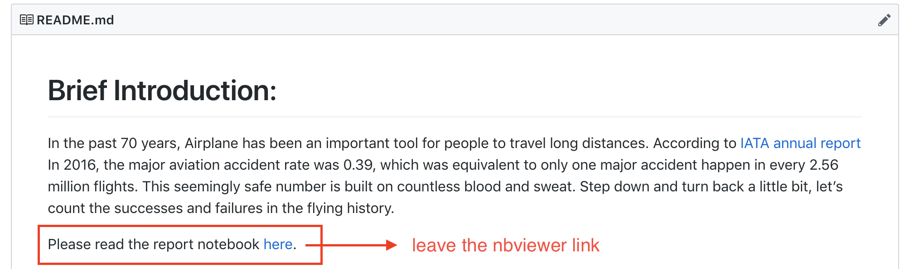

# Assignments

<!-- TOC -->

- [Assignments](#assignments)
    - [How to hand in assignments?](#how-to-hand-in-assignments)
    - [Assignment 0 -- Bridging assignment for language efficiency](#assignment-0----bridging-assignment-for-language-efficiency)
        - [Bonus: Handle the stop words](#bonus-handle-the-stop-words)
        - [Bonus: Discussion or demo](#bonus-discussion-or-demo)
        - [Reference solutions for assignment 0](#reference-solutions-for-assignment-0)
    - [Assignment 1 -- Data collection and ideation](#assignment-1----data-collection-and-ideation)
        - [Bonus: Enrich your dataset](#bonus-enrich-your-dataset)
    - [Assignment 2 -- Data analysis, visualisation and presentation](#assignment-2----data-analysis-visualisation-and-presentation)
    - [Notes on Bonus Question](#notes-on-bonus-question)

<!-- /TOC -->

Following are the **individual** assignments. You are welcome to discuss and work in groups. In the end, everyone should do the assignment and submit an original version from oneself. Make reference where needed, if you used other's solution.

## How to hand in assignments?

- Create a repo called `python-data-assignments`. (Please copy and paste to ensure the exact repo name, or we may not find your assignment)
- Create one folder for each assignment, with names `assignment0`, `assignment1` and `assignment2`.
- Put all the relevant files, including codes, docs and data (where applicable) into the per assignment folder. Refer to [notes-week-00.md](notes-week-00.md) for GitHub operations.

**Note**:

- You need to ensure the work is on GitHub before the deadline. Although we don't grade immediately after submission close, we can always check back the status at that time from version history.
- Please use `master` branch, which is a default setting on GitHub or your Git client. Create **one folder** for each assignment, not **one branch**.

## Assignment 0 -- Bridging assignment for language efficiency

Deadline: **Oct 24, 2018 (Wed)**

There are several news articles in the [assets/assignment0](assets/assignment0) folder. Please make a simple keyword frequency analyzer script called `keywords.py`. Once we run `python3 keywords.py`, your script works as follows:

- Read all the `.txt` files in folder `assignment0/`. (consider `open().read()`; You can use a `list` to store the relative paths of the files first)
- For every file, extract the English words from the file content. (consider `str.split()`)
- For every word extracted above, count how many times each one appears. (consider to use `dict`; keys are keywords; values are word count)
- Rank the keywords from higher frequency to lower frequency. Only `print` the top 15 keywords on Terminal. (consider `sorted()` and list slicing)
- Output the full keyword frequency list into a CSV file. The table headers are `keyword,frequency`. (consider to use `csv`)

### Bonus: Handle the stop words

Your first result may contain a lot "stop words" -- the words that do not carry much meaning in our context. For example, "a" and "the" appear quite frequently in English but they do not give much information about the content. Having those high-frequency words in our list is a distraction for further analysis. We can remove those stop words.

Suppose you are given the stop words list:

`stop_words = ["the", "and", "of", "a", "in"]`

Here are the questions:

1. Can you remove the stop words from above Terminal output, as well as the CSV file?
2. Can you further enrich this `stop_words` list to make the output more meaningful?

### Bonus: Discussion or demo

To address following questions, you can choose to simply discuss the solution in your `README.md` file or give a working demo using codes:

- If you spot one interesting keyword from the top list, how do you locate this keyword in articles? i.e. Find which article and which paragraph contains the keyword.
- Can you further organise your code for future reuse? One example of reusable piece is the keyword extraction from one string. Another example is the keyword extraction from one file. You can consider to put those in functions.
- There are two ways to approach the above problem: 1) assemble the content of all 5 files and extract keyword list for one string; 2) extract keyword-frequency list for all 5 files first and then merge the keyword-frequency (may need to sum the count for the same keyword). Which did you use? Which way is better? And Why?

### Reference solutions for assignment 0

- [@18408532](https://github.com/18408532/python-data-assignments/tree/e5dd0b595606fde3db61a9e2ef8d60c7244935ea/assignment0) gives a solution fully compliant to our requirement. Common pitfalls: print more than top 15 keywords on screen; save only 15 keywords in CSV (we ask for a complete list); fail to process 5 articles (usually due to incorrect loop).
- [@Catmint1215](https://github.com/Catmint1215/Assugnment0/blob/ad8043e205edb6f63755263b35050397c66c3805/Assignment%200.ipynb) uses function to increase the code reusability. In the future, one only need to input an article list and stop words list.
- [@FLYSTEPHEN](https://github.com/FLYSTEPHEN/python-data-assignments/blob/e50c7dd973e27bd7beb9f4aeb184ee66b0f58ced/assignment0/keywords_location.ipynb) shows a well organised solution to locate keywords from those articles. Although this is not efficient, you can see a prototype of "search engine" from the demo. For further reading, search for "Inverted Index".
- [@ClioLI](https://github.com/ClioLI/python-data-assignments/tree/c6629ec0073d588143fd1b90ed61eafe7c35a753/assignment0) and [@ivyWANG958](https://github.com/ivyWANG958/python-data-assignments/tree/911aaff975ec9ec4960dc831cf28dd6b4489a05e/assign0) discussed the two ways of approaching word frequency across multiple articles, i.e. count-then-merge, or merge-then-count.
- [@dingdinglovesunshine](https://github.com/dingdinglovesunshine/python-data-assignments/blob/33efa994d06998802a217a02db31b8c23d0edb65/python-data-assignments0.md) used `os.listdir` to list all the files to make the code more generic. In the future, on only need to put the articles into a designated folder, and then run this script to get word frequency. The execution of this script does not rely on the number of files in the folder.

## Assignment 1 -- Data collection and ideation

Deadline: **Nov 9, 2018 (Fri)**

Collect your **original** data by one of the following two ways:

- Scraping static website (requests + beautiful soup)
- Scraping a dynamic website (selenium/ splinter)

Requirement:

- The dataset needs to contain more than **100** entries and more than **5** fields.
- In the `README.md` file, give information about your dataset, so people can quickly understand the content without looking into your CSV file. You can include those sections: 1) **topic** ; 2) data source; 3) data fields (type, sample data); 4) data volume; 5) **license**; 6) obstacles and solutions (optional); 7) future work (optional). Here is a [sample](https://github.com/marla322/hkbu-big-data-media/tree/master/HW2).

Note:

- "License" is very important. Or, people can not build derivatives upon your work.
- No more than **3** students scrape the same website. Please register your interest with TA as early as possible to coordinate the topics.
- Assignment 2 will be based on Assignment 1. So pick the scraping target in a sensible way. The dataset had better help you generate some meaningful observations about the chosen topic.

More on `README.md`:

- "topic" section -- it helps people to quickly understand what they can do with this dataset. We usually put a piece of motivation and some sample questions into the "topic" section.
- "obstacles and solutions" section -- do you encounter any anti-crawling mechanism? do you have trouble scrolling to more pages? do you need to continuously crawl for several days and merge the results? How do you solve those problems?
- "future work" section -- No project can be ideal. List down the potential directions for improvements. For example, you may crawl more rows and columns when time permits. You may want to simplify the code later. You may want to make the crawling more efficient somehow. If the questions listed in this section is substantial, you are very welcome to [raise issue](https://github.com/hupili/python-for-data-and-media-communication-gitbook/issues/new), so we can discuss.

### Bonus: Enrich your dataset

Most of the time, one data set is not enough for you to make a thorough analysis. You may want to enrich your dataset somehow. Here are some potential methods:

- You can download data set from [gov open data portals](https://data.gov.hk/en/), [research institutes](https://ourworldindata.org/), or [any collection](https://github.com/awesomedata/awesome-public-datasets) that you can verify. You don't have to actually download the data in this bonus question, because some dataset is too large to be put onto GitHub repo. Simply give pointers to the database you are considering and briefly describe how they can be incorporated into the dataset you just scraped or how they can assist your articulation.
- You can get some related data via [HTTP based API](https://earthquake.usgs.gov/fdsnws/event/1/). Please tell us what is the API, give a few (truncated) sample responses, and discuss how that data can potentially help your data-driven report.

Adding a section to your `README.md` will be good.

## Assignment 2 -- Data analysis, visualisation and presentation

Deadline: **Nov 24, 2018 (Sat)**

The core objective of this assignment is to make a **reproducible** and **data-driven** report in jupyter notebook, with pandas, matplotlib, seaborn, networkx, nltk, ...

Basic requirements:

- The analysis and visualisation is based on the dataset from Assignment 1. You can enrich it if needed.
- Find 3 story points from data, and present it with data.
- Use at least 2 types of charts.
- Notebook needs to be legible:
  - Put trial & error codes aside
  - Adjust/ truncate/ omit long output
- Notebook should be able to execute by the readers and get the same results.
- All auxiliary files need to be stored in the assignment folder, including data, image, codes, ...
- **Important** The `.ipynb` notebook file should be self-explainary.  
- In case there is any interactive graph or chart cannot be displayed in your notebook, please use https://nbviewer.jupyter.org to view the final version of the notebook, and leave the nbviewer link in your README file like the following example:

**NOTE**: This is a mini story produced from data. The purpose of this assignment is to exercise workflow so don't dwell on the content too much if you find the story points are not compelling. Once you get used to this workflow, you will find it very easy to share ideas/ results and collaborate with others online. Again, we do not ask for a _substantial_ story from this assignment.

Jupyter notebook is a rich environment for you to put up multimedia texts. You can refer to [this section](https://github.com/hupili/python-for-data-and-media-communication-gitbook/blob/master/notes-week-09.md#jupyter-notebook) for some functionalities of the Jupyter notebook.

Some references from past submissions, with instructor notes:

- [Hans Rosling tops TED](https://nbviewer.jupyter.org/github/17441781/hkbu-big-data-media/blob/master/homework3/HW3-analysis.ipynb) -- The notebook is in standard format and highly legible. Headlines (using `##`) present story points directly and follows a data-driven exploratory path. Hans Roslig is famous in creative data visualisation for social science. He is one of the top cited figures in data journalism courses. You should watch all his TED videos.
- [Analysis of top 200 online novels](https://nbviewer.jupyter.org/github/DaisyZhongDai/hkbu-big-data-media/blob/master/homework3/Top%20200%20online%20novels.ipynb) -- Having **annotations** in bar chart and leveraging word cloud (beyond then course schedule) are two technical advantages. We encourage you to go beyond our class and find other useful libraries. You can learn with online samples and tutorials. The annotation of "mode (most frequent value) of book length" is newsworthy. It clearly shows that online novels follow certain pattern and may be an indicator of "factory production". However, histogram could be misleading sometimes, a serious researcher would checkout other alternatives of bin segments (size and boundary), but that is not required in assignment 3 as this is just a mini story.
- [Chengdu scenic points](https://nbviewer.jupyter.org/github/marla322/hkbu-big-data-media/blob/master/HW3/pandas_chengdu.ipynb) -- The technical plus is to use `plotly`, which can generate interactive plots very easily. Those charts can also be published online using [GitHub Pages](https://github.com/hupili/python-for-data-and-media-communication-gitbook/blob/master/notes-week-00.md#github-pages). `Out[4]` and `Out[11]` could be improved, though. In the exploration stage, you may have some lengthy output cells. In the final product notebook, you can use `.head()`, `.tail()` or list-slicing to only present a few sample data. That improves the legibility.

## Notes on Bonus Question

Note: Solution to bonus questions will not contribute to regular grade and will not affect class wise curving. They will be used in the end as tie breaker or promote significant outperformers to next level of letter grade. In other words, working on bonus questions will not harm other's grade. It may help some continuous outperformers to gain one more layer of security, just in case they have bad luck with project or quiz. You are encouraged to take more bonus if you can.
