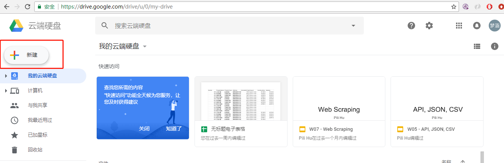
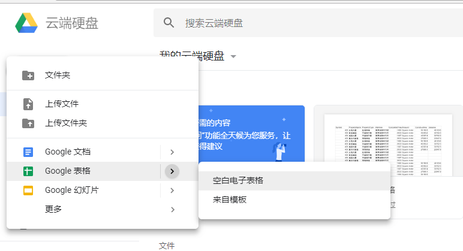
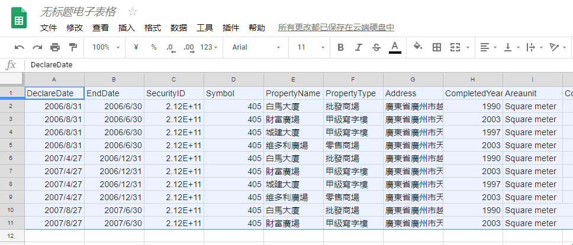
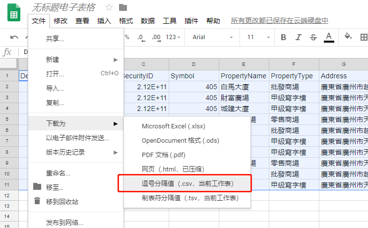
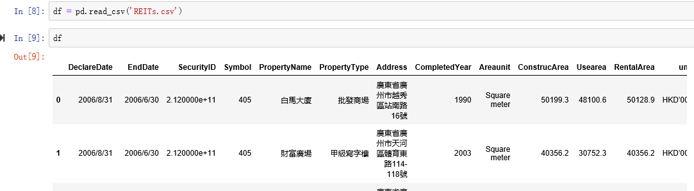

# Other Frequently Asked Questions

<!-- TOC -->

- [Other Frequently Asked Questions](#other-frequently-asked-questions)
    - [Notes](#notes)
    - [Environment](#environment)
        - [Two basic modes of shell: script and interactive](#two-basic-modes-of-shell-script-and-interactive)
        - [Setup virtual venv and install Jupyter Notebook](#setup-virtual-venv-and-install-jupyter-notebook)
        - [Install modules in venv, it's equivalent to install in Jupyter](#install-modules-in-venv-its-equivalent-to-install-in-jupyter)
    - [Tricks & Hot key](#tricks--hot-key)
        - [Restart kernel helps](#restart-kernel-helps)
    - [Frequently asked bugs](#frequently-asked-bugs)
        - [No such file or directory in jupyter or file xxx does not exist](#no-such-file-or-directory-in-jupyter-or-file-xxx-does-not-exist)
    - [Encoding & Decoding](#encoding--decoding)
        - [U+FEFF encoding issue](#ufeff-encoding-issue)
        - [Csv writer newline](#csv-writer-newline)
        - [Cannot read a csv file downloaded from a website](#cannot-read-a-csv-file-downloaded-from-a-website)
        - [Expecting value: line 1 column 1 (char 0)](#expecting-value-line-1-column-1-char-0)

<!-- /TOC -->

## Notes

This is the page for "other" uncategorised FAQs. When some problems of a new area appear, they are likely to arrive here as first stop. When there are enough number of Q/As under certain topic, they will be diverted to the page dedicated to that area.

The whole catalogue is the first entry point for usual readers. It can be found here: [FAQ Catalogue](README.md#faq-catalogue)

## Environment

### Two basic modes of shell: script and interactive

please see [here](notes-week-02.md#two-basic-modes-script-and-interactive)

<!-- TODO: what does this mean? of shell or of Python? -->

### Setup virtual venv and install Jupyter Notebook

please see [here](https://github.com/hupili/python-for-data-and-media-communication-gitbook/blob/master/notes-week-04.md#setup-virtualenv-and-install-jupyter-notebook)

<!-- TODO: notes-week-04.md repeats with module-jupyter.md. Our strategy is to keep the weekly notes simple and direct. We only give the one-right-way-to-do-something in the weekly notes. If the readers meet problems, they can find detailed instructions in the FAQ page -->

### Install modules in venv, it's equivalent to install in Jupyter

If you are using Jupyter for the first time, you should create virtual environment first by `pyvenv venv`. Then enter the `venv` environment by typing `source venv/bin/activate`. This is the right place where you should install all the modules you will use, after that you can enter the Jupyter by command `jupyter notebook`. Once you finish your work, use `deactivate` to exit `venv` environment. Do remember, you just need to create virtual environment once, next time when you use Jupyter, just type`source venv/bin/activate` + `jupyter notebook` will work.

## Tricks & Hot key

1. Exit Python interactive mode: `quit()`,`exit()` or `Control-D` on Mac, `Control-Z` on Windows.
2. Auto supplementation when executing the code files: type the first letter of the file name then `tab`
3. Indent: `tab`
4. Indent back: `tab` + `shift`
5. Comment single line: `#` ahead of the line
6. Comment multiple lines: select multiple lines, then type `command` + `/`, type again to un-comment
7. Force quit boxes - `command`+`option`+`esc`

### Restart kernel helps

In the coding process, we may keep renaming the variables or adjust the sequences of the cells. In such circumstances, there might be errors arisen. Therefore, a good practice here is always try `restarting kernels` if encounter the weird errors.

## Frequently asked bugs

### No such file or directory in jupyter or file xxx does not exist

If you download the csv from some where, and you want to import it in Jupyter notebook. you should put the csv file in the folder where your venv folder are first. Usually, it's in the user path. All the files you write and read should in this folder. Another method is to type `pwd` in Jupyter, it will return the path, where you should put the file in.

## Encoding & Decoding

### U+FEFF encoding issue

CSV Sample output:

```text
['U+FEFF/name', 'id', 'gender', 'location', 'phone']
['Chico', '1742', 'M', 'KLN', '3344']
['Ri', '1743', 'F', 'LOS', '5168']
['Ivy', '1655', 'F', 'MK', '7323']
```

In some cases, the csv you read may have some encoding issue like the above.`U+FEFF` is the byte order mark, or BOM, and is used to tell the difference between big- and little-endian UTF-16 encoding. To omit BOM, just add a encoding line in the `with....open` command, as `with open('chapter4-example-name_list.csv',encoding='utf-8-sig') as f:`. Further reading about this [issue](https://stackoverflow.com/questions/17912307/u-ufeff-in-python-string).

### Csv writer newline

For more explanation, please refer to the documentation on the [open function](https://docs.python.org/3/library/functions.html#open)

### Cannot read a csv file downloaded from a website

This error is usually raised as the following:

`UTF-8 cannot decode byte 0xff in postion x: invalid byte`

Solution:

First, try to copy and paste the contains/data to Google drive with a new sheet, and downloaded it as a new csv.






Then, we can successfully read the data by the usual way.

```python
# -*- coding: utf-8 -*-
import pandas as pd
df = pd.read_csv('REITs.csv', 'rb')
```




### Expecting value: line 1 column 1 (char 0)

It's a common error of `JSONDecodeError` meaning that there is no JSON can be parsed. You need to check the response object before doing further processing.

For some specify example solutions, you can refer to [here](https://stackoverflow.com/questions/16573332/jsondecodeerror-expecting-value-line-1-column-1-char-0) .

<!-- TODO: This is not necessarily caused by encoding problem. sometimes malformed JSON format will also cause the problem. Try to bring up a concrete case. What did you send to the JSON decoder when the error arises? -->

