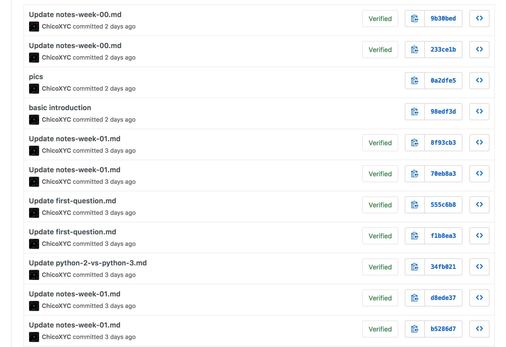
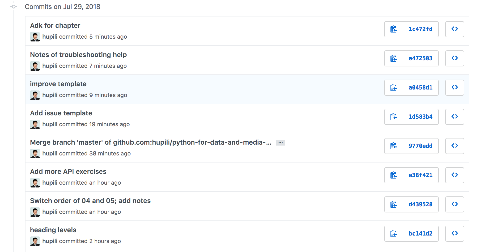

# Guide for Contributor

## Screenshot on MAC

By default, we prefer taking screenshot of proper sized window. Please check out "How to take a screenshot of a window" of [this post](https://support.apple.com/en-hk/HT201361).

## Heading levels

* `#` -- The main title of this page. It will show as `<h1>` in rendered format, or in the `<title>` of an HTML page's meta sections.
* `##` -- The first level of section heading.
* `###` -- The second level of section heading.

## Git commit message

Write a brief commit message so others can quickly comprehend the changes in this commit. If the commit message is complex, write a brief line within 70 characters and the remaining texts in the body after line break.

Bad example:



Good example:



## File naming convention

Adopt the [URL-slug](https://en.wikipedia.org/wiki/Clean_URL#Slug) convention:

* All lowercase. Exception can be made when part of the phrase is an acronym.
* Replace blanks by dash, i.e. `-`.
* Put informative phrases into the path, so that the content/ meaning of the file can be quickly comprehended from its path/ URL.
* Only use alphabets, numbers, dash and dot (for extension name).

The way to check if a file path is URL-friendly or not is straightforward. Just copy and paste this path into your browser's address bar and see if it is changed to another string. For example, a single blank will be changed to `%20` in the address bar. If it stays the same, we think it is URL-friendly.

Good example:

```text
git-commit-message-good.png
```

Bad example 1: (blanks are not URL friendly)

```text
git commit Message Good.png
```

Bad example 2: (not informative enough; may clash with other screenshots)

```text
git.png
```

Bad example 3: (not informative enough; may clash with other screenshots)

```text
commit.png
```
