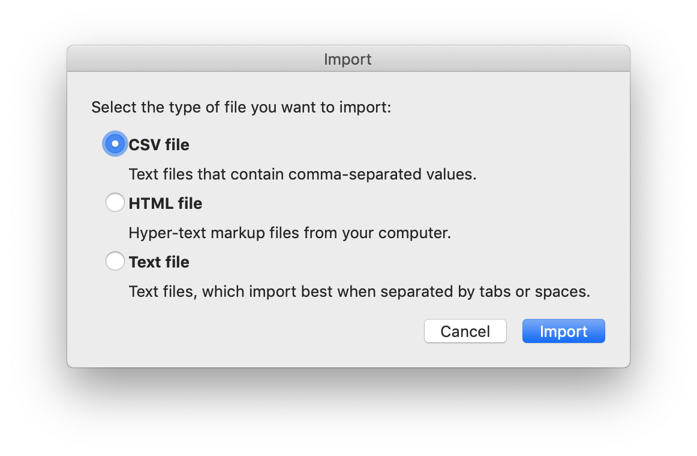
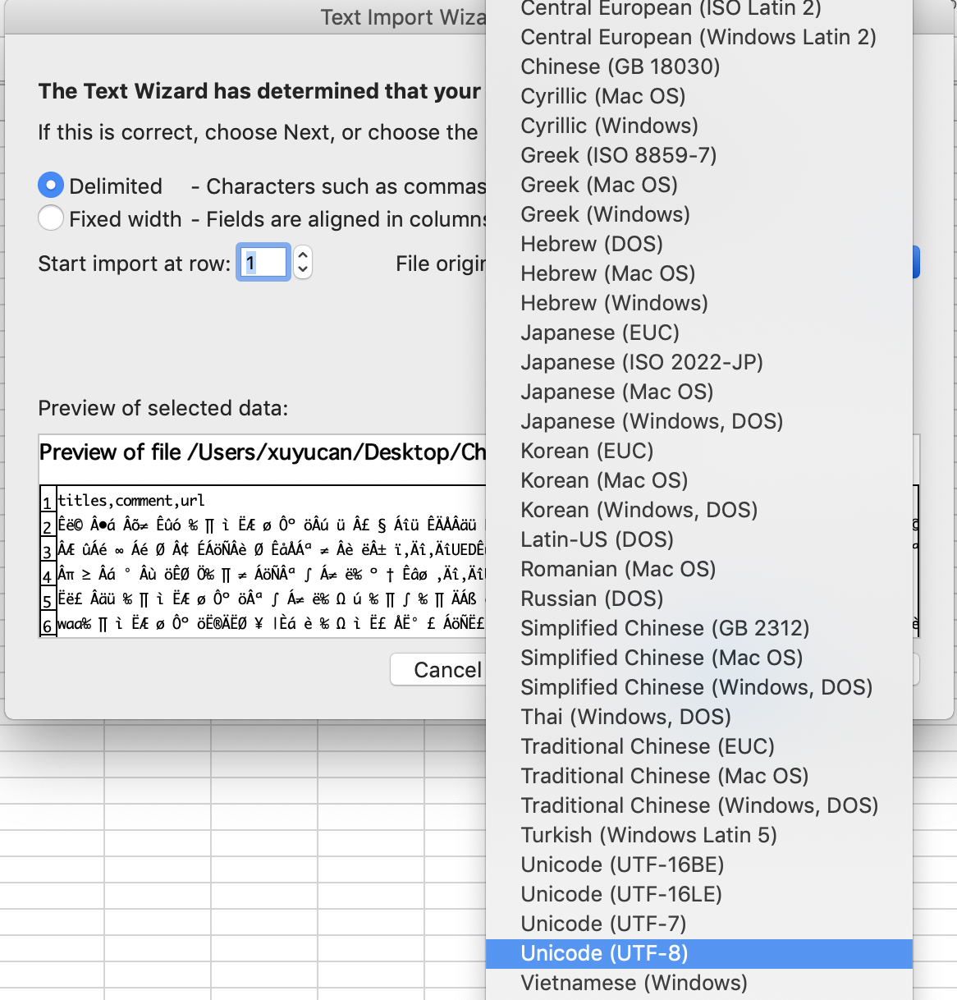
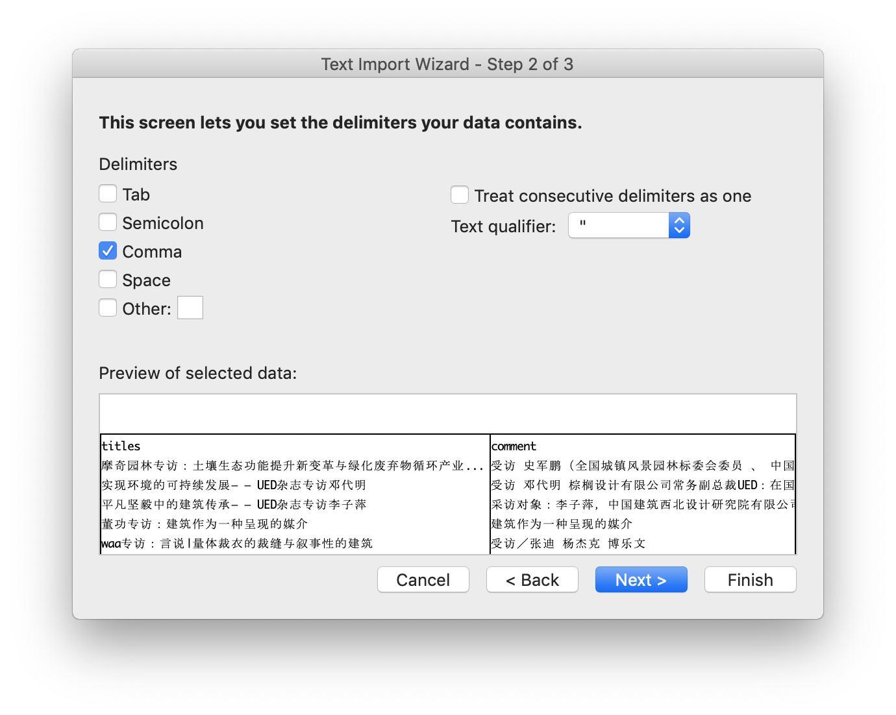
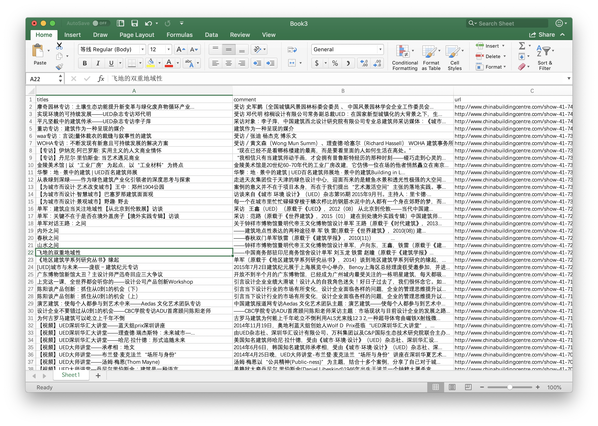

# csv

The so-called CSV \(Comma Separated Values\) format is the most common import and export format for spreadsheets and databases.

## Why present garbled words when you export the CSV?

Because the spreadsheets cannot recognize Chinese, then it presents garbled words on the screen. No worry about the garbled words if your results are right.

## Encoding issue about Microsoft excel

Open csv in Excel avoiding encoding error:

1. Open excel, choose to create a new file / blank workbook.
2. Click file --> import --> csv

3. Import the csv you want, click `get data`

4. Click `file origin` to choose `Unicode(UTF-8)`

5. Click `next` and choose delimiter, in csv, we usually use `comma`, then click next --> finish --> OK.

6. Then, your csv can displayed in Excel correctly.

