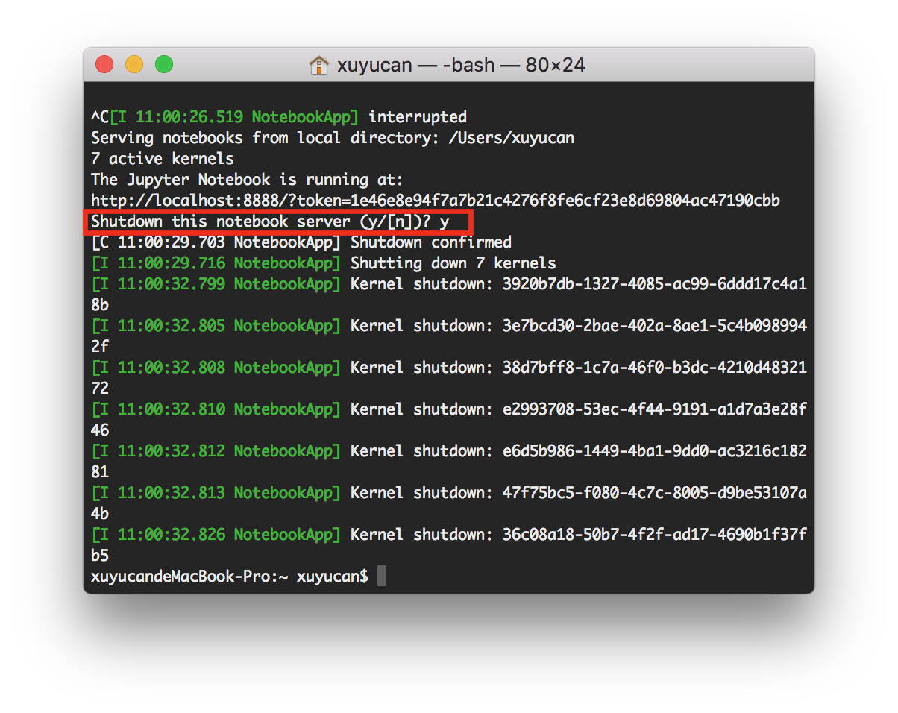

# Jupyter Module

[Jupyter Notebook](http://jupyter.org/) is an open-source web application that allows you to create and share documents that contain live code, equations, visualizations and narrative text. In our course, Jupyter notebook will be our daily tool to write, test, and sharing our codes and works. It's very useful for us to learn and make **reproducible works**. The good advantage of Jupyter notebook includes:

- The Notebook has support for over 40 programming languages, including Python, R, Julia, and Scala.
- Notebooks can be shared with others using email, Dropbox, GitHub and the Jupyter Notebook Viewer.
- Your code can produce rich, interactive output: HTML, images, videos, LaTeX, and custom MIME types.

It is suggested to enter virtual environment before using Jupyter notebook. Because in the following study, we may need to install some packages and modules in Jupyter notebook. It's necessary to keep those files in the same path, so Jupyter can source the modules when you want to use.

## Virtual environment

### Create virtual environment

```bash
pyvenv venv
```

### Enter virtual environment

```bash
source venv/bin/activate
```

When you see `(venv)` appear in front of your command line prompt, that means the you are in the virtual environment. Always check this prefix to make sure you are working in the right environment. 

### Exit virtual environment

You can use `deactivate` command to exit current virtual environment.

## Jupyter Notebook

Now you can install and enter Jupyter notebook.

### Install Jupyter notebook

Note: **you only need to do this once for every virtual environment**

```bash
pip3 install jupyter
```

### Run Jupyter notebook

Always run your Jupyter notebook in the virtual environment.

```bash
jupyter notebook
```

By default the notebook will be available at [http://localhost:8888/tree](http://localhost:8888/tree)

So, next time when you use your jupyter notebook, you just need to type following commands in your terminal

```bash
source venv/bin/activate
jupyter notebook
```

### Quit the Jupyter notebook

```bash
$ control+C
```

Pay attention to the text. Then you will get the following picture. Please input `y` in 5 seconds.



## Basic usage

1. click new to create a new python 3 notebook
2. write codes like you usually do in text editors, and press `shift+return` to run the code. It will return the results or errors under the cell.
3. use `! pip3 install module_name` to install modules in jupyter notebook.
4. in front of every cell, there is an in [ ] sign, the number in [] means the sequences of cells, and if there is * in [], means that this cell is still running, you can either wait it finish or click `stop` under the kernel to exit from the running, pressing `I` twice will also do the trick.
5. cell. run cell run step by step. run all above to run and check the previous steps of coding.
6. kernel. kernel is a tool for interactive input and output all the things you did from the beginning. By clicking `restart`, you can give a variable another value.
7. `type()` more to check the object. It is very useful when we write complicated codings. Eg:a = 1, type(a)
8. `help()` to know the details. Eg: help(str.strip)
9. `print` step by step to check where the error is. (In Jupyter, you can just input the variables without the function of print.) Like, type data in cell equals to print(data).

## Runtime troubleshooting guide

* Rerun all the cells
* Restart the kernel
* Clear the output cells

## Install frequently used dependencies

You do not want to install and re-install dependencies every time. It is more convenient to setup a virtual environment and install common dependencies/ modules for data analysis.

You can download this [requirement.txt](https://github.com/hupili/python-for-data-and-media-communication/blob/master/requirements.txt) and then run the following command (inside virtual environment)

```
pip install -r requirements.txt
```