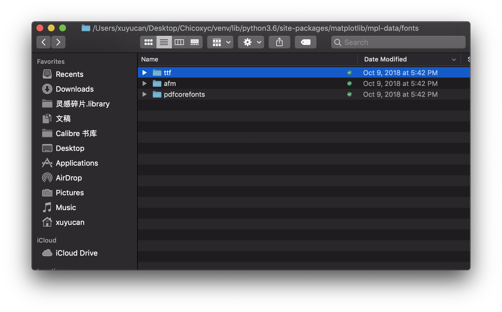
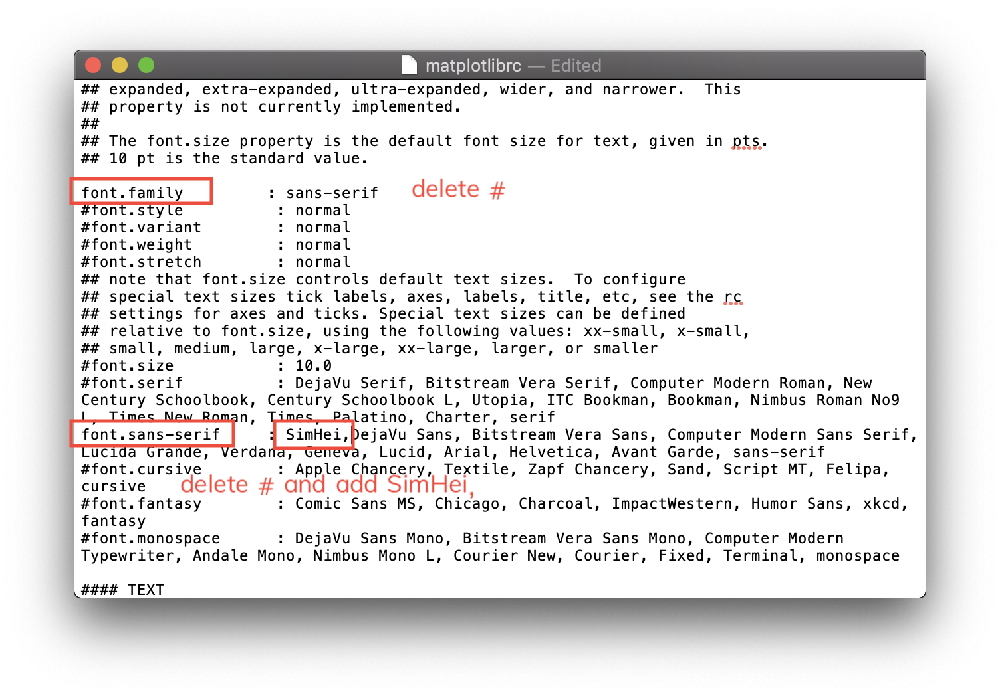

# matplotlib

## How to display Chinese characters when using matplotlib

Step 1: Download the SimHei font [here](https://www.fontpalace.com/font-details/SimHei/)

Step 2: Find font folder in `mpl-data` folder

```python
import matplotlib
print(matplotlib.matplotlib_fname())
#/Users/xuyucan/Desktop/Chicoxyc/venv/lib/python3.6/site-packages/matplotlib/mpl-data/matplotlibrc

!open /Users/xuyucan/Desktop/Chicoxyc/venv/lib/python3.6/site-packages/matplotlib/mpl-data
```

Step 3: Enter the font folder, put the font you just download into the folder,then click to install



Step 4: Back to `mpl-data` folder, click `matplotlibrc`
`command+f` search font family, delete `#`;
search font.sans-serif,delete `#`, and add `SimHei,`;
search axes.unicode_minus, replace `True` to `False`.



Step 5: Delete the cache

```python
import matplotlib as mpl
mpl.get_cachedir() #dind the path of cache
!open /Users/xuyucan/.matplotlib
#delete files in this folder
```

Step 6: Restart the Jupyter notebook

1. `comman+c` in terminal, enter `y`
2. type `jupyter notebook` again

Step 7: add following two lines into your codes

```python
plt.rcParams['font.sans-serif']=['SimHei'] #用来正常显示中文标签
plt.rcParams['axes.unicode_minus']=False #用来正常显示负号
```

There is a similar issue about Chinese characters (CJK characters) when you use wordcloud. Please refer to [this section](module-wordcloud.md/display-chinese-characters-when-plotting-tag-cloud) for the solution.