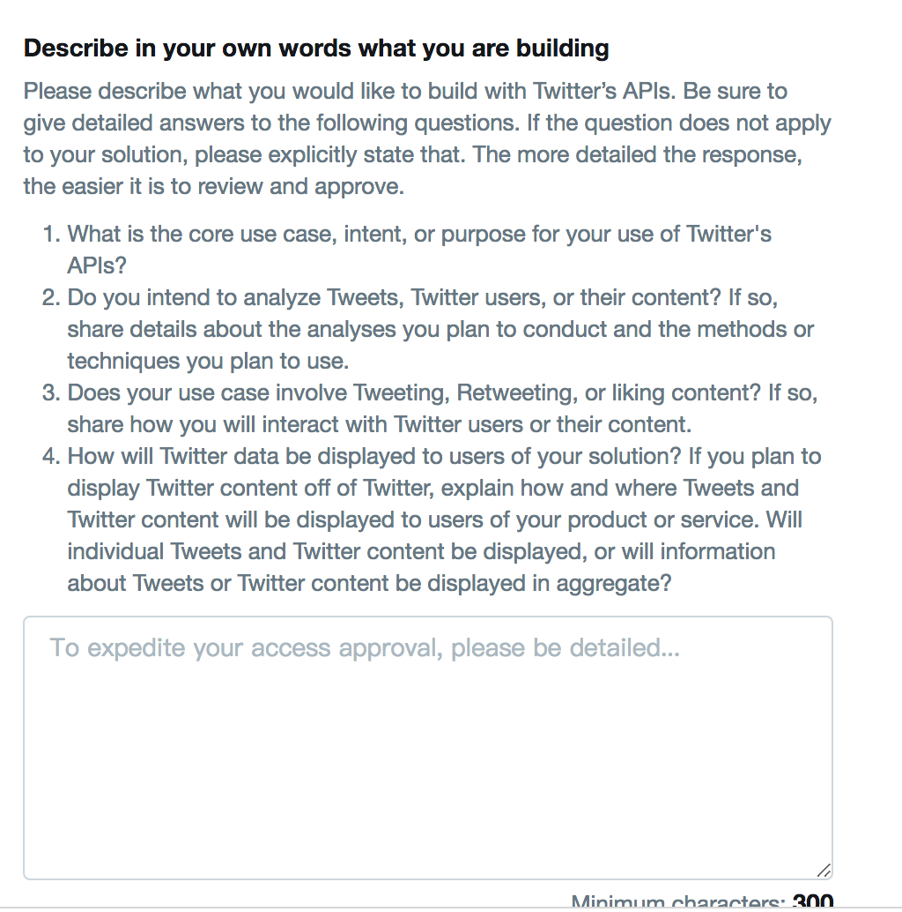
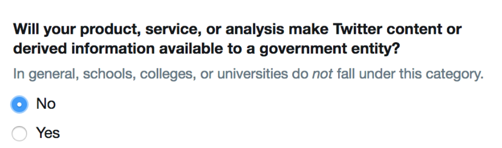
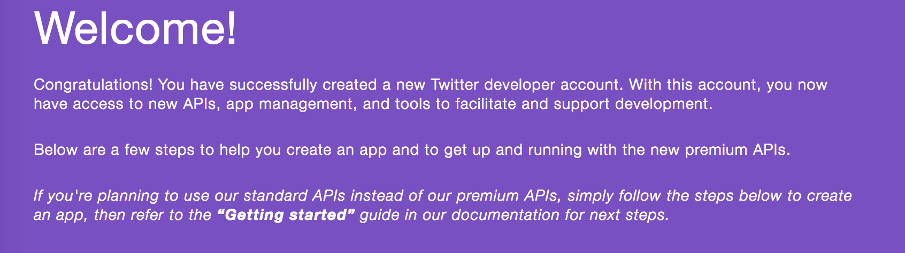

# python-twitter

## Search public tweets on entire Twitter

The `GetSearch` function is useful, you can get the posts from one specific keyword searching.

For more functions, please refer to this [documentation](https://python-twitter.readthedocs.io/en/latest/migration_v30.html#twitter-api-api-getsearch).

## How to apply twitter API key？

The following are the applying experience of one of the 2018 fall students. credited to @iiiJenny.

### Step 1

Preparation：Twitter Account （highly recommend to use Gmail Account to Sign up!）. Then Go to https://apps.twitter.com/app/new and click 'Apply for a developer account'.

### Step 2

Choose “Personal use” & Enter your desired Application Name, Primary country (hk) and so on.
The most important is : Describe in your own words what you are building.

you have to answer each question as detailed as possible. the following is an example:

1. I’m using Twitter’s APIs to practice my data collection and analysis skills in the Big Data Analysis course. I am currently a postgraduate student in Hong Kong Baptist University, majoring in Communication, and normally collect users comment data for mass communication study research.
2. As for the methods and techniques I plan to conduct, here is our course GitHub open book. You can take it as reference. https://github.com/hupili/python-for-data-and-media-communication-gitbook/blob/master/notes-week-04.md#use-api-via-function-calls-to-other-modules-packages
3. I only use it to do data collection practice, will not use case to tweeting, retweeting or liking content.
4. Tweets will be displayed on our final project presentation for academic use.
5. Finally, I will comply with the Policies of twitter. I am looking forward to your favorable reply.

and then, submit your application! -> verify your email

after that, your application may under review or! jump to a new page :

## Delete key from Git? Regenerate key on Twitter?

Since Git remembers the whole history, the key can still be found later. The simplest is to check the [file changes](https://github.com/hupili/python-for-data-and-media-communication/pull/12/files), or commit detail page. If that key is on a test account, things should be fine. However, if that key is on a personal account, you may want to [regenerate one pair on Twitter](https://developer.twitter.com/en/docs/basics/authentication/guides/securing-keys-and-tokens.html).