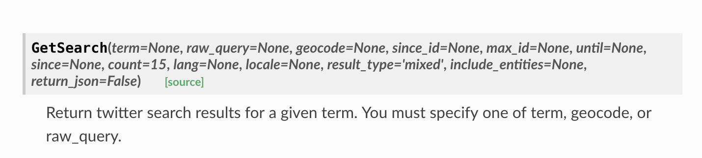

# python-twitter

## Search public tweets on entire Twitter

The `GetSearch` function is useful, you can get the posts from one specific keyword searching.

For more functions, please refer to this [documentation](https://python-twitter.readthedocs.io/en/latest/migration_v30.html#twitter-api-api-getsearch).

## How to apply twitter API key？

Please see the applying experience of 2018 fall students [here](https://github.com/hupili/python-for-data-and-media-communication-gitbook/issues/45).
