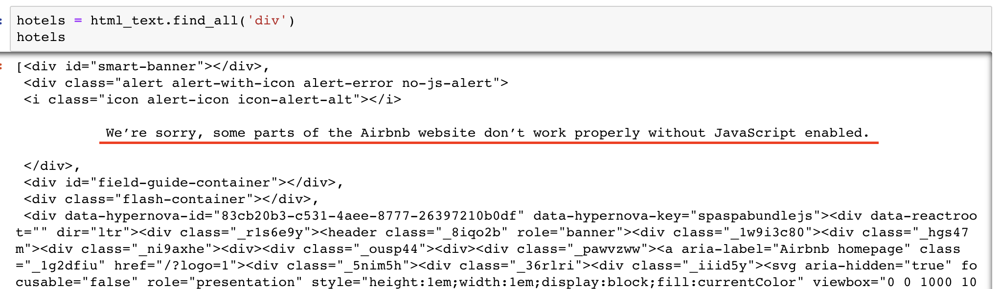

# Requests

<div id="toc">
<!-- TOC -->

- [Requests](#requests)
    - [Modify User Agent](#modify-user-agent)
    - [HTTP status code](#http-status-code)
    - [Return empty results](#return-empty-results)

<!-- /TOC -->
</div>

## Modify User Agent

Some websites combat crawler by detecting the [user agent](https://en.wikipedia.org/wiki/User_agent). User agent can be simply regarded as the name of your browser. Websites may stop your HTTP request if it detects you are not using a normal browser. That is because `requests` will tell the website its identity by default. You can modify this behaviour using `headers` parameter of `requests.get`:

```
r = requests.get(url, headers = {'user-agent': 'Put-User-Agent-String-Here'})
```

Use [Open Rice](openrice.com) as an example:

```
url = 'https://www.openrice.com/en/hongkong/restaurants?what=sushi'
r = requests.get(url, headers = {'user-agent': 'Mozilla/5.0 (Macintosh; Intel Mac OS X 10_13_3) AppleWebKit/537.36 (KHTML, like Gecko) Chrome/64.0.3282.167 Safari/537.36'})
```

A more complete experiment can be found [here](https://github.com/hupili/python-for-data-and-media-communication/blob/master/w4-scraper/Open%20Rice.ipynb)

## HTTP status code

When you make a request to a website, there might be different status responded. Common examples here:

- 200 OK
- 400 Bad Request
- 401 Unauthorized
- 403 Forbidden

For more examples, please refer to [here](https://en.wikipedia.org/wiki/List_of_HTTP_status_codes) .


## Return empty results

Case: Airbnb

```python
import requests
from bs4 import BeautifulSoup
r = requests.get('https://www.airbnb.com/s/all?adults=1&children=0&infants=0&guests=1&toddlers=0&refinement_paths%5B%5D=%2Ffor_you')
html_text = BeautifulSoup(r.text,"html.parser")
hotels = html_text.find_all('div')
hotels
```



You will find the content you wanted is not there and if you save the content in a html and reopen it, it's a blank page.

```python
open('mypage.html','w').write(r.text)
```

This is indicator that this page is loaded dynamically, you may need to use `selenium` or `splinter` to scrape instead.