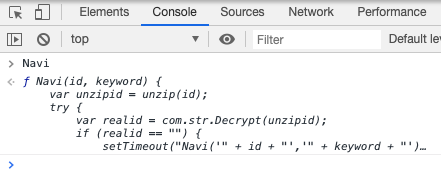

# Selenium

<!-- TOC -->

- [Selenium](#selenium)
    - [Basic steps](#basic-steps)
        - [Step 1 install selenium](#step-1-install-selenium)
        - [Step 2 install webdriver and put it in the project's working directory](#step-2-install-webdriver-and-put-it-in-the-projects-working-directory)
        - [Step 3 start from opening a dynamic page web url](#step-3-start-from-opening-a-dynamic-page-web-url)
    - [Chrome driver not found in path error](#chrome-driver-not-found-in-path-error)
    - [Find elements by Xpath](#find-elements-by-xpath)
    - [Find elements by css selector](#find-elements-by-css-selector)
    - [Infinite scroll in a single page](#infinite-scroll-in-a-single-page)
    - [Dealing with iframes](#Dealing-with-iframes)
    - [Getting computed values in dynamic pages](#Getting-computed-values-in-dynamic-pages)

<!-- /TOC -->

Selenium module can be used in dynamic page web scraping on Windows Systems. It supports Firefox, IE, Chrome and Remote.

## Basic steps

### Step 1 install selenium

pip install selenium

### Step 2 install webdriver and put it in the project's working directory

For example, I use Chrome, so I need download a ChromeDriver. Download link：
https://sites.google.com/a/chromium.org/chromedriver/home

### Step 3 start from opening a dynamic page web url

```python
browser = webdriver.Chrome()
browser.get('http://money.cnn.com/search/index.html?sortBy=date&primaryType=mixed&search=Search&query=trade%20war')
time.sleep(10)
```

For detailed use, refer to the Selenium documentation:
https://selenium-python-zh.readthedocs.io/en/latest/index.html

For more selenium examples, you can refer [here](https://github.com/hupili/python-for-data-and-media-communication/tree/master/scraper-selenium).

## Chrome driver not found in path error

>Message: 'chromedriver' executable needs to be in PATH

This is common error. You can download [Chrome Driver](https://sites.google.com/a/chromium.org/chromedriver/home) and put it in your [Current Working Folder](shell.md#verify-your-current-working-folder). Note, for venv and jupyter user, this is not your project root folder, or the venv folder. It is the path at which you issued the `jupyter notebook` command -- a.k.a. "current working folder".

MAC user has a shortcut to install chromedriver in the path.

```shell
brew cask install chromedriver
```

## Find elements by Xpath

For `XPath` method, XPath uses path expressions to select nodes or node-sets in an XML document. The following are basic expression rules and expression path examples. For a more detailed usage, you can check out this [tutorial](https://www.w3schools.com/xml/xpath_syntax.asp).

Basic expression rules:

| Expression | Description                                                                                           |
|------------|-------------------------------------------------------------------------------------------------------|
| /          | Selects from the root node                                                                            |
| //         | Selects nodes in the document from the current node that match the selection no matter where they are |
| .          | Selects the parent of the current node                                                                |
| @          | Selects attributes                                                                                    |

Path Expression examples:

| Path Expression     | Results                                                                          |
|---------------------|----------------------------------------------------------------------------------|
| /bookstore/book[1]  | Selects the first book element that is the child of the bookstore element.       |
| //book              | Selects all book elements no matter where they are in the document               |
| //@lang             | Selects all attributes that are named lang                                       |
| //title[@lang='en'] | Selects all the title elements that have a "lang" attribute with a value of "en" |

## Find elements by css selector

When we use the find elements in css selector. Two common error are that:

1. the element cannot be located.
2. matching imprecisely. We can find the element, but thats not what we want.

The following are useful workflow that can help us debug when encounter those problems:

1. CSS Selector needs to be precise some time. Being too broad may risk matching something else.
2. The best practice is to use select_elements_x method (notice s) first to verify if the matching is precise. If it is, use the non-"s" version to find the element. If it is not, check if the elements come in specific order. If so, one can use list navigation to locate the precise one.

For more details explanation, you can refer to this [example](https://github.com/hupili/python-for-data-and-media-communication/blob/master/scraper-selenium/CNN%20next%20page.ipynb).

## Infinite scroll in a single page

Usually, the website will not allow you to do infinitely scrolling, there usually some limitations. Therefore we can do some manually scroll testing and see how many times we can scroll. After that we can use a for loop to adjust the scrolling times by your observation.

```python
for i in range(1,100): #change time by your observation
    try:
    time.sleep(2)
    #scraping codes here
    browser.execute_script('window.scrollTo(0, document.body.scrollHeight);')
    except:
    ...
```

**Note:** When executing web emulation, remember to set a sleep time to avoid risen error. It's suggested to set it as 2 seconds if there is a big loading work. You can increase or reduce by your own observation.

Another solution is using XHR. When a page adopts an infinite scroll design, asynchronous data loading is inevitable. When you encounter those cases, network trace analysis may give more concise solution. There are usually XHR interfaces. You don't even need dynamic crawling (browser simulation). You can refer [here](https://github.com/hupili/python-for-data-and-media-communication/blob/master/scraper-examples/mafengwo-xhr.ipynb) for a detailed example.

## Dealing with iframes

For older websites, the document you requested often contains iframes, in other words, other documents. Without switching the webdriver into these iframes, you cannot find or select the element inside, even when the elements are visible to you and the selectors are correct. 

Finding an element in an iframe before switching to it, an error of `NoSuchElementException` will be thrown. To fix this:

```python
#select the iframe and switch to it
browser.switch_to.frame(browser.find_element_by_tag_name("iframe"))
#...do something with elements in the iframe
```
To switch back (use [switch_to](https://selenium-python.readthedocs.io/api.html#module-selenium.common.exceptions)):
```python
browser.switch_to.default_content()
#or browser.switch_to.parent_frame()
```
After switching back to parent of default frame,some operations on the previously selected elements may still work, others would fail. In this case, an `StaleElementReferenceException` is thrown. For more, see [here](https://selenium-python.readthedocs.io/api.html#module-selenium.webdriver.common.action_chains).


A working case of crawling *Taiwan court judgements* could be found [here](https://github.com/Roytangrb/pangolin/blob/master/taiwan/tw_case_crawler.ipynb).

## Getting computed values in dynamic pages

Oftentimes when we need to scrap a table containing urls, the urls are ready and unmasked. When the urls are computed on request for anti-crawling purpose, we will need a few more tricks to restore the real infomation. This is a real case of extracting urls on [China Judgements Online](http://wenshu.court.gov.cn/).

After locating the url, the following is discovered:
```html
<a href="javascript:void(0)" onclick="javascript:Navi(&quot;DcKNwrkRADEIw4RaWjA2EMOyw7Zfw5JdwqJIIx1mFWXDocKNI8K4w4t2wovDqsKeTSbDtisDw5rCrsOhRsO2GMK8Z1wQLzUnwqJBfsOOS1LDvTETw4nCisKTwp7CgRdBw5ouwosJJgp6UzJKw6pWw6/CoS/DqXTDgmfCsS8tGcOsw5rCmsO0T8KTWsKow7vDiQbCqCI2wr0Fw4DCsMKoS8OtLRTCt8Olb3nDlMKGw4U2woXCrcOaRcKrw54Uw67DvCvDicO8AQ==&quot;,&quot;穿山甲&quot;)" target="_self" style="color:Black; text-decoration:none">郑秀怀走私珍贵动物、珍贵动物制品二审刑事裁定书</a>
```
`href` attribute is not directly available, instead, a function `Navi` is exceuted with two arguments (could be found easily in parent tags) `id` and `keyword`.

#### Step 1: locate the function
Since the function is globally callable, we can type in the function name in Chrome's developer console, and click to navigate.


#### Step 2: Compute what you need
This is what the `Navi` function is about:
```js
//增加7道爬虫防御 段智峰 20180807
function Navi(id, keyword) {
    var unzipid = unzip(id);
    try {
        var realid = com.str.Decrypt(unzipid);
        if (realid == "") {
            setTimeout("Navi('" + id + "','" + keyword + "')", 1000);
        } else {
            var url = "/content/content?DocID=" + realid + "&KeyWord=" + encodeURI(keyword); 
            openWin(url);
        }
    } catch (ex) {
        setTimeout("Navi('" + id + "','" + keyword + "')", 1000);
    }
}
```
We can use `execute_script` method [docs](https://selenium-python.readthedocs.io/api.html?highlight=execute_script) to mimic this logic and return the real url:
```python
key = item.get_attribute('key')
# the method returns what the js script returns
# we can pass arguments into the script
realid = browser.execute_script('return com.str.Decrypt(unzip(arguments[0]))', key)
realurl = 'http://wenshu.court.gov.cn/content/content?DocID=' + realid
```
A working function for extracting information on a page could be found in this [gist](https://gist.github.com/Roytangrb/9dbd8bc36a7f34cca390384914da9f18).