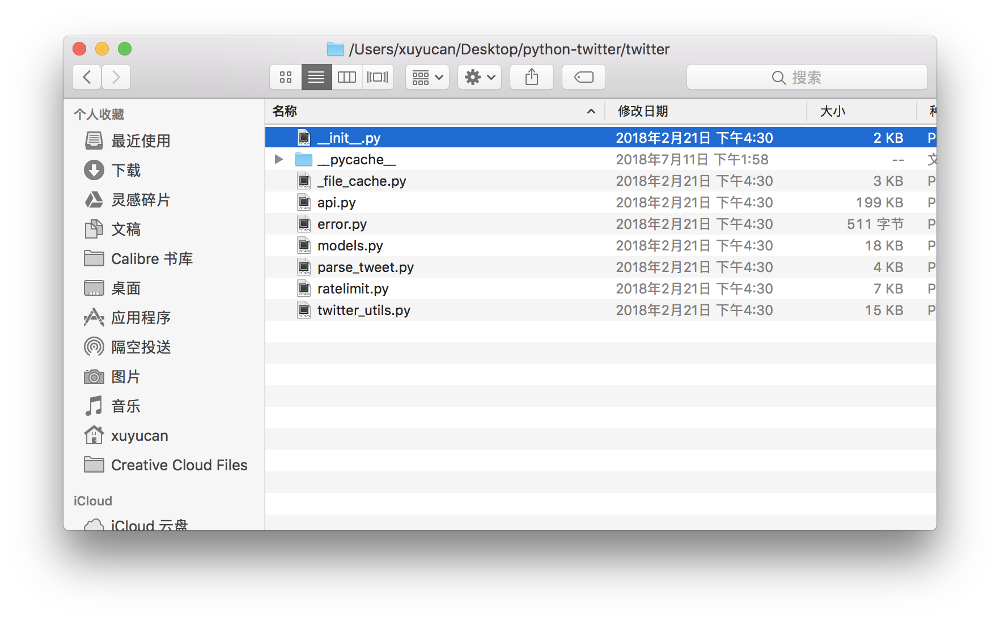

# Chapter 2: Use Python as a daily tool

In the previous chapter, We introduced the basic knowledge about terminal on Mac and how to navigate file system in Terminal, using shell, creating the first python script and execute it... In this chapter, we want to focus specifically on Python basics, including `variables`, basic `data types`, `arithmetic`, `functions` and several commonly used `modules` you need to know about to get up and going as a python developer. After this chapter, you can use python as your daily tool, at least to build a calculator to evaluate your business model or build up your start-up financial plan. You can check out [here](https://dnnsociety.org/2018/02/01/calculate-marketing-objective-for-your-media-startup/) for a reference case study, about **Calculate Marketing Objective for Your Media Startup**. And you can also find more cases in our DNN website.

Tip: search `python` to filter out the cases accomplished by 2017 MA students.

## Objective of this week

* Understand python basics
* Can use `help` to get inline documentation on new modules and functions
* Become comfortable with Python interpreter -- the REPL pattern (Read-Evaluate-Print Loop)
* Can use Python as a daily tool -- at least a powerful calculator

## Familiar with python interactive mode

### Python interpreter

>By default, Python source files are treated as encoded in UTF-8. But the standard library only uses ASCII characters for identifiers, a convention that any portable code should follow. To display all these characters properly, your editor must recognize that the file is UTF-8, and it must use a font that supports all the characters in the file.

### Invoking the Interpreter

Typing the command `python` or `python3` on your terminal.
After that, you will see `>>>` notation which indicates you that you have already entered the interactive mode and the interpreter is waiting for your input. For instance:

```python
$ python3
>>> hello
hello
>>> 1 + 2
3
>>> a = 0
```

### Python has two basic modes: script and interactive

1. `The script mode` is the normal mode where the scripted and finished `.py` files are run in the Python interpreter.

2. `The interactive mode` is a command line shell which gives immediate feedback for each statement.

### Differences between two modes

* A `.py` file can only be executed in script mode, using `python3` + `filename.py` to run the file.
* In interactive mode, you can only enter one line and execute one line each time, while in script mode, you can execute all the code in the file at once by running the .py file directly.
* The interactive mode is primarily used to debug the code and testing.

### Enter and exit interactive mode

When you are in script mode, you can type `python` or `python 3` to enter the interactive mode. **(In our course, we use python 3)**. And type `control + d` to exit from interactive mode.  

### Execute an existing script interactively

Sometimes, you have an existing script, maybe from past works or from others. You want to execute this script first but stays in the Python interpreter after that. In this way, the state of the interpreter, e.g. all the variables, will be fully preserved for your further exploration. One can use the `-i` option. The command line pattern is as follows:

```bash
python -i myscript.py
```

## Variables and assignment

Think of a variable as a name attached to a particular object. In Python, variables need not be declared or defined in advance. Therefore you should give it a definition or assign value to it. The equal sign `=` is used to assign values to variables.

Example 1:

```python
>>> a = 1 + 2
>>> print(a)
```

"a" is variable, so you give it a definition that equals to 1+2, and print 'a', you will get 3 in terminal.

Example 2:

```python
>>> fruit1 = 'apple'
>>> print(fruit1)
apple
```

It means you define variable "fruit1"  as apple, so you will get apple in terminal.

**Note** You should use `''` to hold apple, or the terminal will think apple is another variables. You can't assign variables to other variables.

Example 3:

```python
>>> a = 'hello'
>>> b = 'world'
>>> c = a +' '+ b  #the blank space in `` will be shown on the results
>>> print(c)
hello world
```

a, b, c are all variables, and you can do calculation like normal numbers.

## Basic data types

In fact, there are so many different kinds of data you can use to define the variables. Different data types are totally different.
Following are some basic data types.

### Int

`int` means integer, like 7, 8, 9 and so on. those numbers are integer.

Example 4:

```python
>>> a = int(7.9)
>>> print(a)
7
```

`int()` is a function, which converts the number in `()` to an integer.

### Float

`float` means a number with decimal, like 2.1, 3.8, 5.6 and so on.

Example 5:

```python
>>> b = float(7)
>>> print(b)
7.0
```

`float()` means you converts the number/integer in `()` to a decimal.

### Bool

The bool() method converts a value to Boolean (True or False), using the standard truth testing procedure.

It's not mandatory to pass a value to `bool()`. If you do not pass a value, `bool()` returns False. In general use, bool() takes a single parameter value.

The following values are considered `false` in Python:

* None
* False
* Zero of any numeric type. For example, 0, 0.0, 0j
* Empty sequence. For example, (), [], ''.
* Empty mapping. For example, {}
* Objects of Classes which has __bool()__ or __len()__ method which returns 0 or False

All other values except these values are considered `true`.

Example 6:

```python
>>> test = []
>>> print(test,'is',bool(test))
[] is False
>>> test = [0]
>>> print(test,'is',bool(test))
[0] is False
>>> test = 0.0
>>> print(test,'is',bool(test))
0.0 is False
>>> test = None
>>> print(test,'is',bool(test))
None is False
>>> test = True
>>> print(test,'is',bool(test))
True is True
>>> test = 'Loving you'
>>> print(test,'is',bool(test))
Loving you is True
```

### Str

* `Str` means string, a sequence of characters, like quiet, asdf, HK_NY and so on.
* Strings can be created by enclosing characters inside a single quote or double quotes, like `''`,`""`. Even triple quotes can be used in Python but generally used to represent multi-line strings and doc-strings.

**Note**: what if there is a `""` in your line, how do you print this string line?

Example 7:

Please print `Xiao Ming says " I don't feel well today."`.

```python
>>> print("Xiao Ming says \"I don't feel well today\"")
Xiao Ming says "I don't feel well today"
```

What does `\"` means?, let's talk about this more.

### Escape character

>According to wikipedia, An [escape character](https://en.wikipedia.org/wiki/Escape_character) is a character which invokes an alternative interpretation on subsequent characters in a character sequence.

Python has its own rules and grammar. Like if you need to use special character `''` in a string, you should use escape character. Because python regards `''` as sign of a string, if you use `''` inside of the string, it will cause invalid syntax error. Usually, we uses the \ (backslash) as an escape character for. The following are the commonly used examples.

* `\'` means single quote
* `\"` means double quote
* `\\` means backslash
* `\n` means new line
* `\r` means carriage return
* `\t` means tab
* `\b` means backspace
* `\f` means form feed
* `\v` means vertical tab

Example 8:

```python
>>> print("I don't feel well \ntoday")
I don't feel well
today
```

## Arithmetic

### Basic rules

| Operator          | Description                                                                                                         | Example                                                |
|-------------------|---------------------------------------------------------------------------------------------------------------------|--------------------------------------------------------|
| `+` Addition        | Adds values on either side of the operator.                                                                         | a + b = 30                                             |
| `-` Subtraction     | Subtracts right hand operand from left hand operand.                                                                | a – b = -10                                            |
| `*` Multiplication  | Multiplies values on either side of the operator                                                                    | a * b = 200                                            |
| `/` Division        | Divides left hand operand by right hand operand                                                                     | b / a = 2                                              |
| `%` Modulus         | Divides left hand operand by right hand operand and returns remainder                                               | b % a = 0                                              |
| `**` Exponent       | Performs exponential (power) calculation on operators                                                               | a**3 =1000, a=10                                       |
| `//` Floor Division | The division of operands where the result is the quotient in which the digits after the decimal point are removed.  | 9//2 = 4, 9.0//2.0 = 4.0, -11//3 = -4, -11.0//3 = -4.0 |

#### Exercise 1: Simple calculation

a=10//3, b=10%3, c=10**3, print a, b, c.

```python
>>> a = 10//3
>>> b = 10%3
>>> c = 10**3
>>> print("a=",a, "b=",b, "c=",c)
a= 3 b= 1 c= 1000
```

#### Exercise 2: Calculate a mortgage

Question: Calculate mortgage based on the following formula: (Assign "r" "P" "n" specific numbers by yourself.)


*[formula from wikipedia](https://en.wikipedia.org/wiki/Mortgage_loan), you can check out what each variable represents.*

Exercise:
r=0.05, n=20, P=5000000, A=r*P*(1+r)**n/((1+r)**n-1)
print "A=",A

```python
>>> r = 0.05,
>>> n = 20,
>>> P = 5000000,
>>> A = r*P*(1+r)**n/((1+r)**n-1)
>>> print("A=",A)
A= 401212.935953
```

## Modules, functions and packages

### Modules

In programming, a module is a piece of software that has a specific functionality. For example, when playing a chess game, one module would be responsible for the game logic, and another module would be responsible for drawing the game on the screen. Each module is a different file, which can be edited separately. There are diverse modules on the Internet,like [numpy](http://www.numpy.org/), [scipy](https://www.scipy.org/) and [geopy](https://geopy.readthedocs.io/en/stable/) so on.
Different modules contains different functions relating to modules' features.

### Packages

A package is a collection of Python modules, a directory of Python modules containing an additional `__init__.py` file, to distinguish a package from a directory that just happens to contain a bunch of Python scripts. Packages can be nested to any depth, provided that the corresponding directories contain their own `__init__.py` file. For example, you can see that [python twitter](http://python-twitter.readthedocs.io/en/latest/index.html) is a package with a `__init__.py` file.


### Functions

A function is a block of organized, reusable code that is used to perform a single, related action. Functions provide better modularity for your application and a high degree of code reusing.

As you already know, Python gives you many built-in functions like `print()`, etc. You can also create your own functions, which we will talk later, and these functions are called user-defined functions.

Here are simple rules to define a function in Python.

* Function blocks begin with the keyword def followed by the function name and parentheses `()`.

* Any input parameters or arguments should be placed within these parentheses.

* The code block within every function starts with a colon (:) and is indented.

* The statement `return` means exiting a function, optionally passing back an expression to the caller. A return statement with no arguments is the same as return None.

How to understand the relationship between `functions`, `parameters` and `return` ?

It's like assigning tasks to a worker. So function is the worker you hired, parameters are the raw materials you give to the worker. But the worker at this stage still don't know what product to make, you need to tell him. Return is just like the command you tell the worker what to make, and he will return the product that you want. (A analogy from a student, its pretty much like what those three things like).

Example 9:

```python
# Here is the function definition
>>> def printinfo(name, age): #printinfo is function name, name and age are parameters
>>>     print("Name: ", name） #intended!
>>>     print("Age ", age）
>>>     return
# Now you can call printinfo function
>>> printinfo(age=18, name="yucan")
Name:  yucan
Age  18
```

### How to use modules

#### Step 1: pip install modules

There're some preparations you need to do before you import or use modules. You need to install firstly.
You can either install from the official website of the package or use other third party tools, like `pip`, which we recommend.

Pip is a function of the Python Packaging Authority ([PyPA](https://www.pypa.io/en/latest/)), which is a working group that maintains many of the relevant projects in Python packaging. `pip` is already installed if you are using Python 2 >=2.7.9 or Python 3 >=3.4. You can type `python --version` to check out current version. If you are the older versions, please check out [here](https://pip.pypa.io/en/stable/installing/) to install and upgrade `pip`.

**Note** If you use python 3, please use `pip3` to install.

* To install the latest version of “SomeProject”: type `pip3 install 'SomeProject'` in your terminal.
* To install a specific version: `pip3 install 'SomeProject==1.4'`
* Upgrading packages: `pip3 install --upgrade SomeProject`
* To install packages that are isolated to the current user: `pip3 install --user SomeProject`. In school computer lab, you should use this method because you don't have authority to install in whole computer but just your account, so that the computer will keep your record.

#### Step 2: import modules

In python, we use `import` statements to call a certain modules or functions. `import` means import a module from the library/package you download or install from the internet. You can import modules by writing `import`+ `module name` on terminal. And there are many modules out there, commonly used modules like [numpy](https://docs.scipy.org/doc/numpy/user/quickstart.html) *click to check out more details.*

There are 3 ways to import a module, usually we use the first method, but you will learn the last two method in the later stage.

* import module
* from module.xx.xx import xx
* from module.xx.xx import xx as rename

For example, `import numpy` is to import a module called numpy. (Generally, "import" is always written on the top to indicate readers what kind of module and functions you will use.) After you import the module, you can use `help(module)` to check out their documentations

Example 10:

```python
>>> import numpy
>>> help(numpy)
Help on package numpy:

NAME
    numpy

DESCRIPTION
    NumPy
    =====
    
    Provides
      1. An array object of arbitrary homogeneous items
      2. Fast mathematical operations over arrays
      3. Linear Algebra, Fourier Transforms, Random Number Generation
    
    How to use the documentation
    
    ...
```

After you learn what you want in their documentations, you can press `control + z` to exit.

### How to find modules and packages we want


Basically, those are the modules that we might use in our daily study. You can get to know more modules by googling your demand or create a new `issue` in [here](https://github.com/hupili/python-for-data-and-media-communication-gitbook/issues) to ask for help.

### How to call functions

#### `.` notation to reference to the functions

As you already know from the previous content that there are many functions in a module. We use `module name` +`.`+`function name` to reference to one specific function in a module. If you don't know what are the functions in this module, you can use `help(module)` to search through their documentation.

Example 11:

```python
>>> import numpy
>>> print(numpy.pi)
3.14159265359
```

This example means you choose a function called "pi" from the module `numpy`. You will get pi as 3.1415927. Therefore, whenever you want to call a function, you should check out which modules contain this function, then you use `.` notation to reference to the function.

#### `()` notation to call function

After we reference to one function, usually we have to input the parameters to call the function. we use `('parameters')` after the function to call the function, after executing this command, you can get the results you want.

Example 12: Use `sin` and `pi` function from `numpy` module

```python
>>> import numpy
>>> print(numpy.sin(numpy.pi/6))
0.5
```


##### Exercise 3: Calculate the area of a circle

Q: Calculate the area of a circle, and assign specific radius by yourself.

Example:

```python
>>> import numpy
>>> r = 5
>>> area = r**2 * numpy.pi
>>> print("area=", area)
area= 78.5398163397
```

## Common modules and functions you should know in chapter 2

### Scipy & Numpy

>[SciPy](https://www.scipy.org/) (pronounced “Sigh Pie”) is a Python-based ecosystem of open-source software for mathematics, science, and engineering. Which contains some most wildly used packages including `NumPy`, `Matplotlib`, `pandas`. [NumPy](http://www.numpy.org/) is the fundamental package for scientific computing with Python. It provides a high-performance multidimensional array object, and tools for working with these arrays.

#### Basic functions: Arrays

A numpy array is a grid of values, all of the same type, and is indexed by a tuple of non-negative integers. The number of dimensions is the `rank` of the array; the `shape` of an array is a tuple of integers giving the size of the array along each dimension.

We can initialize numpy arrays from nested Python lists, and access elements using square brackets`[]`:

```python
>>> import numpy as np
>>> a = np.array([1, 2, 3])   # Create a rank 1 array
>>> print(type(a))
numpy.ndarray
>>> print(a.shape)   # how many elements
(3,)
>>> print(a[0], a[1], a[2]) # index elements
1 2 3
>>> a[0] = 5                  # Change an element of the array
>>> print(a)
[5, 2, 3]
>>> b = np.array([[1,2,3],[4,5,6]])    # Create a rank 2 array
>>> print(b.shape)
(2, 3)
>>> print(b[0, 0], b[0, 1], b[1, 0])
1 2 4
```

You can check out more functions in scipy's [tutorial](https://docs.scipy.org/doc/numpy/user/quickstart.html)

### String functions (`str.*`)

#### Common functions

Python has a built-in string class named "str" with many handy features, which allow us to easily make modifications to strings in Python. Here are some of the most common string methods:

| Function                  | Description                                                                                                                                                                                                                        |
|---------------------------|------------------------------------------------------------------------------------------------------------------------------------------------------------------------------------------------------------------------------------|
| str.lower()               | Returns the lowercase or uppercase version of the string                                                                                                                                                                           |
| str.strip()               | Returns a string with whitespace removed from the start and end                                                                                                                                                                    |
| str.find('other')         | Searches for the given other string within s, and returns the first index where it begins or -1 if not found                                                                                                                       |
| str.replace('old', 'new') | Returns a string where all occurrences of 'old' have been replaced by 'new'                                                                                                                                                        |
| str.split('delimiter')    | Returns a list of substrings separated by the given delimiter. 'a,b,c'.split(',') -> ['a', 'b', 'c']. As a convenient special case, str.split (with no arguments) splits on all whitespace chars. 'a b c'.split() -> ['a','b','c'] |
| str.join(list)            | Joins the elements in the given list together using the string as the delimiter.The list elements will be joined by sequences. e.g. '---'.join(['a', 'b', 'c']) -> a---b---c                                                       |

Example 13:

```python
>>> test1 = 'PYTHON'
>>> test1.lower()
'python'
>>> test2 = '\n python is fun \n'
>>> test2.strip()
'python is fun'
>>> test3 = 'python loves,\'you\''
>>> test3.find('you')
8 #returns the first character where 'you' begins
>>> test4 = 'python loves,\'you\''
>>> test4.replace('you','me')
"python loves,'me'"
>>> test5 = 'python loves you'
>>> test5.split()
['python', 'loves', 'you']
>>> test6 = 'python loves you, do you like it'
>>> test6.split(',')
['python loves you', ' do you like it']
```

#### String interpolation by `%`

Before `str.format()`  was introduced, using `%` to do **simple string interpolation** can be very easily. Use it if the order of your arguments is not likely to change and you only have very few elements you want to concatenate.

Example 14:

```python
>>> print("%s %s" %('Hello','World'))
Hello World
```

In above example, `s%` means its a string. We used two `%s` string format specifier to tell Python where to substitute the value, and using 'Hello' and 'World' to replace those two strings. `%` between two parts basically means a command to call the replace actions.

If we want to make multiple substitutions in a single string, and as the % operator only takes one argument, we need to wrap the right-hand side in a tuple as shown in the example below.

Example 15:

```python
>>> name = 'world'
>>> program ='python'
>>> print('Hello %s! This is %s.'%(name,program))
Hello world! This is python.
```

Also, if we want to replace the integer, use `d%`.

```python
>>> print 'one is %d'%1
one is 1
```

#### str.format()

`str.format()` perform as a string formatting operation, which provides the ability to do complex variable substitutions and value formatting, and great flexibility over the output of the string in a way that is easier to read, write and maintain than just using plain old concatenation.

##### Syntax and common functions

1. Accessing arguments by position.

```python
>>> '{0}, {1}, {2}'.format('a', 'b', 'c')
'a, b, c'
>>> '{}, {}, {}'.format('a', 'b', 'c')  # this method works only with the same number of {} and parameters
>>> '{2}, {1}, {0}'.format('a', 'b', 'c')
'c, b, a'
>>> '{2}, {1}, {0}'.format(*'abc')      # unpacking argument sequence
'c, b, a'
>>> '{0}{1}{0}'.format('abra', 'cad')   # arguments' indices can be repeated
'abracadabra'
```

Note: `.format(*'abc')` is equivalent to `.format(*['a', 'b', 'c'])`, and further equivalent to `.format('a', 'b', 'c')`. This is called argument unpack. You can revisit this example after learning the next chapter about compound structures.

2. Accessing arguments by name.

```python
>>> '{name},{age}'.format(age=18,name='xyc')
'xyc,18'
```

3. Accessing arguments’ attributes.

```python
>>> person = {"name": "xyc", "age": "18"}
>>> print("person_name: {name}, person_age: {age}".format(**person))
person_name: xyc, person_age: 18
```

4. Accessing arguments’ items by locations.

```python
>>> coord = (3, 5)
>>> 'X: {0[0]};  Y: {0[1]}'.format(coord)
'X: 3;  Y: 5'
```

5. Replacing %s and %r. It's like `%` way, please see to Examples 14.

```python
>>> "Hello: {!r}; This is: {!s}".format('World', 'Python')
"Hello: 'World'; This is: Python"
```

6. Named placeholders

`.format()` also accepts keyword arguments. One can replaces string with arguments passed in function.

```python
>>> data = {'first': 'Hello', 'last': 'World!'}
>>> '{first} {last}'.format(first='Hello', last='World!')
'Hello World!'
```

7. Aligning the text and specifying a width

```python
>>> '{:<30}'.format('left aligned')
'left aligned                  '
>>> '{:>30}'.format('right aligned')
'                 right aligned'
>>> '{:^30}'.format('centered')
'           centered           '
>>> '{:*^30}'.format('centered')  # use '*' as a fill char
'***********centered***********'
```

8. Replacing %+f, %-f, and % f and specifying a sign

```python
>>> '{:+f}; {:+f}'.format(3.14, -3.14)  # show it always
'+3.140000; -3.140000'
>>> '{: f}; {: f}'.format(3.14, -3.14)  # show a space for positive numbers
' 3.140000; -3.140000'
>>> '{:-f}; {:-f}'.format(3.14, -3.14)  # show only the minus -- same as '{:f}; {:f}'
'3.140000; -3.140000'
```

9. Truncating long strings to a specific number of characters.

```python
>>> '{:.4}'.format('telephone')
'tele'
```

10. Format numbers

    * `'d'` - Decimal Integer. Outputs the number in base 10, and number ahead of `d` means the specific width you want to keep.

    ```python
    >>> '{:d}'.format(42)
    '42'
    >>> '{:4d}'.format(42)
    '  42'
    ```

    * `'f'` - Fixed-point notation. Displays the number as a fixed-point number. The default precision is 6, and number ahead of `f` means how many decimals you want to keep.

    ```python
    >>> '{:06.2f}'.format(3.141592653589793)
    '003.14'
    >>> '{:06.4f}'.format(3.141592653589793)
    '3.1416'

For more `string` operations, you can check out in [python docs](https://docs.python.org/3/library/string.html#formatstrings).

### Random

This module implements pseudo-random number generators for various distributions. There are many useful and simple functions, like `random.randrange()`, `random.shuffle()`and  `random.sample()`. You can check out their [documentation](https://docs.python.org/3/library/random.html) to learn the details.

Examples 16: Test random

Q: Randomly select a number from 1 to 10

```python
>>> import random
>>> print(random.randrange(1,11))
Answer should be one of int numbers in 1 to 10
```

## Exercises and Challenges

### Design and calculate a media business model

A group of HKBU students decided to found up a news website. Basically, their business model is to provide the content to their consumers, and they can make money by charging the subscription fee for exclusive content and ads revenues.

The following are their cost and business plan:

* Content cost 70000 dollars in the first month
* Other cost like labor cost and server cost is 30000 dollars
* 10% of website visitors expected to become our subscribers a month
* Subscription fee is 15 dollars/person a month
* Ad revenue = 0.8 dollars/person a month
* When the number of visitors is larger than 50,000, with one more increment, it will cost us 0.001 dollars more for the cost of cloud computing.

Please build a calculator to estimate their revenues. When the number of visitors is equal to 20,000, 40,000 and 60,000, calculate our net income respectively.

This is just a basic model, you can definitely change the parameters to find more interesting stories. Like how to modify your price strategy to get more subscribers and make more money.

## References

* [Chapter 1, 2, 3 of official Python 2 tutorial](https://docs.python.org/2/tutorial/), About introduction to Python.
* [Python doc modules](https://docs.python.org/3/tutorial/modules.html) About modules, functions and packages.
* [Python format string](https://pyformat.info/). They introduce some most common use-cases covered by the old and new style string formatting API with practical examples.

------

If you have any questions, or seek for help troubleshooting, please [create an issue here](https://github.com/hupili/python-for-data-and-media-communication-gitbook/issues/new)