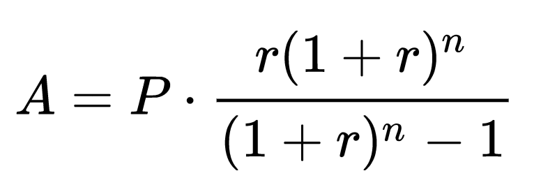
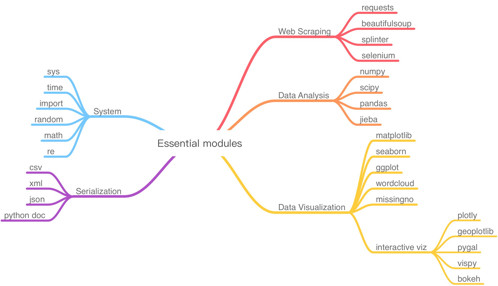

# Week 02 - Use Python as a daily tool

<div id="toc">

<!-- TOC -->

- [Week 02 - Use Python as a daily tool](#week-02---use-python-as-a-daily-tool)
    - [Objective of this week](#objective-of-this-week)
    - [Variables and assignment](#variables-and-assignment)
    - [Basic data types](#basic-data-types)
        - [Integer: `int`](#integer-int)
        - [Floating point (real number): `float`](#floating-point-real-number-float)
        - [Boolean: `bool`](#boolean-bool)
        - [String: `str`](#string-str)
        - [Escape character in strings](#escape-character-in-strings)
    - [Arithmetic](#arithmetic)
        - [Basic rules](#basic-rules)
            - [Exercise 1: Simple calculation](#exercise-1-simple-calculation)
            - [Exercise 2: Calculate a mortgage](#exercise-2-calculate-a-mortgage)
    - [Modules, functions and packages](#modules-functions-and-packages)
        - [Functions](#functions)
        - [Modules](#modules)
        - [Packages](#packages)
        - [How to use modules](#how-to-use-modules)
            - [Step 1: pip install modules](#step-1-pip-install-modules)
            - [Step 2: import modules](#step-2-import-modules)
        - [How to find modules and packages we want](#how-to-find-modules-and-packages-we-want)
        - [How to call functions](#how-to-call-functions)
            - [`.` notation to reference to the member](#-notation-to-reference-to-the-member)
            - [`()` notation to call function](#-notation-to-call-function)
            - [Exercise 3: Calculate the area of a circle](#exercise-3-calculate-the-area-of-a-circle)
    - [Common modules and functions you should know in chapter 2](#common-modules-and-functions-you-should-know-in-chapter-2)
        - [Scipy & Numpy](#scipy--numpy)
            - [Basic functions: Arrays](#basic-functions-arrays)
            - [About index in data types](#about-index-in-data-types)
        - [String functions (`str.*`)](#string-functions-str)
            - [Common functions](#common-functions)
            - [Python’s classical percent-sign string interpolation](#pythons-classical-percent-sign-string-interpolation)
            - [Str.format()](#strformat)
        - [Random](#random)
            - [random.random()](#randomrandom)
            - [random.randint(a,b)](#randomrandintab)
            - [random.choice(seq)](#randomchoiceseq)
            - [random.choices(population, weights=None, *, cum_weights=None, k=1)](#randomchoicespopulation-weightsnone--cum_weightsnone-k1)
            - [random.shuffle(list)](#randomshufflelist)
            - [random.sample(population, k)](#randomsamplepopulation-k)
    - [Exercises and Challenges](#exercises-and-challenges)
        - [Design and calculate a simple media business model](#design-and-calculate-a-simple-media-business-model)
        - [Calculate how many SD card you need to bring](#calculate-how-many-sd-card-you-need-to-bring)
        - [A simple model of media monitoring](#a-simple-model-of-media-monitoring)
        - [Mark Six lottery machine](#mark-six-lottery-machine)
    - [References](#references)

<!-- /TOC -->

</div>

In the previous chapter, We introduced the basic knowledge about terminal on Mac and how to navigate file system in Terminal, using shell, creating the first python script and execute it... In this chapter, we want to focus on Python basics, including _variables_, basic _data types_, _arithmetic_, _functions_ and several commonly used _modules_. After this chapter, you can use python as your daily tool, at least in form of a powerful calculator.

## Objective of this week

* Understand python basics
* Can use `help` to get inline documentation on new modules and functions
* Become comfortable with Python interpreter -- the REPL pattern (Read-Evaluate-Print Loop)
* Can use Python as a daily tool -- at least a powerful calculator


## Variables and assignment

Think of a variable as a name attached to a particular object. In Python, variables need not be declared or defined in advance. Therefore you should give it a definition or assign value to it. The equal sign `=` is used to assign values to variables.

Example 1:

```python
>>> a = 1 + 2
>>> print(a)
```

"a" is variable, so you give it a definition that equals to 1+2, and print 'a', you will get 3 in terminal.

Example 2:

```python
>>> fruit1 = 'apple'
>>> print(fruit1)
apple
```

It means you define variable "fruit1"  as apple, so you will get apple in terminal.

**Note** You should use `''`, or `""`, to wrap `apple`, or the terminal will think apple is another variables. You can't assign variables to other variables.

Example 3:

```python
>>> a = 'hello'
>>> b = 'world'
>>> c = a +' '+ b  #the blank space in `` will be shown on the results
>>> print(c)
hello world
```

a, b, c are all variables, and you can do calculation like normal numbers.

## Basic data types

In fact, there are so many different kinds of data you can use to define the variables. Different data types are totally different.
Following are some basic data types.

### Integer: `int`

`int` means integer, like 7, 8, 9. We deal with intergers in our work for most of the time.

Example 4:

```python
>>> a = int(7.9)
>>> print(a)
7
```

`int()` is a function, which converts the number in `()` to an integer.

### Floating point (real number): `float`

`float` means a number with decimal, like 2.1, 3.8, 5.6 and so on. It was initially called "float" because of the way computer handles very big/ very small real numbers is by [Floating point arithmetics](https://en.wikipedia.org/wiki/Floating-point_arithmetic).

Example 5:

```python
>>> b = float(7)
>>> print(b)
7.0
```

`float()` means you converts the number/integer in `()` to a decimal.

You will find most of our daily arithmetic operations apply to `int` and `float`, like `+`, `-`, `*`, `/`. We will show you basic arithmetics after explaining basic data types.

### Boolean: `bool`

The `bool()` method converts a value to Boolean (True or False), using the standard truth testing procedure.

It's not mandatory to pass a value to `bool()`. If you do not pass a value, `bool()` returns False. In general use, bool() takes a single parameter value.

The following values are considered `false` in Python:

* None
* False
* Zero of any numeric type. For example, 0, 0.0, 0j
* Empty sequence. For example, (), [], ''.
* Empty mapping. For example, {}
* Objects of Classes which has __bool()__ or __len()__ method which returns 0 or False

All other values except these values are considered `true`.

Example 6:

```python
>>> test = []
>>> print(test,'is',bool(test))
[] is False
>>> test = [0]
>>> print(test,'is',bool(test))
[0] is True
>>> test = 0.0
>>> print(test,'is',bool(test))
0.0 is False
>>> test = None
>>> print(test,'is',bool(test))
None is False
>>> test = True
>>> print(test,'is',bool(test))
True is True
>>> test = 'Loving you'
>>> print(test,'is',bool(test))
Loving you is True
```

You can apply **boolean logic** on bool type of values using operators like `and`, `or` and `not`. We will explain more in [Chapter 3](notes-week-03.md) when we discuss program flow management via conditional branches and loops.

### String: `str`

* `Str` means string, a sequence of characters, like quiet, asdf, HK_NY and so on.
* Strings can be created by enclosing characters inside a single quote or double quotes, like `''`,`""`. Even triple quotes can be used in Python but generally used to represent multi-line strings and doc-strings.

**Note**: what if there is a `""` in your line, how do you print this string line?

Example 7:

Please print `Xiao Ming says " I don't feel well today."`.

```python
>>> print("Xiao Ming says \"I don't feel well today\"")
Xiao Ming says "I don't feel well today"
```

What does `\"` means?, let's talk about this more.

### Escape character in strings

An [escape character](https://en.wikipedia.org/wiki/Escape_character) is "a character which invokes an alternative interpretation on subsequent characters in a character sequence".

Python has its own rules and grammar. Like if you need to use special character `''` in a string, you should use escape character. Because python regards `''` as sign of a string, if you use `''` inside of the string, it will cause invalid syntax error. Usually, we uses the \ (backslash) as an escape character for. The following are the commonly used examples.

* `\'` means single quote
* `\"` means double quote
* `\\` means backslash
* `\n` means new line
* `\r` means carriage return
* `\t` means tab
* `\b` means backspace
* `\f` means form feed
* `\v` means vertical tab

Example 8:

```python
>>> print("I don't feel well \ntoday")
I don't feel well
today
```

## Arithmetic

### Basic rules

| Operator          | Description                                                                                                         | Example                                                |
|-------------------|---------------------------------------------------------------------------------------------------------------------|--------------------------------------------------------|
| `+` Addition        | Adds values on either side of the operator.                                                                         | a + b = 30                                             |
| `-` Subtraction     | Subtracts right hand operand from left hand operand.                                                                | a – b = -10                                            |
| `*` Multiplication  | Multiplies values on either side of the operator                                                                    | a * b = 200                                            |
| `/` Division        | Divides left hand operand by right hand operand                                                                     | b / a = 2                                              |
| `%` Modulus         | Divides left hand operand by right hand operand and returns remainder                                               | b % a = 0                                              |
| `**` Exponent       | Performs exponential (power) calculation on operators                                                               | a**3 =1000, a=10                                       |
| `//` Floor Division | The division of operands where the result is the quotient in which the digits after the decimal point are removed.  | 9//2 = 4, 9.0//2.0 = 4.0, -11//3 = -4, -11.0//3 = -4.0 |

#### Exercise 1: Simple calculation

```python
>>> a = 10//3
>>> b = 10%3
>>> c = 10**3
>>> print("a=",a, "b=",b, "c=",c)
a= 3 b= 1 c= 1000
```

#### Exercise 2: Calculate a mortgage

Question: Calculate mortgage based on the following formula: (Assign "r" "P" "n" specific numbers by yourself.)



*[formula from wikipedia](https://en.wikipedia.org/wiki/Mortgage_loan), you can check out what each variable represents.*

```python
>>> r = 0.05
>>> n = 20
>>> P = 5000000
>>> A = r*P*(1+r)**n/((1+r)**n-1)
>>> print("A=",A)
A= 401212.935953
```

## Modules, functions and packages

### Functions

Function is a fundamental building block in Python that includes certain codes that can be re-used. A function takes input in form of "arguments" and gives corresponding output. For example, `print()` is a built-in function, which takes input of a sequence of arguments, representing values to be print. `print()` consumes those arguments, turn them into `str` format, and write the output onto your screen. `int()` is another built-in function, which takes an arbitrary value as input and output a corresponding integer.

Note the "function call" notation, i.e. `()` following the name of the function. When Python interpreter sees this notation, it will enter the body of the function and execute the codes there. When you find yourself doing something repeated in Python, you should consider to wrap those codes into a function, and use function calls with proper parameters at the place you want to use it. We will discuss this more on how to write and how to call one's own function in [Chapter 3](notes-week-03.md).

### Modules

Module is a higher level building block in Python that includes certain _function_ and can be reused. Some examples are like [numpy](http://www.numpy.org/), [scipy](https://www.scipy.org/) and [geopy](https://geopy.readthedocs.io/en/stable/). Those modules extend basic Python functions, so that you can easily finish complex tasks, like compute the matrix multiplication and get distance between two cities. Otherwise, you need to write hundreds of lines of codes, in order to get it done.

### Packages

A package is a collection of Python modules. It can be single `.py` file or a folder structure of `.py` files. Without worrying about the internal layouts, the way of using package is similar of using module. We will use the two terms interchangeably future discussions.

### How to use modules

#### Step 1: pip install modules

There're some preparations you need to do before you import or use modules. You need to install firstly.
You can either install from the official website of the package or use other third party tools, like `pip`, which we recommend.

Pip is a function of the Python Packaging Authority ([PyPA](https://www.pypa.io/en/latest/)), which is a working group that maintains many of the relevant projects in Python packaging. `pip` is already installed if you are using Python 2 >=2.7.9 or Python 3 >=3.4. You can type `python --version` to check out current version. If you are the older versions, please check out [here](https://pip.pypa.io/en/stable/installing/) to install and upgrade `pip`.

**Note** If you use python 3, please use `pip3` to install.

* To install the latest version of “SomeProject”: type `pip3 install 'SomeProject'` in your terminal.
* To install a specific version: `pip3 install 'SomeProject==1.4'`
* Upgrading packages: `pip3 install --upgrade SomeProject`
* To install packages that are isolated to the current user: `pip3 install --user SomeProject`. In school computer lab, you should use this method because you don't have authority to install in whole computer but just your account, so that the computer will keep your record.

#### Step 2: import modules

In python, we use `import` statements to call a certain modules or functions. `import` means import a module from the library/package you download or install from the internet. You can import modules by writing `import`+ `module name` on terminal. And there are many modules out there, commonly used modules like [numpy](https://docs.scipy.org/doc/numpy/user/quickstart.html) *click to check out more details.*

There are 3 ways to import a module, usually we use the first method, but you will learn the last two method in the later stage.

* import module
* from module.xx.xx import xx
* from module.xx.xx import xx as rename

For example, `import numpy` is to import a module called numpy. (Generally, "import" is always written on the top to indicate readers what kind of module and functions you will use.) After you import the module, you can use `help(module)` to check out their documentations

Example 10:

```python
>>> import numpy
>>> help(numpy)
Help on package numpy:

NAME
    numpy

DESCRIPTION
    NumPy
    =====
    
    Provides
      1. An array object of arbitrary homogeneous items
      2. Fast mathematical operations over arrays
      3. Linear Algebra, Fourier Transforms, Random Number Generation
    
    How to use the documentation
    
    ...
```

After you learn what you want in their documentations, you can press `control + z` to exit.

### How to find modules and packages we want


Basically, those are the modules that we might use in our daily study. You can get to know more modules by googling your demand or create a new `issue` in [here](https://github.com/hupili/python-for-data-and-media-communication-gitbook/issues) to ask for help.

### How to call functions

#### `.` notation to reference to the member

A member of a module can be a function or a variable. As you already know from the previous content that there are many functions in a module. We use `module name` +`.`+`member name` to reference to one member in a module.  If you don't know what are the members in this module, you can use `help(module)` to load help documentation, or use `dir(module)` to checkout the available members.

Example 11: Get the constant Pi

```python
>>> import numpy
>>> print(numpy.pi)
3.14159265359
```

This example means you choose a function called "pi" from the module `numpy`. You will get pi as 3.1415927. Therefore, whenever you want to call a function, you should check out which modules contain this function, then you use `.` notation to reference to the function.

#### `()` notation to call function

After we reference to one function, usually we have to input the parameters to call the function. we use `('parameters')` after the function to call the function, after executing this command, you can get the results you want.

Example 12: Use `sin` and `pi` function from `numpy` module

```python
>>> import numpy
>>> print(numpy.sin(numpy.pi/6))
0.5
```


#### Exercise 3: Calculate the area of a circle

Q: Calculate the area of a circle, and assign specific radius by yourself.

Example:

```python
>>> import numpy
>>> r = 5
>>> area = r**2 * numpy.pi
>>> print("area=", area)
area= 78.5398163397
```

## Common modules and functions you should know in chapter 2

### Scipy & Numpy

>[SciPy](https://www.scipy.org/) (pronounced “Sigh Pie”) is a Python-based ecosystem of open-source software for mathematics, science, and engineering. Which contains some most wildly used packages including `NumPy`, `Matplotlib`, `pandas`. [NumPy](http://www.numpy.org/) is the fundamental package for scientific computing with Python. It provides a high-performance multidimensional array object, and tools for working with these arrays.

#### Basic functions: Arrays

A numpy array is a grid of values, all of the same type, and is indexed by a tuple of non-negative integers. The number of dimensions is the `rank` of the array; the `shape` of an array is a tuple of integers giving the size of the array along each dimension.

We can initialize numpy arrays from nested Python lists, and access elements using square brackets`[]`:

```python
>>> import numpy as np
>>> a = np.array([1, 2, 3])   # Create a rank 1 array
>>> print(type(a))
numpy.ndarray
>>> print(a.shape)   # how many elements
(3,)
>>> print(a[0], a[1], a[2]) # index elements
1 2 3
>>> a[0] = 5                  # Change an element of the array
>>> print(a)
[5, 2, 3]
>>> b = np.array([[1,2,3],[4,5,6]])    # Create a rank 2 array
>>> print(b.shape)
(2, 3) #the first number means how many elements in this array, in this case, this array has two elements - two lists. The second number means how many sub-elements in each elements. In this case, there are 3 values in each list. So, it's like a layer nesting.
>>> print(b[0, 0], b[0, 1], b[1, 0])
1 2 4 #you can access values by their index. Similarly, the first number is to index elements in this array, the second number is to index the sub-elements in each elements.
```

**Note:** The text following by `#` is not the code, we call it comment. We can use `#` in ahead of text in the code blocks to comment out those text, which gives instruction to the system that this line is no need to execute. It's the explanations or instructions of the codes that tell others what you are doing so that they can quickly understand. Or even when you look back the codes later, you can quickly recall what you were doing. It's a good habit especially when you collaborate with others.

You can directly add `#` ahead of the codes/text to comment out them. If you want to comment out multiple lines. You can select those lines and type `command+/` . And type `command+/` again to un-comment them.

#### About index in data types

Simply, `Index` is like the position of one element in the whole list or object, which used to access this element. The index of first element is `0` and increases by integer. The following are examples may help you better understand this.

```
    String  ‘H     e     l      l      o'
    Index   [0]   [1]   [2]    [3]    [4]
    ch_list    ['a', 'b',  'c',   'd',   'e']
    Index   [0]   [1]   [2]    [3]    [4]
```

In ch_list ['a', 'b', 'c', 'd', 'e'], ch_list[0]='a', 0 is the index of 'a' in this list, similarly use in array. We will use more in chapter 3 so that you can get more familiar with this issue.

In addition, you can check out more array functions in scipy's [tutorial](https://docs.scipy.org/doc/numpy/user/quickstart.html).

### String functions (`str.*`)

#### Common functions

Python has a built-in string class named "str" with many handy features, which allow us to easily make modifications to strings in Python. Here are some of the most common string methods:

| Function                  | Description                                                                                                                                                                                                                        |
|---------------------------|------------------------------------------------------------------------------------------------------------------------------------------------------------------------------------------------------------------------------------|
| str.lower()               | Returns the lowercase or uppercase version of the string                                                                                                                                                                           |
| str.strip()               | Returns a string with whitespace removed from the start and end                                                                                                                                                                    |
| str.find('other')         | Searches for the given other string within s, and returns the first index where it begins or -1 if not found                                                                                                                       |
| str.replace('old', 'new') | Returns a string where all occurrences of 'old' have been replaced by 'new'                                                                                                                                                        |
| str.split('delimiter')    | Returns a list of substrings separated by the given delimiter. 'a,b,c'.split(',') -> ['a', 'b', 'c']. As a convenient special case, str.split (with no arguments) splits on all whitespace chars. 'a b c'.split() -> ['a','b','c'] |
| str.join(list)            | Joins the elements in the given list together using the string as the delimiter.The list elements will be joined by sequences. e.g. '---'.join(['a', 'b', 'c']) -> a---b---c                                                       |

Example 13:

```python
>>> test1 = 'PYTHON'
>>> test1.lower()
'python'
>>> test2 = '\n python is fun \n'
>>> test2.strip()
'python is fun'
>>> test3 = 'python loves,\'you\''
>>> test3.find('you')
14 #returns the first character where 'you' begins
>>> test4 = 'python loves,\'you\''
>>> test4.replace('you','me')
"python loves,'me'"
>>> test5 = 'python loves you'
>>> test5.split()
['python', 'loves', 'you']
>>> test6 = 'python loves you, do you like it'
>>> test6.split(',')
['python loves you', ' do you like it']
```

#### Python’s classical percent-sign string interpolation

Before `str.format()`  was introduced, using `%` to do **simple string interpolation** can be very easily. Use it if the order of your arguments is not likely to change and you only have very few elements you want to concatenate.

Example 14:

```python
>>> print("%s %s" % ('Hello', 'World'))
Hello World
```

In above example, `s%` means its a string. We used two `%s` string format specifier to tell Python where to substitute the value, and using 'Hello' and 'World' to replace those two strings. `%` between two parts basically means a command to call the replace actions.

If we want to make multiple substitutions in a single string, and as the % operator only takes one argument, we need to wrap the right-hand side in a tuple as shown in the example below.

Example 15:

```python
>>> name = 'world'
>>> program ='python'
>>> print('Hello %s! This is %s.'%(name,program))
Hello world! This is python.
```

Also, if we want to replace the integer, use `d%`.

```python
>>> print 'one is %d'%1
one is 1
```

#### Str.format()

`str.format()` perform as a string formatting operation, which provides the ability to do complex variable substitutions and value formatting, and great flexibility over the output of the string in a way that is easier to read, write and maintain than just using plain old concatenation.

**Syntax and common functions:**

* Accessing arguments by position.

```python
>>> '{0}, {1}, {2}'.format('a', 'b', 'c')
'a, b, c'
>>> '{}, {}, {}'.format('a', 'b', 'c')  # this method works only with the same number of {} and parameters
>>> '{2}, {1}, {0}'.format('a', 'b', 'c')
'c, b, a'
>>> '{2}, {1}, {0}'.format(*'abc')      # unpacking argument sequence
'c, b, a'
>>> '{0}{1}{0}'.format('abra', 'cad')   # arguments' indices can be repeated
'abracadabra'
```

Note: `.format(*'abc')` is equivalent to `.format(*['a', 'b', 'c'])`, and further equivalent to `.format('a', 'b', 'c')`. This is called argument unpack. You can revisit this example after learning the next chapter about compound structures.

* Accessing arguments by name.

```python
>>> '{name},{age}'.format(age=18,name='xyc')
'xyc,18'
```

* Accessing arguments’ attributes.

```python
>>> person = {"name": "xyc", "age": "18"}
>>> print("person_name: {name}, person_age: {age}".format(**person))
person_name: xyc, person_age: 18
```

* Accessing arguments’ items by locations.

```python
>>> coord = (3, 5)
>>> 'X: {0[0]};  Y: {0[1]}'.format(coord)
'X: 3;  Y: 5'
```

* Replacing %s and %r. It's like `%` way, please see to Examples 14.

```python
>>> "Hello: {!r}; This is: {!s}".format('World', 'Python')
"Hello: 'World'; This is: Python"
```

* Named placeholders

`.format()` also accepts keyword arguments. One can replaces string with arguments passed in function.

```python
>>> data = {'first': 'Hello', 'last': 'World!'}
>>> '{first} {last}'.format(first='Hello', last='World!')
'Hello World!'
```

* Aligning the text and specifying a width

```python
>>> '{:<30}'.format('left aligned')
'left aligned                  '
>>> '{:>30}'.format('right aligned')
'                 right aligned'
>>> '{:^30}'.format('centered')
'           centered           '
>>> '{:*^30}'.format('centered')  # use '*' as a fill char
'***********centered***********'
```

* Replacing %+f, %-f, and % f and specifying a sign

```python
>>> '{:+f}; {:+f}'.format(3.14, -3.14)  # show it always
'+3.140000; -3.140000'
>>> '{: f}; {: f}'.format(3.14, -3.14)  # show a space for positive numbers
' 3.140000; -3.140000'
>>> '{:-f}; {:-f}'.format(3.14, -3.14)  # show only the minus -- same as '{:f}; {:f}'
'3.140000; -3.140000'
```

* Truncating long strings to a specific number of characters.

```python
>>> '{:.4}'.format('telephone')
'tele'
```

* Format numbers
  
  * `'d'` - Decimal Integer. Outputs the number in base 10, and number ahead of `d` means the specific width you want to keep.

    ```python
    >>> '{:d}'.format(42)
    '42'
    >>> '{:4d}'.format(42)
    '  42'
    ```

  * `'f'` - Fixed-point notation. Displays the number as a fixed-point number. The default precision is 6, and number ahead of `f` means how many decimals you want to keep.

    ```python
    >>> '{:06.2f}'.format(3.141592653589793)
    '003.14'
    >>> '{:06.4f}'.format(3.141592653589793)
    '3.1416'

For more `string` operations, you can check out in [python docs](https://docs.python.org/3/library/string.html#formatstrings).

### Random

This module implements pseudo-random number generators for various distributions. There are many useful and simple functions,like `random.shuffle()`,`random.random()`  `random.sample()`. You can check out their [documentation](https://docs.python.org/3/library/random.html) to learn the details.

#### random.random()

Return the next random floating point number in the range [0.0, 1.0).

```python
>>> import random
>>> random.random()
0.9897798657708502 #random floating number in [0.0,1.0]
```

#### random.randint(a,b)

Return a random integer N and a <= N <= b. Alias for randrange(a, b+1).

```python
>>> import random
>>> random.randint(2,7)
5 #one random number >=2 and <=7
```

#### random.choice(seq)

Return a random element from the non-empty sequence seq. If seq is empty, raises IndexError.

```python
>>> import random
>>> number_list=[1,2,3,4,5,6,7,8,9,10]
>>> random.choice(number_list)
6 #one random number of the list
```

#### random.choices(population, weights=None, *, cum_weights=None, k=1)

Return a random sub-seq from the non-empty sequence seq.

```python
>>> import random
>>> number_list=[1,2,3,4,5,6,7,8,9,10]
>>> random.choices(number_list,k=3)
[5, 6, 8] #return k random number of the list
```

#### random.shuffle(list)

Return a list that randomly sort the sequence of all elements.

```python
>>> import random
>>> number_list=[1,2,3,4,5,6,7,8,9,10]
>>> random.shuffle(number_list)
>>> print(number_list)
[7, 1, 2, 8, 6, 3, 4, 10, 9, 5] #randomly sort
```

#### random.sample(population, k)

Return a k length list of unique elements chosen from the population sequence or set. Used for random sampling without replacement.

```python
>>> import random
>>> number_list=[1,2,3,4,5,6,7,8,9,10]
>>> random.sample(number_list,4)
[5, 10, 6, 1] #random sample 4 elements
```

## Exercises and Challenges

### Design and calculate a simple media business model

A group of HKBU students decided to found up a news website. Basically, their business model is to provide the content to their consumers, and earn money by a combination of subscription fee and advertising fee.

The following are the cost and revenue component in their business plan: (per month)

- Major cost:
  - Content cost `70000` dollars
  - Other cost like labor cost is `30000` dollars
  - Server cost: `50000`
- Revenue:
  - 10% of website monthly **visitors** are expected to become the **subscribers**
  - Subscription fee is `15` dollar/**subscriber** a month
  - Ad revenue = `0.8` dollar/**visitor** a month

Please build a calculator to estimate their revenues, given the number of monthly visitors as an variable `visitor`. Show the net income when `visitor` equals `40000`, `60000` and `80000`, respectively.

Functions you need to use:

`input()` function. Please refer to [here](https://docs.python.org/3/library/functions.html#input) for it's documentation.

Further challenges:

- Explore how the net income changes when the number of visitors changes
- Explore how the parameters of content cost, per user subscription fee and per user Ad revenue influences net income.
- (optional) Assume a more practical situation. The company invest `50000` in IT infrastructure as fixed assets. The infrastructure can support daily office use and support up to `50000` monthly visitors. When the number of monthly visitors becomes larger than `50000`, the company need to switch to cloud services, in order by by computing powers on demand. The excess amount incurs a cost of `0.001` dollar per user.

**SPOILER**: The reference solution and variations can be found in [Calculate Marketing Objective for Your Media Startup](https://dnnsociety.org/2018/02/01/calculate-marketing-objective-for-your-media-startup/), a blog post from our past students. Note that it uses more complex logics like `if` and `for`, which will be detailed in [Chapter 3](notes-week-03.md).

### Calculate how many SD card you need to bring

Suppose you are working on a documentary. You know how many days of footage you are going to shoot. Since there is no Internet connection in the destination, you have to store the footages first. Please calculate how many SD cards you want to bring with you.

### A simple model of media monitoring

You are assigned the task of media monitoring. Your supervisor is intrested in whether certain keywords appear in one article. In this exercise, we make a simple monitoring service. Suppose you already downloaded [this article](https://www.bbc.com/news/business-45392816) somehow (see [notes-week-07.md](notes-week-07.md) and [notes-week-08.md](notes-week-08.md)). The content is stored in variable like this: (called "heredoc")

```python
article = '''
The chief executive of Chinese online retailer JD.com, Liu Qiangdong, was briefly arrested in the US on accusations of criminal sexual conduct.

Mr Liu, one of China's richest people, was arrested in Minneapolis shortly before midnight on Friday and released on Saturday afternoon.

JD.com said Mr Liu, also known as Richard Liu, was falsely accused. Police say the investigation is open.

JD.com, also known as Jingdong, has alliances with Tencent and Walmart.

...
'''
```

Tasks:

- Try to use string function to identify if certain keywords appears in the above article
- What if you want to monitor other articles?

### Mark Six lottery machine

Mark Six (六合彩) is a famous game in Hong Kong. In this quiz, please write a lottery machine to simulate the Mark Six game. Requirements:

- Create a repo called "mark-six", which includes a script called "lucky.py"
- When the user executes "python3 lucky.py", it outputs the lottery result.
- Create a "README.md" file to give an introduction of this project. You can include background information, program design rationale, pointers to your references, and sample output (from multiple executions).

**TIP**: the module `random` helps here. You can revisit this exercise in week-03 to make improvements.

## References

* [Chapter 1, 2, 3 of official Python 2 tutorial](https://docs.python.org/2/tutorial/), About introduction to Python.
* [Python doc modules](https://docs.python.org/3/tutorial/modules.html) About modules, functions and packages.
* [Python format string](https://pyformat.info/). They introduce some most common use-cases covered by the old and new style string formatting API with practical examples.

------

If you have any questions, or seek for help troubleshooting, please [create an issue here](https://github.com/hupili/python-for-data-and-media-communication-gitbook/issues/new)