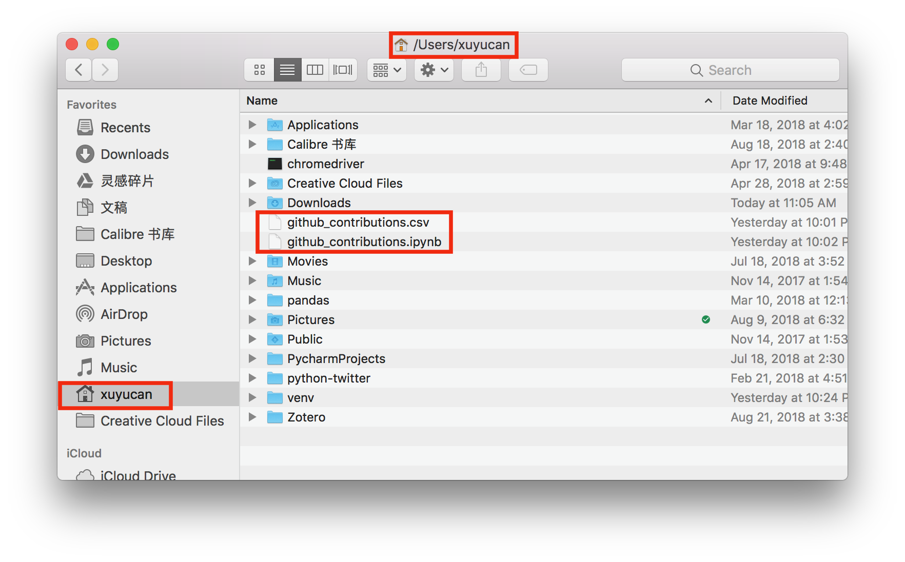
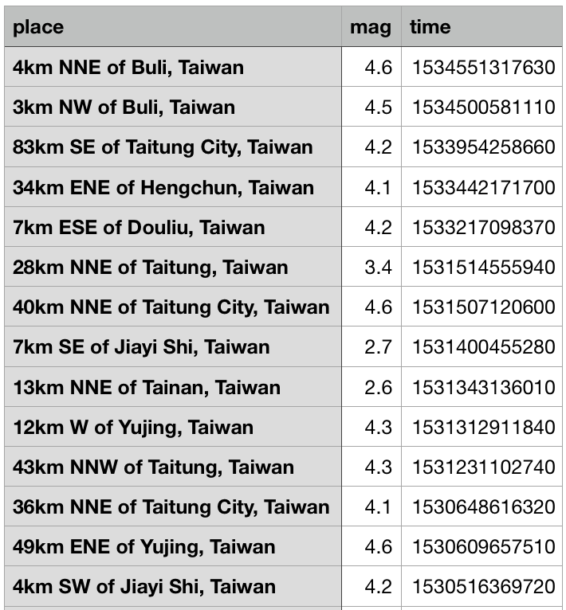
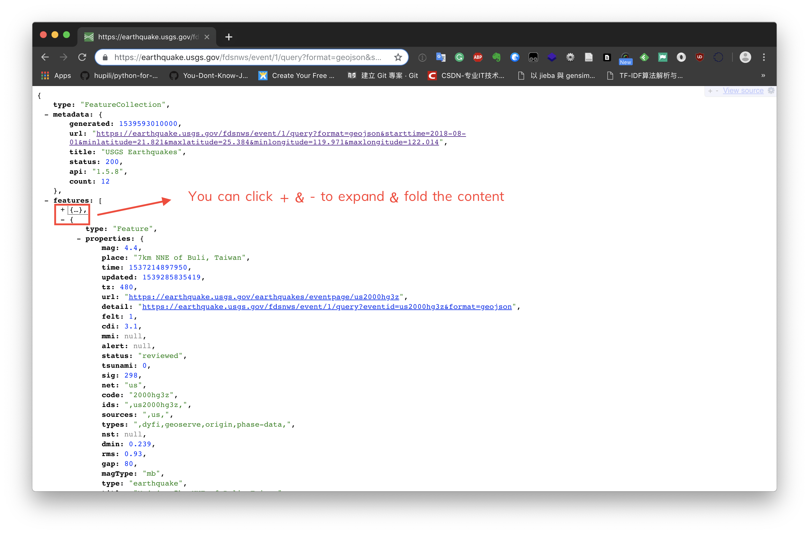
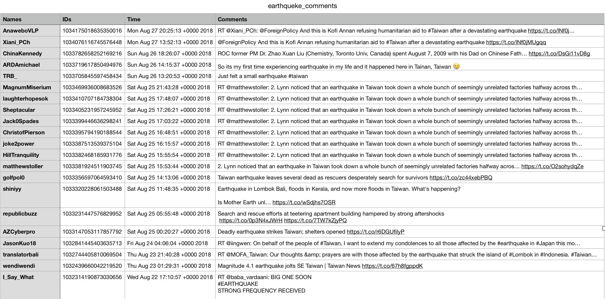

# Week 04 - Get structured data: CSV, JSON and API

<div id="toc">

<!-- TOC -->

- [Week 04 - Get structured data: CSV, JSON and API](#week-04---get-structured-data-csv-json-and-api)
    - [Objective](#objective)
    - [Learn to use Jupyter Notebook](#learn-to-use-jupyter-notebook)
        - [Virtual environment](#virtual-environment)
        - [Setup virtualenv and install Jupyter Notebook](#setup-virtualenv-and-install-jupyter-notebook)
        - [Setup jupyter environment in CVA517](#setup-jupyter-environment-in-cva517)
        - [Basic usage](#basic-usage)
    - [File operation](#file-operation)
        - [Write a file](#write-a-file)
        - [Read a file](#read-a-file)
        - [Append ()](#append-)
    - [CSV](#csv)
        - [csv.reader](#csvreader)
        - [csv.writer](#csvwriter)
            - [Write row](#write-row)
            - [Write rows](#write-rows)
        - [Exercise](#exercise)
    - [JSON](#json)
        - [JSON functions](#json-functions)
            - [json.dumps: Serialize object to a JSON formatted str](#jsondumps-serialize-object-to-a-json-formatted-str)
            - [json.loads: Deserialize JSON str to a Python object](#jsonloads-deserialize-json-str-to-a-python-object)
            - [json.load & json dump](#jsonload--json-dump)
    - [Requests](#requests)
        - [Make a Request](#make-a-request)
        - [Response Content](#response-content)
    - [API](#api)
        - [Why use api](#why-use-api)
        - [Use API via HTTP request/ response](#use-api-via-http-request-response)
            - [Test API without using Python](#test-api-without-using-python)
        - [Use API via function calls to other modules/ packages](#use-api-via-function-calls-to-other-modules-packages)
    - [Bonus: Your first automatic writing robot on Twitter](#bonus-your-first-automatic-writing-robot-on-twitter)
    - [Exercises and Challenges](#exercises-and-challenges)
        - [Douban API](#douban-api)
        - [Yahoo Finance API](#yahoo-finance-api)
        - [GitHub API](#github-api)
        - [Twitter API](#twitter-api)
        - [Wechat API](#wechat-api)
        - [Google Map API](#google-map-api)
        - [Bonus: Real Estate property in Hong Kong (via government open data portal API)](#bonus-real-estate-property-in-hong-kong-via-government-open-data-portal-api)
        - [Bonus: Blockchain - chain data and exchange data](#bonus-blockchain---chain-data-and-exchange-data)
        - [Bonus: Automatic earthquake writer](#bonus-automatic-earthquake-writer)
        - [Bonus: MailGun API](#bonus-mailgun-api)
    - [References](#references)

<!-- /TOC -->

</div>

Previously, we learned composite data types, and the basic control flows. This week, we will learns how to get data, convert data and save data. Before we step into scraping from the HTML, we will introduce a more convenient method - API. From this week on, you are gradually entering the door of "big data", the API allows you to get more types and a larger bass of data at the same time. After this week, you can use API method to request data from open data websites and social media platforms. And even create an automatic writing robot on Twitter.

## Objective

* Learn to use Jupyter notebook. All demos following this week will be conducted in Jupyter notebook.
* Understand API/ JSON and can retrieve data from online databases (twitter, GitHub, weibo, douban, ...)
* Understand basic file format like JSON and CSV.
    * Be able to comfortably navigate through compound structures like {} and [].
    * Be able to comfortably use (multiple layer of) for-loop to re-format data.
    * Be able to use serialisers to handle input/ output to files.

The brief of Application Programming Interface (API):

Operate in client-and-server mode.
Client does not have to download the full volume of data from server. Only use the data on demand.
Server can handle intensive computations that not available by client.
Server can send updated data upon request.

## Learn to use Jupyter Notebook

Jupyter notebook is originally called "IPython notebook" (interactive Python notebook), thus having the `.ipynb` suffix/ extention name of the the Jupyter notebook file.

It provides a web-based interface for you to interactively test and build Python codes. It is well suited for a bottom-up approach when buiding larger projects.

### Virtual environment

You will hear the term "environment" a lot of times when learning programming. It is a very broad term that refers to the context where the program is executed. The context can be time, operating system, current working folder, Python version, dependent module version, the status of system, the status of dependent components, ...

**TIP**: Two pieces of codes can act differently if the environments are different. When you find someone else's codes work but the same thing does not work at your side, it is a problem of "environment". Trouble shooting highly depends on experience and we will see a lot during the semester.

Python has a concept called virtual environment, "virtualenv" for short. You can use virtualenv to ensure the programs execute in the same environment. One common use case is to run Python2 and Python3 programs on the same computer. The system defaults to one of the major versions. However, you can use virtualenv to run some programs in Python2 and some programs in Python3. We also use virtualenv to ensure the dependent Python moduels are the same, whose version is usually specified in `requirements.txt`.

There are two commands to setup virtualenv:

* `virtualenv` -- old executable usually used in Python2.
* `pyvenv` -- the default and recommended way of setting up virtualenv in Python3. The tools is shipped with Python3 installation.

### Setup virtualenv and install Jupyter Notebook

If it's the first time you use jupyter notebook, you need create a virtual environment first. The following are the usual path to setup jupyter environment. For users in CVA 517 LAB, please see [here](#setup-jupyter-environment-in-cva517).

Step 1: Create virtual environment

```bash
pyvenv venv
```

Step 2: Enter virtual environment

```bash
source venv/bin/activate
```

Step 3: Install Jupyter notebook

```bash
pip3 install jupyter
```

Step 4: Enter Jupyter notebook

```bash
jupyter notebook
```

### Setup jupyter environment in CVA517

Due to the jupyter and the python conflict, there are problems of installing jupyter by the usual way. Instead, the following will work. For more details explanation, please see [here](https://github.com/hupili/python-for-data-and-media-communication-gitbook/issues/48).

```bash
pyvenv venv
source venv/bin/activate
pip install --upgrade pip
pip3 install jupyter
pip3 install 'ipython ==6.5.0'
pip3 install 'prompt-toolkit ==1.0.15'
```

Then, next time, you can just type the following command to open jupyter notebook

```bash
source venv/bin/activate
jupyter notebook
```

For details, Please see to our [tutorial](/module-jupyter.md) of how to install and enter jupyter notebook. The following is what jupyter notebook will look like.


### Basic usage

1. click `new` to create a new python 3 notebook
2. write codes like you usually do in text editors, and press `shift`+`return` to run the code. It will return the results or errors under the cell.
3. use `! pip3 install module_name` to install modules in jupyter notebook.
4. in front of every cell, there is an `in [ ]` sign, the number in `[]` means the sequences of cells, and if there is `*` in `[]`, means that this cell is still running, you can either wait it finish or click `stop` under the `kernel` to exit from the running,pressing `I` twice will also do the trick.
5. cell. `run cell` run step by step. `run all above` to run and check the previous steps of coding.
6. kernel. `kernel` is a tool for interactive input and output all the things you did from the beginning. By clicking`restart`, you can give a variable another value.

## File operation

### Write a file

Step 1: Create the file

```python
f = open("test.txt","w")
```

* You can write different kind of files by changing file name, like `name.txt`,`name.json`,`name.json`. But different file has different ways to write and read.
* ‘w' means write.

Step 2: Write content

```python
f.write('python tutorial')
f.close()
```

* f.close() to close the writing, this will close the instance of the file test.txt stored.

### Read a file

You also need to open the file first and then read the content.

**Syntax:**

```python
f = open("test.txt", "r+")
contents=f.read() #read all
content =f.read(6) #read first 6 characters
```

* ‘r' means read. 'r+' means it will read from the beginning, if you want to print certain part of the string, you should use this method.

### Append ()

The append function is used to append to the file instead of overwriting it. To append to an existing file, simply open the file in append mode ("a")

**Syntax:**

```python
h = open("Hello.txt", "a")
write("Hello World again")
h.close
```

## CSV

The CSV (Comma Separated Values) format is the most common import and export format for spreadsheets and databases,just like `xlsx` file, which is used for storing your data and make it easy to read and write. You don't need to pip3 install csv. Just `import csv` before using it.

The CSV has two basic functions: `reader` and `writer` .objects read and write.

### csv.reader

Return a reader object which will iterate over lines in the given CSV file. Each row read from the CSV file is returned as a list of strings. No automatic data type conversion is performed.

Suppose we have a CSV file, `name_list.csv`, you can download it [here](assets/chapter4-example-name_list.csv). The content is as follows:

| name  | id   | gender | location | phone|
|-------|------|--------|----------|------|
| Chico | 1742 |    M   |  KLN     |  3344|
| Ri    | 1743 |    F   |  LOS     |  5168|
| Ivy   | 1655 |    F   |   MK     |  7323|

Example 1: How to read this CSV?

```python
import csv
with open('chapter4-example-name_list.csv','r') as f: # open CSV
    rows = csv.reader(f) # read CSV
    for row in rows: #loop every row
        print(row)
```

Note: **If you download the csv, you should copy the csv file in the folder where your venv folder are. Usually, it's in the user path. All the files you write and read should in this folder.**



Output:

```text
['name', 'id', 'gender', 'location', 'phone']
['Chico', '1742', 'M', 'KLN', '3344']
['Ri', '1743', 'F', 'LOS', '5168']
['Ivy', '1655', 'F', 'MK', '7323']
```

**Note:**

* `with open(...) as f` means you give f a definition, which stands for opening the file. In the example,`f` can be changed by any words you like. It just means you rename the step of the opening. It's equal to `f = open('chapter4-example-name_list.csv',mode='r')`.
* `open()` means open the file. If there is no such file, it will create a new one. If there is a existing one, writer function will clear all the previous content and then write the new content.

### csv.writer

Return a writer object responsible for converting the user’s data into delimited strings. CSV file can be any object with a write() method.

Example 2: How to write a CSV file?

#### Write row

```python
import csv
with open('name.csv','w') as f:
    mywriter=csv.writer(f)  #writer is the function to write something
    mywriter.writerow(['Chico','Male'])  #you can just use writer.writerow()
    mywriter.writerow(['Ri','Female']) #write another row  
```

Output:


**Note:**

* `w` means write. By the way, if you want to read the file, you can input`r`,representing "read".
* `csv.writer()` means to write something in the name.csv file.
* `writerow()` means write one row and then another row. The input should be list type. `writerows()` means they will write row after row until loop all the elements from a list.
* arguments in `writerow()` should be a list, because `csv` function treat a row as a list, therefore you should use`[]` to wrap up the argument.

#### Write rows

**Method 1:**

```python
import csv
mylist=[['KLN',1742,3344],['Los',1743,5168]]  
with open('location.csv','w') as f:
    mywriter=csv.writer(f)
    mywriter.writerows(mylist) #if there are sub-list in the list
```

Output:


**Method 2:**

```python
import csv
number_list = [11,22,33,44,55,66]
with open('number.csv','w',) as f:
    mywriter=csv.writer(f)
    mywriter.writerows([[number] for number in number_list]) # equal to a for loop
```

Output:


**Method 3:**

```python
student_list = ['Chico','Ri','Ken','Aaliyah','Voodoo']
with open('student.csv','w',) as f:
    writer=csv.writer(f)
    for i in range(0,len(student_list)):
        writer.writerow(student_list[i])
```

Output:


**Note:** I guess you already find what's wrong here.  `writerows()` means write all the rows in one time. It writes every item of the list into a row. Like we said, csv.writerow function treat a row as a list, for which it will regard the first row 'Chico' as a list of items with 5 characters, or 5 strings. Then it is put in 5 cells. So how to avoid spilt characters of a string into different cells?

Try change `writer=csv.writer(f)` to `writer=csv.writer(f,delimiter=' ')`, see what will happen.

### Exercise

1. Write row ['hello','python'] in A1 in the CSV file

```python
import csv
with open('hello.csv','w') as f:
    mywriter=csv.writer(f)
    mywriter.writerow(['hello','python']) #writerow('hello','python') won't work, you should put it in a list. Every item of the list will be write in a cell of the table.
```

2. Use writerows to write [['spam','1'],['22','333'],['OK','Good']] in the CSV file

```python
import csv
with open('test.csv','w') as f:
    mywriter=csv.writer(f)
    mywriter.writerows([['spam','1'],['22','333'],['OK','Good']])
```


There are 3 items, or 3 lists, therefore it will output 3 rows. And inside each row, there are different items,So it will write each item in one cell.

## JSON

>JSON (JavaScript Object Notation) is a lightweight data interchange format inspired by JavaScript object literal syntax.

* JSON is a syntax for storing and exchanging data.
* JSON is text, written with JavaScript object notation.

**What does JSON looks like?**

Example 3:

```json
{
    "firstName": "Jane",
    "lastName": "Doe",
    "hobbies": ["running", "sky diving", "singing"],
    "age": 35,
    "children": [
        {
            "firstName": "Alice",
            "age": 6
        },
        {
            "firstName": "Bob",
            "age": 8
        }
    ]
}
```

**Why to use JSON?**

The advantages of JSON:

1. The data size is small. Compared with XML(another) file type to store and exchange data, JSON is small in size and faster in passing.
2. The transmission speed is fast. JSON is much faster than XML.
3. Data format is simple, easy to read and write, and the format is compressed.
4. Easy to use with python, JSON is a form of `k-v` structure.

In simple terms, JSON is a dict, which has keys, each key corresponds to a value. The middle is separated by `:` , the outermost is surrounded by `{}`, and the different key-value pairs are separated by `,`. Example like this

```python

{'key1': 'value1', 'key2': 'value2', 'key3': 'value3'}
```

If there is a case where a Key corresponds to multiple values, use [] to include all the corresponding values.

```python
{'key1': ['v11', 'v12', 'v13'], 'key2': 'v22'}
```

Now you can go back to have a look of example 3, test yourself whether you have understand the JSON structure.

### JSON functions

#### json.dumps: Serialize object to a JSON formatted str

**Syntax**

```python
json.dumps(obj, skipkeys=False, ensure_ascii=True, check_circular=True, allow_nan=True, cls=None, indent=None, separators=None, encoding="utf-8", default=None, sort_keys=False, **kw)
```

Don't be panic, we do not have to use those all parameters. Basically, you need to know those two.

1. If sort_keys is true (default: False), then the output of dictionaries will be sorted by key.
2. If ensure_ascii is true (the default), the output is guaranteed to have all incoming non-ASCII characters escaped like Chinese. If ensure_ascii is false, these characters will be output as-is.

Example 4: Convert Python object data into JSON string

```python
import json

data = {
    'name' : 'ACME',
    'shares' : 100,
    'price' : 542.23
}
json_str = json.dumps(data)
json_str
```

Output:

```txt
'{"name": "ACME", "shares": 100, "price": 542.23}'
```

If you want to save the JSON string to a file, so that others can re-use this file, you can use `open()` with the `.write()` function to achieve that.

```python
with open('json_data.json', "w") as f:
    f.write(json_str)
    f.close()
```

**TIP:** In **Jupyter notebook**, you can write shell commands after `!`. `cat` is essentially a shell command that reads the content of a file and output to the screen. It is a common way to check if the output (to a file) is intended. In [notes-week-01.md](notes-week-01.md), we have learned some useful commands like `cd`, `pwd` and `ls`. Those can all be used here. Also recall how we install new Python modules in a Jupyter notebook: `!pip install <package-name>`.

```shell
!cat json_data.json
```

```txt
{"name": "ACME", "shares": 100, "price": 542.23}
```

#### json.loads: Deserialize JSON str to a Python object

**Syntax**

```python
json.loads(s, *, encoding=None, cls=None, object_hook=None, parse_float=None, parse_int=None, parse_constant=None, object_pairs_hook=None, **kw)
```

Example 5: Parse JSON string to Python internal data structure.

```python
json_str = '''
{
    "dataset": {
        "train": { "type": "mnist", "data_set": "train", "layout_x": "tensor" },
        "test": { "type": "mnist", "data_set": "test", "layout_x": "tensor" }
    }
}
'''

import json
result = json.loads(json_str)
```

**TIP**: when you write a large chunk of data in Python, this "multi-line string", "block string literal", or "verbatim" is very useful. It helps you to reserve all the format like indentations in the data. This feature appears in nearly all programming languages and the official name is [HEREDOC](https://en.wikipedia.org/wiki/Here_document#Python).

In the above example, you can `.read()` the `json_str` from a file instead of using HEREDOC. Try it yourself.

Output: the content (string representation) of `result`

```python
{'dataset': {'test': {'data_set': 'test',
   'layout_x': 'tensor',
   'type': 'mnist'},
  'train': {'data_set': 'train', 'layout_x': 'tensor', 'type': 'mnist'}}}
```

#### json.load & json dump

Actually, if we want to convert between json file with python object. We can directly use `json.load` & `json.dump`. The difference between `loads` and `load` or `dumps` and `dump` is that you can get the string by using `-s` method. And sometimes, we need those strings to do other things instead of justing writing into files.

Example 6: Converting between JSON file and Python object

```python
stu = {
    "age": 20,
    "score": 88,
    "name": "Bob"
}
with open('stu.json', 'w') as f:
    json.dump(stu, f) #converting Python object to JSON file
```

Open the stu.json file, it will output like:

```text
{"age": 20, "score": 88, "name": "Bob"}
```

```python
with open('stu.json', 'r') as f:
     data = json.load(f) #converting JSON file to Python object
data
```

Output:

```text
{"age": 20, "score": 88, "name": "Bob"}
```

## Requests

Requests are the primary module we use to crawl website and get the content.

### Make a Request

Making a request is easy. First of all, please use `pip` to install requests before import. Then import the `requests` module. Usually, we use `requests.get` to make a request for data.

```python
import requests
r = requests.get('http://www.imdb.com/list/ls058982125/') #2017 Movie List
```

Now, we have a Response object called r. We can get all the information we need from this object, information about the 2017 movie list.

### Response Content

After we get the response object r, we need to read the content of the server’s response. There are three ways  to read contents.

```python
import requests
r = requests.get('http://www.imdb.com/list/ls058982125/') #pass url in ()
r.text
r.json
r.content
```

If you want to return text data, use `r.text`.(Use mostly)

If you want to return JSON, use `r.json`

If you want to return pictures and files, use `r.content`, it will return the binary data.

## API

Application Program Interfaces, or APIs, are commonly used to retrieve data from remote websites. Sites like Twitter, Douban and even government websites all offer certain data through their APIs. To use an API, you make a request to a remote web server, and retrieve the data you need.

### Why use api

Compared with other ways like download directly, APIs are useful in the following cases:

* The data is changing quickly. It doesn't need you to re-download it every minute - this will take a lot of bandwidth, and be pretty slow, the data we get through api is always up to date (unless you specify).
* Usually, the data sets return from APIs are usually can be directly convert to CSV or JSON, which is more structural and clean, you don't need to spend a lot of time to clean and find the data compared with request from `.html`.
* You can filter the data you want instead of download a large of data set.

Generally, different websites have different APIs methods to request the data. For example, the APIs of [USGS](https://earthquake.usgs.gov/fdsnws/event/1/) and [Douban](https://developers.douban.com/wiki/?title=api_v2) is a url, and you can change some parameters in the url to get the different data. While, the twitter api is a set of tokens and keys, you can call different functions to get different data.

### Use API via HTTP request/ response

So, in the following example, we'll be querying a simple API to retrieve data about the last 100 years' earthquakes that happen in Taiwan.

Step 1: Find it's API, and read it's documentation

API link : https://earthquake.usgs.gov/fdsnws/event/1/

Different organizations and websites have their own rules of using API. For this earthquake API, you cannot just request all data from this original API link, you need to specify which region, what period of time you want. It's like declare what content/data you want to request. Then you can just pass those parameters following the original API link to request those data, you can click the above API link see their examples to learn more.

Step 2: Set arguments and functions we want use

Functions:

* `query?`
* `count?`

Arguments:

* Start time: 1918-08-24
* End time: 2018-08-24
* Min latitude: 21.890
* Min longitude: 119.300
* Max latitude: 25.320
* Max longitude: 122.030

You can get 4 location parameters from [worldatlas](https://www.worldatlas.com/as/tw/where-is-taiwan.html)

Step 3: Create the API We want

```python
import requests
import csv

api_url = 'https://earthquake.usgs.gov/fdsnws/event/1/'
api_method = 'query?'
api_method_2 = 'count?'
api_format = 'format=geojson'
api_starttime = '1918-02-21'
api_endtime = '2018-02-21' #if you want to return data up to now, just to omit the endtime
api_minlatitude = '21.890'
api_minlongitude = '119.300'
api_maxlatitude = '25.320'
api_maxlongitude = '122.030'

query_url ='{0}{1}{2}&starttime={3}&minlatitude={4}&maxlatitude={5}&minlongitude={6}&maxlongitude={7}'.format(api_url,api_method,api_format,api_starttime,api_minlatitude,api_maxlatitude,api_minlongitude,api_maxlongitude)
#prepare for calling query function

count_url ='{0}{1}{2}&starttime={3}&minlatitude={4}&maxlatitude={5}&minlongitude={6}&maxlongitude={7}'.format(api_url,api_method_2,api_format,api_starttime,api_minlatitude,api_maxlatitude,api_minlongitude,api_maxlongitude)
#prepare for calling count function
```

Step 4: Requests content

If you just want to know how many earthquakes happen in the past 100 years, just use `count_url`, it will return how many data we get.

```python
response = requests.get(count_url)
data = response.json()
data # equals to print(data)
```

Note: **#in Jupyter Notebook you can omit 'print()' by directly using its name to print something**

Output:

```
{'count': 3939, 'maxAllowed': 20000}
```

If you just want to get all data and extract key information, just use `query_url`.

```python
response = requests.get(query_url)
data = response.json() #response JSON
data # print all data
```

Step 5:  Select the key values we want: mag, place and time, and write it in the csv file

You can check out the returned JSON, The outermost layer is a dict, and you will find all key information we want is in the key `features`, meanwhile, there are so many features. So firstly, we should extract all features by using `data['features']`, it will return a list of all features. And in the list, the information of every earthquake is in an dict. So we can further use keys to access its values.

```python
with open('TTT.csv','w') as f:
    writer = csv.writer(f)
    header = ['place','mag','time']
    writer.writerow(header)

    for i in range(0,len(data['features'])):
        writer.writerow([data['features'][i]['properties']['place'],data['features'][i]['properties']['mag'],data['features'][i]['properties']['time']])

    f.close()

    # data['features'][i]['properties']['mag'] means to find all magnitude of the earthquake
    # data['features'][i]['properties']['place'] # find all location
    # data['features'][i]['properties']['time'] # find all time
```

Output:


Quiz: You can see that the time is not what we want. Can you convert them to UTC time(Universal Time Coordinated).

#### Test API without using Python

Note that `requests.get(url)` basically sends an `GET` HTTP request to the server. You can achieve this without using Python. Your web browser, like Google Chrome, sends a lot of `GET` requests every day to the websites you visit. You can use `print(url)` to get the assembled final URL and copy-and-paste this URL into your browser address bar, to test the response from the server. Since most API returns JSON data structure, you can use the [JSONView](https://chrome.google.com/webstore/detail/jsonview/chklaanhfefbnpoihckbnefhakgolnmc?hl=en) extension in Google Chrome to get a better view and easier explore the response.



### Use API via function calls to other modules/ packages

Another API method that is worthy to introduce is using the keys and token they give to you, through which you can use the function they build to get the data. But a shortcoming about this method is there is very limit the amount of data you can get. The organizations with a large database are very strict about this. In this example, we will also use Taiwan example, to scrape users tweets under the keyword of 'Taiwan earthquake'.

Step 1: Check out `python-twitter` and install it

[Python twitter](https://python-twitter.readthedocs.io/en/latest/) is a library which provides a pure Python interface for the Twitter API. It works with Python 2.7+ and Python 3.

As usual, we use Jupyter Notebook to do exercise and pip way to install

```python
!pip install python-twitter
```

Step 2: Getting your application tokens

In order to use the python-twitter API client, you first need to acquire a set of application tokens. These will be your `consumer_key` and `consumer_secret`, which get passed to  `twitter.Api()` when starting your application. Please refer to the [documentation](https://python-twitter.readthedocs.io/en/latest/getting_started.html) and apply your own key.

```python
import twitter
import csv
api = twitter.Api(consumer_key) #please pass your own api key
```

Step 3: Find the correct function to call

There are many functions to accomplish different demands. If you want to get status from one given twitter ID, `api.GetUserTimeline` is the right one. As for our example, we should use `api.GetSearch` to get the comments. Then change the parameters we want. For more functions, please see [here](https://python-twitter.readthedocs.io/en/latest/twitter.html#module-twitter.api).

```python
results = api.GetSearch(term='taiwan earthquake',
        raw_query=None, 
        geocode=None, 
        since_id=None, 
        max_id=None, 
        until='2018-08-28', 
        since='2018-01-01', 
        count=100, #maximum you can get
        lang='en', 
        locale=None, 
        result_type='mixed', 
        include_entities=None, 
        return_json=False)
len(results) #check how many statues you get
type(results) # check the data type
```

Step 4: Take out the value we want and write it to CSV file

```python
with open('earthquake_comments.csv','w') as f:
    writer = csv.writer(f)
    header = ['Names','IDs','Time','Comments']
    writer.writerow(header)
    for i in range(0,len(results)):
        writer.writerow([results[i].user.screen_name,
        results[i].id,
        results[i].created_at,
        results[i].text])
```

Output:


## Bonus: Your first automatic writing robot on Twitter

Although our focus in this chapter is to get data from different sources via API, some of the APIs are more than that. For example, you can use the `python-twitter` module to post a status to Twitter. Now that you already know how to template string (`%` and `str.format`) and how to post a Twitter status, you can combine them as your first _automatic writing robot_!

Here are some examples of such robots:

- A robot that summarises Initium Media articles and post status upon new release. You can find [source code](https://github.com/hupili/summary-bot/blob/master/bot.py), or see it [in action](https://twitter.com/summary_bot).
- [EQBOT](http://eqbot.com/) gets earthquake updates in an interested region and post to Twitter when there is a new earthquake. The bot is reproduced by our TA as [@nandobreaux](https://twitter.com/nandobreaux), whose source codes are in this [notebook](https://github.com/hupili/python-for-data-and-media-communication/blob/master/w5-api-json/earthquake_robot.ipynb).

## Exercises and Challenges

### Douban API

Retrieve and analyse the recent movie. Douban's API will be helpful here:

- [API sample for Recent movies](https://api.douban.com/v2/movie/in_theaters)
- [API sample for movie details](https://api.douban.com/v2/movie/subject/26942674)

Try to store the recent movie data into a CSV for future analysis. One example header could be:

```csv
title,director,year,cast,description,region
```

Reference use cases:

- [Hu Zizhe, COMM7780, S2018](https://github.com/hupili/python-for-data-and-media-communication/blob/b69f4a4d12dab58920a871e3e2aadf1a7f04d5ac/api-examples/week5_douban_huzizhe.py)

### Yahoo Finance API

Yahoo Finance provides rich set of stocks API. You can get company information and quote information from the API. The API is originally designed for their internal use. People have done a lot of analysis on it and reverse engineered the parameters so you can easily play around it. Find some example use from [this notebook](https://github.com/hupili/python-for-data-and-media-communication/blob/master/api-examples/Yahoo%20Finance%20API.ipynb).

### GitHub API

GitHub provides very convenient/ developer friendly access to its pubic database via [its API](https://developer.github.com/v3/). For example, one can enumerate the people who have starred one repo by calling (HTTP request) the following API endpoint:

```text
https://api.github.com/repos/{username}/{reponame}/stargazers
```

For example, click [here](https://api.github.com/repos/hupili/python-for-data-and-media-communication-gitbook/stargazers) to see the API response that includes all users who have starred our open book repo.

### Twitter API

Twitter provides official API to access its data and allows one to programmably post status updates on the platform. We have introduced the API and a Python package in previous sections. You can search for a certain keywords and get related tweets using this API.

Reference use cases:

- [XU Yucan, COMM7780, S2018](https://github.com/hupili/python-for-data-and-media-communication/blob/master/api-examples/week5_taiwancomments_xuyucan.py)

### Wechat API

Wechat does not provide public API but its own web App has an internal HTTP API. People have done good analysis on it and built very convenient packages to retrieve data and post messages. [wechat-egonet](https://github.com/hupili/wechat-egonet) is a script based on the library called `itchat`. You can use it to get your friend list and chatrooms information.

Reference use cases:

- **pwords**, 2018, _个人微信群组关系网络图 (ego-network)_ [Link](https://mp.weixin.qq.com/s/DgAXmcR2kn3q2xjsEiwpJg)

### Google Map API

Retrieve a JSON response from Google Map API. Here is an example: [Get the location of HKBU](https://maps.googleapis.com/maps/api/geocode/json?address=hong%20kong%20baptist%20university).

Once you know how to use `requests` and `json` to get the interested coordinates data, you can revisit the [city distance challenge](notes-week-03.md#distances-among-cities) from last chapter. Then you have a fully automated solution.

**NOTE**: The above HTTP API does not work starting from Aug 2018. Instead, you can use the Google geo coder from `geopy` library. You need to apply for an API key first. Following sample code can help you.

```python
from geopy.geocoders import GoogleV3
geolocator = GoogleV3(api_key='Put your Google Map API Key here')
location = geolocator.geocode("慈雲山毓華里18號慈華商場地下2-3號")
location.point
```

### Bonus: Real Estate property in Hong Kong (via government open data portal API)

Lookup real estate properties on HK gov open data portal, e.g. the [dataset page](https://data.gov.hk/en-data/dataset/centaline-centanetod-ccipropertyinfo/resource/4d3d7289-9d84-4f31-bf7e-a515d00d5328). Retrieve the data that `scp_mktc` contains '九龍' from year 2000 up to now. API result is like [this](assets/data-gov-hk-API-results).

### Bonus: Blockchain - chain data and exchange data

[blockchain.info](blockchain.info) provides a set of [API](https://www.blockchain.com/api) for one to retrieve information related with bitcoin transactions. Pick one wallet address, check its UTXO sets and sum up the values to get the total balance in this wallet.

[A free crypocurrency API](https://min-api.cryptocompare.com/) for you to retrieve and study historical exchange rates. We are interested in bitcoin price. Try to get the exchange rate day-by-day of `BTC/USDT` pair in recent years and store them in a file.

### Bonus: Automatic earthquake writer

* Implement a basic version of first automated writer - QuakeBot from LA Times.
  * Get real-time data of earthquakes in `America` from USGS API
  * Print a story to the screen include place, time, magnitude, using template string / string interpolation
  * See [here](https://gizmodo.com/quakebot-an-algorithm-that-writes-the-news-about-earth-1547182732) for an introduction of the bot. See [here](https://www.theregister.co.uk/2017/06/22/la_times_bot_spreads_fake_news/) for an incident and think how to avoid it?

Reference use cases:

- [XU Yucan, COMM7780/JOUR7280, F2018](https://github.com/ChicoXYC/python-for-data-and-media-communication/blob/master/api-examples/Taiwan%20earthquake%20robot.ipynb)

### Bonus: MailGun API

Try to send automatic emails using [MailGun](https://www.mailgun.com/). Imagine you want to maintain the relationship with thousands of customers. You have the name list with email addresses. You want to write an intimate email so that every mail looks like manually tailored for the recipient. However, it is very time consuming to do this manually. You come up with an idea based on string templating and MailGun API. MailGun is a commonly used service for receiving email and sending email. You can use string templating to format the customised message and then use MailGun to send them to the recipients.

An example of using MailGun can be found in [this repo](https://github.com/hupili/mgcli).

## References

* Python official doc about [json](https://docs.python.org/3/library/json.html)

------

If you have any questions, or seek for help troubleshooting, please [create an issue here](https://github.com/hupili/python-for-data-and-media-communication-gitbook/issues/new)