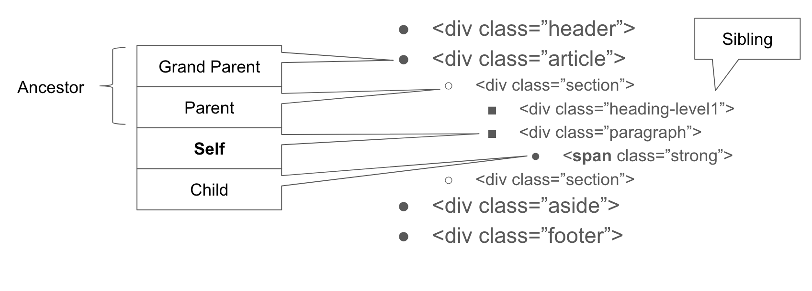

# Week 05 - Get semi-structured data: Web scraping

<div id="toc">

<!-- TOC -->

- [Week 05 - Get semi-structured data: Web scraping](#week-05---get-semi-structured-data-web-scraping)
    - [A word on unified environment](#a-word-on-unified-environment)
        - [virtualenv, Python3 and Python2](#virtualenv-python3-and-python2)
        - [Jupyter notebook](#jupyter-notebook)
    - [Knowledge about HTML](#knowledge-about-html)
        - [Chrome DevTools](#chrome-devtools)
        - [How to use Chrome DevTools](#how-to-use-chrome-devtools)
        - [Frontend three: HTML, JS, and CSS](#frontend-three-html-js-and-css)
        - [HTML](#html)
    - [Scraper](#scraper)
        - [Basic logic](#basic-logic)
        - [New module: BeautifulSoup](#new-module-beautifulsoup)
            - [Use BeautifulSoup parser](#use-beautifulsoup-parser)
            - [Find data: find.() and find_all()](#find-data-find-and-find_all)
        - [Get data](#get-data)
            - [Get title](#get-title)
            - [Get date](#get-date)
            - [Get author](#get-author)
                - [Method 1: Failed because of lack of specificity](#method-1-failed-because-of-lack-of-specificity)
                - [Method 2: Best Current Practice (BCP) -- multiple layers of element lookup (find)](#method-2-best-current-practice-bcp----multiple-layers-of-element-lookup-find)
                - [Method 3: Parse authors by spliting a larger text](#method-3-parse-authors-by-spliting-a-larger-text)
            - [Get tags](#get-tags)
            - [Scrape all articles of one page](#scrape-all-articles-of-one-page)
            - [Bonus: Scrape all articles features of all pages](#bonus-scrape-all-articles-features-of-all-pages)
    - [Scraper pattern](#scraper-pattern)
        - [Data structure](#data-structure)
        - [Item-first v.s. attribute first](#item-first-vs-attribute-first)
        - [Deal with missing data in scraping](#deal-with-missing-data-in-scraping)
        - [Bonus: Scrape by text processing and regular expression](#bonus-scrape-by-text-processing-and-regular-expression)
    - [Bonus: Crawler](#bonus-crawler)
        - [Workflow of a search engine like Google](#workflow-of-a-search-engine-like-google)
        - [Crawler is more than scraper](#crawler-is-more-than-scraper)
        - [Crawler is not necessary in most of your cases](#crawler-is-not-necessary-in-most-of-your-cases)
        - [scrapy](#scrapy)
        - [scrapy-cluster](#scrapy-cluster)
    - [Exercises and Challenges](#exercises-and-challenges)
        - [Scrape github users' contribution frequency](#scrape-github-users-contribution-frequency)
            - [Further challenge1: more users](#further-challenge1-more-users)
            - [Further challenge2: detailed activities](#further-challenge2-detailed-activities)
        - [Scrape the faculty list](#scrape-the-faculty-list)
        - [Scrape Haunted House in Hong Kong](#scrape-haunted-house-in-hong-kong)
        - [Scrape Hacker News](#scrape-hacker-news)
        - [Scrape Juejin](#scrape-juejin)
            - [Bonus: Automatic trending topic detection and posting](#bonus-automatic-trending-topic-detection-and-posting)
        - [Scrape Douban Top 250](#scrape-douban-top-250)
        - [Scrape IMDB Top 250](#scrape-imdb-top-250)
        - [Scrape opening journalist positions in the world](#scrape-opening-journalist-positions-in-the-world)
    - [Related Readings](#related-readings)

<!-- /TOC -->

</div>

## A word on unified environment

### virtualenv, Python3 and Python2

Python3 is the de facto standard in Python now (year 2018). The community spent [around 10 years](https://en.wikipedia.org/wiki/History_of_Python#Version_3) efforts before the widespread of Python3. The standard and interpreter core are out in the market for a very long time but many useful libraries were waiting to support Python3. People have maintained a [wall of shame](https://python3wos.appspot.com), which is later changed to "wall of superpowers", to track the progress of moving to Python3. It is all because Python3 is not a backward compatible upgrade to Python2. Past codes will break when we upgrade from Python2 to Python3.

**TIP**: If you start a new project now, use Python3, *Python3*, **Python3**.

However, in some places, especially older systems/ environments, you still have Python2, or dependencies on Python2. To make things uncluttered, please setup virtualenv and your Jupyter notebook in virtualenv.

### Jupyter notebook

Windows users and Mac OS X users suffer different environment setup problems in chapter 1-3. Starting from chapter 4, all our works will be based on virtualenv and Jupyter notebook. So everyone will see the same input/ output in the future. -- A big cheers! -- you have already passed through the most difficult part of the whole course.

You can refer to [FQA on Jupyter](module-jupyter.md) for more information.

## Knowledge about HTML

### Chrome DevTools

Chrome DevTools is a set of web developer tools built directly into the Google Chrome browser. For us, Chrome DevTools can help us better learn the basics of viewing and even changing a page's code, with what we can understand the structure of a webpage better, how a website store the data, present the information, and most importantly, how we locate/find those information we want and retrieve them into structural data to process further analysis.

### How to use Chrome DevTools

1. Firstly, It is suggested to use 'Chrome' as our browser.
2. In Chrome, `option+command+i` to open the Chrome DevTools, a.k.a Chrome developer console.
3. Click the upper left corner of the console, you can select an element in the webpage to inspect it. You will see its source code by moving your cursor on to it.

Eg: Check out the structure of a webpage, a project about tweets of Trump <https://initiumlab.com/blog/20170329-trump-and-ivanka/>. For example, moving your cursor to check out every `h2` headline.


### Frontend three: HTML, JS, and CSS


* HTML is a machine language of web page. Writing something in HTML means to create a web page. It is a structure of diverse tags. Those tags are in pairs,with open tag and closing tag that wrap up content we want to present. Like `<p>` content `</p>`.
* CSS stands for Cascading Style Sheets. CSS describes how HTML elements are to be displayed on screen, paper, or in other media.
* JavaScript is the programming language of HTML and the Web, which is mainly used for image manipulation, form validation, and dynamic changes of content.

### HTML

HTML is a "declarative language", whereas Python is "imperative language" (in short, loose terms). The key difference here is that declarative language does not instruct the machine how to solve a problem/ present result in a step-by-step manner. Instead, it tells the machine what the desired output is and it is subject to the machine how to generate the output in its own ways.

The whole web lives on HTML so you can find numerous free online resources for further study of HTML, e.g. [here](https://en.wikibooks.org/wiki/HyperText_Markup_Language). Our major objective here is not to teach one to write web pages (frontend development). We emphasize on understanding the HTML pages and parsing useful **structured** data out of the pages. Here are the core concepts on HTML:

- It is a language based on tags. Common tags can be `p`, `h1`, `h2`, `h3`, `ul`, `ol`, `li`, `img`, `a`, ...
- Tags come in paired and nested manners:
  - Paired -- if you see `<p>`, there must be a `</p>` later on. The document looks like 

  ```html
  <p>
    ... content is here ...
  </p>
  ```

  - Nested -- imagine a list of shopping items on the page, and each item is an image link, that leads you to detailed page when clicked. The structure looks like

  ```html
  <ul>
    <li>
        <a href="link to the destination when click">
            
        </a>
    </li>
  <ul>
  ```

In this way, one can build a complex structure of pages. The inner tags are called "children" of the out tags. One can picture in mind that the HTML document is organised in **tree** like structure, where `<html></html>` is the "root" and every other tag is a "branch" who has child tag and parent tag. One may note that `img` tag does not come in pairs in above example. That is because you can not place any content inside `img`. It is a "leaf" and we don't enclose further tags inside it. Towards this end, we can give a shorthand omitting the closing tag `</img>`. It was once a good practice to make the tags come in paired format. Since the inception of HTML5, it was suggested to leave "leaf" tags the way it naturally should be -- i.e. no pairing closing tag and no content iside.


(an illustration of HTML tree structure)

For the ease of discussion, we also call "HTML tag" as "HTML element" or "HTML node" interchangeably.

## Scraper

### Basic logic

Before we try to get data, here is the logic we should know.
Basically, when we scrape a website, firstly we need to know the website.

1. Does the website provide its own API to get the data?
2. If no, we will scrape the data from it's html.
3. All data or information is stored in the html tags. Tag names are settled by the website creators, which always appears as pairs. So, all we need to do is to find the tags that contains our required data. For example, the article titles are usually in `h1`, and texts are usually in `p`. You can find those tags by using Chrome DevTools, which we talked about this at the beginning of the chapter.
4. After we find the data and the tags, we write code to get them(using `control flows`), clean them(`manipulating strings`,`strip()`,`replace()`...), and store them into files(`CSV`,`JSON`).

### New module: BeautifulSoup

>`bs4` is the abbreviation of BeautifulSoup4. Beautiful Soup is a Python library for pulling data out of HTML and XML files.

In other words, BeautifulSoup parse the html content you request into structural data so that we can easily find the element we want.

Install BeautifulSoup

```text
!pip3 install --user bs4
```

Import the module

```text
from bs4 import BeautifulSoup
```

#### Use BeautifulSoup parser

BeautifulSoup parser can convert the results we request into structural data so that we can easily find the data we want.

Eg: <https://initiumlab.com/blog/20170329-trump-and-ivanka/>

```python
import requests #week o4 request module
from bs4 import BeautifulSoup #pay attention to its syntax
r = requests.get('https://initiumlab.com/blog/20170329-trump-and-ivanka/')
#print(r) you will get <Response [200]> means request successful
html_str = r.text #get the content of the request
```

* Store the web as `r`, `get()` means try to get response of that web page, passing url string in to `()`.
* `text` means to show the text of the web page.

Output: This is before the parsing step, you can see that they are like a mess.


```python
data = BeautifulSoup(html_str,"html.parser") #pay attention to it's syntax
```

Output: After parsing, you can see that the data is more structural, and we can further get/find the data by using `control flows` and manipulating of `[]` and `{}`.


#### Find data: find.() and find_all()

* `find` to find what we want, and output the first item. Like if there are 10 h1, they will return the first one.
* `find_all` return a list of all the values we want. Like if there are 10 h1, they will return a list that contain all those h1. **A list means that we can use for loop to further filter**.

Example:

html_doc is as following:

```python
html_doc = """
<html><head><title>The Dormouse's story</title></head>
<body>
<p class="title"><b>The Dormouse's story</b></p>

<p class="story">Once upon a time there were three little sisters; and their names were
<a href="http://example.com/elsie" class="sister" id="link1">Elsie</a>,
<a href="http://example.com/lacie" class="sister" id="link2">Lacie</a> and
<a href="http://example.com/tillie" class="sister" id="link3">Tillie</a>;
and they lived at the bottom of a well.</p>

<p class="story">...</p>
"""

from bs4 import BeautifulSoup
soup = BeautifulSoup(html_doc, 'html.parser')
my_a = soup.find('a') #find a
my_a
```

Output:

```text
<a href="http://example.com/elsie" class="sister" id="link1">Elsie</a>
```

```python
my_a = soup.find_all('a') #find all a
my_a
```

Output:

```text
[<a class="sister" href="http://example.com/elsie" id="link1">Elsie</a>,
 <a class="sister" href="http://example.com/lacie" id="link2">Lacie</a>,
 <a class="sister" href="http://example.com/tillie" id="link3">Tillie</a>]
```

```python
my_a = soup.find('a',attrs={'id':'link3'}) #find link3
```

Note: **You can see that in tag a, there are some attributes, like class, id. Those attributes are used to distinguish this tag from other similar tags, especially when there are many tags in the html page. So, if you want to locate or find sth. more precisely. You can find those attributes specifically by writing it as `soup.find('tag_name',attrs={'attributes':'values'})`**

Output:

```text
<a class="sister" href="http://example.com/tillie" id="link3">Tillie</a>
```

Basically, parser and find functions are the most used of `BeautifulSoup` library for us, if you want to know more functions and syntax of using it, please check out [here](https://www.crummy.com/software/BeautifulSoup/bs4/doc/).

### Get data

#### Get title

Open the chrome devtools, by moving the mouse on the headline, you can find title is in:

```html
<h1 class="post__title" itemprop="name headline"> 特朗普父女推特解密</h1>
```


```python
import requests
import csv
from bs4 import BeautifulSoup
r = requests.get('https://initiumlab.com/blog/20170329-trump-and-ivanka/')
html_str = r.text
data = BeautifulSoup(html_str,"html.parser")
my_h1 = data.find('h1') # we use tag and attributes to extract the data we want. Type(my_h1) you can see that `my_h1` is bs4.element.Tag
my_title = my_h1.text #turn bs4.element.Tag into pure text
my_title.strip() # remove the character specified at the beginning and end of the string
```

Output: You can learn the logic and function of each step.


**Note:**

* `strip()`means delete the meaningless character at the beginning and end of the string.
* `HTML/bs4_tag.text` means turn bs4.element.Tag into pure text.
* You can `help(str.strip)` to see the usage of strip.
* `type(sth)` is to print what is the format of sth. It's useful because you should know what's the data it return to further extract the value we want. Like, if it is a list, we should first use index to access its value. Similarly, if it is a dict, we should use keys to access its value.

#### Get date

In the same way we use to find the title, we can find that time tag as follows:

```html
<time itemprop="dateCreated" datetime="2017-03-29T....." content="2017-03-29">
                  2017-03-29
                </time>
```

Extract time value:

```python
my_date = data.find('time').text.strip()
```

Output:


#### Get author


You can find that authors are in the span, so could we just use `find.span`to get the authors?

##### Method 1: Failed because of lack of specificity

```python
my_authors = data.find('span')
```

Output:

```text
<span>首頁</span>
```

It is not what we want, the reasonable guess is that there are many 'span'. So check how many span there, and find the difference between those tags. `command+f` to open the search bar in console,and input 'span'.You can see, there are more than 2 'span'. Therefore we should find all the span.

```python
my_spans = data.find_all('span')
my_spans
```

Output:

```text
[<span>首頁</span>,
 <span>文章</span>,
 <span>專題</span>,
 <span>活動</span>,
 <span>職位</span>,
 <span>團隊</span>,
 <span>訂閱</span>,
 <span>Li Yiming</span>,
 <span>Li Yuqiong</span>,
 <span class="tag">
 ...
 <span>香港北角英皇道 663 號泓富產業千禧廣場 1907 室</span>]
```

You can see that `find_all` returns a list and there are so many spans, and the authors are also in two of those spans. So how we get them? We use `index` to access them.

```python
authors = []
author_1 = my_span[7].text
author_2 = my_span[8].text
authors.append(author_1) #append them into a list
authors.append(author_2)
```

**Note**: Why do we just use `authors = my_span.find[7:9].text` to find all authors? Because `find[7:9]` or `find_all` return a list of elements, however, if you use `().text` function in a list of elements, it will raise error, the list has no attribute 'text', which means it cannot be converted to text directly in this way.

**TIP**: "specificity" issue is quite common in writing scraper. There are usually many ways, and usually easy, to find the element(s) we are interested in. One needs to work hard to ensure, the scraper does not pollute the result by other elements that we are **not interested** in.

##### Method 2: Best Current Practice (BCP) -- multiple layers of element lookup (find)


* The logic here is if we can not specify one elements in the inner circle, we spread out to find the differentiate tag that only the element has.
* In the HTML, we can find that authors upper tag is 'td'. But there are too many td. And it is difficult to be specific. So, we spread out.
* Outer the `td` is the `tr` tag with a class named `post_authors`, you can find its the special tag only used to wrap authors, so try to locate and extract author names by tag: `tr`. Once we find the `tr`, we wan further find td, then find all `span` in `td`, thats what we want.

```python
my_authors = []
post_authors = data.find('tr',attrs={'class':"post__authors"})
#pay attention to its syntax, find('tag_name,attributes={'key':'value'})
my_td = post_authors.find_all('td')
my_span = my_td[1].find_all('span')
for span in my_span:
    my_authors.append(span.text)
my_authors
```

Output:

```text
['Li Yiming', 'Li Yuqiong']
```

##### Method 3: Parse authors by spliting a larger text

```python
my_authors = data.find('tr',attrs={'class':"post__authors"}).text.strip().replace('\n',',') #after .text, we got the author names with several characters, we can further use strip and replace to omit those meaning less characters.
```

Output:


* Syntax: `find('tag_name,attributes={'key':'value'})`
* attrs = attributes. It contains more detailed information about about HTML tags, which helps to locate and identify the values better.
* `replace('a','b')` means replace a as b. You can see that even after `strip()`, there is a `\n` in lines, in such circumstances, we can use replace to get off those characters.

**TIP**: Please compare this method to the previous method. The best practice is to refrain from text processing if possible, especially in the upstream (earlier stage) of data processing pipeline. Method 3 looks simpler by a glance but Method 2 is more stable, especially in the long run, when more people join force to maintain one set of codes. The major drawback of splitting text is that the delimiter (`\n` here) may also appear as part of the text content. It is unlikely the case in our current example but have caused trouble to many students in other scenarios.

#### Get tags

```python
my_tags = data.find('tr',attrs={'class':'post__tags'}).text.strip().replace(' ','').replace('\n\n\n\n\n','|')
#you can find that there are several blanks and escape characters in return my_tags. We can use replace to get off those meaningless characters.
```

#### Scrape all articles of one page

If you want to scrape more articles, you will find there are some repeatable work and logic, so it's better for us to define a function to scrape more articles. Aside of this, all we need to do is find all articles url so that we can use a `for loop` to scrape more articles, right?

Step 1: Based on what we do in the above example, we can define a function like the following.

```python
def scrape_one_article(article_url):
    r = requests.get(article_url).text
    data = BeautifulSoup(r,"html.parser")
    my_title = data.find('h1').text.strip()
    my_date = data.find('time').text.strip()
    my_authors = data.find('tr',attrs={'class':"post__authors"}).text.strip().replace('\n',',')
    my_tags = data.find('tr',attrs={'class':'post__tags'}).text.strip().replace(' ','').replace('\n\n\n\n\n','|')
    my_url = article_url
    return my_title,my_authors,my_date,my_tags,my_url
```

Step 2: Get all the urls of one page. You can click '文章' to get into the articles page.


You can see that there are many articles in this page. So how can we scrape all the articles features including authors, dates, headlines? Firstly, we should get all urls of those articles. Therefore, we define another function to get those urls.

```python
def scrape_articles_urls_of_one_page(article_page_url): #scrape_articles_urls_of_one_page
    article_urls = []
    r = requests.get(article_page_url).text
    data = BeautifulSoup(r,"html.parser")
    my_urls = data.find_all('a',attrs={'class':'post__title-link js-read-more'}) #find the links

    #quiz1: if you read the code of this page, most students will try to find ('a',attrs={'class':'post__title-link'}) first and failed. Do you know why?

    #quiz2: you will find that url can be extracted by my_url['href'], the results will be like this: '../blog/20160908-taipei-power-usage/', but the real one should be like this 'http://initiumlab.com/blog/20160908-taipei-power-usage/',
    #so who do we format those links we want?

    for my_url in my_urls:
        url ='{0}{1}'.format('http://initiumlab.com',my_url['href'][2:]) #format urls
        #print(url)
        article_urls.append(url)

    return article_urls
scrape_articles_urls_of_one_page('http://initiumlab.com/blog/')
```

Output:

```text
['http://initiumlab.com/blog/20170407-open-data-hk/',
 'http://initiumlab.com/blog/20170401-data-news/',
 'http://initiumlab.com/blog/20170329-trump-and-ivanka/',
 'http://initiumlab.com/blog/20170324-hk-odd/',
 'http://initiumlab.com/blog/20170315-news-tool/',
 'http://initiumlab.com/blog/20170312-soma-post/',
 'http://initiumlab.com/blog/20170222-new-media/',
 'http://initiumlab.com/blog/20170113-Sharing-With-Friends-Versus-Strangers/',
 'http://initiumlab.com/blog/20161229-Facebook-App-Download-Conversion/',
 'http://initiumlab.com/blog/20160908-taipei-power-usage/']
```

After we get all the articles urls of one page, you can call the `scrape_one_article(article_url)` function to crape all the features of this page.

```python
articles = []
article_urls = scrape_articles_urls_of_one_page('http://initiumlab.com/blog/') #scrape_articles_urls_of_page1
for article_url in article_urls:
    articles.append(scrape_one_article(article_url))

with open('articles.csv','w',newline='') as f:
    writer = csv.writer(f)
    header = ['Titles','Authors','Dates']
    writer.writerow(header)
    writer.writerows(articles)
```

Output:


#### Bonus: Scrape all articles features of all pages

Since we scrape one page of articles, can I scrape all articles of all pages? Of course! we just come from 0 to 1, next step is from 1 to n. But there are some difficulties on the way which might be a little bit difficult for us, but definitely we can solve this.

Potential challenges：

* Scrape articles urls from different pages. Because the format of articles urls changes in different pages, plus the articles urls are not directly what we want, which need us further construct those urls.
* Format all pages urls.
* Get straight/understanding with 3 layers structure.

```python
import requests #week o4 request module
from bs4 import BeautifulSoup #pay attention to its syntax
import csv

def scrape_one_article(article_url):  #scrape one articles features, which we've already done this
    r = requests.get(article_url).text
    data = BeautifulSoup(r,"html.parser")
    my_title = data.find('h1').text.strip()
    my_date = data.find('time').text.strip()
    my_authors = data.find('tr',attrs={'class':'post__authors'}).text.strip().replace('\n',',')
    my_tags = data.find('tr',attrs={'class':'post__tags'}).text.strip().replace(' ','').replace('\n\n\n\n\n','|')
    my_url = article_url
    return my_title,my_authors,my_date,my_tags,my_url

def scrape_articles_urls_of_one_page(article_page_url): #scrape_articles_urls_of_one_page, its a little bit different from demo above because in the following pages(2-7), the articles' urls are different...
    article_urls = []
    r = requests.get(article_page_url).text
    data = BeautifulSoup(r,"html.parser")
    my_urls = data.find_all('a',attrs={'class':'post__title-link js-read-more'})
    for my_url in my_urls:
        url ='{0}blog{1}'.format('http://initiumlab.com/',my_url['href'].split('/blog')[-1]) #format urls.
        # Fail try 1 : use slice to cut off ../../..
        # Fail try 2 : use blog instead of /blog to split. There are blog in the headline
        #print(url)
        article_urls.append(url)
    return article_urls

def scrape_all_pages(url):
    articles=[]
    for i in range(1,8):  #format all pages urls
        if i == 1:
            page_url = url
        else:
            page_url = '{url_initial}page/{number}/'.format(url_initial = url,number=i)
            #print(page_url)

        article_urls = scrape_articles_urls_of_one_page(page_url)
        for article_url in article_urls:
            articles.append(scrape_one_article(article_url))

    return(articles)

with open('initiumlab_articles.csv','w',newline='') as f:
    all_articles = scrape_all_pages('http://initiumlab.com/blog/')
    writer = csv.writer(f)
    header = ['Titles','Authors','Dates','Tags','Url']
    writer.writerow(header)
    writer.writerows(all_articles)
```

Output will be like the following picture, and you can also find the csv file [here](assets/initiumlab_articles.csv).


## Scraper pattern

### Data structure

"list-of-dict" structure is preferred. We also organise our code in this way:

- First (outer) layer is `list` -- iterate the data items we are interested in.
- Second (inner) layer is `dict` -- extract the features/ properties of a single data item.

[list-of-list](notes-week-03.md#representing-a-dataset) is one alternative to store the data. The advantage is compact representation of data entrires. Instead of having `{key1: value1, key2: value2, ..}`, we have `[value, value2, ...]`. The (insignificant) disadvantage is missing "table headers", or "column names" which appeared as keys in the list-of-dict representation. One can maintain this information outside `dataset`.

The choice of data structure is closely related the workflow of your program. So, put it another words, it is a reflection of the thought process. Please checkout the [imdb.com scraper](https://github.com/hupili/python-for-data-and-media-communication/blob/a4922340f55c4565fff19979f77862605ac19f22/scraper-examples/imdb.com.ipynb) for a complete example of this method.

Also read the following section to compare the two different workflow

### Item-first v.s. attribute first

Item-first approach is adopted as best practice when you get started. Suppose we scrape the OpenRice website. Each item is a restaurant and fields include `title`, `like`, `location`, etc. Suppose we already have Beautifulsoup object in `mypage`. Following is the framework for item-first approacah:

```python
dataset = []
myitems = mypage.find_all(???)
for myitem in myitems:
    title = myitem.find(???).???
    like = myitem.find(???).???
    location = myitem.find(???).???
    ...
    # the variables can be None to represent missing data
    dataset.append([title, like, location, ...])
...
csv.writerows(dataset) # one line is enough for the output.
```

Attribute-first approach is not preferred, although sometimes the code seems simpler. We put the framework here for the completeness of discussion.

```python
titles = []
likes = []
locations = []
...

for e in mypage.find_all(???):
    titles.append(e.???)
for e in mypage.find_all(???):
    likes.append(e.???)
for e in mypage.find_all(???):
    locations.append(e.???)
...

for i in range(len(titles)):
    csv.writerow(titles[i], likes[i], locations[i], ...)

# Or try this more compact method:
# csv.writerows(zip(titles, likes, locations, ...))
```

### Deal with missing data in scraping

One general guideline in data processing is to preserve as much original information as possible at the early stage of the pipeline. The downstream analysis programs can always decide how to deal with missing data. So instead of substituting the missing data with some "reasonable value", it is better to put `None` in that place. `None` will become empty cell in CSV and `null` in JSON to represent "empty". In later chapters, when we load the data via `pandas`, the data frame will put an `NaN` in that place, meaning "not a number". The `None`, `null`, `NaN`, or empty, are language specific way of treating missing data. No matter which way it adopts, leting the user know the data is missing is important.

To further understand this **missing data is data** philosophy, one can simply mind experiment the "average" operation. When the data entry is marked as missing, we just skip this data. However, if someone substituted this missing data in upstream with some reasonable value, say "0", the output will be smaller -- "0" does not contribute to the numerator but having a valid data entry here contributes 1 more to the denominator.

### Bonus: Scrape by text processing and regular expression

You may have noticed one way of scraping called "text processing". Common string functions in Python are like `strip()`, `split()`, `find()`, `replace()`, `str[begin:end]`. The advantage of text processing is its simplicity and you can write intuitive codes. The disadvantage of text processing is that it is error prone. Never the less, handling text is one important technique in data analysis pipeline.

Interested readers can further study [Regular Expression](https://docs.python.org/3/library/re.html) (RegEx, regex, `re`) in Python. It is a powerful way for pattern matching and pattern substitution. The learning curve of regex is sharp so we omit the discussion in this chapter. We *might* revisit this concept and given an introduction in the text process chapter.

## Bonus: Crawler

### Workflow of a search engine like Google

A search engine mainly works in following way:

1. Crawl web pages from the Internet
2. Store those web pages in a distributed cluster
3. Build reverse index, which is essentially a mapping from the term (keyword) to web pages
4. Analyse the user query and use terms to recall candidate pages
5. Rank the candidate pages according to their relevance, using many features including term level, page level and user level ones.

### Crawler is more than scraper

A crawler is essentially a super module of scraper. When talking about "scraper", we mainly focus on retrieving and parsing a single document, be it an HTML, PDF, or image. Most of the time, we deal with HTML documents. "crawler" can follow the hyperlinks in a document, scrape documents pointed by those hyperlinks, and find new hyperlinks -- thus crawling.

Crawler is an essential building block for a search engine. Think of how Google and Baidu can reach the whole WWW-world without knowing where it is, or how large it is. It all starts by giving a set of "seed pages", and let the crawler expand the horizon by following the links on the pages.

### Crawler is not necessary in most of your cases

As a beginner of programmatic data collection, you often find crawler is non-necessary. The major reason is that in our use case, the "crawling zone" is bounded, namely there is a systematic way to specify where to crawl and how to crawl. In such scenario, you only need to focus on "scraper" part. Once you can handle one page, you can systematically generate other pages, or rules/ operation sequences to find other pages. Here are some examples of common generators:

- Find pages to scrape from a "hub page" -- e.g. find links to news articles from a list page, and then scrape each page from the list.
- Manipulate page id parameter in URL -- e.g. a forum/ a Wordpress blog site.
- Start from a seed page and continuously click "Next Page" -- e.g. search engine results. [notes-week-06.md](notes-week-06.md) will explain in details how to emulate browser in a programmatic way.

### scrapy

[scrapy](https://scrapy.org/) is the most commonly used crawler framework in Python. Given this framework, you only need to write a `parse` function, which basically does two jobs:

1. Emit "data item" found in the current page
2. Emit "page item" that `scrapy` framework needs to follow.

Note the keyword `yield` when you try this framework. This is called "Generator" -- a common construct in most modern programming languages. You have already used generator for many times throughout this class. We don't mention it to avoid possible confusion. Interested readers can find a simple tutorial [here](https://www.liaoxuefeng.com/wikipage/00138681965108490cb4c13182e472f8d87830f13be6e88000).

### scrapy-cluster

[scrapy-cluster](https://github.com/istresearch/scrapy-cluster) is a distributed crawling framework, that uses [Docker](https://www.docker.com/) container technology to easily and horizontally scale out with your task size. It is a super module of `scrapy`. The layering is a follows:

1. `parse()` function in `scrapy` -- This is essentially a "Scraper" -- single page, parsing
2. `scrapy` -- This is essentially **one** "Crawler" -- The emitted data items and page items are within one crawling topic.
3. `scrapy-cluster` -- This is essentially a (distributed) cluster of **multiple** Crawlers. Those crawlers can have different topics, priorities, scheduling options, etc.

## Exercises and Challenges

### Scrape github users' contribution frequency

Scrape contributions of [Justin Myers](https://github.com/myersjustinc). We just need to know in different time, how many contributions he committed (1). You can change the url parameters to get the contributions of different time (2).


Please save the results into csv like the following.


#### Further challenge1: more users

Given a list of users, scrape all of their contribution frequency and store accordingly with the user identifier.

#### Further challenge2: detailed activities

Below the contribution calendar, there is a list of detailed activities. Can you further scrape those activities? You may need to design a good table structure to store the data.

### Scrape the faculty list

Try to scrape as more fields as possible, e.g. name, introduction, contact, etc. Here are some potential scraping target for your choice:

- http://www.jour.hkbu.edu.hk/faculty/
- http://www.comm.hkbu.edu.hk/comd-www/english/people/m_facutly_dept.htm
- http://www.comm.hkbu.edu.hk/comd-www/english/people/m_facutly_dept_academy_film.htm
- http://www.comm.hkbu.edu.hk/comd-www/english/people/m_facutly_dept_communication_studies.htm
- http://www.comm.hkbu.edu.hk/comd-www/english/people/m_facutly_dept_journalism.htm

Note, scraping techniques demoed in this chapter may not be enough. You may need to do some text processing (`str` functions).

### Scrape Haunted House in Hong Kong

https://www.squarefoot.com.hk/haunted/ – a list of haunted houses in Hong Kong. A group of DJ students last term [used scrapinghub.com to crawl the data](https://dnnsociety.org/2017/12/17/hk-residents-perception-on-haunted-house-keeps-conservative-2/). Now you can write Python codes with fine control. There are two more databases for you to cross-check https://news.gohome.com.hk/tc/category/haunted-house/haunted-house-article/ and  http://www.hkea.com.hk/UHousesServ

### Scrape Hacker News

Hacker News is the world number 1 technology news crowd gathering service: https://news.ycombinator.com/ . One can sense the trend from those articles shared by mostly guru users. You can get post title, link, points (a.k.a. "likes") from the website.

### Scrape Juejin

https://juejin.im/ is the Chinese counterpart of Hacker News. One can check the difference of topic popularity between HN and juejin, in past 5-10 years, and answer the question: is China switching from a copycat role to a leading role in the technology world? There might be a difficulty when comparing topics because the two sites use difference languages.

#### Bonus: Automatic trending topic detection and posting

You can setup a robot to scrape HackerNews continuously. Once a topic gets enough points, that may be a trending one in the technology sphere. As an automated journalist, you may want to immediately post this to a Twitter account. For example, [this bot](https://twitter.com/newsyc50) tweets a Hacker News story once it reaches 50 points. There are other thresholds in this family.

### Scrape Douban Top 250

https://movie.douban.com/top250  . Maybe you already know a convenient way using API, this is still good exercise. Is there any difference between the data you scraped from web and the data you retrieved via API?

### Scrape IMDB Top 250

https://www.imdb.com/chart/top . Can you get as many fields as you can? Can you find any difference between the two lists? What are the implications of the differences?

### Scrape opening journalist positions in the world

The following online job list can be scraped with the knowledge in this chapter:

- https://careers.journalists.org/jobs/10753217/graphics-journalist
- https://www.indeed.com/q-Data-Journalism-Internship-jobs.html

(Feel free to add to the list when you find new ones)

## Related Readings

Here are some scrapers and the output dataset from our past students, you can learn some tricks and search for inspirations of your own project:

- [HK Carpark price data](https://github.com/XIAO-Chao/hkbu-big-data-media/tree/master/homework2)
- [Qidian](https://github.com/DaisyZhongDai/hkbu-big-data-media/tree/master/homework2)
- [CTrip scenic point data](https://github.com/marla322/hkbu-big-data-media/tree/master/HW2)
- This [blog post](https://dnnsociety.org/2018/03/10/some-scraping-targets-and-ideas/) has some past scraping ideas. Some ideas are beyond this chapter. You can ask for an evaluation before start.

------

If you have any questions, or seek for help troubleshooting, please [create an issue here](https://github.com/hupili/python-for-data-and-media-communication-gitbook/issues/new)