# Week 05 - Get semi-structured data: Web scraping

<div id="toc">

<!-- TOC -->

- [Week 05 - Get semi-structured data: Web scraping](#week-05---get-semi-structured-data-web-scraping)
    - [Use Jupyter notebook more](#use-jupyter-notebook-more)
    - [Knowledge about HTML](#knowledge-about-html)
        - [The working process of search engines like Google](#the-working-process-of-search-engines-like-google)
        - [Chrome DevTools](#chrome-devtools)
        - [How to use Chrome DevTools](#how-to-use-chrome-devtools)
        - [HTML, JS, and CSS](#html-js-and-css)
    - [Scraper](#scraper)
        - [Basic logic](#basic-logic)
        - [New module: BeautifulSoup](#new-module-beautifulsoup)
            - [Use BeautifulSoup parser](#use-beautifulsoup-parser)
            - [Find data: find.() and find_all()](#find-data-find-and-find_all)
        - [Get data](#get-data)
            - [Get title](#get-title)
            - [Get date](#get-date)
            - [Get author](#get-author)
                - [Try 1: not a good way](#try-1-not-a-good-way)
                - [Try 2: Best practice](#try-2-best-practice)
            - [Get tags](#get-tags)
            - [Scrape all articles of one page](#scrape-all-articles-of-one-page)
            - [[O] Scrape all articles features of all pages](#o-scrape-all-articles-features-of-all-pages)
    - [Scraper pattern](#scraper-pattern)
        - [Data structure](#data-structure)
    - [[O] Crawler](#o-crawler)
        - [Crawler is not necessary in most of your cases](#crawler-is-not-necessary-in-most-of-your-cases)
        - [scrapy](#scrapy)
        - [scrapy-cluster](#scrapy-cluster)
    - [Exercises and Challenges](#exercises-and-challenges)
    - [Relative Readings](#relative-readings)

<!-- /TOC -->

</div>

## Use Jupyter notebook more

1. We can debug step by step. It is convenient when we are writing a complicated coding.
2. As we have downloaded python2 and python3, there are some conflicts to run some programs when we import modules. It is suggested to enter virtual environment before using Jupyter notebook, and install all modules in Jupyter notebook.

More useful notes and usage, please refer to here[Jupyter Module](module-jupyter.md).

## Knowledge about HTML

### The working process of search engines like Google

1. Crawl web pages
2. Store those web pages
3. Build reverse index,which means making a relationship between the keyword and web page.
4. Extract page-level features

For this week, we will simulate this working precess like how we crawl the web page and extract the features and data we want.

### Chrome DevTools

Chrome DevTools is a set of web developer tools built directly into the Google Chrome browser. For us, Chrome DevTools can help us better learn the basics of viewing and even changing a page's code, with what we can understand the structure of a webpage better, how a website store the data, present the information, and most importantly, how we locate/find those information we want and retrieve them into structural data to process further analysis.

### How to use Chrome DevTools

1. Firstly, It is suggested to use 'Chrome' as our browser.
2. In Chrome, `option+command+i` to open the Chrome DevTools,AKA. Chrome developer console.
3. Click the upper left corner of the console, you can select an element in the webpage to inspect it. You will see its source code by moving your cursor on to it.

Eg: Check out the structure of a webpage, a project about tweets of Trump <https://initiumlab.com/blog/20170329-trump-and-ivanka/>. For example, moving your cursor to check out every `h2` headline.

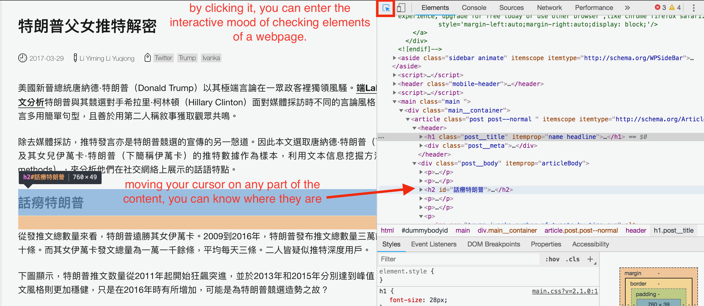

### HTML, JS, and CSS


* HTML is a machine language of web page. Writing something in HTML means to create a web page. It is a structure of diverse tags. Those tags are in pairs,with open tag and closing tag that wrap up content we want to present. Like `<p>` content `</p>`.
* CSS stands for Cascading Style Sheets. CSS describes how HTML elements are to be displayed on screen, paper, or in other media.
* JavaScript is the programming language of HTML and the Web, which is mainly used for image manipulation, form validation, and dynamic changes of content.

## Scraper

### Basic logic

Before we try to get data, here is the logic we should know.
Basically, when we scrape a website, firstly we need to know the website.

1. Does the website provide its own API to get the data?
2. If no, we will scrape the data from it's html.
3. All data or information is stored in the html tags. Tag names are settled by the website creators, which always appears as pairs. So, all we need to do is to find the tags that contains our required data. For example, the article titles are usually in `h1`, and texts are usually in `p`. You can find those tags by using Chrome DevTools, which we talked about this at the beginning of the chapter.
4. After we find the data and the tags, we write code to get them(using `control flows`), clean them(`manipulating strings`,`strip()`,`replace()`...), and store them into files(`CSV`,`JSON`).

### New module: BeautifulSoup

>`bs4` is the abbreviation of BeautifulSoup4. Beautiful Soup is a Python library for pulling data out of HTML and XML files.

In other words, BeautifulSoup parse the html content you request into structural data so that we can easily find the element we want.

Install BeautifulSoup

```text
!pip3 install --user bs4
```

Import the module

```text
from bs4 import BeautifulSoup
```

#### Use BeautifulSoup parser

BeautifulSoup parser can convert the results we request into structural data so that we can easily find the data we want.

Eg: <https://initiumlab.com/blog/20170329-trump-and-ivanka/>

```python
import requests #week o4 request module
from bs4 import BeautifulSoup #pay attention to its syntax
r = requests.get('https://initiumlab.com/blog/20170329-trump-and-ivanka/')
#print resp you will get <Response [200]> means request successful
html_str = r.text #get the content of the request
```

* Store the web as `r`, `get()` means try to get response of that web page, passing url string in to `()`.
* `text` means to show the text of the web page.

Output: This is before the parsing step, you can see that they are like a mess.
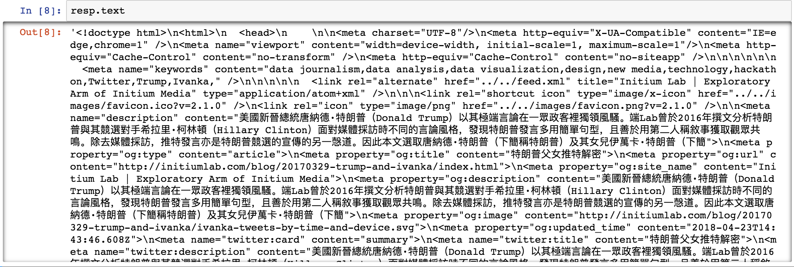

```python
data = BeautifulSoup(html_str,"html.parser") #pay attention to it's syntax
```

Output: After parsing, you can see that the data is more structural, and we can further get/find the data by using `control flows` and manipulating of `[]` and `{}`.

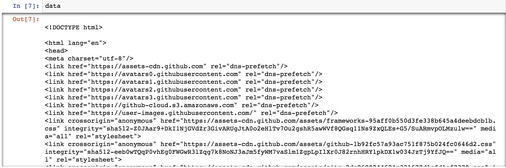

#### Find data: find.() and find_all()

* `find` to find what we want, and output the first item. Like if there are 10 h1, they will return the first one.
* `find_all` return a list of all the values we want. Like if there are 10 h1, they will return a list that contain all those h1. **A list means that we can use for loop to further filter**.

Example:

html_doc is as following:

```python
html_doc = """
<html><head><title>The Dormouse's story</title></head>
<body>
<p class="title"><b>The Dormouse's story</b></p>

<p class="story">Once upon a time there were three little sisters; and their names were
<a href="http://example.com/elsie" class="sister" id="link1">Elsie</a>,
<a href="http://example.com/lacie" class="sister" id="link2">Lacie</a> and
<a href="http://example.com/tillie" class="sister" id="link3">Tillie</a>;
and they lived at the bottom of a well.</p>

<p class="story">...</p>
"""

from bs4 import BeautifulSoup
soup = BeautifulSoup(html_doc, 'html.parser')
my_a = soup.find('a') #find a
my_a
```

Output:

```text
<a href="http://example.com/elsie" class="sister" id="link1">Elsie</a>
```

```python
my_a = soup.find_all('a') #find all a
my_a
```

Output:

```text
[<a class="sister" href="http://example.com/elsie" id="link1">Elsie</a>,
 <a class="sister" href="http://example.com/lacie" id="link2">Lacie</a>,
 <a class="sister" href="http://example.com/tillie" id="link3">Tillie</a>]
```

```python
my_a = soup.find('a',attrs={'id':'link3'}) #find link3
```

Note: **You can see that in tag a, there are some attributes, like class, id. we can find those attributes specifically by writing it as `soup.find('tag_name',attrs={'attributes':'values'})`**

Output:

```text
<a class="sister" href="http://example.com/tillie" id="link3">Tillie</a>
```

Basically, parser and find functions are the most used of `BeautifulSoup` library for us, if you want to know more about this, please check out [here](https://www.crummy.com/software/BeautifulSoup/bs4/doc/).

### Get data

#### Get title

Open the chrome devtools, by moving the mouse on the headline, you can find title is in:

```html
<h1 class="post__title" itemprop="name headline"> 特朗普父女推特解密</h1>
```

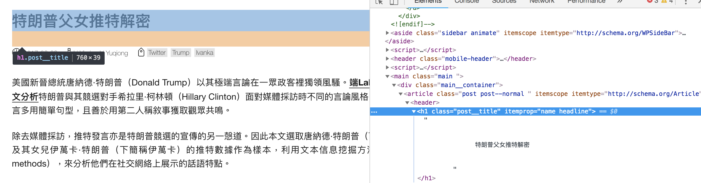

```python
import requests
import csv
from bs4 import BeautifulSoup
r = requests.get('https://initiumlab.com/blog/20170329-trump-and-ivanka/')
html_str = r.text
data = BeautifulSoup(html_str,"html.parser")
my_h1 = data.find('h1') # we use tag and attributes to extract the data we want. Type(my_h1) you can see that `my_h1` is bs4.element.Tag
my_title = my_h1.text #turn bs4.element.Tag into pure text
my_title.strip() # remove the character specified at the beginning and end of the string
```

Output: You can learn the logic and function of each step.

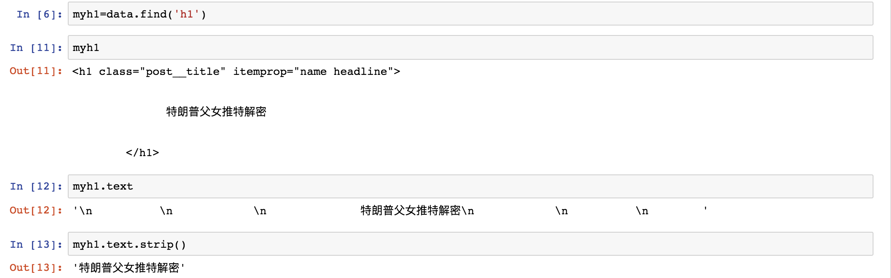

**Note:**

* `strip()`means delete the meaningless character at the beginning and end of the string.
* `HTML/bs4_tag.text` means turn bs4.element.Tag into pure text.
* You can `help(str.strip)` to see the usage of strip.
* `Type(sth)` is to print what is the format of sth. It's useful because you should know what's the data it return to further extract the value we want. Like, if it is a list, we should first use index to access its value. Similarly, if it is a dict, we should use keys to access its value.

#### Get date

In the same way we use to find the title, we can find that time tag as follows:

```html
<time itemprop="dateCreated" datetime="2017-03-29T....." content="2017-03-29">
                  2017-03-29
                </time>
```

Extract time value:

```python
my_date = data.find('time').text.strip()
```

Output:
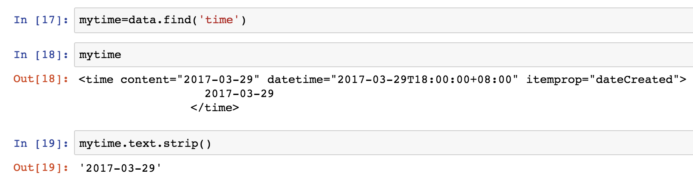

#### Get author

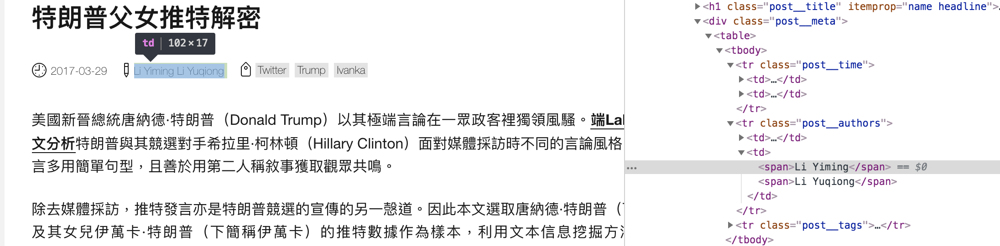

You can find that authors are in the span, so could we just use `find.span`to get the authors?

##### Try 1: not a good way

```python
my_authors = data.find('span')
```

Output:

```text
<span>首頁</span>
```

It is not what we want, the reasonable guess is that there are many 'span'. So check how many span there, and find the difference between those tags. `command+f` to open the search bar in console,and input 'span'.You can see, there are more than 2 'span'. Therefore we should find all the span.

```python
my_spans = data.find_all('span')
my_spans
```

Output:

```text
[<span>首頁</span>,
 <span>文章</span>,
 <span>專題</span>,
 <span>活動</span>,
 <span>職位</span>,
 <span>團隊</span>,
 <span>訂閱</span>,
 <span>Li Yiming</span>,
 <span>Li Yuqiong</span>,
 <span class="tag">
 ...
 <span>香港北角英皇道 663 號泓富產業千禧廣場 1907 室</span>]
```

You can see that `find_all` returns a list and there are so many spans, and the authors are also in two of those spans. So how we get them? We use `index` to access them.

```python
authors = []
author_1 = my_span[7].text
author_2 = my_span[8].text
authors.append(author_1) #append them into a list
authors.append(author_2)
```

**Note: Why do we just use `authors = my_span.find[7:9].text` to find all authors? Because `find[7:9]` or `find_all` return a list of elements, however, the list can not be texted.**

##### Try 2: Best practice


* The logic here is if we can not specify one elements in the inner circle, we spread out to find the differentiate tag that only the element has.
* In the HTML, we can find that authors upper tag is 'td'. But there are too many td. And it is difficult to be specific. So, we spread out.
* Outer the `td` is the `tr` tag with a class named `post_authors`, you can find its the special tag only used to wrap authors, so try to locate and extract author names by tag: `tr`.

```python
my_authors = data.find('tr',attrs={'class':"post__authors"})
#pay attention to its syntax, find('tag_name,attributes={'key':'value'})
my_authors.text.strip()
my_authors.text.strip().replace('\n',',')
```

Output:
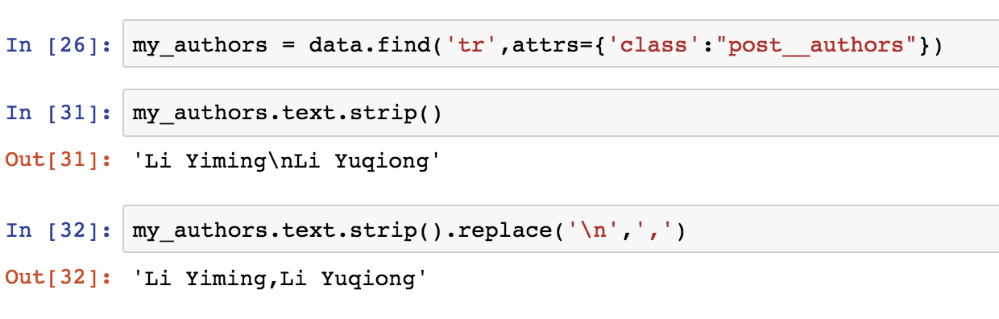

* Syntax: find('tag_name,attributes={'key':'value'})
* attrs = attributes. It contains more detailed information about about HTML tags, which helps to locate and identify the values better.
* replace('a','b') means replace a as b. You can see that even after `strip()`, there is a `\n` in lines, in such circumstances, we can use replace to get off those characters.

#### Get tags

```python
my_tags = data.find('tr',attrs={'class':'post__tags'}).text.strip().replace(' ','').replace('\n\n\n\n\n','|')
#you can find that there are several blanks and escape characters in return my_tags. We can use replace to get off those meaningless characters.
```

#### Scrape all articles of one page

If you want to scrape more articles, you will find there are some repeatable work and logic, so it's better for us to define a function to scrape more articles. Aside of this, all we need to do is find all articles url so that we can use a `for loop` to scrape more articles, right?

Step 1: Based on what we do in the above example, we can define a function like the following.

```python
def scrape_one_article(article_url):
    r = requests.get(url).text
    my_page = BeautifulSoup(r,"html.parser")
    my_title = data.find('h1').text.strip()
    my_date = data.find('time').text.strip()
    my_authors = data.find('tr',attrs={'class':"post__authors"}).text.strip().replace('\n',',')
    my_tags = data.find('tr',attrs={'class':'post__tags'}).text.strip().replace(' ','').replace('\n\n\n\n\n','|')
    my_url = article_url
    return my_title,my_authors,my_date,my_tags,my_url
```

Step 2: Get all the urls of one page. You can click '文章' to get into the articles page.

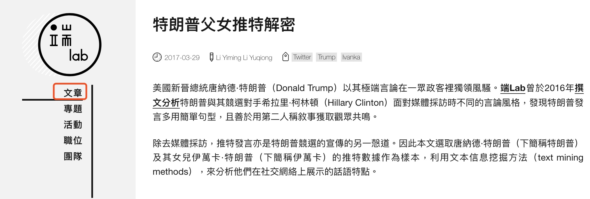

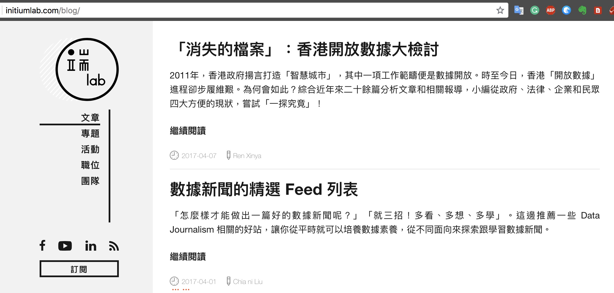

You can see that there are many articles in this page. So how can we scrape all the articles features including authors, dates, headlines? Firstly, we should get all urls of those articles. Therefore, we define another function to get those urls.

```python
def scrape_articles_urls_of_one_page(article_page_url): #scrape_articles_urls_of_one_page
    article_urls = []
    r = requests.get(article_page_url).text
    data = BeautifulSoup(r,"html.parser")
    my_urls = data.find_all('a',attrs={'class':'post__title-link js-read-more'}) #find the links

    #quiz1: if you read the code of this page, most students will try to find ('a',attrs={'class':'post__title-link}) first and failed. Do you know why?

    #quiz2: you will find that url can be extracted by my_url['href'], the results will be like this: '../blog/20160908-taipei-power-usage/', but the real one should be like this 'http://initiumlab.com/blog/20160908-taipei-power-usage/',
    #so who do we format those links we want?

    for my_url in my_urls:
        url ='{0}{1}'.format('http://initiumlab.com',my_url['href'][2:]) #format urls
        #print(url)
        article_urls.append(url)

    return article_urls
scrape_articles_urls_of_one_page('http://initiumlab.com/blog/')
```

Output:

```text
['http://initiumlab.com/blog/20170407-open-data-hk/',
 'http://initiumlab.com/blog/20170401-data-news/',
 'http://initiumlab.com/blog/20170329-trump-and-ivanka/',
 'http://initiumlab.com/blog/20170324-hk-odd/',
 'http://initiumlab.com/blog/20170315-news-tool/',
 'http://initiumlab.com/blog/20170312-soma-post/',
 'http://initiumlab.com/blog/20170222-new-media/',
 'http://initiumlab.com/blog/20170113-Sharing-With-Friends-Versus-Strangers/',
 'http://initiumlab.com/blog/20161229-Facebook-App-Download-Conversion/',
 'http://initiumlab.com/blog/20160908-taipei-power-usage/']
```

After we get all the articles urls of one page, you can call the `scrape_one_article(article_url)` function to crape all the features of this page.

```python
articles = []
article_urls = scrape_articles_urls_of_one_page('http://initiumlab.com/blog/') #scrape_articles_urls_of_page1
for article_url in article_urls:
    articles.append(scrape_one_article(article_url))

with open('articles.csv','w',newline='') as f:
    writer = csv.writer(f)
    header = ['Titles','Authors','Dates']
    writer.writerow(header)
    writer.writerows(articles)
```

Output:

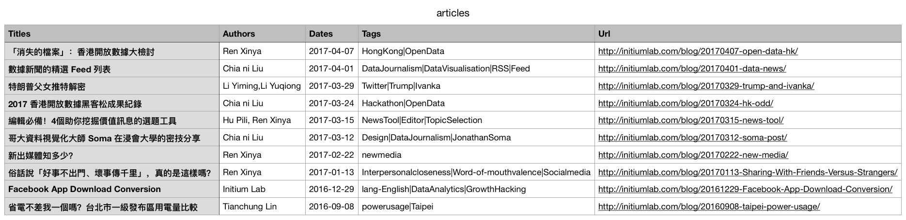

#### [O] Scrape all articles features of all pages

Since we scrape one page of articles, can I scrape all articles of all pages? Of course! we just come from 0 to 1, next step is from 1 to n. But there are some difficulties on the way which might be a little bit difficult for us, but definitely we can solve this.

```python
import requests #week o4 request module
from bs4 import BeautifulSoup #pay attention to its syntax
import csv

def scrape_one_article(article_url):  #scrape one articles features, which we've already done this
    r = requests.get(article_url).text
    data = BeautifulSoup(r,"html.parser")
    my_title = data.find('h1').text.strip()
    my_date = data.find('time').text.strip()
    my_authors = data.find('tr',attrs={'class':'post__authors'}).text.strip().replace('\n',',')
    my_tags = data.find('tr',attrs={'class':'post__tags'}).text.strip().replace(' ','').replace('\n\n\n\n\n','|')
    my_url = article_url
    return my_title,my_authors,my_date,my_tags,my_url

def scrape_articles_urls_of_one_page(article_page_url): #scrape_articles_urls_of_one_page, its a little bit different from demo above because in the following pages(2-7), the articles' urls are different...
    article_urls = []
    r = requests.get(article_page_url).text
    data = BeautifulSoup(r,"html.parser")
    my_urls = data.find_all('a',attrs={'class':'post__title-link js-read-more'})
    for my_url in my_urls:
        url ='{0}blog{1}'.format('http://initiumlab.com/',my_url['href'].split('/blog')[-1]) #format urls. 
        # Fail try 1 : use slice to cut off ../../..
        # Fail try 2 : use blog instead of /blog to split. There are blog in the headline
        #print(url)
        article_urls.append(url)
    return article_urls

def scrape_all_pages(url):
    articles=[]
    for i in range(1,8):  #format all pages urls
        if i == 1:
            page_url = url
        else:
            page_url = '{url_initial}page/{number}/'.format(url_initial = url,number=i)
            #print(page_url)

        article_urls = scrape_articles_urls_of_one_page(page_url)
        for article_url in article_urls:
            articles.append(scrape_one_article(article_url))

    return(articles)

with open('initiumlab_articles.csv','w',newline='') as f:
    all_articles = scrape_all_pages('http://initiumlab.com/blog/')
    writer = csv.writer(f)
    header = ['Titles','Authors','Dates','Tags','Url']
    writer.writerow(header)
    writer.writerows(all_articles)
```

Output will be like the following picture, and you can also find the csv file [here](assets/initiumlab_articles.csv).

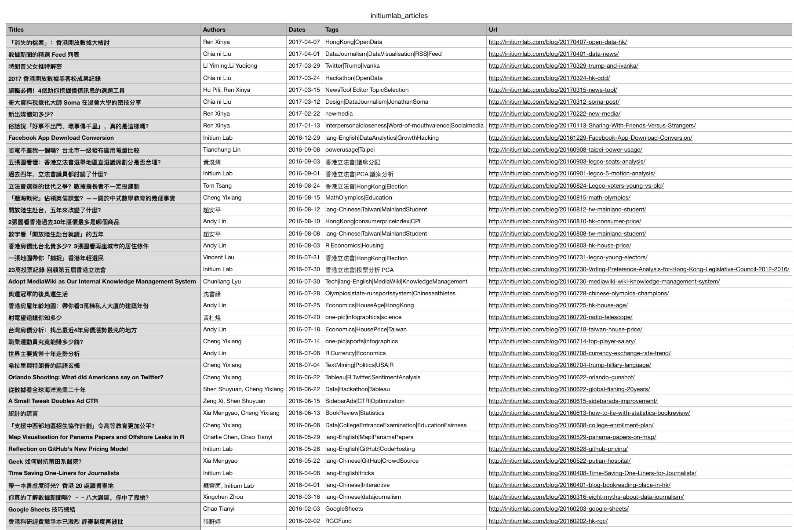

## Scraper pattern

### Data structure

"list-of-dict" structure is preferred. We also organise our code in this way:

- First (outer) layer is `list` -- iterate the data items we are interested in.
- Second (inner) layer is `dict` -- extract the features/ properties of a single data item.

Checkout the [imdb.com example](https://github.com/hupili/python-for-data-and-media-communication/blob/a4922340f55c4565fff19979f77862605ac19f22/scraper-examples/imdb.com.ipynb)

## [O] Crawler

A crawler is essentially a super module of scraper. When talking about "scraper", we mainly focus on retrieving and parsing a single document, be it an HTML, PDF, or image. Most of the time, we deal with HTML documents. "crawler" can follow the hyperlinks in a document, scrape documents pointed by those hyperlinks, and find new hyperlinks -- thus crawling.

Crawler is an essential building block for a search engine. Think of how Google and Baidu can reach the whole WWW-world without knowing where it is, or how large it is. It all starts by giving a set of "seed pages", and let the crawler expand the horizon by following the links on the pages.

### Crawler is not necessary in most of your cases

As a beginner of programmatic data collection, you often find crawler is non-necessary. The major reason is that in our use case, the "crawling zone" is bounded, namely there is a systematic way to specify where to crawl and how to crawl. In such scenario, you only need to focus on "scraper" part. Once you can handle one page, you can systematically generate other pages, or rules/ operation sequences to find other pages. Here are some examples of common generators:

- Find pages to scrape from a "hub page" -- e.g. find links to news articles from a list page, and then scrape each page from the list.
- Manipulate page id parameter in URL -- e.g. a forum/ a Wordpress blog site.
- Start from a seed page and continuously click "Next Page" -- e.g. search engine results. [notes-week-06.md](notes-week-06.md) will explain in details how to emulate browser in a programmatic way.

### scrapy

[scrapy](https://scrapy.org/) is the most commonly used crawler framework in Python. Given this framework, you only need to write a `parse` function, which basically does two jobs:

1. Emit "data item" found in the current page
2. Emit "page item" that `scrapy` framework needs to follow.

Note the keyword `yield` when you try this framework. This is called "Generator" -- a common construct in most modern programming languages. You have already used generator for many times throughout this class. We don't mention it to avoid possible confusion. Interested readers can find a simple tutorial [here](https://www.liaoxuefeng.com/wikipage/00138681965108490cb4c13182e472f8d87830f13be6e88000).

### scrapy-cluster

[scrapy-cluster](https://github.com/istresearch/scrapy-cluster) is a distributed crawling framework, that uses [Docker](https://www.docker.com/) container technology to easily and horizontally scale out with your task size. It is a super module of `scrapy`. The layering is a follows:

1. `parse()` function in `scrapy` -- This is essentially a "Scraper" -- single page, parsing
2. `scrapy` -- This is essentially **one** "Crawler" -- The emitted data items and page items are within one crawling topic.
3. `scrapy-cluster` -- This is essentially a (distributed) cluster of **multiple** Crawlers. Those crawlers can have different topics, priorities, scheduling options, etc.

## Exercises and Challenges

* Scrape github users' history contributions. For example, scrape contributions of [Justin Myers](https://github.com/myersjustinc). We just need to know in different time, how many contributions he committed[1]. You can change the url parameters to get the contributions of different time[2]. Please save the results into csv like the following.

    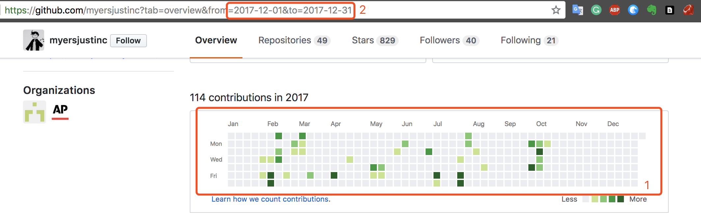
    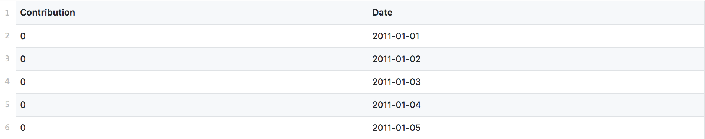

## Relative Readings

Some scrapers and the output dataset from our past students, you can learn some tricks and search for inspirations of your own project:

* [HK Carpark price data](https://github.com/XIAO-Chao/hkbu-big-data-media/tree/master/homework2)
* [Qidian](https://github.com/DaisyZhongDai/hkbu-big-data-media/tree/master/homework2)
* [CTrip scenic point data](https://github.com/marla322/hkbu-big-data-media/tree/master/HW2)

------

If you have any questions, or seek for help troubleshooting, please [create an issue here](https://github.com/hupili/python-for-data-and-media-communication-gitbook/issues/new)