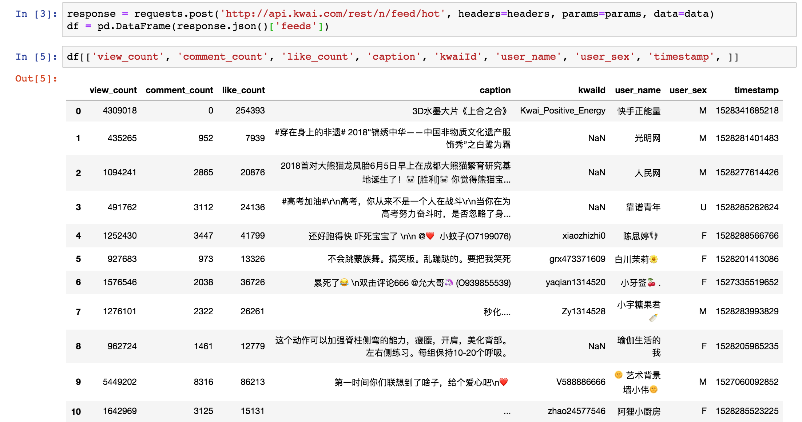

# Week 06 - Advanced scraping: anti-crawler, browser emulation and other nitty gritty

<div id="toc">

<!-- TOC -->

- [Week 06 - Advanced scraping: anti-crawler, browser emulation and other nitty gritty](#week-06---advanced-scraping-anti-crawler-browser-emulation-and-other-nitty-gritty)
    - [Anti-crawling](#anti-crawling)
        - [User agent](#user-agent)
            - [[O] Test HTTP requests](#o-test-http-requests)
        - [Rate throttling](#rate-throttling)
    - [Common issues](#common-issues)
        - [Encoding](#encoding)
    - [Browser emulation](#browser-emulation)
        - [Why use Browser Emulation](#why-use-browser-emulation)
        - [Limitation](#limitation)
        - [Selenium](#selenium)
            - [Downloading Python bindings for Selenium](#downloading-python-bindings-for-selenium)
            - [Drivers](#drivers)
            - [Navigating](#navigating)
            - [Locating Elements](#locating-elements)
            - [Example: CNN articles scraping](#example-cnn-articles-scraping)
                - [Fundamental: One page](#fundamental-one-page)
                - [Advanced: All pages](#advanced-all-pages)
        - [Splinter](#splinter)
            - [Finding elements](#finding-elements)
                - [Fundamental version: one page](#fundamental-version-one-page)
                - [Advanced version: all pages](#advanced-version-all-pages)
    - [Analyse Network Traces](#analyse-network-traces)
    - [[O] Crawl mobile Apps](#o-crawl-mobile-apps)
        - [Packet analysis](#packet-analysis)
            - [Example: Kwai (kuaishou)](#example-kwai-kuaishou)
        - [App decompilation](#app-decompilation)
        - [App emulation](#app-emulation)
    - [[O] Other quick scraping/ crawling tricks](#o-other-quick-scraping-crawling-tricks)
    - [Excercises and Challenges](#excercises-and-challenges)
        - [In-bound marketing and SEO auditing](#in-bound-marketing-and-seo-auditing)
        - [Crawl the legal case of China](#crawl-the-legal-case-of-china)
        - [[O] Crawl Weibo data and discover KOL](#o-crawl-weibo-data-and-discover-kol)
    - [Related Readings](#related-readings)

<!-- /TOC -->

</div>

## Anti-crawling

### User agent

The simplest way to prevent crawler access it to limit by user agent. "User agent" can be thought of synonym for "web browser". When you surft the Internet with a normal web browser, the server will know whether you use Chrome, Firefix, IE, or other browsers. Your browser give this information to the web server by a field called `user-agent` in the HTTP request headers. Similarly, `requests` is a like a web browser, for Python code, not for human. It also gives the `user-agent` to the web server and the default value is like `python-requests/*`. In this way, the server knows that the client is Python requests module, not a regular human user. One can by-pass this limit by modifying the user-agent string.

```python
r = requests.get(url,
        headers = {
            'user-agent': 'Mozilla/5.0 (Macintosh; Intel Mac OS X 10_13_3) AppleWebKit/537.36 (KHTML, like Gecko) Chrome/64.0.3282.167 Safari/537.36'
        }
    )
```

Full code and demo can be found in [this notebook](https://github.com/hupili/python-for-data-and-media-communication/blob/ff77a632e030fcaa392dac34086bf84e2a802b45/scraper-examples/Open%20Rice.ipynb).

#### [O] Test HTTP requests

[https://nghttp2.org/httpbin](https://nghttp2.org/httpbin) is a useful service to test HTTP requests. This service basically echos the content or certain parameters from your HTTP request. You can get better idea of what your tools send to the server via this service.

Example: Check the user-agent of shell command `curl`:

```bash
%curl https://nghttp2.org/httpbin/user-agent
{"user-agent":"curl/7.54.0"}
```

Example: Check the default user-agent of `requests`:

```python
>>> r = requests.get('https://nghttp2.org/httpbin/user-agent')
>>> r.text
'{"user-agent":"python-requests/2.19.1"}\n'
>>> r = requests.get('https://nghttp2.org/httpbin/user-agent', headers={'user-agent': 'See, I modified the user agent!!'})
>>> r.text
'{"user-agent":"See, I modified the user agent!!"}\n'
```

### Rate throttling

* Limit by IP
* Limit by cookie/ access token

## Common issues

### Encoding

[51job.com example](https://github.com/hupili/python-for-data-and-media-communication/blob/a4922340f55c4565fff19979f77862605ac19f22/scraper-examples/51job.com.ipynb)

## Browser emulation

Primarily, Browser emulation or browser automation is used for automating web applications for testing purpose. Like when you build your web application, you want to simulate how many users your server can handle, and how the users act when they look into your website, how they open page, click, navigate and read the the page content.

But browser emulation is certainly not limited to just that. For our course, we mainly use it to manipulate the
browser, to interactively communicate with the website, locate the information and get the data we want.

### Why use Browser Emulation

1. Some of complicated website can't be directly scraped by static method. For example, some elements, especially page turning buttons/links in the webpage have embedded javascript codes, which need users certain actions to further loading the content.
2. Browser Emulation way can handle some complicated scraping work like ones that need you login.
3. Some webpages have strictly rules for anti-scraping. However, in browser emulation, we simulate users' behaviors, which is more camouflaged and not easy to discover, meaning that the limits is smaller than static scraping like `request`.

In our course, we mainly introduce two libraries - `Selenium` and `Splinter` for browser emulation and dynamic scraping. Those packages are wildly used in this field. And their documentations are easy to read.

### Limitation

Each time, it need to load all the content of the webpage, the crawling speed is slow, therefore not suitable for scraping cases with a large load of data.

### Selenium

Selenium is a set of different software tools, each with a different approach to supporting browser automation. These tools are highly flexible, allowing many options for locating and manipulating elements within a browser, the key tool we will use is Selenium Python bindings.

> Selenium Python bindings provides a simple API to write functional/acceptance tests using Selenium WebDriver. Through Selenium Python API you can access all functionalities of Selenium WebDriver in an intuitive way.

You can visit [here](https://selenium-python.readthedocs.io/) to learn how to use those functions by yourself. In the following example, we will use CNN articles scraping case to elaborate the basic functions of it, and how to scrape a webpage that need our interaction.

#### Downloading Python bindings for Selenium

```python
!pip install selenium    #in Jupyter Notebook
```

```python
from selenium import webdriver #import
```

#### Drivers

Selenium requires a driver to interface with the chosen browser. Chrome, for example, requires Chromedriver, which needs to be installed before the below examples can be run.

you can download different drivers for supported browsers in the following links:

| Supported Browsers | Download Links                                                 |
|--------------------|----------------------------------------------------------------|
| Chrome             | https://sites.google.com/a/chromium.org/chromedriver/downloads |
| Firefox            | https://github.com/mozilla/geckodriver/releases                |
| Safari             | https://webkit.org/blog/6900/webdriver-support-in-safari-10/   |

For windows users: please refer to [here](https://selenium-python.readthedocs.io/installation.html#detailed-instructions-for-windows-users) for instruction of download.

**Note: Make sure it’s in your PATH, e. g. place it in /usr/bin or /usr/local/bin.** If it's not in the PATH, when you initiate the Chromedriver, it will raise error `Message: 'chromedriver' executable needs to be in PATH.`

You can also solve this problem by specify the path of the Chromedriver, for example, if you just download in `Users/username/...`. You can still initiate it in this way, for my example:

```python
browser = webdriver.Chrome() #default to initiate webdriver, you can assign it with driver or browser or other things you like. If raise error, you can solve this problem by specifying the file path like the following.
browser = webdriver.Chrome('/users/xuyucan/chromedriver')
```

#### Navigating

You can doing a lot of interactive things with the webpage with help of the selenium, like navigating to a link, searching, scrolling, clicking etc. In the following example, we will demo the basic usage of navigating.

```python
from selenium import webdriver
browser = webdriver.Chrome('/users/xuyucan/chromedriver') #initiate webdriver
browser.get('http://google.com/') #visit to google page
element = browser.find_element_by_name("q") #Find the search box
element.send_keys("github python for data and media communication gitbook") #search our openbook
element.submit() #submit search action
# you will find the webpage will automaticlly return the results you search
link = browser.find_element_by_link_text('GitHub - hupili/python-for-data-and-media-communication-gitbook') #find our tutorial
link.click() #click the link, enter our tutorial
browser.execute_script("window.scrollTo(0,1200);") #scroll in the page, window.scrollTo(x,y), x means horizontal, y means vertical
notes_links = browser.find_element_by_link_text('notes-week-06.md') #find link of notes 6
notes_links.click() #click into notes 6
#browser.close()
```

#### Locating Elements

There are many ways to locate the elements. It's similar to the usage in `requests` method, just a simple `find...` sentence but more diverse.

Selenium provides the following methods to locate elements in a page:

* find_element_by_id
* find_element_by_name
* find_element_by_xpath
* find_element_by_link_text
* find_element_by_partial_link_text
* find_element_by_tag_name
* find_element_by_class_name
* find_element_by_css_selector

To find multiple elements (these methods will return a list):

* find_elements_by_name
* find_elements_by_xpath
* find_elements_by_link_text
* find_elements_by_partial_link_text
* find_elements_by_tag_name
* find_elements_by_class_name
* find_elements_by_css_selector

Except the `XPath` method, others are pretty much like we used before, just check out the html in Chrome Devtools, find the name, class, link, attributes etc. For instruction of the syntax, you can refer this [documentation](https://selenium-python.readthedocs.io/locating-elements.html).

For `XPath` method, XPath uses path expressions to select nodes or node-sets in an XML document. The following are basic expression rules and expression path examples. For a more detailed usage, you can check out this [tutorial](https://www.w3schools.com/xml/xpath_syntax.asp).

Basic expression rules:

| Expression | Description                                                                                           |
|------------|-------------------------------------------------------------------------------------------------------|
| /          | Selects from the root node                                                                            |
| //         | Selects nodes in the document from the current node that match the selection no matter where they are |
| .          | Selects the parent of the current node                                                                |
| @          | Selects attributes                                                                                    |

Path Expression examples:

| Path Expression     | Results                                                                          |
|---------------------|----------------------------------------------------------------------------------|
| /bookstore/book[1]  | Selects the first book element that is the child of the bookstore element.       |
| //book              | Selects all book elements no matter where they are in the document               |
| //@lang             | Selects all attributes that are named lang                                       |
| //title[@lang='en'] | Selects all the title elements that have a "lang" attribute with a value of "en" |

#### Example: CNN articles scraping

The following is the link of results returned by keyword searching of `trade war`. We can scrape those articles title, time and url for further studying. The reason why we need use `selenium` is because the page turning links are embedded javascript codes, which cannot be extracted and use directly in `requests` way. To solve that, we need to interact with the page, and do browser emulation.

https://money.cnn.com/search/index.html?sortBy=date&primaryType=mixed&search=Search&query=trade%20war

##### Fundamental: One page

```python
!pip3 install selenium # if you installed before, just ignore
from selenium import webdriver

browser = webdriver.Chrome('/users/xuyucan/chromedriver')
browser.get('http://money.cnn.com/search/index.html?sortBy=date&primaryType=mixed&search=Search&query=trade%20war')

browser.find_elements_by_xpath("//div[@id='summaryList_mixed']//div[@class='summaryBlock']") #find all articles wrapped in the path of class='summaryBlock'
articles = []
for session in browser.find_elements_by_xpath("//div[@id='summaryList_mixed']//div[@class='summaryBlock']"):
    article = {}
    article['headline'] = session.find_element_by_class_name("cnnHeadline").text #find headline
    article['date'] = session.find_element_by_class_name("cnnDateStamp").text #find date
    url = session.find_element_by_xpath("./div[@class='cnnHeadline']/*[@href]")  #can not directly get the href attributes, it will return 'url' as a selenium object: <selenium.webdriver.remote.webelement.WebElement (session="936716c8251394a2fddad1fa80b64d23", element="0.9458243256600611-16")>
    article['url'] = url.get_attribute('href') #further get attributes from last step
    articles.append(article)
articles
```

Output:


##### Advanced: All pages

```python
from selenium import webdriver
import time #mainly use its time sleep function

def get_articles_from_browser(b):
    articles = []
    for session in b.find_elements_by_xpath("//div[@id='summaryList_mixed']//div[@class='summaryBlock']"):
        article = {}
        article['headline'] = session.find_element_by_class_name("cnnHeadline").text #find headline
        article['date'] = session.find_element_by_class_name("cnnDateStamp").text #find date
        url = session.find_element_by_xpath("./div[@class='cnnHeadline']/*[@href]") #find url 
        article['url'] = url.get_attribute('href') #get url attribute
        articles.append(article)
    return articles


url = 'http://money.cnn.com/search/index.html?sortBy=date&primaryType=mixed&search=Search&query=trade%20war'
browser = webdriver.Chrome('/users/xuyucan/chromedriver')
browser.get(url)
time.sleep(2) #sleep 2 second for each call action, if it's too frequently with no sleep time, its has high opportunity to be banned from the website.

all_page_articles = []
for i in range(10):
    time.sleep(0.5)
    try:
        new_articles = get_articles_from_browser(browser)
        all_page_articles.extend(new_articles)
#in the following, we need to emulate to click `next button` to turn pages.
#try 1: just click link by default ... 
#next_page = browser.find_element_by_link_text('Next').click()
#error: not clickable. After try several print() in the process,I found that, we need to scroll the window down till we can see the next button. Therefore you can see that selenium browser emulation method is really just like a human behavior.
#try 2: scroll whole body down to the bottom...
#browser.execute_script('window.scrollTo(0, document.body.scrollHeight);')
#error: In some page, the navigation bar has blocked the click button if you scroll down to the bottom
#try 3: (document.body.scrollHeight - int) ...  
#fail: can not be minus, but can be divided.
        browser.execute_script('window.scrollTo(0, document.body.scrollHeight/1.5);')#test several numbers to choose a suitable one
        next_page = browser.find_element_by_link_text('Next')
        next_page.click()
    except Exception as e:
        print(e)
        print('Error on page %s' % i)

import pandas as pd #spoiler. pandas is the key module in the next chapter, you can check out chapter 7 for further information.
df = pd.DataFrame(articles) #convert articles into dataframe
df
```

Output:


### Splinter

Splinter achieves pretty much the same results as Selenium does, though there might be a little difference in syntax. In the following, we will also use `splinter` method to demo the cnn example, you can compare it with `selenium` method, and choose one you like to practice more.

```python
!pip3 install splinter  
from splinter import Browser
import time
url = 'http://money.cnn.com/search/index.html?sortBy=date&primaryType=mixed&search=Search&query=trade%20war'
browser = Browser('chrome')
browser.visit(url)
time.sleep(2)
```

**Note:** If you get error `Message: 'chromedriver' executable needs to be in PATH.`. The PATH is the working path that your Jupyter Notebook is running. You can check out where it is by the following command, and place the chromedriver you download into this folder.

```python
!echo $PATH
!ls #add the first path returned from last step
!open #add the first path returned from first step
```


#### Finding elements

Splinter provides 6 methods for finding elements in the page, one for each selector type: `css`, `xpath`, `tag`, `name`, `id`, `value`, `text`. Each of these methods returns a list with the found elements. And you can use index to access each of them in the list. This method is different from `selenium` which provides with finding single element and list of elements. All in all, those two methods are very alike. You can check out [here](https://splinter.readthedocs.io/en/latest/api/driver-and-element-api.html#splinter.driver.DriverAPI.find_by_css) for Splinter doc about finding elements. In this case, we mainly use `find_by_css(css_selector)` method.

##### Fundamental version: one page

```python
!pip3 install splinter  
from splinter import Browser
import time
url = 'http://money.cnn.com/search/index.html?sortBy=date&primaryType=mixed&search=Search&query=trade%20war'
browser = Browser('chrome')
browser.visit(url)
time.sleep(2)

articles = []
for block in browser.find_by_css('#summaryList_mixed .summaryBlock'):
    article = {}
    h = block.find_by_css('.cnnHeadline a')
    article['headline'] = h.text
    article['url'] = h['href']
    article['date'] = block.find_by_css('span.cnnDateStamp').text
    articles.append(article)

articles
```

Output:


How to find its css? When you open chrome devtools, you can find the css in the `style` console by corresponding to the elements in the webpage.


https://github.com/hupili/python-for-data-and-media-communication/tree/master/ww-splinter

##### Advanced version: all pages

```python
url = 'http://money.cnn.com/search/index.html?sortBy=date&primaryType=mixed&search=Search&query=trade%20war'

def get_articles_from_browser(b):
    articles = []
    for block in b.find_by_css('#summaryList_mixed .summaryBlock'):
        article = {}
        h = block.find_by_css('.cnnHeadline a')
        article['headline'] = h.text
        article['url'] = h['href']
        article['date'] = block.find_by_css('span.cnnDateStamp').text
        articles.append(article)
    return articles

# Launch the initial page#
browser = Browser('chrome')
browser.visit(url)
time.sleep(2)

all_page_articles  = []
for i in range(50): #scrape 50 pages
    time.sleep(0.5)
    try:
        new_articles = get_articles_from_browser(browser)
        all_page_articles.extend(new_articles)
        browser.execute_script('window.scrollTo(0, document.body.scrollHeight/1.5);') #scroll down
        next_buttons = browser.find_by_css('.pagingLinks li.ends.next')
        next_buttons[0].click() #splinter find_by return a list, therefore we need use index0 to access the next_button.
    except Exception as e:
        print(e)
        print('Error on page %s' % i)

import pandas as pd
df = pd.DataFrame(all_page_articles)
df
```

Output: There will be 500 rows.


## Analyse Network Traces

Open "Google Chrome Developer Console" by `command+option+i`. Check out the "Network" tab and use "XHR" filter to find potential packages. We are usually interested in `json` files or `xml` files sent over the line. Most dynamic web pages have predictable / enumerable internal API -- use HTTP request to get certain `json`/ `xml` files.

Some websites render HTML at the backend and send them to the frontend in a dynamic way. You find the URL in address bar stays the same but the content is changed. You can also find the HTML files and their **real URL** via developer console. One such example is [xiachufang.com scraper](https://github.com/hupili/python-for-data-and-media-communication/blob/a4922340f55c4565fff19979f77862605ac19f22/scraper-examples/xiachufang.com.ipynb).

## [O] Crawl mobile Apps

With the explosion of mobile Apps, more and more data is shifted from the open web to mobile platform. The design principle of web and mobile are very different. When Tim Berners Lee initially designed the WWW, it was intended to be an open standard that every one can connect to. That is why, once the web server is up, you can use Chrome to access it whlie other users may use Firefox or even Python `requests`. There are many tools to emulate browser activities, so you can programmably do the same thing as if a regular user is surfing the Internet. Compare with the open web, mobile world is a closed eco system. It often requires heavy duty packet analysis, App decompilation, or App emulation, in order to get data behind the mobile Apps. "Packet analysis" is most close to our course and is elaborated below.

### Packet analysis

This section is very similar to earlier [Analyse Network Traces](#analyse-network-traces). The only difference is that we analyse the mobile App packet here.

No matter how mysterious a mobile App seems to be, it has to talk to a server in order to get updated information. You can be assured that everything you see from your smart phone screen comes from either of the two channels:

1. Embeded in the phone, i.e. in the operating system, or in the App when you initially install
2. Loaded via the Internet upon certan user operation, e.g. App launch, swipe left, touch, ...

Channel 1 is the topic of next section. Channel 2 is what we are going to tackle. The idea is to insert a sniffer between the App and the backend server. In this way, whatever conversation the App has with the server will pass the sniffer first. The sniffer is also called "man-in-the-middle (MITM)", and [a famous attack](https://en.wikipedia.org/wiki/Man-in-the-middle_attack) is named after this. You may have also heard the term "proxy", which intercepts your original network packet, modify it somehow, and then send the packet to the destination. One can use proxy to bypass Internet censorship or use proxy to hide the original sender's address. Our key tool is a MITM proxy. Here are two common choices

- "Charles proxy" -- Its GUI is very convenient for further packet analysis. It also has iOS and MAC clients. The software is not free though.
- `mitmproxy` -- You can install it via `pip`. It is free and open source. It provides command line interface to help intercept and dump packets. Recent version also provides web interface to browse the sniffed packets.

#### Example: Kwai (kuaishou)

[Kuaishou](https://www.kuaishou.com/) is a popular video sharing platform originated from China. We analyse its international version, [kwai](http://www.kwai.com), and scrape the top players data.

We'll omit the configuration of Charles Proxy on iOS and MAC, because there are numerous resources online and the interfaces are always changing. Once you finish configuration, do the following steps:

- Start sniffing in Charles Proxy on iOS.
- Open Kwai App.
- Browse like a normal user. Note that the packet sniffer can only intercept the conversations that happened. So you want to trigger more actions.
- Quit Kwai App.
- Send sniffed packet traces to MAC for further analysis.

There is no direct formula for packet analysis. We usually observe the request/ response sequence by time. For example, if you "pull down" to refresh the video list at 10th second, then the relevant packets are very likely to be sent around 10th second. You can find that data is obtained from an endpoint called `http://api.kwai.com/`. Specifically, the App sends HTTP requests to `http://api.kwai.com/rest/n/feed/hot` in order to obtain a list of hot videos. In our previous scraper examples, HTTP request is usually sent using the `GET` method. In the case of Kwai, `POST` is used. A complete `POST` request is composed of three parts:

- headers -- send in HTTP protocol; users can not see
- params -- usually appears as `?a=3&b=5` in browser bar; `a` and `b` here are called parameters
- data -- the `POST` body; this is the main content to be consumed by the web server; based on this content, the server give correspondinge response.

Charles Proxy's MAC software can help you to convert one HTTP request into the Python language, with the above three parts filled -- that is, give you the Python code that can **replay** one request. The variable configurations are as follows, with certain fields masked to preserve privacy:

```python
headers = {
    'Host': 'api.kwai.com',
    ...
    'Accept': 'application/json',
    'User-Agent': 'kwai-ios',
    'Accept-Language': 'en-HK;q=1, zh-HK;q=0.9, zh-Hans-HK;q=0.8',
}

params = (
    ('appver', '5.7.3.494'),
    ...
    ('c', 'a'),
    ('ver', '5.7'),
    ('sys', 'ios11.4'),
    ('mod', 'iPhone10,3'),
    ...
)

data = [
  ...
  ('coldStart', 'true'),
  ('count', '20'),
  ('country_code', 'hk'),
  ('id', '13'),
  ('language', 'en-HK;q=1, zh-HK;q=0.9, zh-Hans-HK;q=0.8'),
  ('pv', 'false'),
  ('refreshTimes', '0'),
  ('sig', ...),
  ('source', '1'),
  ('type', '7'),
]
```

Here's the request operation and its outcome:



<!--  -->

Note the `pd.DataFrame` is a `pandas` object, which will be explained in [notes-week-07.md](notes-week-07.md).

### App decompilation

This means to "crack" the App. You need to first get the installation package of the App, analyse its structure, decompile it, and understand how this App talk with a server from its source code.

Sophisticated App will embed certain cryptography routine in the App and authenticate itself with the server. Even if you successfully analysed the network packet, it is hard for you to come up with the correct authentication parameters. In order to understand how this authentication process is conducted, you may want to reverse engineer the App.

Further discussion is omitted here because this part takes years of computer science background, especially in information security domain.

### App emulation

[Appium](http://appium.io/) is a frequently used automatic testing tool. You can use this tool to emulate user operations on mobile Apps and scrape the data from the screen.

Actually, `selenium`, we introduced earlier in this chapter, was initially also an automatic testing tool for the web frontend. Then it became a bridge between the programmable user and web broser driver, which was used in a lot scraping works. When you find yourself stuck with data access because of non-human behavoiur (e.g. anti-crawling), you can try to search the keywords "emulation" or "auto testing", and can usually get some pointers to useful tools.

## [O] Other quick scraping/ crawling tricks

In our class, we show you the very basic steps of scraping so that you know how it things happen in a sequential way. However, you don't have write codes for everything from scratch in real practice. People already made numerous tools and libraries that can help you do certain tasks quickly. Here are some examples related with course (Shell/ Python) for those who are interested:

- Type `wget -r {url}`, where `{url}` is the URL of the website you want to crawl. After running this command, you can find all the web pages and their dependent resources are on your computer. You can fine tune the parameters to limit crawling scope, like number of hops or types of files. Use `man wget` to find out more.
- There are many shell commands which can be combined to perform efficient text processing. [This article](https://github.com/hupili/agile-ir/blob/master/cases/case2-crawl-by-url-filling/index.md) shows how one can combine a few Shell commands to quickly download the Shakespeare works.
- [This repo](https://github.com/hupili/agile-ir/blob/master/cases/case2-crawl-by-url-filling/index.md), originally a workshop given on PyConHK in 2015, shows you some handy tools and libraries in Python that allow one to scrape more with less codes. For example, you can use `readability` to extract the main body of an HTML page, without bothering with its page structure. For readers with frontend development background, `pyquery` is a handy library to allow you write jQuery like selectors to access HTML elements. `scraply` is a machine learning based library that can learn the labelled crawling target and generate corresponding rules; The user only needs to tell `scraply` what to crawl, instead of how to crawl.
* [Data Science at the Command Line](https://www.datascienceatthecommandline.com/chapter-3-obtaining-data.html) by Jeroen Janssens is a comprehensive and duly updated reference book for command line tools for data science. Its [Obtaining data](https://www.datascienceatthecommandline.com/chapter-3-obtaining-data.html) is a good further reading for those who are interested in more efficient data collection in Linux shell environment.

## Excercises and Challenges

### In-bound marketing and SEO auditing

Search Engine Optimization (SEO) is one common technique a digital marketer needs to master. Suppose you have led a team to conduct the optimization. Now it is time to audit the optimization result. One of the key function is to build scraper which can:

* Input 1 is a search query, i.e. some keywords
* Input 2 is a set of URLs from your own website
* Output the ranks of each URL in the search result list

### Crawl the legal case of China

<http://wenshu.court.gov.cn> collects the legal cases in China. It supports advanced search options. One can emulate browser to download relevant documents on a certain area. Please try:

- Give a keyword as input.
- Download the documents of the first page, e.g. `.docx` files, onto local disk.
- Organise an index of those documents into a `CSV` which may include "title", "court", "date", "document-path", and other fields if you deem useful.

### [O] Crawl Weibo data and discover KOL

Key Opinion Leader (KOL) is the goto person for targeted massive marketing. As a marketing specialist, you want to identify the KOLs in a certain area so that your team can reachout to them effectively. Before learning sophisticated graph mining algorithms, one can do the follow challenge to get some preliminary result:

- Given an industry domain, identify `keywords`
- For every `keyword in keywords`, scrape the search of related micro blogs.
- Every piece of microblog may have following data structure:
  ```python
  microblog = {
      'username': 'DATA HERE',
      'datetime': 'DATA HERE',
      'text': 'DATA HERE',
      'num_like': 'DATA HERE',
      'num_comment': 'DATA HERE',
      'num_share': 'DATA HERE'
  }
  ```
- A simple algorithm to find KOL is to count `num_like`, `num_comment`, `num_share` for each `username`.


## Related Readings

- Dynamic loading and crawling exmaple: [libguides example](https://github.com/hupili/python-for-data-and-media-communication/blob/a4922340f55c4565fff19979f77862605ac19f22/scraper-examples/Libguides.ipynb)
- Social media crawling example: [Scrape a luxury brand with keyword in Weibo](https://github.com/hupili/python-for-data-and-media-communication/blob/a4922340f55c4565fff19979f77862605ac19f22/ww-selenium/Weibo.ipynb)
- Dynamic page crawling, with a matter of parsing page content: [Timeout](https://github.com/hupili/python-for-data-and-media-communication/blob/a4922340f55c4565fff19979f77862605ac19f22/ww-splinter/timeout.com.ipynb)
- Dynamic crawling a static page with a matter of pagination: [Amazon Books](https://github.com/hupili/python-for-data-and-media-communication/blob/a4922340f55c4565fff19979f77862605ac19f22/ww-splinter/Amazon%20books.ipynb)

------

If you have any questions, or seek for help troubleshooting, please [create an issue here](https://github.com/hupili/python-for-data-and-media-communication-gitbook/issues/new)