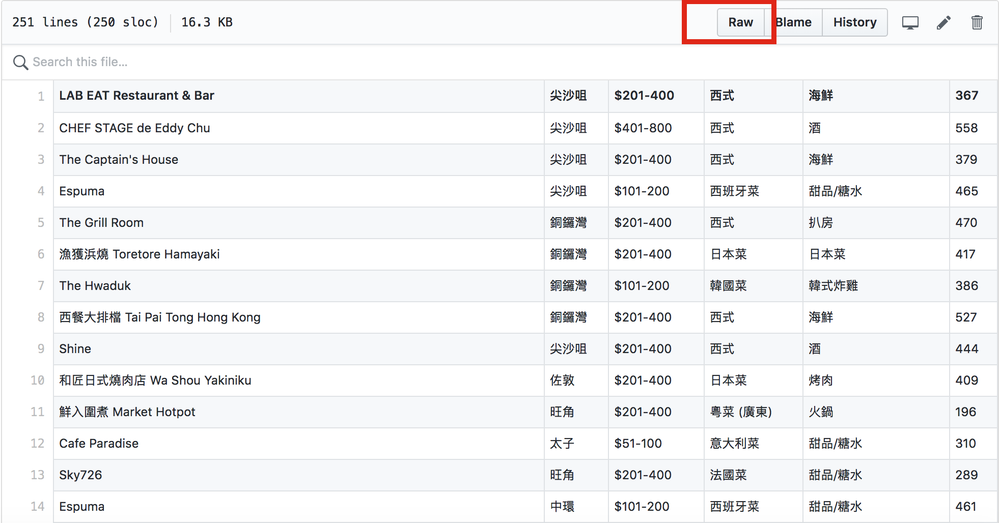
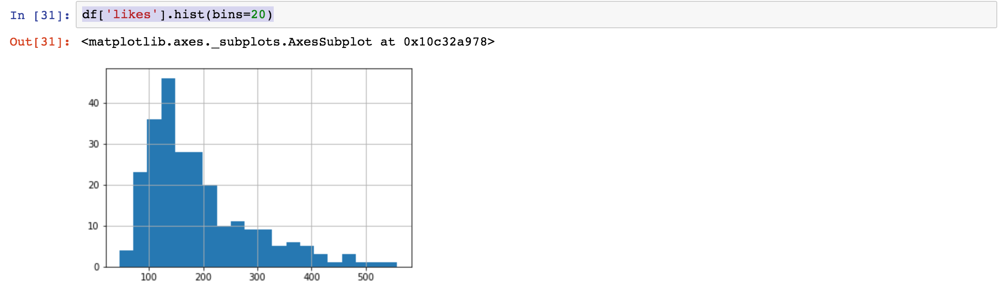
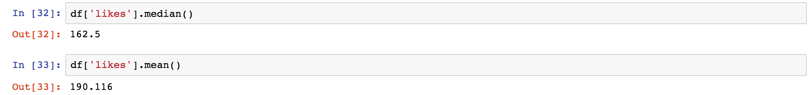

# Week 07 - Work with table: data cleaning and pre-processing

<div id="toc">

<!-- TOC -->

- [Week 07 - Work with table: data cleaning and pre-processing](#week-07---work-with-table-data-cleaning-and-pre-processing)
    - [Objective](#objective)
    - [Preparation](#preparation)
        - [Python environment](#python-environment)
        - [Download data file from a GitHub repo](#download-data-file-from-a-github-repo)
    - [`pandas` introduction](#pandas-introduction)
        - [Load table (DataFrame) from local csv file](#load-table-dataframe-from-local-csv-file)
        - [Load table (DataFrame) from a URL](#load-table-dataframe-from-a-url)
        - [Select data](#select-data)
            - [Select data with []](#select-data-with-)
            - [Select data with .loc](#select-data-with-loc)
        - [Basic statistics](#basic-statistics)
            - [DataFrame.describe()](#dataframedescribe)
            - [Count values of series](#count-values-of-series)
            - [Plot a simple charts/histogram with data](#plot-a-simple-chartshistogram-with-data)
        - [Data cleaning and pre-processing](#data-cleaning-and-pre-processing)
        - [Filtering](#filtering)
        - [Sorting](#sorting)
    - [Export from `pandas`](#export-from-pandas)
        - [Bonus: Python and Javascript in action](#bonus-python-and-javascript-in-action)
    - [Dataprep](#dataprep)
        - [Cleaning](#cleaning)
        - [Transformation](#transformation)
        - [Extraction](#extraction)
    - [References](#references)

<!-- /TOC -->

</div>

## Objective

- Master the schema of "data-driven story telling" : the crowd \(pattern\) and the outlier \(anomaly\)
- Can efficiently manipulate structured table formatted datasets
- Use `pandas` for basic calculation and plotting

Modules:

- `pandas`

Datasets to work on:

- [openrice.csv](https://github.com/hupili/python-for-data-and-media-communication/tree/master/w6-pandas) contributed by group1 of S18 session.

Tips about scraping Openrice:

- We can use the search function, and change the criteria in the advanced search mode. Here is the initial search page of Openrice. <https://www.openrice.com/zh/hongkong/restaurants>
- Follow up last step, you will get a url that contains the results return from your searching. Check out the url parameters, you will find that they have encoded those parameters into a set of IDs. One can get all of their coding information by scraping those data with browser emulation(`selenium` etc.)
- In each searching returns, Openrice has a limit of display 17 pages data. We can create a multiple layer loop scraper to enlarge the data volume.

-------

**TODO: following notes are scribed by S18 student helper. Need further organisation**

## Preparation

### Python environment

Please install libraries/dependencies in your virtual environment:

```python
pip install pandas, seaborn, matplotlib, requests, csv
```

If you are already in Jupyter notebook, you can prefix the command with `!` in order to execute execute those commands in a Jupyter notebook cell.

For conda users, you can install by following method:

```python
conda install pandas
```

### Download data file from a GitHub repo

> Example: Today, We will use the data from Openrice as an example and do the restaurant analysis. Assuming that we have already got certain amount of data from Openrice and saved it into csv file.

Here is the link of csv file which can be downloaded here.
[https://github.com/hupili/python-for-data-and-media-communication/tree/master/w6-pandas](https://github.com/hupili/python-for-data-and-media-communication/tree/master/w6-pandas)


Click "raw" on the right upper corner.  



You can see the raw csv file as below.


Click right and choose "save as"  


Then the csv file can be saved as csv\(comma-separated values\).  


## `pandas` introduction

Pandas is an open source library providing easy-to-use data structures and data analysis tools for the Python programming language, enabling you to carry out your entire data analysis workflow in Python without having to switch to a more domain specific language like R. For easy and light weighed data analysis, pandas in our best choice.

There are two basic data structures:

1. Series. A series is a one-dimensional object that can hold any data type such as integers, floats and strings. Simply, series is like a single column of a DataFrame.

  Example:

  ```python
  import pandas as pd
  x = pd.Series([1,0,2,8])
  x
  0    1
  1    0
  2    2
  3    8
  dtype: int64
  ```

  The first axis is referred to as the index. Also, we can define indexes for the data by our own way.

  ```python
  x = pd.Series([1,0,2,8], index=['a', 'b', 'c', 'd'])
  x
  a    1
  b    0
  c    2
  d    8
  dtype: int64
  ```

2. Dataframe. A DataFrame is a two dimensional object that can have columns with different types,dictionaries, lists, series etc... Dataframe is the primary pandas data structure.

  ```python
  avg_ocean_depth = pd.Series({
                    'Arctic': 1205,
                    'Atlantic': 3646,
                    'Indian': 3741,
                    'Pacific': 4080,
                    'Southern': 3270
  })
  max_ocean_depth = pd.Series({
                      'Arctic': 5567,
                      'Atlantic': 8486,
                      'Indian': 7906,
                      'Pacific': 10803,
                      'Southern': 7075
  })
  ocean_depths = pd.DataFrame({
                      'Avg. Depth (m)': avg_ocean_depth,
                      'Max. Depth (m)': max_ocean_depth
  })
  ocean_depths
  ```

  Output:

  ```text
            Avg. Depth (m)  Max. Depth (m)
  Arctic              1205            5567
  Atlantic            3646            8486
  Indian              3741            7906
  Pacific             4080           10803
  Southern            3270            7075
  ```

### Load table (DataFrame) from local csv file

Put csv file into the same folder with Jupyter notebook. You can type `!pwd` to check out where it is and put the file in this path.

```python
import pandas
pandas.read_csv('openrice.csv')
```

The output will be as below:


If there is no header in the csv file.We can use `Pandas` as below to add proper headers for a form.

```python
df = pandas.read_csv('openrice.csv', header=None, names=['name', 'location', 'price', 'style', 'type', 'likes'])
```

then the output will be like this:  


**Notes:** `df`is short for "dataframe", which is used as return value in pandas.

### Load table (DataFrame) from a URL

We can load CSV from GitHub directly with the help of `requests` and `io.StringIO`. `io` module is used for dealing with various types of I/O (input/output). Due to the requirement that `pandas.read_csv` function needs a `file-like object` as the argument, we need to use `io.StringIO` to write and store those string, returned from the request, temporarily. Then we can read the csv in pandas.

**Note:** We should use `raw data` url from github page instead of others.

```python
import pandas as pd
import io
import requests
url="https://raw.githubusercontent.com/hupili/python-for-data-and-media-communication/master/pandas-examples/Group%201-Openrice/openrice.csv"
s=requests.get(url).content
df=pd.read_csv(io.StringIO(s.decode('utf-8')))
```

### Select data

First of all, every time we load a csv in Jupyter, always print the first several rows to have a overview what's look like. It's useful and necessary because sometimes the dataset can be really large, if you print the whole table, your browser might get crushed. We can use following command to check out the records here.

```python
df.head() #displaying first 5 rows by default, you can pass the number in () to show more/less rows.
```

the output will be as blow:  


There are several ways to select data. We only focus on the most used ones. `[]`, `.loc` and `.iloc`. Collectively, they are called the indexers.

#### Select data with []

`[]` method is mainly used for selecting single column and multiple columns. Basically, `[]` method treat the dataframe as a dict, using a key to refer to certain value. If you want to select one column of data, just simply put the name of the column in-between the brackets. For example, you want all the restaurant locations.You can type:

```python
df['location']
```

Then the output will be as below \(the picture do not show all the locations due to the limited space\):  


You can find that the data type of the results returned is changed.  Using `type(df['location'])` to check out what it is. If you want to keep the it with the `dataframe`, you can write the above code as this: `df[['location']]`.

To select multiple columns of the data, you can pass it a list of column names.

```python
df[['name','location','likes']]
```

The output will be like this:
<!-- Todo: update data -->

#### Select data with .loc

The `.loc` indexer will return a single row/rows as a Series when given a single row `label`/`labels`, which is in index.

Example:

```python
df = pd.DataFrame([[170, 60], [180, 82], [175, 70]],
      index=['Ri', 'Frank', 'Tyler'],
      columns=['height', 'weight'])
df
                height  weight
Ri                170      60
Frank             180      82
Tyler             175      70
```

```python
df.loc['Frank'] #select one row

height    180
weight     82
Name: Frank, dtype: int64

df.loc[['Frank', 'Tyler']]

                height  weight
Frank              180      82
Tyler              175      70
```

Similarly, there is another function `.iloc`, which is purely integer-location based indexing for selection by position.

Using the `openrice.csv` as an example:

```python
pandas.read_csv('openrice.csv')
df.iloc[5]
df.iloc[[5,10,15]]
df.iloc[10:20]
```

<!-- Todo: update output -->

### Basic statistics

#### DataFrame.describe()

Descriptive or summary statistics in python – pandas, can be obtained by using describe function. `describe()` function gives you a summary about the dataframe or certain series with the `mean`, `count`, `std` and `freq` values etc.

Example:

```python
df.describe()
        likes
count	250.000000
mean	190.116000
std	96.398304
min	46.000000
25%	121.500000
50%	162.500000
75%	226.000000
max	558.000000

df['style'].describe()
count     250
unique     20
top        西式
freq       49
Name: style, dtype: object
```

<!-- Todo: update output -->

#### Count values of series

After we can select one column or row, we can do further calculation or analysis. One common usage is to count different values in one column.

Example

```python
df['location'].value_counts()
尖沙咀    53
旺角     44
銅鑼灣    43
觀塘     20
中環     10
灣仔     10
太子      8
荃灣      7
西環      6
元朗      6
...
df['type'].value_counts()
海鮮                   43
火鍋                   36
甜品/糖水               19
烤肉                   12
壽司/刺身               11
日式放題                9
咖啡店                  9
薄餅                    9
自助餐                  9
```

`value_counts()` function gives you a hint for further filter and data processing. For example, after you know the `尖沙咀` is the most popular places. We can do a filter that select all the restaurants in `尖沙咀` and cross analysis it with likes, prices etc., which we will cover later in this chapter.

#### Plot a simple charts/histogram with data

After we got the results from our analysis, the key point is to visualize them so that we can have a better understanding of the results and get insights from them. By using `.hist()` function, We can plot a simple histogram to show the distribution and trend.

Example:

```python
df['likes'].hist()
```

and you can get a distribution like below:  


You can change shape of the charts by changing the bins(basically, one bin means one column)

```python
df['likes'].hist(bins=20)
```



<!-- Todo: update output -->

### Data cleaning and pre-processing

Clean the data and convert price range to numeric values

<!-- TODO: master the `apply` and `lambda` pattern -->

* After you get the distribution, you can do some analysis. Compare the distribution with mean, media numbers.
  
* If you need to compare price which is a interval.You need to pay special attention on numbers. Python recognize '$101-200'&lt;'$51-100' because Python only compare the  
  numbers in sequence of each interval.

  You need to convert each interval string into numbers, which means you need to choose a number to represent each interval to do comparison.  
  Here, we use "mapping" function

  ```
  mapping = {
    '$101-200': 200,
    '$201-400': 400,
    '$51-100': 100,
    '$401-800': 800,
    '$50以下': 50
  }
  ```

* Now, you can use:

  ```
    original_string = '$60以下'
    mapping.get(orignal_string, 0)
    def cleaning(e):
    return mapping.get(e, 0)
    cleaning('$50以下')
  ```

  

* Then you can use the code below to transfer intervals into numbers.

  `df['price_num'].apply(cleaning)`

  

### Filtering

<!-- TODO: the df[ condition ] pattern -->

<!-- TODO:
- filter by numeric range
- filter by exact value
- filter by strings
- filter by more than two conditions -->

* If you want to know how many restaurants having likes is 558, or less than 60, then you can use filter function:  
  `df[df['likes'] == 558]`  
  `df[df['likes'] < 60]`

  the output will be as below:  
  

* If you want to select location of Mongkok.

  ```
    df1[
       df1['location'] == '旺角'
      ]
  ```

  the output will be:  
  

* If you want to select the seafood restaurants with price number less than 100.  
  

### Sorting

* If you want to sort price from high to low.

  ```
    df.sort_values(by='price_num', ascending=False)
  ```

  the output will be  
  


## Export from `pandas`

After you finish processing data in `pandas`, you may want to export it

- to store the dataset for later analysis.
- to convert it into a format that can be used by Frontend developers to make interactive web visualisations.

The common export formats are:

- `to_csv`
- `to_dict`
- to JSON format

<!-- TODO: workout the above export method -->

### Bonus: Python and Javascript in action

A very common workflow is to process data in Python and visualize data in Javascript. The last interactive chart in this [blog post](http://initiumlab.com/blog/20160730-Voting-Preference-Analysis-for-Hong-Kong-Legislative-Council-2012-2016/#%E8%AD%B0%E5%93%A1%E5%9B%9B%E5%B9%B4%E6%8A%95%E7%A5%A8%E5%82%BE%E5%90%91%E8%AE%8A%E5%8C%96) shows the political preference variation of HK legco members during the 2012-2016 term. The interactive chart is made by [echarts](https://ecomfe.github.io/echarts-doc/public/en/index.html), a popular Javascript library for interactive visualisation from Baidu. However, the data collection and heavy duty data analysis are done in Python. We conducted the analysis in Python and export the `pandas.DataFrame` into a `JSON` format that can be consumed by echarts. You can checkout the [JSON file here](http://initiumlab.com/blog/20160730-Voting-Preference-Analysis-for-Hong-Kong-Legislative-Council-2012-2016/echarts-option-legco-5.json).

The key takeaway is that data files like `json`, `csv` and `xml` are usually the bridge between frontend (e.g. Javascript) and backend (e.g. Python).

## Dataprep

You need to finish "Dataprep" before analysis. That is, we start with structured data. Preparing the structured and cleaned data has no common schema. A data scientist regularly spends most of the time in dataprep. We have pointers in [Dataprep](dataprep.md) for your own reading, including some non-Python dataprep tools/ platforms. Now that we learned the basics of `pandas`, we can conduct the dataprep workflow all in Python.

Here is a polluted dataset from original openrice scraped data. Please try to combine pandas knowledge above and following guidelines to prepare a structured data that is good for further analysis.

### Cleaning

- Check the variable distribution. Is there any special value that only appears once or a few times? Will it be a typo?
- Check the variable range. What is the common range of values in this variable? Is there any peculiar value?
- Check the string length. Is there a super long cell? It may be because parsing error during scraping stage. Some data may mix up.
- Check the missing values. Are there empty cells? What is the reasonable default value to fill in those empty cells?
- Check the above on a subset of data (filtering/ grouping). Does `50` looks like a regular price? Does `50` looks like a regular price within "seafood" category?

### Transformation

- Convert text value to numeric value. e.g. convert price range text into a representative number that can be sorted.
- Merge multiple categories. e.g. merge `港式` and `潮州菜` into `中式`. Sometimes, less categories help analysis. You may need some domain knowledge and trials and errors, in order to find good method of grouping.
- Encoding, many times called "coding" in social science research, is the process of turning natural language data into numeric data. This is also a mantter of domain knowledge but you can try the method here. e.g. in order to study the relationship between price range and the income level of that district, we can encode 18 districts into three income class `high`, `medium` and `low`.

### Extraction

We load the CSV data in one shot, because the current dataset is very small. In real practice, you may meet a large dataset, so the first step is usually data extraction. One can do extraction by certain rules, e.g. get the restaurants in a certain district, get the restaurants that are open in a certain time period. Or you are interested in the whole population but do not possess the appropriate computation power to handle this dataset. At this point, you may want to do sampling. `DataFrame.sample()` may be helpful here. When dealing with really large dataset, you may want to combine extraction by rule and extraction by sampling.

## References

* First two chapters \(i.e. before "3D"\) of the article [The Art of Effective Visualization of Multi-dimensional Data](https://towardsdatascience.com/the-art-of-effective-visualization-of-multi-dimensional-data-6c7202990c57) by Dipanjan Sarkar
* [Exercise numpy](https://www.shiyanlou.com/courses/1090) on ShiYanLou
* [Exercise pandas](https://www.shiyanlou.com/courses/1091) on ShiYanLou

------

If you have any questions, or seek for help troubleshooting, please [create an issue here](https://github.com/hupili/python-for-data-and-media-communication-gitbook/issues/new)
