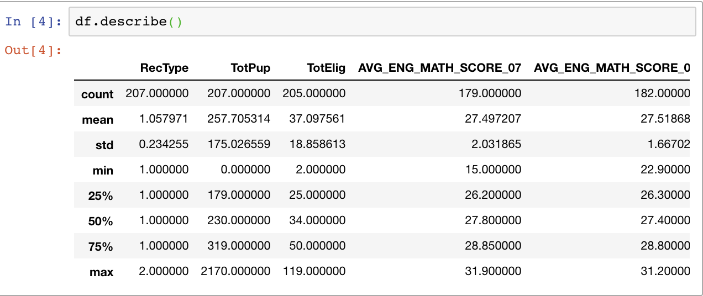
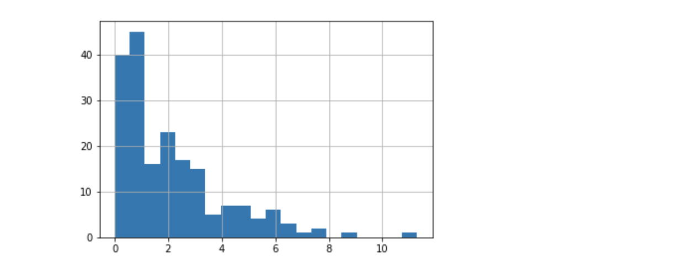
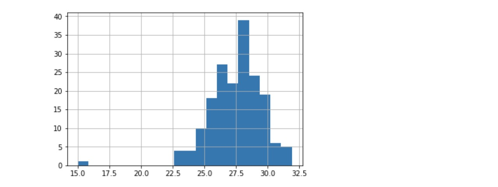
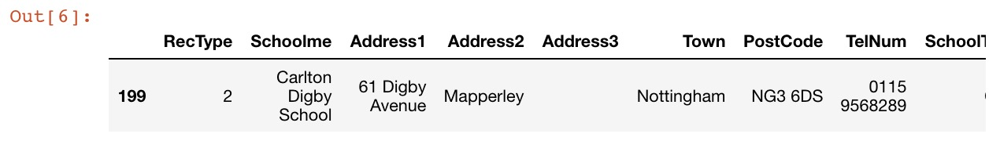
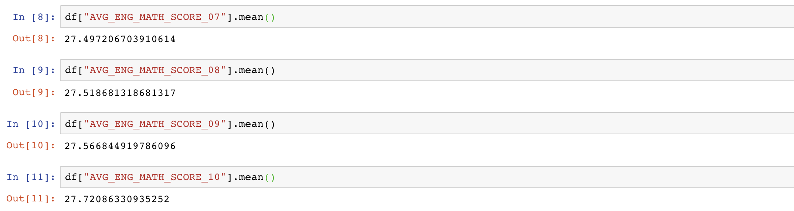
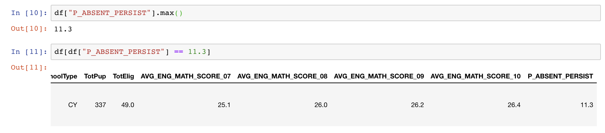
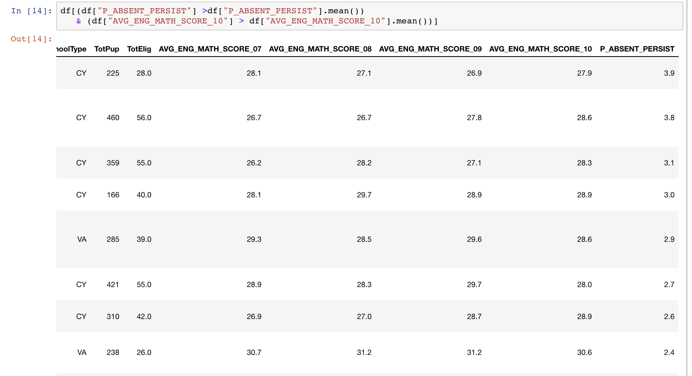
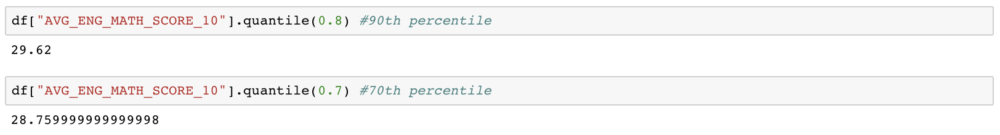
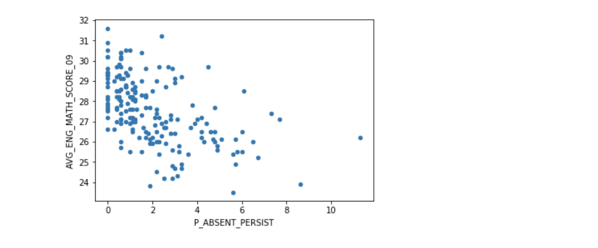

# Week 08 - Work with table: 1D analysis and 2D analysis

<div id="toc">
<!-- TOC -->

- [Week 08 - Work with table: 1D analysis and 2D analysis](#week-08---work-with-table-1d-analysis-and-2d-analysis)
    - [Objective](#objective)
    - [Distribution](#distribution)
        - [Histogram and KDE](#histogram-and-kde)
            - [Bonus: How histograms can be cheating](#bonus-how-histograms-can-be-cheating)
        - [Special points in distribution](#special-points-in-distribution)
    - [Bonus: Articulate central tendency and spread of data](#bonus-articulate-central-tendency-and-spread-of-data)
        - [Variance](#variance)
        - [Skewness](#skewness)
        - [Kurtosis](#kurtosis)
    - [Correlation](#correlation)
        - [Continuous: Scatter plot and correlation](#continuous-scatter-plot-and-correlation)
        - [Discrete: Cross-tab and correlation](#discrete-cross-tab-and-correlation)
        - [From correlation to causality](#from-correlation-to-causality)
    - [Bonus: (Statistical) Hypothesis testing](#bonus-statistical-hypothesis-testing)

<!-- /TOC -->
</div>

## Objective

- Master the schema of "data-driven story telling": the crowd \(pattern\) and the outlier \(anomaly\)
- Can use `pandas`, `matplotlib` and `seaborn` to conduct 1D analysis and articulate on the statistics
- Can conduct 2D analysis by:
  - `pandas.pivot_table()` -- discrete distribution analysis (bin analysis)
  - `pandas.groupby().aggreate()` -- the SAC (splitting -- applying -- combining) pattern
  - `Series.corr()` -- calculate correlation
  - `DataFrame.plot()` or `matplotlib.pyplot.plot()` -- scatter plot to visualise 2D correlation

The dataset and case we use this week comes from a workshop called "descriptive analysis" conducted by Jenifer on GICJ2017 in South Africa. You can download data from:

* www.jenster.com/nottingham.xlsx
* www.jenster.com/index.xlsx

New modules:

* [Matplotlib](https://matplotlib.org/). Matplotlib is a Python 2D plotting library and one of the most frequently used plotting modules in Python.
* [Seaborn](https://seaborn.pydata.org/). Seaborn is a Python data visualization library based on matplotlib. It provides a high-level interface for drawing attractive and informative statistical graphics.

## Distribution

<!-- Obj: 
- visual analysis;
- can filger based on visual clues (1-D);
- can investigate special data points;
 -->

### Histogram and KDE

```python
import pandas as pd
from matplotlib import pyplot as plt
import seaborn as sns
import numpy as np
df = pd.read_excel('nottingham.xlsx')
df.describe() #get descriptive information
```



The columns:

* `AVG_ENG_MATH_SCORE_xx`: The average score for the particular class of year xx. For a class, this metric is the higher the better
* `P_ABSENT_PERSIST`:  the absent ratio transformed somehow, the higher the worse.

This is multi dimensional data. We are interested in the relationship between those dimensions/ variables.

```python
len(df)
df['P_ABSENT_PERSIST'].hist(bins=20)
```



Quick Question:
* What do you conclude from this histogram?
* What would you do next to mine the news?

```python
df['AVG_ENG_MATH_SCORE_07'].hist(bins=20)
```



Same question: can you find anything notable from this chart? It that weird for the outlier whose score is around 15? How do we filter that out?

```python
df[df['AVG_ENG_MATH_SCORE_07'] < 16]
```



#### Bonus: How histograms can be cheating

Try to adjust number of bins and bin boundaries to see what happens.

### Special points in distribution

<!-- TODO:
- functions
- can filter out interesting pionts for further discussion
- Mean
-->

- Mean



The statistical mean, gives a very good idea about the central tendency of the data being collected. What can we get from the mean? you can have a general idea that overall, students get better performance in higher grades, but is it normal?

- Max/ Min


The max and min shows the most extreme observations. If extreme values are real (not measurement errors), it becomes valuable to us, giving us a breakthrough point to dig out the reason, which we emphasis at the very beginning of this course - abnormal.

For this case, we can filter out the school with highest absent rate and see if there is anything interesting. Step further, we can filter out the school with high absent rate but high performance in score at the same time.
This is also abnormal for us in theory which we can further check out.



- Median

```python
df["AVG_ENG_MATH_SCORE_10"].median()
```

Output:

```text
27.8
```

Median provides a helpful measure of center of our dataset. But more often, we care more about the Percentile, like where are the majority of the data locate.

- Percentile

Percentile is a given percentage of observations in a group of observations fall. For example, the 75th percentile is the value (or score) below which 75% of the observations may be found.



## Bonus: Articulate central tendency and spread of data

### Variance

### Skewness

### Kurtosis

## Correlation

### Continuous: Scatter plot and correlation

We can plot the correlation graph to display relationship between two variables and columns. For example, to figure out whether there is a correlation between absence and score.

```python
df.plot('P_ABSENT_PERSIST', 'AVG_ENG_MATH_SCORE_09', kind='scatter')
#kind means the graph type
```



Generally, you can see that the higher the absence ratio, the lower the test score in general. But here are two questions:

* Is this relationship strong enough?
* What are the outliers?

To solve this problem, we need to use correlation functions to dig out more.

```python
help(df['P_ABSENT_PERSIST'].corr)
```

Output:
```test
Help on method corr in module pandas.core.series:

corr(other, method='pearson', min_periods=None) method of pandas.core.series.Series instance
    Compute correlation with `other` Series, excluding missing values
    
    Parameters
    ----------
    other : Series
    method : {'pearson', 'kendall', 'spearman'}
        * pearson : standard correlation coefficient
        * kendall : Kendall Tau correlation coefficient
        * spearman : Spearman rank correlation
    min_periods : int, optional
        Minimum number of observations needed to have a valid result
    
    
    Returns
    -------
    correlation : float
```

From above you can see that, `corr` function is used to compute one series with other series. And there are 3 methods: `pearson`, `kendall`, `spearman`. we don't need necessarily to know how to calculate instead
we need to what does it means and main differences. For example, `person` measure the degree of the relationship between `linearly` related variables, while Spearman rank correlation is a `non-parametric test`. For more details, You can refer [here](http://www.statisticssolutions.com/correlation-pearson-kendall-spearman/)

```python
df['P_ABSENT_PERSIST'].corr(df['AVG_ENG_MATH_SCORE_09'], method='pearson')
```

output:

```text
-0.5205965225654683
```

**Note:**

* Pearson correlation is between [-1, 1]
* Values around 0 means no correlation/ weak correlation
* Values near 1 and -1 can be interpreted as strong (linear) correlation

Pearson correlation does not work very well with `non-linear correlation` or when the variables are not (jointly) normally distributed. It is also senstive to outliers. Spearman's rank correlation can help here.

```python
df['P_ABSENT_PERSIST'].corr(df['AVG_ENG_MATH_SCORE_09'], method='spearman')
```

Outut:

```text
-0.5810765727681304
```

### Discrete: Cross-tab and correlation

### From correlation to causality

## Bonus: (Statistical) Hypothesis testing

