# Week 07 - Work with table: data cleaning and pre-processing

<div id="toc">

<!-- TOC -->

- [Week 07 - Work with table: data cleaning and pre-processing](#week-07---work-with-table-data-cleaning-and-pre-processing)
    - [Objective](#objective)
    - [Preparation](#preparation)
        - [Python environment](#python-environment)
    - [`pandas` introduction](#pandas-introduction)
        - [Pandas Series](#pandas-series)
            - [Convert between list/dict with series](#convert-between-listdict-with-series)
                - [list<-->series](#list--series)
                - [dict<-->series](#dict--series)
            - [Get quick stats of series](#get-quick-stats-of-series)
                - [Series.sort_values](#seriessort_values)
                - [Series.sum](#seriessum)
            - [Slice series](#slice-series)
            - [Reference to elements in series](#reference-to-elements-in-series)
            - [Benefits of using series](#benefits-of-using-series)
        - [Pandas Dataframe](#pandas-dataframe)
            - [Load table (DataFrame) from local csv file](#load-table-dataframe-from-local-csv-file)
            - [Load table (DataFrame) from a URL](#load-table-dataframe-from-a-url)
            - [Select data](#select-data)
                - [Select columns with []](#select-columns-with-)
                - [Select rows with .loc and .iloc](#select-rows-with-loc-and-iloc)
            - [Basic statistics](#basic-statistics)
                - [DataFrame.describe()](#dataframedescribe)
                - [Count values of series](#count-values-of-series)
                - [Sort values in dataframe](#sort-values-in-dataframe)
                - [Plot a simple chart: histogram](#plot-a-simple-chart-histogram)
            - [Data cleaning and pre-processing](#data-cleaning-and-pre-processing)
                - [Apply a function](#apply-a-function)
                - [lambda: anonymous function](#lambda-anonymous-function)
            - [Filtering](#filtering)
                - [Filter by numeric range](#filter-by-numeric-range)
                - [Filter by exact value](#filter-by-exact-value)
                - [Filter by more than two conditions](#filter-by-more-than-two-conditions)
        - [Export from `pandas`](#export-from-pandas)
            - [to_csv](#to_csv)
            - [to_dict](#to_dict)
            - [to_json](#to_json)
            - [Bonus: Python and Javascript in action](#bonus-python-and-javascript-in-action)
    - [Dataprep](#dataprep)
        - [Cleaning](#cleaning)
        - [Transformation](#transformation)
        - [Extraction](#extraction)
    - [References](#references)

<!-- /TOC -->


</div>

This week, we will step from data collecting process into analyzing process. We will learn a new module called pandas, with which, we can do tasks like data cleaning, pre-processing, filtering, and even simple visualizations.
In this week, we will only cover some basic usage of pandas, advanced data analyzing and data manipulating will be touched in the following weeks, stay tuned.

## Objective

- Master the schema of data pre-processing: cleaning, transforming, extracting
- Can efficiently manipulate structured table formatted datasets
- Use `pandas` for basic calculation and plotting

Modules:

- `pandas`

Datasets to work on:

- [openrice_sample.csv](https://github.com/hupili/python-for-data-and-media-communication/blob/master/scraper-examples/open_rice/openrice_sample.csv)

In this chapter, we will not cover the specific scraping demo but basic usage of `pandas`. Interested students can refer to [here](https://github.com/hupili/python-for-data-and-media-communication/blob/master/scraper-examples/open_rice/openrice_urls-selenium.ipynb) for scraping process.

-------

## Preparation

### Python environment

Please install libraries/dependencies in your virtual environment:

```python
pip install pandas, requests, csv
# if you've already installed, just ignore
```

If you install in Jupyter notebook, you can prefix the command with `!` in order to execute execute those commands in a Jupyter notebook cell.

## `pandas` introduction

Pandas is an open source library providing easy-to-use data structures and data analysis tools for the Python programming language, enabling you to carry out your entire data analysis workflow in Python without having to switch to a more domain specific language like R. For easy and light weighed data analysis, pandas in our best choice.

There are two basic data structures:

### Pandas Series

A series is a one-dimensional object that can hold any data type such as integers, floats and strings. Simply, series is like a single column of a DataFrame.

Example 1:

```python
import pandas as pd
x = pd.Series([1,0,2,8])
x
0    1
1    0
2    2
3    8
dtype: int64
```

The first axis is referred to as the index. Also, we can define indexes for the data by our own way.

```python
x = pd.Series([1,0,2,8], index=['a', 'b', 'c', 'd'])
x
a    1
b    0
c    2
d    8
dtype: int64
```

#### Convert between list/dict with series

##### list<-->series

Example:

```python
#import pandas as pd
l = ['火鍋','海鮮','甜品/糖水','壽司/刺身','日式放題','烤肉','薄餅']
list_series = pd.Series(l)
list_series
```

```text
0       火鍋
1       海鮮
2    甜品/糖水
3    壽司/刺身
4     日式放題
5       烤肉
6       薄餅
dtype: object
```

Convert series back to list

```python
list_series.tolist()
```

##### dict<-->series

Converting between dict and series is pretty much the same like converting between list and series.

```python
word_dict = {'火鍋':39,'海鮮':28,'甜品/糖水':24,'壽司/刺身':14,'日式放題':11,'烤肉':10,'薄餅':9}
dict_series = pd.Series(word_dict)
```

```text
火鍋       39
海鮮       28
甜品/糖水    24
壽司/刺身    14
日式放題     11
烤肉       10
薄餅        9
dtype: int64
```

Convert series back to dict

```python
dict_series.to_dict()
```

#### Get quick stats of series

##### Series.sort_values

Sorting values in ascending or descending order.

```python
words_dict = {'火鍋':39,'壽司/刺身':14,'甜品/糖水':24,'日式放題':11,'薄餅':9,'烤肉':10,'海鮮':28}
dict_series = pd.Series(words_dict)
dict_series.sort_values(ascending=False)
```

Output:

```text
火鍋       39
海鮮       28
甜品/糖水    24
壽司/刺身    14
日式放題     11
烤肉       10
薄餅        9
dtype: int64
```

##### Series.sum

Use the above dict_series as an example:

```python
dict_series.sum()
```

Output:

```text
135
```

#### Slice series

Slicing series is the same as slicing list, just give the index interval can work. Also take the above example:

```python
dict_series[:4]
```

Output:

```text
火鍋       39
壽司/刺身    14
甜品/糖水    24
日式放題     11
dtype: int64
```

#### Reference to elements in series

Reference to elements in series is pretty much the same as doing it in dict. each element in series is like the key in dict.

```python
dict_series['火鍋']
```

Output:

```text
39
```

#### Benefits of using series

Series has the advantage from both `dict` and `list`. One can use a key to reference to the elements, which leads a `dict` like look and feel. However, for a regular `dict`, keys do not have certain ordering. Python only guarantees `dict.keys()`, `dict.values()` and `dict.items()` adopts the same ordering but how they are ordered is not specified. `pandas.Series` can preserve the order of elements, which gives a `list` like look and feel.

### Pandas Dataframe

A DataFrame is a two dimensional object that can have columns with different types,dictionaries, lists, series etc... Dataframe is the primary pandas data structure.

Example 3: [2017 Hong Kong population](https://www.censtatd.gov.hk/hkstat/sub/sp150_tc.jsp?productCode=D5320189). There are several series, one can merge them to a dataframe.

```python
land_area = pd.Series({
                'Hong Kong Island': 79.92,
                'Kowloon': 46.94,
                'New Territories and Islands':954.69
})
mid_year_population = pd.Series({
                'Hong Kong Island': 1248.5,
                'Kowloon': 2256.1,
                'New Territories and Islands':3886
})
population_density = pd.Series({
                'Hong Kong Island': 15620,
                'Kowloon': 48060,
                'New Territories and Islands': 4070,
})
hongkong_population_distribution = pd.DataFrame({
                'Land Area (sq. km)': land_area,
                'Mid- year Population (\'000)': mid_year_population,
                'Population Density (Persons per sq. km)': population_density
})
hongkong_population_distribution
```

Output:

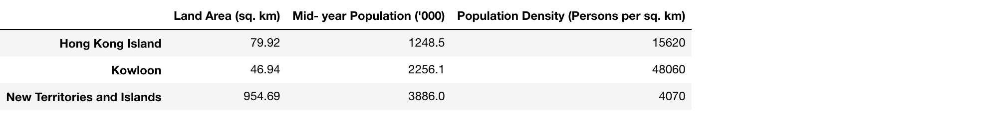

#### Load table (DataFrame) from local csv file

First of all, you need to download the csv file from [here](https://github.com/hupili/python-for-data-and-media-communication/blob/master/scraper-examples/open_rice/openrice_sample.csv). For how to download the file, you can refer to [here](github.md#how-to-download-a-file-from-github-web-page).

Put csv file into the same folder with Jupyter notebook. You can type `!pwd` to check out where it is and put the file in this path.

```python
import pandas
pandas.read_csv('openrice_sample.csv')
```

The output will be as below:
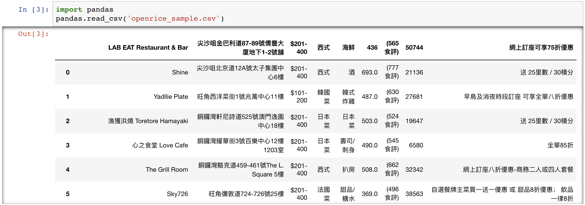

If there is no header in the csv file.We can use `Pandas` as below to add proper headers for a form.

```python
df = pandas.read_csv('openrice_sample.csv', header=None, names=['name', 'location','price','country','type','likes','review','bookmark','discount_info'])
# `df`is short for "dataframe", which is usually used as return value in pandas.
```

#### Load table (DataFrame) from a URL

We can also load CSV from GitHub directly with the help of `requests` and `io.StringIO`. `io` module is used for dealing with various types of I/O (input/output). Due to the requirement that `pandas.read_csv` function needs a `file-like object` as the argument, we need to use `io.StringIO` to write and store those string, returned from the request, temporarily. Then we can read the csv in pandas. Interested students can find more info about `io` module in [here](https://docs.python.org/3/library/io.html#text-i-o).

**Note:** We should use `raw data` url from github page instead of preview url.

```python
import pandas as pd
import io
import requests
url="https://raw.githubusercontent.com/hupili/python-for-data-and-media-communication/master/scraper-examples/open_rice/openrice_sample.csv"
s=requests.get(url).content
df=pd.read_csv(io.StringIO(s.decode('utf-8')),header=None, names=['name', 'location','price','country','type','likes','review','bookmark','discount_info'])
```

#### Select data

First of all, every time we load a csv in Jupyter, always print the first several rows to have a overview what's look like. It's useful and necessary because sometimes the dataset can be really large, if you print the whole table, your browser might get crushed. We can use following command to check out the records here.

```python
df.head() #displaying first 5 rows by default, you can pass the number in () to show more/less rows.
```

the output will be as blow:  


There are several ways to select data. We only focus on the most used ones. `[]`, `.loc` and `.iloc`. Collectively, they are called the indexers.

##### Select columns with []

`[]` method is mainly used for selecting single column and multiple columns. Basically, `[]` method treat the dataframe as a dict, using a key to refer to certain value. If you want to select one column of data, just simply put the name of the column in-between the brackets. For example, you want all the restaurant locations.You can type:

```python
df['location']
```

Then the output will be as below:  
![Pandas Select With []](assets/pandas-select-with-[].png)

You can find that the data type of the results returned is changed. Using `type(df['location'])` to check out what it is. If you want to keep the it with the `dataframe`, you can write the above code as this: `df[['location']]`.

To select multiple columns of the data, you can pass it a list of column names.

```python
df[['name','location','likes']]
```

The output will be like this:

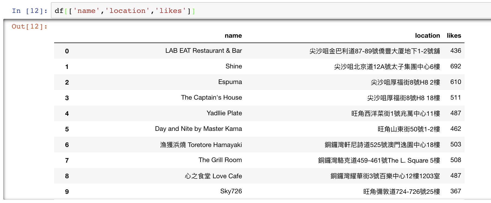

##### Select rows with .loc and .iloc

The `.loc` indexer will return a single row as a Series when given a single row `label`, and return DataFrame if multiple rows are selected.

Example:

```python
df = pd.DataFrame([[170, 60], [180, 82], [175, 70]],
    index=['Ri', 'Frank', 'Tyler'],
    columns=['height', 'weight'])
df
```

```text
                height  weight
Ri                170      60
Frank             180      82
Tyler             175      70
```

```python
df.loc['Frank'] #select one row
```

```text
height    180
weight     82
Name: Frank, dtype: int64
```

```python
df.loc[['Frank', 'Tyler']]
```

```text
                height  weight
Frank              180      82
Tyler              175      70
```

Similarly, there is another function `.iloc`, which is purely integer-location based indexing for selection by position.

Using the `openrice.csv` as an example:

```python
#read csv first, make sure the header is right, you can refer to previous content in this chapter.
df.iloc[5]
```

```text
name             Day and Nite by Master Kama
likes                                    462
location                        旺角山東街50號1-2樓
price                               $101-200
country                                  日本菜
style                                     海鮮
review                              (595 食評)
bookmark                               28151
discount_info                  送 25里數 / 30積分
Name: 5, dtype: object
```

```python
df.iloc[[5,10,15]]
```

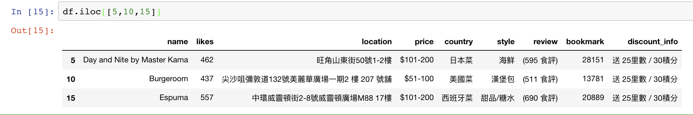

```python
df.iloc[10:20]
```

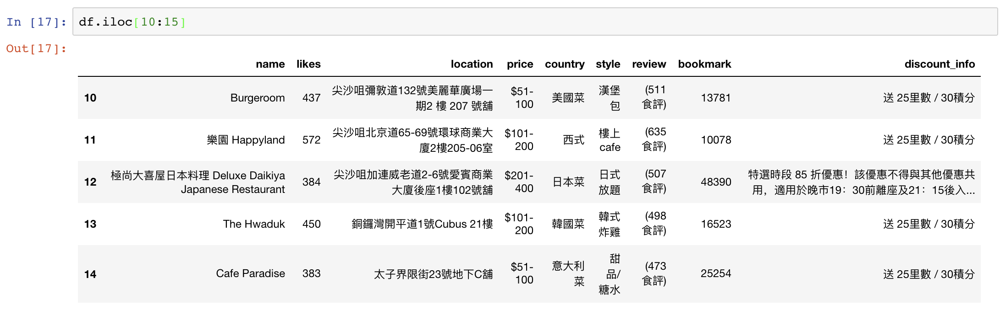

#### Basic statistics

##### DataFrame.describe()

Descriptive or summary statistics in python – pandas, can be obtained by using describe function. `describe()` function gives you a summary about the dataframe or certain series with the `mean`, `count`, `std` and `freq` values etc. Only the column with pure numbers can be described if you don't specify the column.

Example:

```python
df.describe()
	likes	        bookmark
count	244.000000	244.000000
mean	249.094262	12596.356557
std	112.075938	8567.647276
min	66.000000	1430.000000
25%	165.000000	6741.750000
50%	215.500000	10755.500000
75%	309.500000	15464.500000
max	692.000000	52023.000000
```

```python
df['style'].describe()
count     244
unique     47
top        火鍋
freq       39
Name: style, dtype: object
```

##### Count values of series

After we can select one column or row, we can do further calculation or analysis. One common usage is to count different values in one column.

Example

```python
df['country'].value_counts()
```

```text
西式         47
日本菜        45
意大利菜       26
韓國菜        20
粵菜 (廣東)    18
港式         18
多國菜        17
泰國菜        10
台灣菜        10
西班牙菜       10
...
Name: country, dtype: int64
```

```python
df['style'].value_counts()
```

```text
火鍋                   39
海鮮                   28
甜品/糖水                24
壽司/刺身                14
日式放題                 11
烤肉                   10
自助餐                   9
薄餅                    9
咖啡店                   8
All Day Breakfast     7
...
Name: style, dtype: int64
```

`value_counts()` function gives you a hint for further filter and data processing. For example, after you know the `火锅` is the most popular food type. We can do a filter that select all the restaurants in `火锅` and cross analysis it with likes, prices etc., which we will cover later in this chapter.

##### Sort values in dataframe

Sort values in dataframe is similar to which in series. You can sort by different columns like the example:

```python
df.sort_values(by='likes',ascending=False)
```

**Note:** In the `sort_values` function, we can only use `ascending` method, `descending` will not work here,which is designed by pandas documentation. But we can use `ascending=False` to meet `descending` needs.

What's more, in the multiple columns dataset, one may need to filter or sort values by multiple columns, we can use following method to accomplish this:

```python
df.sort_values(['likes','bookmark'],ascending=[False,False]) #the first false corresponding to the first column
```

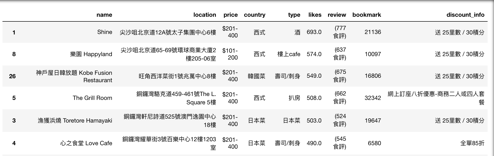

##### Plot a simple chart: histogram

After we got the results from our analysis, the key point is to visualize them so that we can have a better understanding of the results and get insights from them. By using `.hist()` function, We can plot a simple histogram to show the distribution and trend.

Example:

```python
%matplotlib inline #this line is to solve the problem that histogram doesn't reveal.
df['likes'].hist()
```

and you can get a distribution like below:  
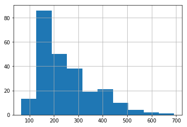

You can change shape of the charts by changing the bins(basically, one bin means one column)

```python
df['likes'].hist(bins=20)
```

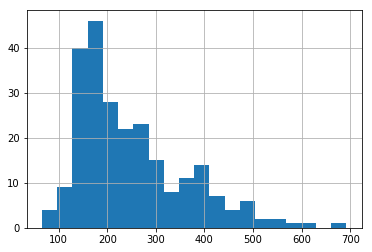

#### Data cleaning and pre-processing

##### Apply a function

In the process of analyzing, we will encounter a lot of data cleaning issues, like the missing values, NoneType values or other type of values that have side effects, which need us to build different functions to handle them or convert them. For example, the price in the `openrice` is a range of number which cannot be compared directly. We need firstly clean the data and convert price range to numeric values.

If you need to compare price which is a interval.You need to pay special attention on numbers. Otherwise,Python recognize '$101-200' < '$51-100' because Python only compare the first number in sequence of each interval.

You need to convert each interval string into numbers, which means you need to choose a number to represent each interval to do comparison. Here, we use `mapping` function:

```python
mapping = {
  '$101-200': 200,
  '$201-400': 400,
  '$51-100': 100,
  '$401-800': 800,
  '$50以下': 25
}
```

Now, build a function to handle those data.

```python
original_string = '$60以下'
mapping.get(original_string, 0)
# if those string is in the mapping dict, it will return the paired value, otherwise, it will return the value you set, in this case, is the second parameter 0.
def cleaning(e):
    return mapping.get(e, 0)
cleaning('$50以下')
```

**Note:** In the mapping function, its not like the traditional dict - key & value like.

```python
mapping = {'A':'B'}
mapping.get('A')
```

Basically, it tells that we use B to replace A. For vast sum of data, we can use apply function to do cleaning. For example, if you have a series of data need to be mapping:

```python
mapping = 
{'A':'B',
'C':'D',
...,
'X':'Y'}
def cleaning(e):
    return mapping.get(e, 0)
pandas.series.apply(cleaning)
```

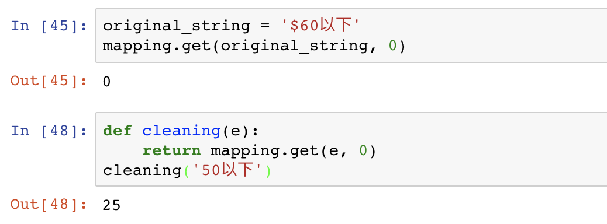

Then we can use `apply` function to do cleaning for the whole column. Basically, `<data>.apply(<function_name>)` means that pass those data one by one to call the function, which is equal to a `for` loop processing data.

```python
df['price'].apply(cleaning) #clean the whole column
```

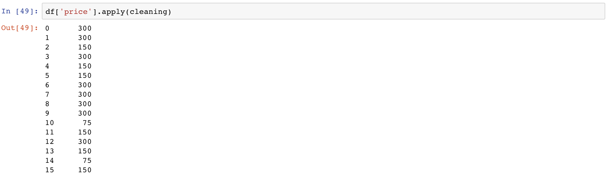

##### lambda: anonymous function

lambda also called as anonymous function, which doesn't have a specific name, only need one line to declare function. The usual syntax is as follows:

```python
lambda arguments : expression
```

There can be multiple arguments, and expression is the results it returns.

For example:

```python
c = lambda x,y : x**2 + 4*y
c(4,2)
#24
```

x,y are arguments, and after the`:` is the results. This is equal to:

```python
def f(x,y):
    return x**2 + 4*y
f(4,2)
```

The advantages of `lambda`:

- Using lambda omit the process of defining functions, which make the code more light.
- We can save time by using lambda without thinking about naming the function
- The power of lambda is better shown when you use them as an anonymous function inside another function.

For example: Build a filter lambda function inside a function

```python
# Program to filter out only the even items from a list

my_list = [1, 5, 4, 6, 8, 11, 3, 12,9,27,15,14,17]
new_list = list(filter(lambda x: (x%3 == 0) , my_list))
new_list
# Output: [6, 3, 12, 9, 27, 15]
```

#### Filtering

In the above example, we learned how to access to the columns, raws and multiple data in the dataframe. For further analysis, we need to do some filtering work to help us better finding the insights. For example, how to select the most expensive restaurants and the least likeable restaurants? Is there any correlation between likes and types?...

For filtering, in pandas, we use the `df[ conditions ]` method. This is basically means, we first use `condition` to filter the data, and put it into data frame. For example, if you want to know how many restaurants having over 500 likes, and what are those restaurants.

```python
df['likes'] > 500 #this is a condition filtering restaurants that received more than 500 likes.
```

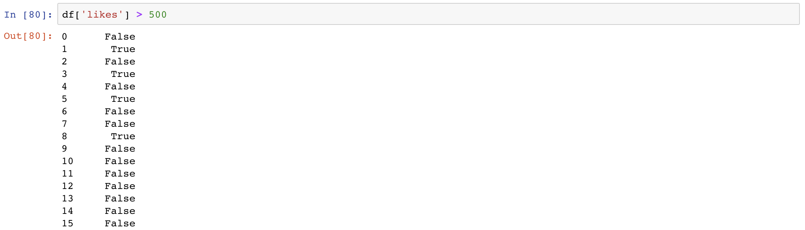

The results returned is a series true or false, true means meeting the condition, while false is not.

To get the information of those filtered restaurants, we use `df[]` outside of the `condition`.

```python
df[df['likes'] > 500]
```

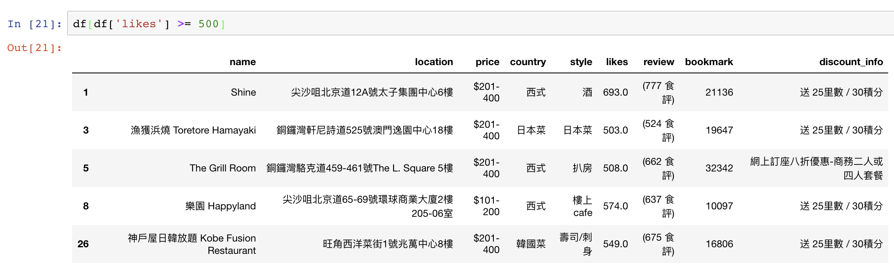

There are many ways to do filtering, the following are the common methods that are wildly used.

##### Filter by numeric range

If there is multiple conditions in filtering, we need to use `()` to include each condition. For example, filter the `bookmark` between 50000-60000.

```python
df[(df['bookmark'] < 60000) & (df['bookmark']>50000)]
```

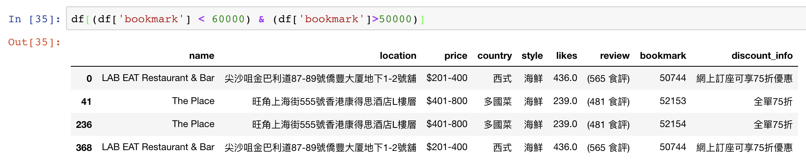

##### Filter by exact value

You can filter the exact value by passing the specific numbers or strings. For example, we can select all Spanish restaurants.

```python
[df['country'] == '西班牙菜'] #use two == for comparison
```

the output will be:
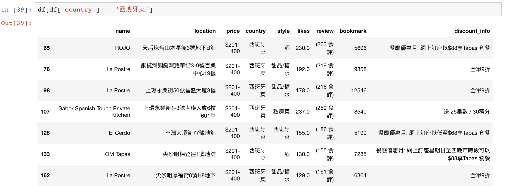

##### Filter by more than two conditions

As we discuss before, we can filter multiple conditions by using () to include each condition. For example, we can select some cost-effective restaurants for a friends gathering. Like, the `seafood restaurants` with price range in `$100-200` and likes `more than 300`.

```python
df[(df['price'] == '$101-200') & (df['style'] == '海鮮') & (df['likes'] > 300)]
```

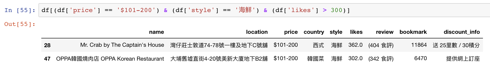

For how to manipulate multiple conditions, You may need to review the bool comparison logic in the Chapter 3 - [logic operators](https://github.com/hupili/python-for-data-and-media-communication-gitbook/blob/78e8f08afdd84855295287ba19e360352fca373a/notes-week-03.md#logic-operators)

### Export from `pandas`

After you finish processing data in `pandas`, you may want to export it

- to store the dataset for later analysis.
- to convert it into a format that can be used by Frontend developers to make interactive web visualisations.

The common export formats are:

- `to_csv`
- `to_dict`
- to JSON format

#### to_csv

In pandas, dataframe to csv is very simple, just one line can work for this.

```python
df.to_csv('full_filename', encoding='utf-8', index=False) #full_filename means you need to add the file format like openrice.csv .
```

You can pass other parameter if needed, for more information, you can check out [here](https://pandas.pydata.org/pandas-docs/stable/generated/pandas.DataFrame.to_csv.html) .

#### to_dict

There are different output formats with `to_dict` method, which depends on what parameter you pass in. By default, it will return dict like {column -> {index -> value}}. List like method [{column -> value}, … , {column -> value}] is also wildly used. For example:

```python
df.to_dict()
```

Output:

```text
{'bookmark': {0: 50744,
  1: 21136,
  2: 27681,
  ...
  'country': {0: '西式',
  1: '西式',
  2: '韓國菜',
  ...
  'style': {0: '海鮮',
  1: '酒',
  2: '韓式炸雞',
  ...}}
```

```python
df.to_dict('records')
```

Output:

```text
[{'bookmark': 50744,
  'country': '西式',
  'discount_info': '網上訂座可享75折優惠',
  'likes': 436.0,
  'location': '尖沙咀金巴利道87-89號僑豐大厦地下1-2號舖',
  'name': 'LAB EAT Restaurant & Bar',
  'price': '$201-400',
  'review': '(565 食評)',
  'style': '海鮮'},
  ...
 {'bookmark': 21136,
  'country': '西式',
  'discount_info': '送 25里數 / 30積分',
  'likes': 693.0,
  'location': '尖沙咀北京道12A號太子集團中心6樓',
  'name': 'Shine',
  'price': '$201-400',
  'review': '(777 食評)',
  'style': '酒'}]
```

You can check out [here](http://pandas.pydata.org/pandas-docs/stable/generated/pandas.DataFrame.to_dict.html) for more usage and methods.

#### to_json

`to_json` method will convert the dataframe to a JSON string, and its like combination of above two methods. The difference is that json has a `orient` parameter, which determine the output format, whether `list like` or `dict like`. Besides, for a file path or object. If not specified, the result is returned as a string.

```python
df.to_json('full_file_name', orient='split',force_ascii=False) #then you can open the json file
```

```python
df.to_json(orient='records',force_ascii=False) #you can change different orient method
```

Output:

```text
'[{"name":"LAB EAT Restaurant & Bar","location":"尖沙咀金巴利道87-89號僑豐大厦地下1-2號舖","price":"$201-400","country":"西式","style":"海鮮","likes":436.0,"review":"(565 食評)","bookmark":50744,"discount_info":"網上訂座可享75折優惠"},
...
{"name":"Shine","location":"尖沙咀北京道12A號太子集團中心6樓","price":"$201-400","country":"西式","style":"酒","likes":693.0,"review":"(777 食評)","bookmark":21136,"discount_info":"送 25里數 \\/ 30積分"}]'
```

You can check out [here](https://pandas.pydata.org/pandas-docs/stable/generated/pandas.DataFrame.to_json.html) for more usage and methods.

After we get the json string, we also can use `json_dumps` and `json_loads` to convert between Python object and json file.

#### Bonus: Python and Javascript in action

A very common workflow is to process data in Python and visualize data in Javascript. The last interactive chart in this [blog post](http://initiumlab.com/blog/20160730-Voting-Preference-Analysis-for-Hong-Kong-Legislative-Council-2012-2016/#%E8%AD%B0%E5%93%A1%E5%9B%9B%E5%B9%B4%E6%8A%95%E7%A5%A8%E5%82%BE%E5%90%91%E8%AE%8A%E5%8C%96) shows the political preference variation of HK legco members during the 2012-2016 term. The interactive chart is made by [echarts](https://ecomfe.github.io/echarts-doc/public/en/index.html), a popular Javascript library for interactive visualisation from Baidu. However, the data collection and heavy duty data analysis are done in Python. We conducted the analysis in Python and export the `pandas.DataFrame` into a `JSON` format that can be consumed by echarts. You can checkout the [JSON file here](http://initiumlab.com/blog/20160730-Voting-Preference-Analysis-for-Hong-Kong-Legislative-Council-2012-2016/echarts-option-legco-5.json).

The key takeaway is that data files like `json`, `csv` and `xml` are usually the bridge between frontend (e.g. Javascript) and backend (e.g. Python).

## Dataprep

You need to finish "Dataprep" before analysis. That is, we start with structured data. Preparing the structured and cleaned data has no common schema. A data scientist regularly spends most of the time in dataprep. We have pointers in [Dataprep](dataprep.md) for your own reading, including some non-Python dataprep tools/ platforms. Now that we learned the basics of `pandas`, we can conduct the dataprep workflow all in Python.

Here is a polluted dataset from original openrice scraped data. Please try to combine pandas knowledge above and following guidelines to prepare a structured data that is good for further analysis.

### Cleaning

The format:

- Does this file use UTF-8 encoding? Checkout some common issues [about encoding](encoding.md). If not, are you able to convert it to the conventional UTF-8 encoding?
- Does the input data table has valid column names? If not, how do you know the meaning of each column?
- Does every row of the table have the same number of columns ("cells" more precisely)?
- Is every element in a single column of the data type? Say all integers or all strings. Do you see a string mixed into to a column where you are supposed to see numbers?
- How many missing values are in this table? Do missing values affect your analysis result? Do you want to fill the missing values (e.g. `DataFrame.fillna()`) somehow; Or do you want to remove the rows/ columns which contain missing values?

The content:

- Check the variable distribution. Is there any special value that only appears once or a few times? Will it be a typo?
- Check the variable range. What is the common range of values in this variable? Is there any peculiar value?
- Check the string length. Is there a super long cell? It may be because parsing error during scraping stage. Some data may mix up.
- Check the missing values. Are there empty cells? What is the reasonable default value to fill in those empty cells?
- Check the above on a subset of data (filtering/ grouping). Does `50` looks like a regular price? Does `50` looks like a regular price within "seafood" category?
- Is the duplicate content? If there is no duplicate _entire rows_, is there duplicate rows in terms of a subset of the columns? Is this duplicate an error in the data? You may want to leverage some domain knowledge to further check.

As an exercise, you can download a CSV file with intentionally injected error [here](hhttps://github.com/hupili/python-for-data-and-media-communication/tree/master/pandas-examples/data%20cleaning%20exercise). The notebook is for your reference.

### Transformation

- Convert text value to numeric value. e.g. convert price range text into a representative number that can be sorted.
- Merge multiple categories. e.g. merge `港式` and `潮州菜` into `中式`. Sometimes, less categories help analysis. You may need some domain knowledge and trials and errors, in order to find good method of grouping.
- Encoding, many times called "coding" in social science research, is the process of turning natural language data into numeric data. This is also a matter of domain knowledge but you can try the method here. e.g. in order to study the relationship between price range and the income level of that district, we can encode 18 districts into three income class `high`, `medium` and `low`.

### Extraction

We load the CSV data in one shot, because the current dataset is very small. In real practice, you may meet a large dataset, so the first step is usually data extraction. One can do extraction by certain rules, e.g. get the restaurants in a certain district, get the restaurants that are open in a certain time period. Or you are interested in the whole population but do not possess the appropriate computation power to handle this dataset. At this point, you may want to do sampling. `DataFrame.sample()` may be helpful here. When dealing with really large dataset, you may want to combine extraction by rule and extraction by sampling.

## References

* [Exercise numpy](https://www.shiyanlou.com/courses/1090) on ShiYanLou
* [Exercise pandas](https://www.shiyanlou.com/courses/1091) on ShiYanLou

------

If you have any questions, or seek for help troubleshooting, please [create an issue here](https://github.com/hupili/python-for-data-and-media-communication-gitbook/issues/new)
