# Week 09 - Present findings: data visualization and reproducible report

<div id="toc">

<!-- TOC -->

- [Week 09 - Present findings: data visualization and reproducible report](#week-09---present-findings-data-visualization-and-reproducible-report)
    - [Objective](#objective)
    - [Data Visualization Libraries](#data-visualization-libraries)
        - [matplotlib](#matplotlib)
            - [Why matplotlib?](#why-matplotlib)
            - [Basic usage](#basic-usage)
            - [How to order the keys of bar chart](#how-to-order-the-keys-of-bar-chart)
            - [How to plot multiple chart in one input/ output cell](#how-to-plot-multiple-chart-in-one-input-output-cell)
        - [seaborn](#seaborn)
            - [Basic usage](#basic-usage-1)
            - [Plot bar-charts and other charts](#plot-bar-charts-and-other-charts)
        - [plotly](#plotly)
        - [pyecharts](#pyecharts)
        - [pandas](#pandas)
        - [bokeh](#bokeh)
    - [Data visualization Principles](#data-visualization-principles)
        - [Principle](#principle)
        - [Charts](#charts)
        - [Dashboard](#dashboard)
    - [GitHub repo](#github-repo)
        - [README.md](#readmemd)
        - [Presenting dataset](#presenting-dataset)
    - [Publish work on GitHub Pages](#publish-work-on-github-pages)
        - [Basic HTML](#basic-html)
        - [Bonus: CSS](#bonus-css)
        - [Single column layout](#single-column-layout)
        - [Integrated exercise: Publish a full work in a stand alone page](#integrated-exercise-publish-a-full-work-in-a-stand-alone-page)
            - [Save plotly chart](#save-plotly-chart)
        - [Bonus: Continuously update GitHub Pages](#bonus-continuously-update-github-pages)
    - [Bonus: Craft a data service](#bonus-craft-a-data-service)
    - [Code of conduct: Reproducible reporting and full reporting](#code-of-conduct-reproducible-reporting-and-full-reporting)
    - [References](#references)


</div>

## Objective

- `matplotlib`
- `seaborn`
- `plotly`
- `pyecharts`
- `pandas`

## Data Visualization Libraries

Demo data: [open rice data](https://github.com/hupili/python-for-data-and-media-communication/blob/master/scraper-examples/open_rice/openrice_viz.csv)

- 1D: plot price range bars
- 2D: plot price range bars w.r.t areas
  - Use faceting, i.e. multiple sub plots in one plot
  - Use grouping, i.e. grouped bar chart (can select a subset of areas)

### matplotlib

#### Why matplotlib?

Matplotlib is a data visualization library which has ability to support you plot various kind of graphs and charts like scatter plot, bar chart, histogram, even 3D graphics and animations and so on. Its powerful and its simple that we usually use it as the basic driver for the basic data visualization. You can refer [here](https://matplotlib.org/api/_as_gen/matplotlib.pyplot.html) for it's documentation and functions.

#### Basic usage

Install and import:

```python
!pip install matplotlib
from matplotlib import pyplot as plt
```

Basic usage example:

```python
from matplotlib import pyplot as plt
import pandas as pd
data = [1, 5, 2, 3, 2]
df = pd.DataFrame(data, columns=['value'])
#df
plt.bar(df.index, df.value) #pass x label value and y label value
plt.show()
```

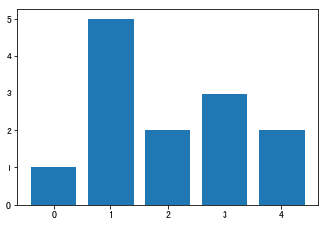

#### How to order the keys of bar chart

**Note:** Matplotlib doesn't support displaying Chinese characters, we need to do some setup work here. Please refer [here](https://github.com/hupili/python-for-data-and-media-communication-gitbook/blob/master/module-matplotlib.md#how-to-display-chinese-characters-when-using-matplotlib) with the tutorial.

```python
# -*- coding: utf-8 -*-
import pandas as pd
from matplotlib import pyplot as plt
df = pd.read_csv('openrice_viz.csv') #read csv
#df.head()

plt.rcParams['font.sans-serif']=['SimHei'] #set for displaying Chinese characters here.
plt.rcParams['axes.unicode_minus']=False #set for displaying `-`

country_counts=df['country'].value_counts()[:15].sort_values(ascending=False) #sort values
country = pd.DataFrame(country_counts)
fig = plt.figure(figsize=(14,7)) #adjust size
plt.bar(country.index, country.country,color = '#46bc99',edgecolor = '#40b4e5') #change color of the bars

# another way to plot bar in pandas:
# country_counts=df['country'].value_counts()[:15].sort_values(ascending=False).plot(
#     kind='bar',color = '#46bc99',edgecolor = '#40b4e5')
plt.title('top 15 country') #plot title and label name
plt.xlabel('country')
plt.ylabel('counts')
plt.show()
```

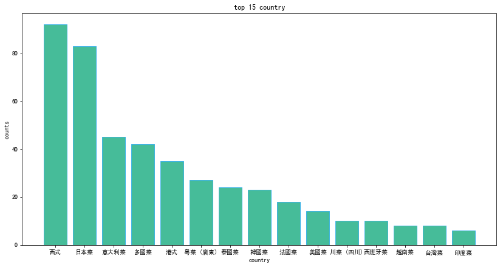

#### How to plot multiple chart in one input/ output cell

Sometimes, we can use `plt.subplot` function to plot multiple charts into one output cell, so that we can more easily to compare and tell the difference between different parameters.

```python
fig, axes = plt.subplots(nrows=2, ncols=2,constrained_layout=True,figsize=(30,20)) #set a 2*2 canvas, adjust layout to more flexible, adjust figure size, axes means the location of each subplots, you can refer to the following picture below to learn more.

#plot price range count
price = pd.DataFrame(df['price'].value_counts())
ax1 = price.plot(kind = 'bar',color = '#46bc99',edgecolor = '#40b4e5',ax=axes[0,0],fontsize=24)
ax1.set_title("Price range count",fontsize=40)

#plot country count
country = pd.DataFrame(df['country'].value_counts()[:15])
ax2 = country.plot(kind = 'bar',color = '#46bc99',edgecolor = '#40b4e5',ax=axes[0,1],fontsize=24)
ax2.set_title("Country count",fontsize=40)

#plot type count
type = pd.DataFrame(df['type'].value_counts()[:15])
ax3 = type.plot(kind = 'bar',color = '#46bc99',edgecolor = '#40b4e5',ax=axes[1,0],fontsize=24)
ax3.set_title("Type count",fontsize=40)

#plot likes and bookmark scatter
likes_bookmark = df[['likes','bookmark']]
ax4 = likes_bookmark.plot(kind = 'scatter',x='likes',y='bookmark',color = '#46bc99',ax=axes[1,1],s=80,fontsize=24)
ax4.set_title("Like with Bookmark count",fontsize=40)
```

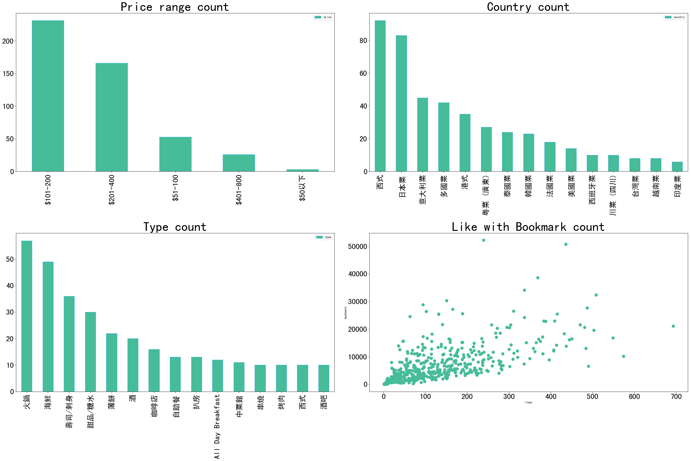

**Note:**

1. You can pass a lot of parameters like `kind`, `color`, `fontsize` into the function. For more usage documentation, please refer [here](https://pandas.pydata.org/pandas-docs/version/0.22/generated/pandas.DataFrame.plot.html)
2. Axes is just like the position of the subplots. You can refer to the following picture for better understanding.


### seaborn

Seaborn is a Python data visualization library based on matplotlib, basically, you can regard it as the advanced version of matplotlib, and its closely integrated with `pandas data structures`, with which we can draw more attractive and informative statistical graphics. You can refer [here](https://seaborn.pydata.org/tutorial.html#tutorial) for it's documentation and functions.

#### Basic usage

Install and import:

```python
!pip install seaborn
import seaborn as sns
```

Basic usage example:

```python
import seaborn as sns
sns.distplot(df["bookmark"],bins=20)
#one can directly pass pandas.series to plot histogram
```

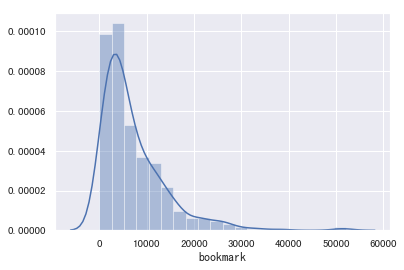

#### Plot bar-charts and other charts

Example: Draw a bar chart between price range and likes, you can easily find that $200-400 is the most popular price and acceptable range in Hong Kong.

```python
sns.set(font='SimHei') #set font to support Chinese character
pd_df = df.groupby(['price'])['likes'].mean().reset_index().sort_values("likes",ascending=False) #this is to solve the output chart is not sorted by likes.
ax = sns.barplot(x='price', y='likes',data=pd_df,palette=("ch:2.5,-.2,dark=.3")) #palette is like the color combination style
plt.title('likes_price', color='gray', fontsize=16, weight='bold')
```

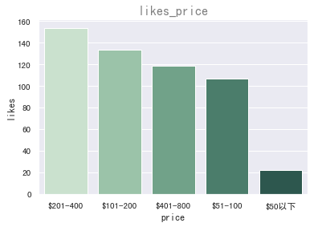

Example 2: Draw a scatter plot between bookmarks and likes to quickly checkout whether there is a relationship.

```python
import seaborn as sns
ax = sns.scatterplot(x="bookmark", y="likes",data=df)
```

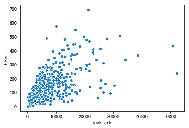

Apart from two dimensional analysis, seaborn can handle more complicated cases. We can add another parameters called `hue`. Hue is the name of variables in data or vector data, its an optional argument. Grouping variable that will produce points with different colors. It can be either categorical or numeric.

```python
ax = sns.scatterplot(x="bookmark", y="likes",hue='price',data=df)
```

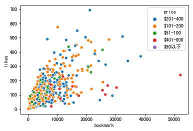

For more seaborn examples and tutorials, you can refer [here](hhttps://seaborn.pydata.org/tutorial.html)

<!-- Apart from bar charts, there are many other style we can choose, the following is a simple demo of `catplot`.  You can refer [here](https://seaborn.pydata.org/generated/seaborn.catplot.html) for more plotting methods.

```python
sns.catplot(x="price", y="likes",hue="country", height=10, aspect=1,data=df)
```

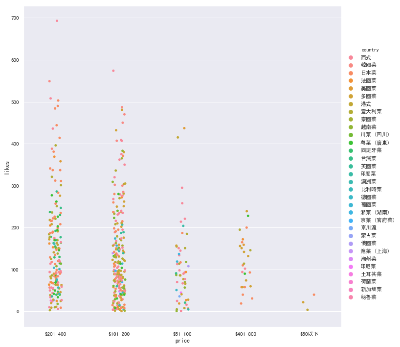 -->

### plotly

Plotly is very powerful to make interactive, publication-quality graphs online. Including line plots, scatter plots, area charts, bar charts, error bars, box plots, histograms, heatmaps, subplots, multiple-axes, polar charts, and bubble charts. If you want to present and publish your work on html, with some fancy appearance and interactive experience, Plotly is a very recommended library.

Install and import:

```python
!pip install plotly
import plotly #plot it offline
import plotly.plotly as py # Every function in this module will communicate with an external plotly server
```

Basic usage example:

```python
import plotly.plotly as py
import plotly.graph_objs as go
# to see relationship between countries and likes
pd_df2 = df.groupby(['country'])['likes'].mean().reset_index().sort_values("likes",ascending=False)
#if you want to plot charts with sorted order, you need to sorted data first, then pass the data into function.

data = [go.Bar(x=pd_df2.country,
            y=pd_df2.likes)]
py.iplot(data, filename='country_with_average_like_bar') #if you use py.plot(), you will get the output in a new browser window, but with iplot(), you can do interactive actions just in your Jupyter notebook
```

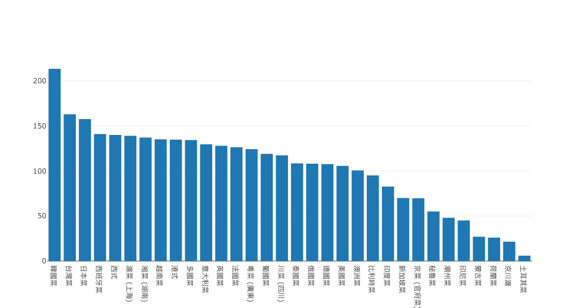

For more plotly examples and tutorials, you can refer [here](https://plot.ly/python/)

### pyecharts

Pyecharts is a library to generate charts using Echarts, which is an open source library from Baidu for data visualization in javascript. Pyecharts provides 30+ kinds of charts, especially with easy-to-use interactive graphs.

Install and import:

```python
!pip install pyecharts
from pyecharts import Bar #you can change Bar to other kind of charts, like Line, Pie, HeatMap etc...
```

Basic usage example:

```python
from pyecharts import Bar
#to see relationship between countries with likes and bookmarks
pd_df3 = df.groupby(['country'])['bookmark'].mean().reset_index().sort_values("bookmark",ascending=False)
attr = pd_df2.country
v1 = pd_df2.likes  #you can pass a list like data here
v2 = pd_df3.bookmark
bar = Bar("Countries by likes and bookmark")
bar.add("by likes", attr, v1, mark_line=["average"])
bar.add("by bookmark", attr, v2, mark_line=["average"])
bar
```

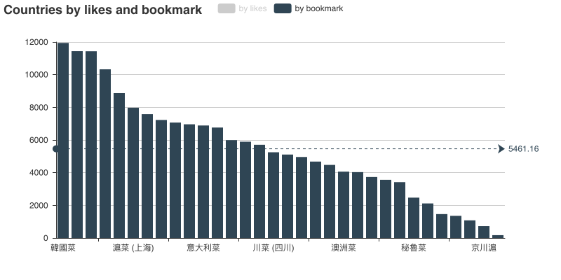
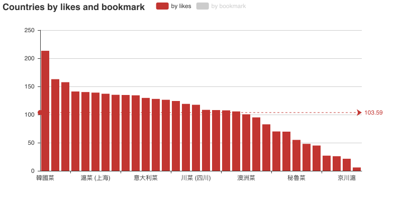

For more pyecharts examples and tutorials, you can refer [here](http://pyecharts.org/#/zh-cn/charts_base)

### pandas

One can also include "bar charts" in your DataFrame, from which you can easily find the distribution and the extreme values. For example:

```python
pd_df4 = df.pivot_table(index=['country'], columns=['price'], values='name', aggfunc='count')
pd_df4.style.bar(color='#d65f5f')
```

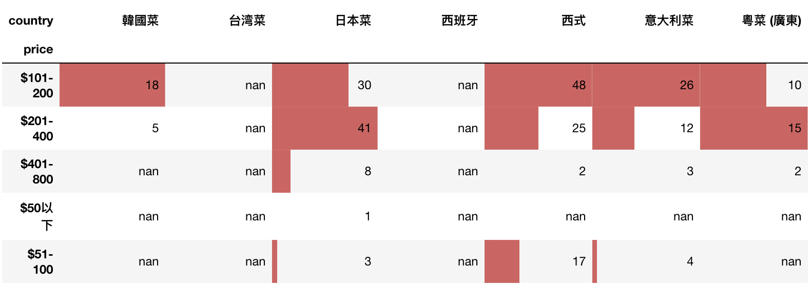

For more inside pandas.DataFrame usage, please refer [here](https://pandas.pydata.org/pandas-docs/stable/style.html#Bar-charts)

### bokeh

Bokeh is an interactive visualization library that targets modern web browsers for presentation.

Install and import:

```python
!pip install bokeh
from bokeh.plotting import figure, show
```

Basic usage example:

Plot top 10 country grouped with bookmark, and sorted by bookmark.

```python
from bokeh.plotting import figure
from bokeh.io import show, output_file
output_file("bokeh_bar.html")
pd_df5 = df.groupby(['country'])['bookmark'].mean().reset_index().sort_values("bookmark",ascending=False)[:10]
# source = ColumnDataSource(data=pd_df5)
p = figure(x_range=pd_df5.country,plot_height=350, title="Country with bookmark",
           toolbar_location=None, tools="")
p.vbar(x=pd_df5.country, top=pd_df5.bookmark, width=0.9)
p.xgrid.grid_line_color = None
p.y_range.start = 0
show(p)
```

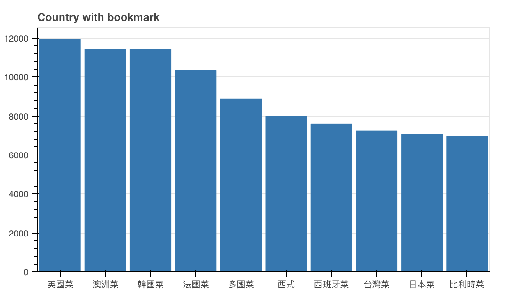

For more bokeh examples and tutorials, you can refer [here](http://bokeh.pydata.org/en/latest/docs/user_guide/categorical.html#)

## Data visualization Principles

**NOTE**: This section are on course slides.

### Principle

<!-- **TODO**: examples and counter examples. Where visualization helps and where visualization can go wrong. How data and viz can cheat you. -->

### Charts

### Dashboard

## GitHub repo

### README.md

"README" is a convention in computer world. You can find a file of this name in almost all software distribution. It means exactly the same as its name indicates: before you do anything, read me first! This file usually gives people instructions on first steps to work with the software. It may point to other more detailed tutorials or mannuals. The `.md` in `README.md` is just a suffix to indicate that this file is written in markdown format. When GitHub sees this file, it renders the file into HTML (for your web browser) using a markdown compiler. You can check out the [README.md](README.md) of this current repo to get an idea.

Besides giving important project information and "play the open source way", a good README file is also an "elevator pitch" to potential readers/ users. You want to present the key functions/ highlights in quick/ direct way. Here are some tips for your consideration.

- Use one sentence to summarise the project. You can use analogy to help visitors quickly comprehend the content.
- Include a "demo" section to show the outcome. Screenshots may help.
- Include a "quickstart" to show user the painless operations that can give some prelminary results.
- Include a "license" section to make the file look professional
- A [tutorial](https://blog.github.com/2018-06-29-GIF-that-keeps-on-GIFing/) to use GIFs to better present your work on GitHub.

### Presenting dataset

When you present a dataset on GitHub, following information is helpful for the readers to quickly understand your project:

- **topic**
- data source
- data fields (type, sample data)
- data volume
- **license**
- obstacles and solutions
- future work

License is easy to forget. Some serious users may not use your project if there is no permissive license. One can refer to [this section](notes-week-00.md#common-licenses) for some common licenses in the open source world. The suggested license as a default:

- If your work is reusable code, using `MIT` is common.
- If your work is creative content, either dataset or article, using `CC 4.0 BY` is common.

## Publish work on GitHub Pages

### Basic HTML

HTML is a declarative language. One only needs to "declare" what content is on the page, using "tags". HTML tags come in pairs, in the form like `<tag></tag>`. Tags can be nested so some content can be put inside other content (container tags) ("phrase" and "flow" element in HTML language). You can readily start building a web page by modifying other's code. Following tags are common:

- h1/ h2/ h3
- p
- img
- a
- ul/ ol/ li
- strong, em
- iframe

Note that, `iframe` is commonly used to embed external resources into the current web page.

### Bonus: CSS

CSS can be used to style the page. They usually come in three places:

- The `<style>` tag
- The `style=""` attribute in HTML element
- Use `<link rel="stylesheet" src="">` to include external style files.

Detailed explanation is omitted from this open book. To get started, you don't have to worry about CSS. Most common way of practice is to get some existing works and modify the content via HTML directly.

### Single column layout

With the wide spread of mobile devices, single column layout is trending. That is, there is only one column on every row. The web page is an interleaved layout of images and texts. No two images appear side by side. No two paragraphs appear side by side. If you need to do so, try to edit those two images into one outside the scope of HTML so that one `img` tag is enough for the presentation.

### Integrated exercise: Publish a full work in a stand alone page

[Big Road](http://project.hupili.net/big-road/) is a minimalist solution to make sensible web stories on GitHub. You can follow the instructions there to put your stories on the web. It features:

- Only HTML
- Mobile-only and single column layout
- No CSS (actually we do have CSS there; but you don't have to worry about it)
- Responsive embedding
- Interactive chart demo

#### Save plotly chart

<!-- TODO: How to save a plotly chart and put into your web story on gh-pages? -->

### Bonus: Continuously update GitHub Pages

The GitHub repository can be updated continuously ensure the data presented there is latest. One common strategy is:

- Use Python to handle the data collection and data processing.
- Generate JSON data files to interface between Python and Javascript.
- Build interactive charts that takes JSON data as input, from a designated location on gh-pages.
- Periodically run the Python script to make the data up to date. One may find `cron` on Linux or Mac OSX helpful.

## Bonus: Craft a data service

Two components of the system:

- Frontend -- things that a regular users can see
- Backend -- things that a regular users can not see, and usually unaware of

Frontend is based on the languages: HTML/ CSS/ JavaScript. Backend can have many different alternatives, notably `Python`, `JavaScript` (NodeJS), `Ruby` and `PHP`. There are two styles of connecting frontend and backend:

- Server Side Rendering -- The web framework of the backend compiles HTML/ CSS/ JavaScript and then send to the user browser in a batch. This way is more efficient in terms of execution but not less flexible in web design.
- Client Side Rendering -- The backend only provisions API (the same concept you encountered in week-04). Frontend reads data from API and assembles the web page for user's action. This is the current mainstream approach. This way decouples frontend and backend, and has certain engineering advantages.

There are some useful libraries in Python for you to build a backend:

- `django` -- a very comprehensive library, with a rich eco-system.
- `flask` -- medium weight library. It is recommended for a serious but small scale project.
- `bottle` -- light weight library. One can build up a web service in 10 minutes. It is good as an initial trial.

## Code of conduct: Reproducible reporting and full reporting

- Reproducible reporting: Using Jupyter notebook can make most of the content reproducible by default. The readers can find dataset, codes, results, charts and explanation all in one place. However, note that
  - Sometimes you execute the cells in the Jupyter notebook in a different order from their appearance on the notebook. That is normal in the trial and error stage. Before you publish the notebook, make sure you restart the kernel and execute from beginning to end in one batch. This makes sure the other readers can **reproduce** the notebook.
  - Sometimes, manual intervention is required in the process, e.g. clicking a button, substituting cookies, etc. You need to put down notes where the workflow is not fully automated. The core concept of reproducible reporting, is to make sure the readers can reproduce your result, either by code, or by human operation.
- Full reporting: not only report the successful instances; but also report the unsuccessful instances. Sometimes, you find contradictory results from one dataset. Many authors are selective. In our code of conduct, you need to do a full reporting at one intermediate stages, i.e. showing the possible results/ alternative results that you already find. In the narratives of final report, being selective is usually one necessary evil to make a compelling story. You need to make sure you don't over-state anything.

## References

- First two chapters \(i.e. before "3D"\) of the article [The Art of Effective Visualization of Multi-dimensional Data](https://towardsdatascience.com/the-art-of-effective-visualization-of-multi-dimensional-data-6c7202990c57) by Dipanjan Sarkar


------

If you have any questions, or seek for help troubleshooting, please [create an issue here](https://github.com/hupili/python-for-data-and-media-communication-gitbook/issues/new)
