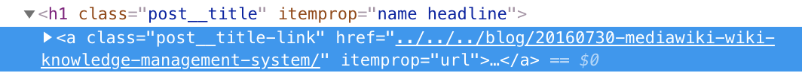
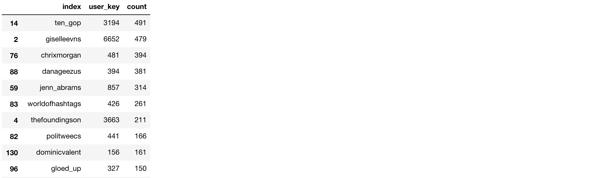
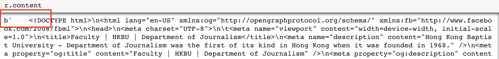
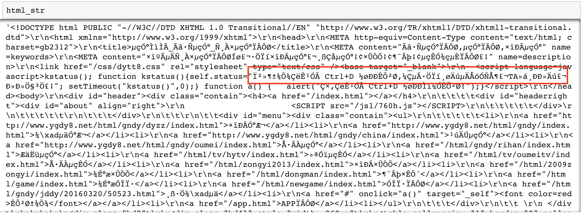
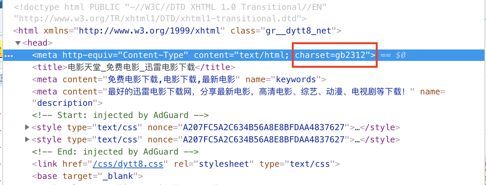
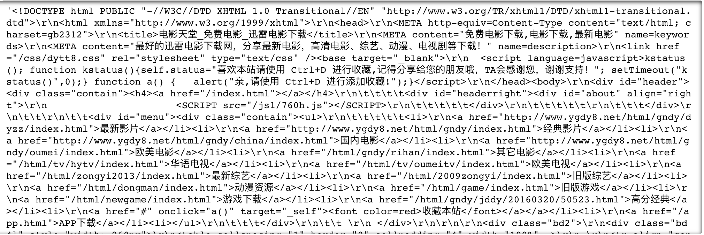
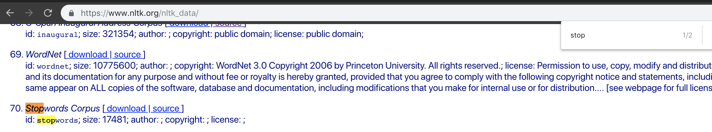
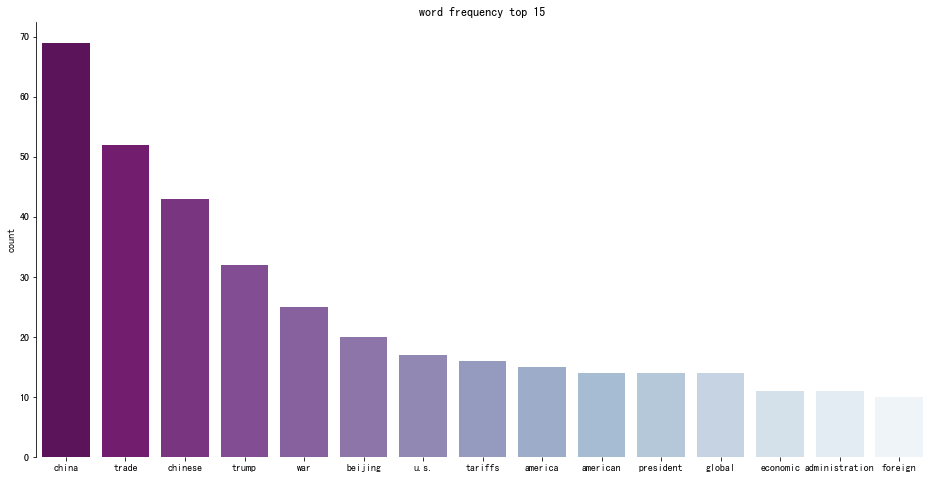

# Week 10: Text data

<div id="toc">

<!-- TOC -->

- [Week 10: Text data](#week-10-text-data)
    - [Text processing](#text-processing)
        - [String functions recap](#string-functions-recap)
            - [Case 1: Get full URL from HTML A tag's href attribute](#case-1-get-full-url-from-html-a-tags-href-attribute)
            - [Case 2: Substring matching and substitution](#case-2-substring-matching-and-substitution)
            - [Case 3: Most frequent names in tweets](#case-3-most-frequent-names-in-tweets)
        - [encode and decode](#encode-and-decode)
        - [String matching and Regular Expression (RegEx)](#string-matching-and-regular-expression-regex)
            - [RegEx case 1: match Twitter username from tweets](#regex-case-1-match-twitter-username-from-tweets)
            - [RegEx case 2: match telephone numbers in a piece of text](#regex-case-2-match-telephone-numbers-in-a-piece-of-text)
            - [Bonus: Text substitution](#bonus-text-substitution)
            - [RegEx in shell](#regex-in-shell)
    - [Word frequency](#word-frequency)
        - [Use dict to count the words frequency](#use-dict-to-count-the-words-frequency)
        - [Use pandas.series.value_counts()](#use-pandasseriesvalue_counts)
        - [Stopwords](#stopwords)
            - [Set stopwords](#set-stopwords)
            - [Remove stopwords](#remove-stopwords)
        - [Visualize word frequency](#visualize-word-frequency)
            - [with bar chart](#with-bar-chart)
            - [with tag cloud](#with-tag-cloud)
    - [Word segmentation](#word-segmentation)
        - [jieba for Chinese](#jieba-for-chinese)
        - [How to add new terms to the wordseg dictionary](#how-to-add-new-terms-to-the-wordseg-dictionary)
        - [How to adjust term weight in the wordseg dictionary](#how-to-adjust-term-weight-in-the-wordseg-dictionary)
    - [Bonus: TF.IDF](#bonus-tfidf)
    - [Bonus: Topic model](#bonus-topic-model)
    - [Bonus: Sentiment analysis](#bonus-sentiment-analysis)
    - [Bonus: word2vec](#bonus-word2vec)
    - [Further readings](#further-readings)

<!-- /TOC -->

</div>

<!-- NOTE: new outline begin -->

## Text processing

### String functions recap

Outline:

- split
- replace
- join
- format
- find
- slicing (`:`)

#### Case 1: Get full URL from HTML A tag's href attribute

To Scrape Initiumlab articles' urls, which we used as an example in [chapter 5](https://github.com/hupili/python-for-data-and-media-communication-gitbook/blob/master/notes-week-05.md#scrape-all-articles-of-one-page)

* Using `split + slice + format`

When scraping certain elements in webpage, the elements sometimes are folded or shorted, we need to split to different parts, use list slicing to get the part we want and re-format the strings we want.  For example:



the article url we get is `"../../../blog/20160730-mediawiki-wiki-knowledge-management-system/"`, but what we expect is this`"http://initiumlab.com/blog/20160730-mediawiki-wiki-knowledge-management-system/"`. We can format the new string by the following method.

```python
s = "../../../blog/20160730-mediawiki-wiki-knowledge-management-system/"
s = s.split('/blog')
#s
s1 = s[-1]
#s1
s2='{0}{1}'.format('http://initiumlab.com/blog',s1)
#s2
```

#### Case 2: Substring matching and substitution

Check out certain words in a string, replace certain words and separate the words with some notations.

* Using `find + replace + join`

In certain occasion, we need to check out whether there is one word in the string, and need to replace the word.

```python
s = "this is string example....this is the string we will test, is it"
s.find('string')
#output: 8, the position of the first characters
s.find('python')
#output: -1, it will return -1 if there is no this word in the string
s.replace("is", "was") #replace all
#output: 'thwas was string example....thwas was the string we will test, was it'
s.replace("is", "was", 3) #replace first 3
#output: 'thwas was string example....thwas is the string we will test, is it'
s2 = s.split(' ')
'|'.join(s2) #you can add different things in the string
#output: 'this|is|string|example....this|is|the|string|we|will|test,|is|it'
```

#### Case 3: Most frequent names in tweets

Apply a function onto every element of the dataframe - Check out the most frequent names in the tweets text

* Using `str.lower()` + `in` operator + `pandas.apply()`

Exercise with the Tweeter Troll Data, you can download [here](https://raw.githubusercontent.com/hupili/python-for-data-and-media-communication/master/text-analysis/regular_reader_tweets.csv).

1. Check out times that certain name appears in the dataset.

```python
#import and check out the dataset
import pandas as pd
df = pd.read_csv('regular_reader_tweets.csv')
#len(df)
#df.sample(10)

#check certain user name in the text
def check_name(x):
    return 'ten_gop' in str(x).lower()
df['text'].apply(check_name).value_counts()
#return results true only
#df['text'].apply[check_names].value_counts()[True]
```

Output:

```text
False    202991
True        491
Name: text, dtype: int64
```

2. Check out the most common names in the tweet text.

```python
# filter out all the user and reset to dataframe
s_user = df['user_key'].value_counts()
df_users = s_user.reset_index()
#df_users

# count_retweeted_number of all the users with apply function
def count_retweeted_number(name):
    def check_name(x):
        return name in str(x).lower()
    return df['text'].apply(check_name).value_counts().get(True, 0)

df_users['count'] = df_users['index'].apply(count_retweeted_number)
df_users.sort_values(by='count', ascending=False)
```

Output:



### encode and decode

- UTF-8
- GBK

`UTF-8` is the most widely used implementation of Unicode on the Internet, while `GBK` is mainly used for coding Chinese character.

When scraping the webpage, the results of `r.text` & `r.content` is different. Let's get straight of their relationships.

```python
url = 'http://www.jour.hkbu.edu.hk/faculty/'
r = requests.get(url)
r.text
```

This is the results of `r.text` its a string.


```python
r.content
```

This is the results of `r.content` its a byte.


The conversion between string and byte is as follows:

- byte to string: `r.content.decode()`. Pass the decode method like `gbk` into the bracket.
- string to byte: `r.text.encode()`. Pass the encode method like `utf-8` into the bracket.

Why we need to convert between two types?

When scraping one webpage, we need to get the `string` type so that we can use `BeautifulSoup` to parser the string and extract the value we want. Therefore, usually, we just use `r.text` is enough.

But if the website use other encoding methods than `utf-8`, like `gbk`, we need to decode the content first. In such circumstance, using `r.content.decode()` to get the string. Usually, we can get the website encoding method in their html `meta` tag.

Another method to solve the encoding problem is making a statement at the beginning like the following.

```python
r = requests.get('http://www.jour.hkbu.edu.hk/faculty/')
r.encoding = 'utf-8' #using this line, change the encoding method corresponding to their webpage encoding method
data = BeautifulSoup(r.text,"html.parser")
```

Case1: You can refer [Chapter 6 - encoding for another example](notes-week-06.md#encoding). 

Case2 : scraping Chinese websites like `电影天堂`.

```python
url = 'https://www.dytt8.net/'
r = requests.get(url)
html_str = r.text
```



You will find the results is messy because the website is using `gb2312` method to encode the html, which is kind of `GBK` methods.



Therefore, we need to firstly decode the content.

```python
html = r.content.decode('gbk')
html
```



After decoding, the Chinese characters can display appropriately. And when writing data into csv, you can use a more widely used method `utf-8` to encode it.

```python
with open('dy.csv','a',newline='',encoding='utf-8') as f:
    writer = csv.writer(f)
    ...
```

### String matching and Regular Expression (RegEx)

The `.find()` and `in` operator on `str` has limited matching capability. They can only perform precise matching. What if we want to do fuzzy matching? Common siutations:

1. Find all the user names from the Twitter message. i.e. those look like `@xxxx `, i.e. start with `@` and end with ` ` (blank).
2. Find all the phone numbers from a paragraph of texts.

RegEx can solve those problems in a very concise way. We show you the power of RegEx in following subsections. Once you decide to move further, the [official doc on re](https://docs.python.org/3/library/re.html) is a good source for you to further study RegEx.

#### RegEx case 1: match Twitter username from tweets

Here's the solution for question 1.

```python
>>> tweet = '@tom @jacky and @will, please come to my office at 10am.'
>>> import re
>>> pattern = re.compile(r'@[a-zA-Z0-9]+')  # pattern of the Twitter username
>>> pattern.findall(tweet)
['@tom', '@jacky', '@will']
```

The key of learning RegEx is to learn the pattern string, i.e. `@[a-zA-Z0-9]+` in the above example. Let's decode this pattern as follows:

- `@` - matches a single `@` character.
- `[]` - is a collection notation, matching the current position to any valid character in this collection.
  - In our example, the collection is composed of
    - All characters from `a` to `z`, and from `A` to `Z`, and from `0` to `9`.
    - The hyphen `-` here is a notation to specify a range of characters.
- `+` - is a repetition number, meaning matching one or more characters using the preceding pattern character
  - The preceding pattern character is a collection, i.e. `[a-zA-Z0-9]`.

To sum it up, the above RegEx pattern can match all any substring that starts with a `@` character and then followed by one or more alphanumeric characters.

#### RegEx case 2: match telephone numbers in a piece of text

Learning RegEx is like learning a new language. It is very easy to match the pattern you want. However, it may be difficult to exclude things that you don't want to match. Let's give a demo using question 2. The first trial would be:

```python
>>> introduction = 'Student usually can enrol up to 16 courses in 1 semester. If you want to enrol in more courses, please contact Ms A at 34119999 or Mr B 34119998'
>>> pattern = re.compile(r'\d+')
>>> pattern.findall(introduction)
['16', '1', '34119999', '34119998']
```

In this pattern, `\d` means the collection of numbers, i.e. `[0-9]`. The `+` specifies a repetition count of one or multiple. You can see that all the numeric substrings are extracted. However, not all of them are telephone numbers. Given a bit domain knowledge, we know that the phone numbers in Hong Kong have 8 digits. So we can adjust our pattern to use a repetition number of `{8}`:

```python
>>> pattern = re.compile(r'\d{8}')
>>> pattern.findall(introduction)
['34119999', '34119998']
```

The pattern works at present, but does not work when the text includes other 8-digit non telephone number substrings:

```python
>>> introduction = 'Student usually can enrol up to 16 courses in 1 semester. If you want to enrol in more courses, please contact Ms A at 34119999 or Mr B 34119998. Students who enrol in extra courses will be charged 12345678 dollar per course.'
>>> pattern = re.compile(r'\d{8}')
>>> pattern.findall(introduction)
['34119999', '34119998', '12345678']
```

The tuition fee is also match because our pattern is not precise enough. In order to fix this problem, we need to further apply our domain knowledge. We know that HKBU's telephone numbers start with `3411`. So we can revise our pattern and get following result:

```python
>>> pattern = re.compile(r'3411\d{4}')
>>> pattern.findall(introduction)
['34119999', '34119998']
```

The pattern is to match any 8 character string that starts with "3411" and ends with any four digits. The curious readers may ask: what if the tuition fee is "34113411 dollar"? As you guess, the above pattern fails. How to refine? The short answer is that there is no ultimate way. As long as "34113411" itself is a valid telephone number, we can hardly exclude it from our matching by just looking at itself. 

This issue is quite common text processing, or further more **Natural Language Processing (NL)**. The token itself is not enough for us to understand its meaning. One similar example is: "Apple is good". We are not sure if "the Apple" that produces iPhone is good; or apple, as a fruit, is good. We human being needs context in order to understand this sentence. So is computer. This discussion is beyond our curriculum. Interested readers can search for "NLP".

Back to our focus on basic pattern matching, we can conclude that it is easy to match the things one want using RegEx, but rather difficult to fully exclude other unwanted stuffs. When building your RegEx solution, you usually starts with a collection of **cases**. You keep on adding new cases to the collection and test them with your RegEx pattern. You may need to refine multiple times in order to find the one that works well on your dataset.

#### Bonus: Text substitution

RegEx can let you substitute some matching parts. This is very similar to the `str.replace` function but does more than that. It even allows one to interpolate variables using values from matching part.

Suppose the university decides "3411" is a bad prefix and "8888" sounds good. How do we change all the numbers? Checkout following solution:

```python
>>> pattern = re.compile(r'3411(\d{4})')
>>> re.sub(pattern, r'+852 8888-\1', introduction)
'Student usually can enrol up to 16 courses in 1 semester. If you want to enrol in more courses, please contact Ms A at +852 8888-9999 or Mr B +852 8888-9998. Students who enrol in extra courseswill be charged 12345678 dollar per course.'
```

Besides changing the telephone prefix, we also added the country code and a hyphen between university prefix and the phone number. Note how this happens:

- `()` is called a "group" in RegEx. The brackets do not match any character. However, patterns inside a pair of brackets are of the same group. The match substring will be put in the same group for further reference.
- `\1` means the first group. There could be multiple groups matched by one pattern. You can use `\n` notation to refer to the `n`-th group. `\0` means the entire string.

#### RegEx in shell

Following commands can be used to perform RegEx operation. Those commands sometimes can make your work more efficient.

- `grep`
- `egrep`
- `fgrep`

## Word frequency

Word frequency refers to the number of times a list of given word appears in the file, which gives you a quick overview of the top words in one text data and help find the news point for further analysis.

### Use dict to count the words frequency

```python
words_list = meaningful_words #the list of words you have
dict_words_frequency={}
for n in words_list:
    dict_words_frequency[n]=words_list.count(n)
#dict_words_frequency
```

### Use pandas.series.value_counts()

Use the [assignment 1](https://github.com/hupili/python-for-data-and-media-communication-gitbook/blob/master/assignments.md#assignment-0----bridging-assignment-for-language-efficiency) as an example:

```python
import os
import pandas as pd
  
def read_txt(path): #read files and get content
    all_text = []
    for file in os.listdir(path):
        f=open(file,"r+",encoding="utf8",errors="ignore")
        contents= f.read()
        all_text.append(contents)
    all_words = "".join(all_text)
    return all_words

words = read_txt("text/") #pass your own file path that include list of .txt
words = words.split()
word_count = pd.Series(words).value_counts().sort_values(ascending=False)[0:15]
word_count
```

Output:

```text
the        327
to         187
of         149
and        132
a          124
in          99
that        68
is          58
as          53
on          52
China       50
with        49
US          47
trade       47
Chinese     43
```

You can find that the above word frequency list is not so good because there are many meaningless words,like `the`, `to`... Those are generally we called `stopwords`.

### Stopwords

>Stop words are words which are filtered out before or after processing of natural language data (text). *From [wiki](https://en.wikipedia.org/wiki/Stop_words)*

The stopwords may change when handling different text analysis cases. We can get stopwords from the open source channel or customize your own stopwords.

#### Set stopwords

1. You can download the `stopwords.txt` from the internet and load when you used, [example](https://github.com/stanfordnlp/CoreNLP/blob/master/data/edu/stanford/nlp/patterns/surface/stopwords.txt).

```python
filepath = './stopwords.txt'
stopwords = [line.strip() for line in open(filepath, 'r', encoding='utf-8').readlines()]
```

2. import stopwords from `nltk` library

```python
import nltk
from nltk.corpus import stopwords
nltk.download('stopwords')
stopwords = stopwords.words('english')
```

**Note:** According to our helpers feedback, Windows users can successfully set stopwords with this method, for Mac users, you need to visit their [website](https://www.nltk.org/nltk_data/), search `stopwords` and download.



Then put the language txt file in the current folder where your Jupyter notebook are.

3. import stopwords from `pypi`

For installation and documentation, you can refer [here](https://pypi.org/project/stop-words/
), they provide a diverse languages of stopwords.

4. Customize your own stopwords

You can add new stopwords by the case need.

```python
stopwords = ['a','b'] #the original stopwords list
newstopwords = ['stopword1','stopword2']
stopwords.extend(newstopwords)
```

#### Remove stopwords

Following the above example:

```python
words = ['a','like','media','b']
processed_word_list = []
#assume you've already get a list of words  
for word in words:
    word = word.lower() # in case they are not all lower cased
    if word not in stopwords:
        processed_word_list.append(word)
#processed_word_list
#['like', 'media']
```

### Visualize word frequency

#### with bar chart

```python
#you can use other visualization library
import seaborn as sns
import matplotlib.pyplot as plt 
def word_count(processed_word_list):
    word_count = pd.Series(processed_word_list).value_counts().sort_values(ascending=False)[0:15]  
    fig = plt.figure(figsize=(16,8))  
    x = word_count.index.tolist()  
    y = word_count.values.tolist()  
    sns.barplot(x, y, palette="BuPu_r")  
    plt.title('word frequency top 15')  
    plt.ylabel('count')  
    sns.despine(bottom=True)  
    #plt.savefig('./word_count_bar.png',dpi=400)  
    plt.show()

word_count(processed_word_list)
```



#### with tag cloud

Tag cloud is commonly used, for aesthetics purpose. However, it is not a precise presentation of the data.

```python
from PIL import Image
import wordcloud
import numpy as np

def tag_cloud(text):
    mask = np.array(Image.open('newspaper.png')) #set mask, you can change to the picture you like, but it must have a high color contrast
    wc = wordcloud.WordCloud(mode='RGBA',background_color='white',max_words=2000,stopwords=stopwords,max_font_size=300,random_state=42,mask=mask)
    wc.generate_from_text(' '.join(text))
    plt.figure(figsize=(12,12))
    plt.imshow(wc, interpolation='bilinear')
    plt.axis("off")
    plt.title('word frequency top 15 tag cloud', loc='Center', fontsize=20)
    plt.show()
    return plt.show()

tag_cloud(words)
```


## Word segmentation

### jieba for Chinese

For english words, its easy to segment words, just by the blank space between the words. But for Chinese words, its more complicated, because there is no blank space in Chinese sentence and the combination of the characters in one sentences may diverse too. In order to handle this situation, `jieba` is the most useful libraries we can get out here, which is a Chinese specialized word segmentation module.

Install and import:

```python
!pip3 install jieba
import jieba
```

Basic usage:

```python
s = '我在浸会大学学python'
jieba.cut(s)
#output: <generator object Tokenizer.cut at 0x10f3a3048>
list(jieba.cut(s)) #turn it into list
#['我', '在', '浸会', '大学', '学', 'python']
```

Case1: Cut an article, you can download the article [here](assets/trade-wars-zh.txt).

```python
import jieba
text = open('trade-wars-zh.txt',"r").read()
#cut words
words = jieba.cut(text)
#set stopwords
filepath = 'stopwords.txt'
stopwords = [line.strip() for line in open(filepath, 'r', encoding='utf-8').readlines()]
#remove stopwords
processed_word_list = []
for word in words:
    if word not in stopwords and len(word)>1: #remove single word
        processed_word_list.append(word)

#processed_word_list
```

### How to add new terms to the wordseg dictionary

Example 1: Customize your own words dict

For basic needs, using `suggest_freq(segment, tune=True)` and `add_word(word)` are recommended.

```python
print('/'.join(jieba.cut('特朗普已经准备好对所有进口美国的中国商品征收关税')
#中国/已/表示/计划/对/美国/的/任何/贸易壁垒/进行/报复/。
jieba.suggest_freq(('贸易', '壁垒'), True)
print('/'.join(jieba.cut('中国已表示计划对美国的任何贸易壁垒进行报复。')))
#中国/已/表示/计划/对/美国/的/任何/贸易/壁垒/进行/报复/。
jieba.add_word('贸易壁垒')
print('/'.join(jieba.cut('中国已表示计划对美国的任何贸易壁垒进行报复。')))
#中国/已/表示/计划/对/美国/的/任何/贸易壁垒/进行/报复/。
```

Example 2: Ambiguous word segmentation

1. 如果 & 果汁

```python
s1 = '狮子山的山泉水如果汁一般好喝'
'/'.join(jieba.cut(s1))
#'狮子山/的/山泉水/如果/汁/一般/好喝'
jieba.suggest_freq(('如', '果'), True)
'/'.join(jieba.cut(s1))
#'狮子山/的/山泉水/如/果汁/一般/好喝'
```

2. 乒乓球拍 卖完了& 乒乓球 拍卖完了

```python
s2 = '乒乓球拍卖完了'
'/'.join(jieba.cut(s2))
#'乒乓球/拍卖/完/了'
jieba.add_word('乒乓球拍')
jieba.suggest_freq(('拍', '卖'), True)
#'乒乓球拍/卖完/了'
```

For a complicated cases, you can refer [here](https://blog.csdn.net/qq_30262201/article/details/80128076) to customize your own words dict.

### How to adjust term weight in the wordseg dictionary

## Bonus: TF.IDF

- `TF` - Term Frequency
- `IDF` - Inverse Document Frequency
- `TFIDF` = `TF * IDF`

TFIDF is a measure of (a term's importance to a document) in (a collection of documents), called "corpus". We put the previous sentence in brackets so that it is easier to read. The rationale is very straight forward:

- TF -- importance to a specific document -- the more one term appears in one document, the more important it is to the document.
- IDF -- importance in a collection of documents -- if a term appears too frequently in all documents, e.g. stop words, it does not carry much importance to the current document.

[Read more](https://en.wikipedia.org/wiki/Tf%E2%80%93idf)

## Bonus: Topic model

Topic model is a typical example of machine learning: discover meaningful lower dimension space out of higher dimension observations. The higher dimension space is called data space. The lower dimension space is called latent space. The basic assumption is that, despite the complexity of text/ human language, the intrinsic structure is simple. The texts we observe are just statistical variables generated from the intrinsic structure.

Consider two courses about data journalism:

1. The data analysis course, e.g. [current course](https://github.com/hupili/python-for-data-and-media-communication-gitbook/)
2. The data visualization course, e.g. [http://datavis.studio](http://datavis.studio)

We know the "topic" of the two courses are different. How can we tell? If we check out the word frequency of the two course, we may find that:

1. Frequent terms: Data, scraper, web, Python, jupyter, pandas, numpy, matplotlib, ...
2. Frequent terms: Data, Javascript, CSS, HTML, web, responsive, bootstrap, echart, ...

By looking at the two different lists, we can tell they are of different topics. Computers can also recognise topics in a similar way. In a usual topic modeling procedure, we start with a matrix composed of "document vectors". The vector has a coordinate system using all the potential terms, so every element in the vector represents an intensity of this term in the document. A "topic vector" has the same shape of a "document vector" -- a collection of terms with different weights. Some terms may be stronger indicator of certain topic, like "Python" and "Javascript" in above example. Some other terms may be a weaker indicator, like "web" in above example, where one course emphasize more on "web scraping" and another course emphasize more on "responsive web". In the technical language, "topic vector" is a (mostly "linear") combination of "document vectors". The number of topics is much less than the number of documents, which can be told from the original rationale:

- We have many documents but only a few topics
- The intrinsic structure (number of docs) is much simpler than the observations (documents)

Here is a [tutorial](https://towardsdatascience.com/topic-modelling-in-python-with-nltk-and-gensim-4ef03213cd21) of topic mining using `nltk` and `gensim`. The algorithm used is called LDA.

## Bonus: Sentiment analysis

The task of sentiment analysis is to get polarity and subjectivity from a piece of text. Polarity can be positively mooded or negatively mooded. Subjectivity can be subjective or objective. It finds good applications in media monitoring. When a crisis emerges, you may want to know how the public reacts to the incident. With massive data from the social network and real-time sentiment analysis, one can devise a better PR strategy.

The procedure of sentiment analysis usually starts with a collection of positive terms and a collection of negative terms. If one piece of text contains more positive terms, it is likely to be an overall positive statement; Vice versa. How to get the collection of positive or negative terms? We usually start with human labels on some training texts. After human judges the sentiment of the training texts, we throw them to the computer. The computer builds the term collection using the collection that if one term appears frequently in a positive statements, that term is likely to be positive; Vice versa.

The above is just an intuition of sentiment analysis. The real work involves more sophisticated statistical models. You may not be able to fully understand them but following are some pointers for you to get working codes:

- Construct classifier using `sklearn`. Checkout the [tutorial](https://towardsdatascience.com/sentiment-analysis-of-tweets-using-multinomial-naive-bayes-1009ed24276b).
- Online API like [text-processing](http://text-processing.com/docs/sentiment.html).
- `TextBlob` is also useful and applied in [group 2's work](https://dnnsociety.org/2018/03/02/using-big-data-to-figure-out-how-fair-china-daily-news-is/).

## Bonus: word2vec

word2vec is a set of algorithms to perform "word embedding". It is similar to "topic modeling" in terms of the structure:

- Topic modeling - A document is represented by a (linear) combination of topics; A topic is represented by a (linear) combination of terms.
- Word embedding - A document is represented by a variable length sequence of words; A word is represented by a lower-dimension vectors; the element of word vectors may not have physical interpretation.

The upside of word embedding is to enable vector arithmetics like `king−man+woman=queen`. Also, the word vector can be computed offline (pre-computation). That makes it easier to handle new documents.

Checkout [Wikipedia](https://en.wikipedia.org/wiki/Word2vec) for background information and [this blog](https://www.datacamp.com/community/tutorials/lda2vec-topic-model) for a quick tutorial on LDA (topic model), word2vec and LDA2vec.

## Further readings

1. [Unicode, ASCII,UTF-8 and GBK](https://jdhao.github.io/2018/01/28/unicodede-utf8-gbk/)

------

If you have any questions, or seek for help troubleshooting, please [create an issue here](https://github.com/hupili/python-for-data-and-media-communication-gitbook/issues/new)
