# Special data type: Text, time series, graph, geographical

<div id="toc">

<!-- TOC -->

- [Special data type: Text, time series, graph, geographical](#special-data-type-text-time-series-graph-geographical)
    - [Text](#text)
    - [Check the information in terminal](#check-the-information-in-terminal)
    - [Simple steps to start Jupyter notebook in terminal](#simple-steps-to-start-jupyter-notebook-in-terminal)
        - [4 Steps](#4-steps)
        - [New](#new)
        - [Install modules in jupyter](#install-modules-in-jupyter)
    - [For loop](#for-loop)
        - [Range\(\)](#range\\)
        - [Append VS Extend](#append-vs-extend)
    - [Verify every step -splinter python](#verify-every-step--splinter-python)
        - [Fail to save content](#fail-to-save-content)
        - [Resolution splinter](#resolution-splinter)
        - [Exercise Tweeter Troll Data](#exercise-tweeter-troll-data)
        - [Download the file](#download-the-file)
    - [Dataframe](#dataframe)
        - [Apply a function onto every element of the dataframe.](#apply-a-function-onto-every-element-of-the-dataframe)
        - [Convert text by str(),lower()](#convert-text-by-strlower)
        - [Use the previous step as a filter](#use-the-previous-step-as-a-filter)
        - [Find the most one retweeted - by function.](#find-the-most-one-retweeted---by-function)
        - [Apply the function into all the names](#apply-the-function-into-all-the-names)
            - [Try1 Fail](#try1-fail)
            - [Try2 change the name as the value of the Series](#try2-change-the-name-as-the-value-of-the-series)
            - [Try3 succeed](#try3-succeed)
        - [Save time](#save-time)
        - [Calculate the frequent terms](#calculate-the-frequent-terms)
            - [Get text](#get-text)
            - [Word count](#word-count)
            - [Stop word](#stop-word)
            - [Word cloud](#word-cloud)
            - [Jieba](#jieba)
            - [Pandas plotting](#pandas-plotting)
    - [Time series](#time-series)
    - [Graph](#graph)
    - [Basic preparations](#basic-preparations)
        - [Pip install all the modules by one step](#pip-install-all-the-modules-by-one-step)
        - [Jupyter display to show the picture](#jupyter-display-to-show-the-picture)
        - [Markdown to show a picture](#markdown-to-show-a-picture)
        - [HTML link](#html-link)
    - [Graph](#graph-1)
        - [Count the edge](#count-the-edge)
        - [Network example](#network-example)
        - [Get data by json](#get-data-by-json)
        - [Visualization Spring layout](#visualization-spring-layout)
        - [Color specific nodes](#color-specific-nodes)
        - [Shortest path](#shortest-path)
        - [Centrality Measures](#centrality-measures)
        - [Structure degree](#structure-degree)
        - [Clustering coefficient](#clustering-coefficient)
        - [Cliques part of the graph](#cliques-part-of-the-graph)
        - [Connected components](#connected-components)
        - [Community detection](#community-detection)
        - [Color the nodes](#color-the-nodes)
    - [Time series](#time-series-1)
    - [Geographical data](#geographical-data)

<!-- /TOC -->

</div>


## Text

----

Following content is from week7 of S18 offering. Unorganised yet.

## Check the information in terminal

* `which pip3`is to learn where is pip3 in your computer. You can also input `which pip`to know the location of pip.

* `ls -l` means to list the files in the mode of listing with details.  
    
  From the above screenshot, you can find that Python equals to python3.6 and the same as python3. Pip does not equal to pip3.

* `cat` to check the content to verify if they are the same.  
    
  Obviously, they are the same.

* You can also drag the pip file and pip3 file into the Visual Studio Code,after you use `which` to know their location.

## Simple steps to start Jupyter notebook in terminal

### 4 Steps

* Step1  
  `pyvenv venv` means create a virtual environment\(venv\) folder called 'venv'. You can change the folder's name as you like, like `pyvenv BIGDATA`.  
    Be careful where you create the folder.

* Step2  
  `source venv/bin/activate` means activate the virtual environment. Then you will see the '\(venv\)',which means you are in a virtual environment.  
    
  You can `deactivate` the virtual environment.

* Step3

  ```
  pip install jupyter
  pip install requests
  ```

* Step4  
  `Jupyter notebook` to open notebook.

### New

* If you are in the same computer, or on your own laptop, you don't need to totally follow the 4 steps.

* Pili's virtual environment folder is 'environment'. So if he restart his computer, he can just

  ```
  source enviroment/bin/activate
  Jupyter notebook
  ```

  

### Install modules in jupyter

* You can just pip install packages in jupyter notebook.
  

## For loop

### Range\(\)

* Function 'Range' has 3 parameters. From XX to XX with the step size XX.  
  The 3rd parameter is the step size. If you don't input the 3rd one, it will take 1 in default.
   

*  The parameters can be negative.
    
  

* 'i' is defined in the whole coding,from the beginning of 'import' to the end of the coding, not only inside for loop.

* If you define sth inside the `def`, the definition will only work inside the def.

### Append VS Extend


* In the for loop, i will be 10, 8 then 6 and 4 at last. Only the last value is left.


* `append` means add. Every time you have an 'i', you add it into the 'pages' list.


* `append` means that the whole list is appended as an element, or one item.

* `extend` means extract the items and add those items into the new list.

## Verify every step -splinter python

### Fail to save content


```
r=requests.get('XXXXthe website')
```
The above step is OK.

```
 r.text
 open('mypage','w').write(r.text)
```

* Then you can find a file.  

  
If you open it, you will find that
  
It is blank, which means the file you save is blank.  
SO try to verify everything step by step.

### Resolution splinter

Splinter is a browser to emulate a real person. So the website won't know whether you are a man or a robot.  


You can google to learn that.

### Exercise Tweeter Troll Data

* Pili's Github  
  [https://github.com/hupili/python-for-data-and-media-communication](https://github.com/hupili/python-for-data-and-media-communication)

* Exercise Data:  
  [https://github.com/hupili/python-for-data-and-media-communication/blob/master/w7-text/Twitter Troll data from NBC \(nltk\).ipynb](https://github.com/hupili/python-for-data-and-media-communication/blob/master/w7-text/Twitter Troll data from NBC %28nltk%29.ipynb)

* Research get those deleted data from archive.

### Download the file

* `Control + right click` the 'save the file\(link\) as ...'.  
  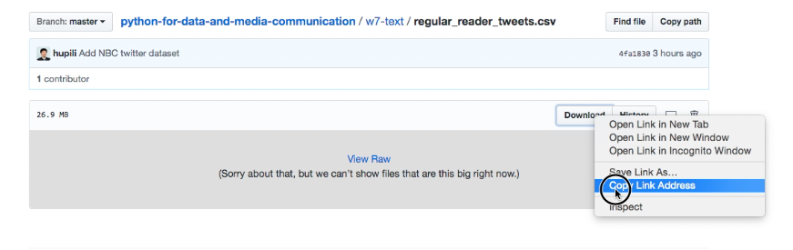

* Drag that into our working folder or just download into the folder.  
  

## Dataframe

  ```
  import pandas as pd
  df= pd.read_csv('XXXXXXXXXXXXXX.csv')
  ```

  

* It can also be opened by '[https://XXXX](https://XXXX) links'.

  ```
  import pandas as pd
  df= pd.read_csv('https://XXXXXXXXXXXXXXXXX')
  ```

  ```
  df.sample(10)
  ```

    
  It means it randomly print 10 samples. It is useful when your dataset is very large, which will be slow to run the code.

  ```
  df['user_key'].value_counts()
  ```

    
  Count the popular users. They post largest number of messages.

  ```
  'a' in 'am'
  ```

  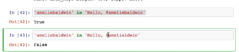  
  `in` is to check if it is contained in the text.

```
  'abc'.find('b')
```

  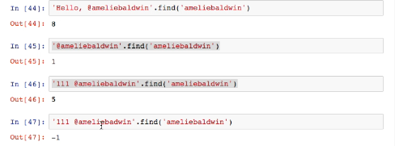  
  It shows the index, which starts from 0. You can see from \[46\], space is also contained. And '-1' means the last one.

### Apply a function onto every element of the dataframe.

  ```
  df.apply()
  ```

    
  

* `def` is to define a function called check\_name, which checks if 'amXXX' in x. If it is true, it will return 'amXXX'.

* x is just a variable.

* `apply` to make the function work for all the 'text' in the dataframe. In other words, x='text' in the example.

* There is an error in the second line. There are some dirty data in 'text'.

### Convert text by str(),lower()

  ```
  str(x)
  ```

  

  ```
  .value_counts()
  ```

    
  It is to check how many times it appears. And they are the same, which means there are some errors.

 ```
  lower()
  upper()
  ```

  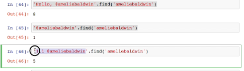  
  

### Use the previous step as a filter
 
```
df[df['XXX'] ]
```

    
  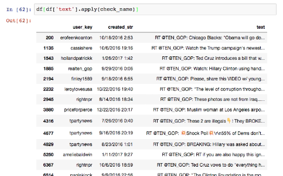

* \[61\] is a filter. Now it works. We successfully find out how many times they are retweeted.

```
df['text'].apply[check_names].value_counts()[True]
```


* We extract the True.

### Find the most one retweeted - by function.

  ```
  def check_name(x):
    retutn 'ten_gop' in str(x).lower()
  df['text'].apply[check_names].value_counts()[True]
  ```

  It is the previous step.

  ```
  def count_retweeted_number(name):
    def check_name(x):
        retutn 'name' in str(x).lower()
    return df['text'].apply(check_name).value_counts()[True]
  ```

  

* Now we write the previous one into a function. In the inside function, we change 'x' into 'name'.

  ```
  count_retweeted_number('XXX')
  ```

  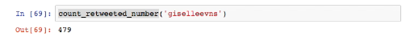

### Apply the function into all the names

#### Try1 Fail

* `df['user_key']`  
  

    
  It is a Series.

 ```
  s_user=df['user_key']
  ```

  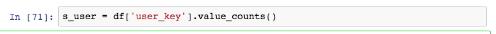  
  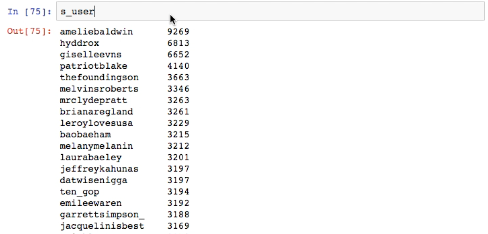  
  The `value_counts` is just to show you how many times they appear. 's\_user' is just like a dictionary.

 ```
  s_user.apply(count_retweeted_number)
  ```

    
  `apply` is a function which only works for the values.  
  Apply the function into all the 'user\_key'. But there is an error. Because we are applying on the values of the 's\_\_user',  which is obviously integers in \[75\].  So we have to change the name as the value of the Series. Then we can apply to the names.

#### Try2 change the name as the value of the Series

  ```
  s_user.index
  s_user.values
  ```

    
  It is to check the index and values. They are correspond to each other.

  ```
  s_user.to_frame.reset_index()
  ```

    
  `to_frame` is to change Series into Dataframe.  
  `reset_index` is to add an index. Then the formal index will be change into a value, whose column name is 'index'.

  ```
  df_user['index'].apply()
  ```

    
  
  

* The error is in the picture below:  
  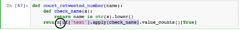  
  In this step, if the answer is false, there will be an error.

#### Try3 succeed

* As we write before:

  ```
  s_user=df['user_key']
  ```


  ```
  .get()
  ```

    
    
    
    
  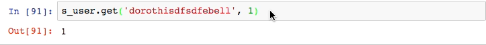

  \[87\] is something appear in the content.  
  \[88\] is the same.  
  \[89\] does not exist in the content.  
  \[90\] and \[91\] means we change the return of the 'false'. In default, it is empty. We can change it in the 2nd parameter. It is better to set it as 0 in this example.

  ```
  .get(True,0)
  ```

  

  ```
  sort_values(by='user_key',ascending=False)
  ```

    
  We can find out who tweeted the largest number of tweets.

  ```
  sort_values(by='count',ascending=False)
  ```

    
  We can find out who is retweeted most.  
  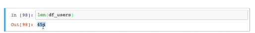  
  So it will execute 454 times. It really takes a long time to finish the whole code.

### Save time

* You can interrupt it.  
    
  

* You can run the top20.  
    
  

### Calculate the frequent terms

#### Get text

   
    
    
 Get the text.

  ```
  .split()
  ```
  
    
    
    
  Split by space or comma.

  ```
  [:10]
  ```

    
  Get the formal 10 items' text.

  ```
  extend()
  ```

    
  Split the formal 5 items' text and split them by space. Then extract the items and add the items into list 'all\_text'.

*  If we run for whole text, cancelling '\[:5\]'. There is an error.  
    
   We have to change the text into str.

#### Word count

    
  

  ```
  pd.Series()
  ```

    
    
  Convert 'word count' into a Series, and reset index.

  ```
  .to_frame().reset_index()
  ```

    
  Convert into a dataframe.

  ```
  sort_values(ascending=False)
  ```

    
  They are not informative, as there are so many 'stop-words'. We can delete those words manually.

  ```
  set(['RT', 'the', 'of'])
  ```

    
  `set` is more efficient for the integers to check in or not in.

* You can search google you can find 'stop word' resources.

* NLTK:   
  

#### Stop word

  


* Step1

  ```
  def is_stop_word(x):
  return x in stop_words
  ```

* Step2

  ```
  df_wrod_count[df_word_count['index'].apply(is_stop_word)]
  ```

* Step3

  ```
  .sort_values(by=0,ascending=False)
  ```

* Step4

  ```
  is not stop
  ```

  

#### Word cloud


*  
   

#### Jieba


  ```
  jieba.cut()
  ```

  

*  It means we have to change it into a list.  


#### Pandas plotting

* Please learn to learn from others by google.

* Pandas can be more powerful than excel.First of all,let's start from the excel function.

## Time series

**TODO**: Organise concept notes here.

At present, you can refer to those
[notebooks from S18 class](https://github.com/hupili/python-for-data-and-media-communication/tree/a4922340f55c4565fff19979f77862605ac19f22/w8-datetime).

## Graph

## Basic preparations

### Pip install all the modules by one step

* First of all, download the requirements.txt from  [https://github.com/hupili/python-for-data-and-media-communication](https://github.com/hupili/python-for-data-and-media-communication) to your desktop.This file is a list of many modules. So you only need to do this for once to have all the packages.

* Check on your virtual environment to make sure you have this file.  
  


### Jupyter display to show the picture

* Create a picture called "picture.png" on your repository on folder 'venv', as follows.  
  

  ```
  jupyter notebook
  ```

  Open jupyter notebook and then create a new python file under the 'venv' folder. Then write the code as follows.

  ```
  from IPython.display import Image
  Image("picture.png")
  ```

  

### Markdown to show a picture

* Change to the markdown environment in jupyter notebook as follows.  
  

  ```
  
  ```

  

### HTML link

  ```
  from IPython.core.display import HTML
  HTML('<a href="http://example.com"link</a')
  ```

  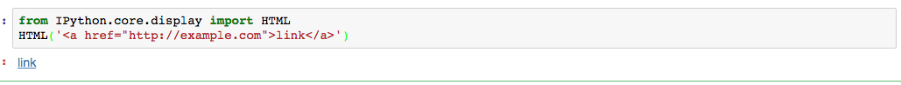

* Block quote, or ''' ''', is to quote code.   
  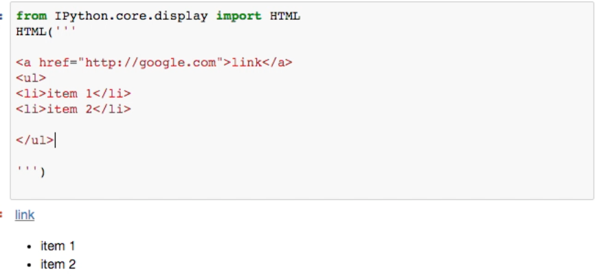

## Graph

### Count the edge

* Represents of the graph.
 


* Try to count the edge between those circles.

     
   This undirected table is symmetric. It shows that 1 and 2 has one edge. 2 and 3 is the same.   
     
   The above one is directed.

* There are different ways to show the relationships.
     
     
     
   Then we can infer the list.

### Network example

  ```
  import networkx as nx
  g=nx.Graph()
  ```

  

  ```
  g.add_node('A')
  g.add_node('B')
  g.add_node('C')
  ```

  It adds the nodes. Then`g.nodes` to check.  
  

  ```
  g.add_edge('A','B')
  ```

  It adds egdes between A and B. Then`g.nodes` and`g.edges` to check.  
  

  ```
  nx.draw(g)
  ```

  

  ```
  g.add_edge('C','B')
  nx.draw(g)
  ```

  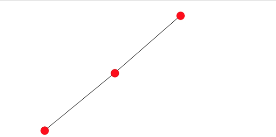

### Get data by json

  ```
  import json
  content=open('miserables.json').read()
  data=json.loads(content)
  ```

 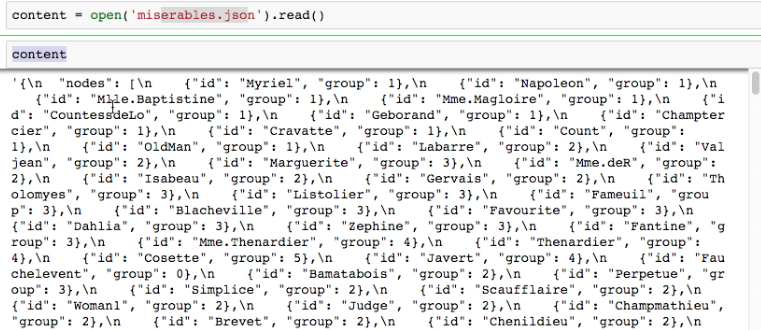  
 The content is an object.

   
 `json.loads` is to load a string which is given by content. Then data becomes the python structure.

  ```
  type(data)
  data.keys()
  data['nodes']
  data['links']
  ```

     
     
   Check the data. There are many nodes called 'group' and 'ID' and links called 'source' and 'target'.
  ```
  for n in data['nodes']:
  g.add_node(n['id'],group=n['group'])
  ```

  `n['id']` means extracting the id from every item in data\[nodes\], and add them into g.  
  `g.number_of_nodes` and `g.number_of_edges` to check the node.

  ```
  for l in data['links']:
  g.add_edge(l['source'],l['target'], **l)
  ```

  `**l` is an attribute. It means to take every item in 'key-value' pairs. So it equals to

  ```
  l['source'],l['target'], source=0,target=0,value=0
  ```

### Visualization Spring layout

* 'spring layout' is another name for 'force directed layout'.

  ```
  import matplotlib 
  %matplotlib inline
  nx.draw(g)
  ```

  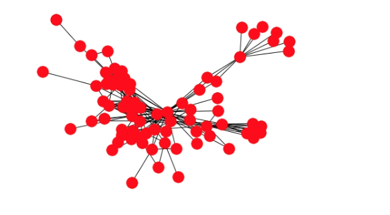

  ```
  from matplotlib import pyplot as plt
  plt.figure(figsize=(20,20))
  pos=nx.spring_layout(g)
  nx.draw_networkx_nodes(g,pos,node_color='#ccccff',alpha=0.5)
  nx.draw_networkx_edges(g,pos,width=1,alpha=0.3)
  labels=dict([(n,n)for n in g.nodes])
  _=nx.draw_networkx_labels(g,pos,labels=labels,font_color='#666666')
  ```

  

* The above one is the basic graph.

   
 `plt.figure(figsize=(20,20))` to change the size.  
 `nx.draw_networkx_nodes` and `nx.draw_networkx_edges` to draw the nodes and edges.  
 `labels=dict([(n,n)for n in g.nodes])` and `_=nx.draw_networkx_labels` to draw the labels. Create a dict\[\(n,n\)\], whose n is from g.nodes

### Color specific nodes

  ```
  g.nodes['Anzelma']
  ```

    
  We know the content of g.nodes

  ```
  import matplotlib
  color=matplotlib.cm.Accent
  color(10)
  ```

  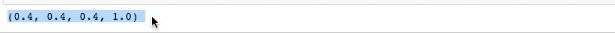  
  `matplotlib.cm` is a useful tool. You can try by yourself.It shows the R\(red\), G\(green\), B\(blue\) and alpha.

  ```
  for group in range(1,20):
  nodelist=[n for n in g.nodes if g.nodes[n]['group']== group]
  nx.draw_networkx_nodes(g,pos,nodelist=nodelist,node_color=color(group),alpha=0.8)
  ```


 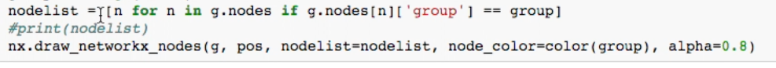
 If g.nodes's group = 1, add those nodes into the nodelist. They will be the same color 1 . If g.nodes's group = 2, they will be added to another nodelist ,and be colored 2.

### Shortest path

  ```
  sp=nx.shortest_path(g,'XXX','XXX')
  ```

    
  It shows the shortest way between the two nodes.

  ```
  #base on the above graph
  nx.draw_networkx_edges(g,
  pos,
  edgelist=list(zip(sp[:-1],sp[1:])),
  width=5,
  edge_color='r'
  )
  ```

   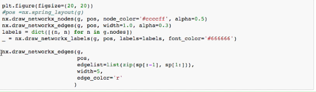  
   

### Centrality Measures

* **Degree centrality**: degree is the numbers of edges associated with the nodes.
* But not everyone is of the same importance. So **Closeness**  means the shorter the path, relationship is closer. 
* How many times the person be the bridge in the shortest path? This is **Betweenness**. Key messages are in those person.

  ```
  df_top_nodes=df.sort_values('closeness', ascending=False)[:5]
  #basic grah
  nx.draw_networkx_nodes(g,pos,nodelist=list(df_top_nodes.index),
  node_color='#ff7700',
  alpha=0.5)
  ```

     
   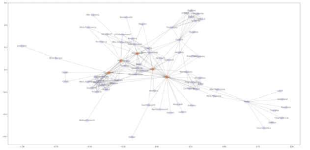  
   Sort by closeness.

### Structure degree

  ```
  g.degree
  ```

  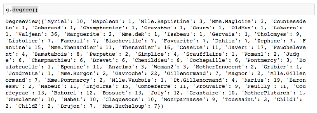

  ```
  pd.Series(dict(g.degree())).hist(bins=20)
  ```

    
  `dict(g.degree())` and then `Series`. Then Draw a picture.

* Heave tail distribution, which is famous for rich will be richer and poor will be poorer.

### Clustering coefficient

  ```
  nx.algorithms.clustering(g,['XXX','XXX','XXX'])
  nx.average_clustering(g)
  ```

  The numbers of triangles over the number of potential triangles .
  
  ```
  nx.average_clustering(nx.complete_graph(5))
  ```

  

### Cliques part of the graph

  ```
  Cliques=list(nx.find_cliques(g))
  ```

  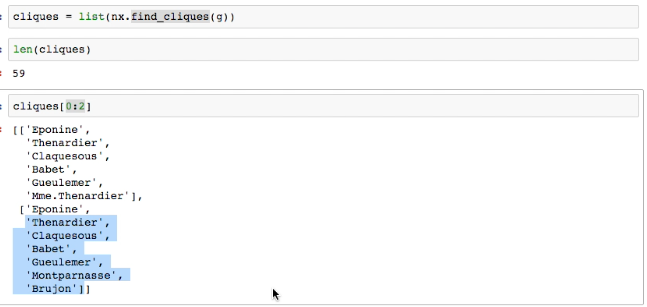

  ```
  from matplotlib import pyplot as plt
  plt.figure(figsize=(20,20))
  pos=nx.spring_layout(g)
  nx.draw_networkx_nodes(g,
                     pos,
                     node_color='#ccccff',
                     alpha=0.5
                     )
  nx.draw_networkx_edges(g,
                     pos,
                     width=1,
                     alpha=0.3
                     )
  labels=dict([(n,n)for n in g.nodes])
  _=nx.draw_networkx_labels(g,
                   pos,
                   labels=labels,
                   font_color='#666666'
                   )
  ```

  The above is the basic graph. Then

  ```
  nx.draw_networkx_nodes(g,
                       pos,
                       nodelist=cliques[1],
                       node_color='#ff7700',
                       alpha=0.5
                       )
  ```

  

### Connected components

  ```
  components =list(nx.connected_components(g))
  ```

  to find those who are not connected by others.

### Community detection

  ```
  from networkx.algorithms import community
  communities = list(community.girvan_newman(g))
  ```

    
  Those in the community is much denser,and those between the community is sparser.

  ```
  communities = list(community.label_propagation_communities(g))
  ```

  The function is similar.

### Color the nodes

```
plt.figure(figsize=(20,20))
pos=nx.spring_layout(g)
nx.draw_networkx_edges(g,pos,width=1,alpha=0.3)

for i in range(0, len(communities)):
  nodelist=communities[i]
  print(nodelist)
  nx.draw_networkx_nodes(g,pos,nodelist=nodelist,node_color=color(i), alpha=0.8)
  labels=dict([(n, '%s:%s' % (n, g.nodes[n]['group'])) for n in nodelist])
  nx.draw_networkx_labels(g,pos,labels=labels,fint_color='#666666')
```

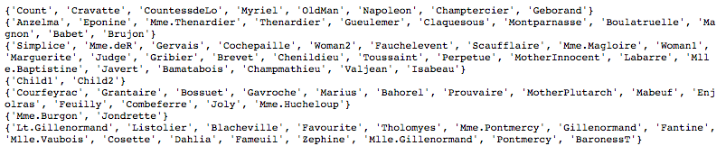  


## Time series


## Geographical data

**TODO**

References for geographical data:

- Draw geo scatter plot via matplotlib: [England and Ireland seen from pub locations](http://ramiro.org/notebook/mapping-pubs/)


------

If you have any questions, or seek for help troubleshooting, please [create an issue here](https://github.com/hupili/python-for-data-and-media-communication-gitbook/issues/new)

----
