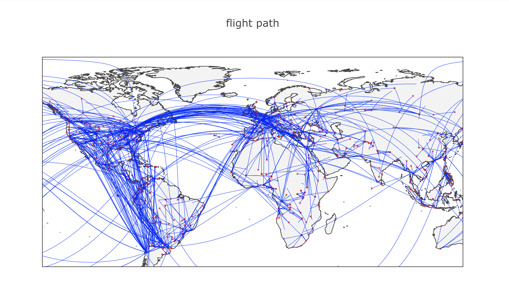
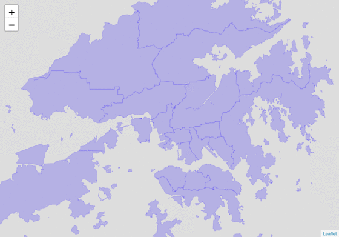

# Week 13: Geographical data

<div id="toc">
<!-- TOC -->

- [Week 13: Geographical data](#week-13-geographical-data)
    - [Outline](#outline)
    - [Geographical Data](#geographical-data)
        - [Geocoding: turn string address data into geo coordinates](#geocoding-turn-string-address-data-into-geo-coordinates)
        - [Geographical Reference Systems (GRS)](#geographical-reference-systems-grs)
        - [Projection system](#projection-system)
            - [Mercator projection](#mercator-projection)
        - [GeoJOSN: a lightweight file format to store geographical data](#geojosn-a-lightweight-file-format-to-store-geographical-data)
    - [Mapping](#mapping)
        - [Feature](#feature)
        - [Layer](#layer)
        - [Background Layer](#background-layer)
        - [Tooltip](#tooltip)
        - [Highlight](#highlight)
    - [Case studies](#case-studies)
        - [Aircrash map](#aircrash-map)
        - [Openrice Sichuan Food](#openrice-sichuan-food)

<!-- /TOC -->
</div>

## Outline

- `geopy`
- `folium`

## Geographical Data

Following are the major steps and considerations when dealing with geographical data:

1. Geocode: turn geographical names into longitude and latitude coordinates. For example, you can not plot `Hong Kong` on a map, but you can plot `(114.141, 22.362)` on the map. (you can use [geojson.io](http://geojson.io/#map=11/22.3672/114.0580) to quickly get the data).
2. Projection: even if you get the geo coordinates somehow, it still can not be plotted on the screen directly. We need a translation from the geo coordinates to screen coordinates. For example, if we want to put HK in the center of the a `640px by 480px` 2D map, we need to establish a mapping like `(114.141, 22.362) --> (320px, 240px)`. This process is called projection. The actual project is more complex than that. Here's a demo of [different methods of projection](https://www.jasondavies.com/maps/transition/).
   - Scatter plot/ bubble plot -- simply project the point coordinates
   - Choropleth -- one needs to project a geometry
3. Base layer: maps are usually organised into layers. Besides puting the data points we are interested in onto the map, we also show some geographical information, like consitutuency boundaries, streets and ontours. This is the benefit of map -- put new data points onto a plate that people are already familiar with. This kind of information usually comes with the "base layer", whereas the above plotted elements are in "data layers". Choices for base layer are like Google Maps, Open Street Map, Mapbox, etc.

References for geographical data:

- Draw geo scatter plot via matplotlib: [England and Ireland seen from pub locations](http://ramiro.org/notebook/mapping-pubs/)
- Bubble chart on map using `folium` (leaflet.js based) for visualisation and `overpy` for geocoding: [Visualising HK property prices](https://medium.com/coinmonks/visualizing-property-prices-in-hong-kong-with-pandas-overpy-and-folium-595240ffca90)
- Plot choropleth using `folium`: [United States unemployment rate choropleth map](https://python-graph-gallery.com/292-choropleth-map-with-folium/) . One needs to prepare a data table and a geojson file which includes the interested geometries.

### Geocoding: turn string address data into geo coordinates

### Geographical Reference Systems (GRS)

### Projection system

#### Mercator projection

### GeoJOSN: a lightweight file format to store geographical data

## Mapping

### Feature

### Layer

### Background Layer

### Tooltip

### Highlight

## Case studies

### Aircrash map

You can refer [here](https://dnnsociety.org/2018/04/30/flying-in-the-sky-a-report-of-air-crash-worldwide/) for the whole story. And the dataset can be found [here](https://github.com/ChicoXYC/HKBU-BIG-DATA-MEDIA/tree/master/Final%20Project%20-%20Airplane%20crash).

For the visualization of the map, the key data we should get is the longitude and latitude of each cities, and organize the start station and the end station of each path. Then, with help of `plotly`, we can get an interactive map.

```python
import pandas as pd 
import plotly
import plotly.plotly as py
import plotly.graph_objs as go
import matplotlib.pyplot as plt
df_flight_paths = pd.read_csv('path.csv') #includes the latitude and longitude of start station and end station
df_airports = pd.read_csv('station.csv') #includes latitude and longitude of all cities.

#prepare the airports station
airports1 = [ dict(
        type = 'scattergeo',
        lon = df_airports['lng'],
        lat = df_airports['lat'],
        mode = 'markers',
        marker = dict( 
            size=3,
            color='rgb(255, 0, 0)',
            opacity=0.7
        ))]
airports2 = [ dict(
        type = 'scattergeo',
        lon = df_airports['lng'],
        lat = df_airports['lat'],
        mode = 'markers',
        marker = dict( 
            size=1,
            color='rgb(255, 0, 0)',
            opacity=1
        ))]

#prepare the flight path
flight_paths = []
for i in range(len(df_flight_paths)):
    flight_paths.append(
        dict(
            type = 'scattergeo',
            lon = [ df_flight_paths['start_lon'][i], df_flight_paths['end_lon1'][i] ],
            lat = [ df_flight_paths['start_lat'][i], df_flight_paths['end_lat1'][i] ],
            mode = 'lines',
            line = dict(
                width = 0.5,
                alpha = 0.2,
                color = 'blue',
            )
        )
    )

#set layout
layout = dict(
        title = 'flight path',
        showlegend = False,         
        geo = dict(
            projection = dict( type="world" ),
            resolution = 50,
            showland = True,
            landcolor = 'rgb(243, 243, 243)',
            countrycolor = 'rgb(204, 204, 204)',

            lataxis = dict(
                #range = [ 20, 60],
                showgrid = False,
                tickmode = "linear",
                dtick = 50
            ),
            lonaxis = dict(
                #range = [-100, 20],
                showgrid = False,
                tickmode = "linear",
                dtick = 60
            ),
        ),
    )

#plot map
fig = dict(data=airports1+airports2+flight_paths, layout=layout)
py.iplot(fig, validate=False, filename='flight path')
```



### Openrice Sichuan Food

Following is an animated map showing how Sichuan restaurants rolled out in Hong Kong.



The tools and process:

- Use `requests`, `selenium`, and `beautifulsoup` to collect data
- Use `geopy` to perform geocoding, i.e. turn address into geo-location
- Use `folium` (built-on leaflet.js) to visualise circles on map
- Use selenium to take screenshot
- Use ImageMatick and `gifsicle` to combine screenshots into gif

Code repo: https://github.com/hupili/openrice-data-blog-201811