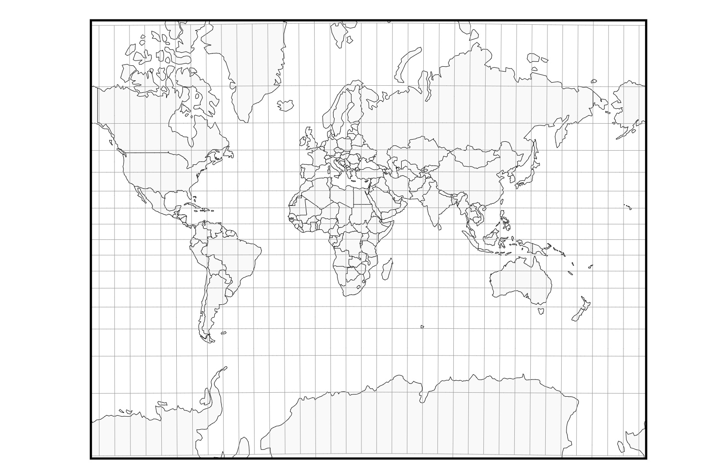
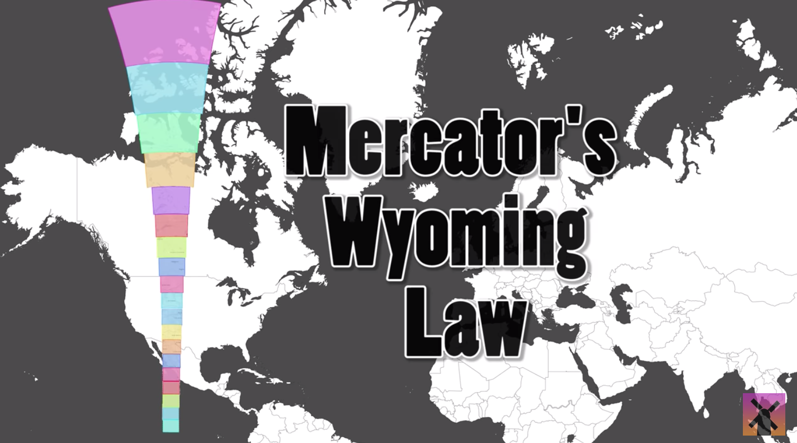
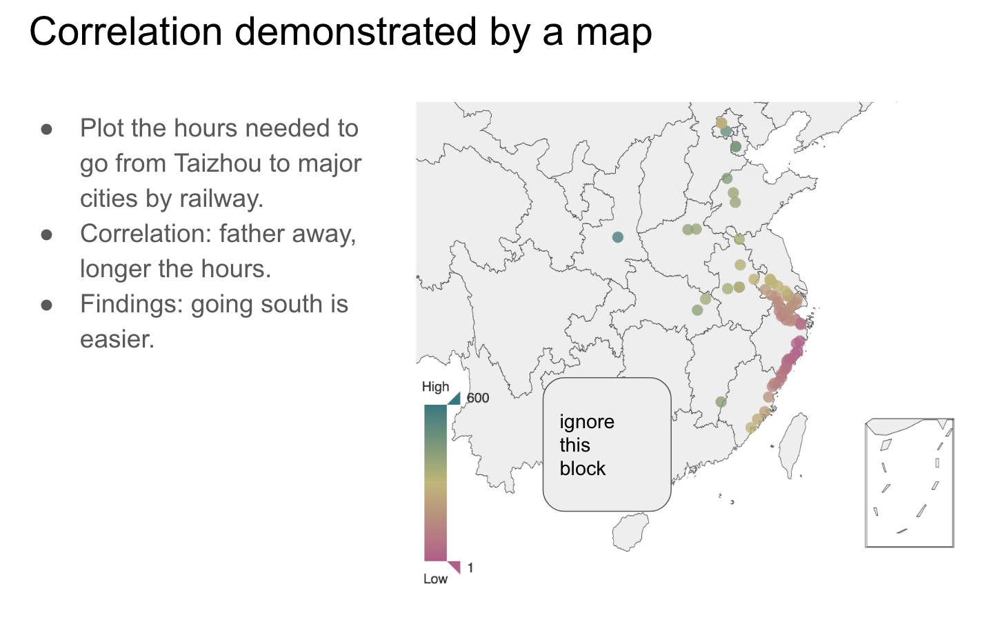
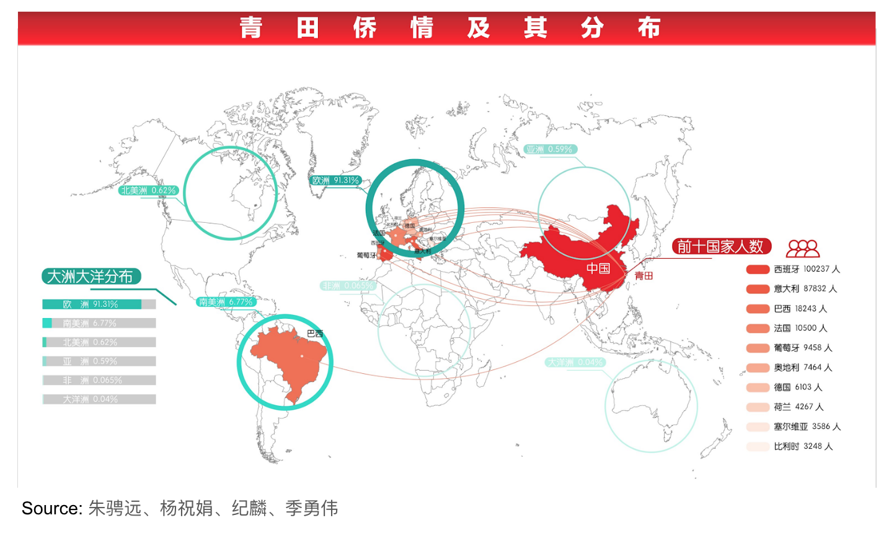
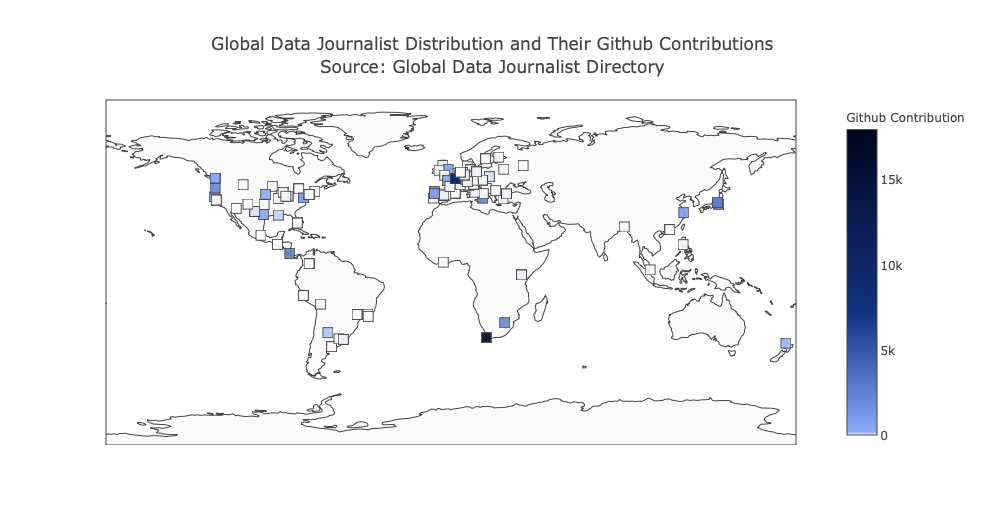
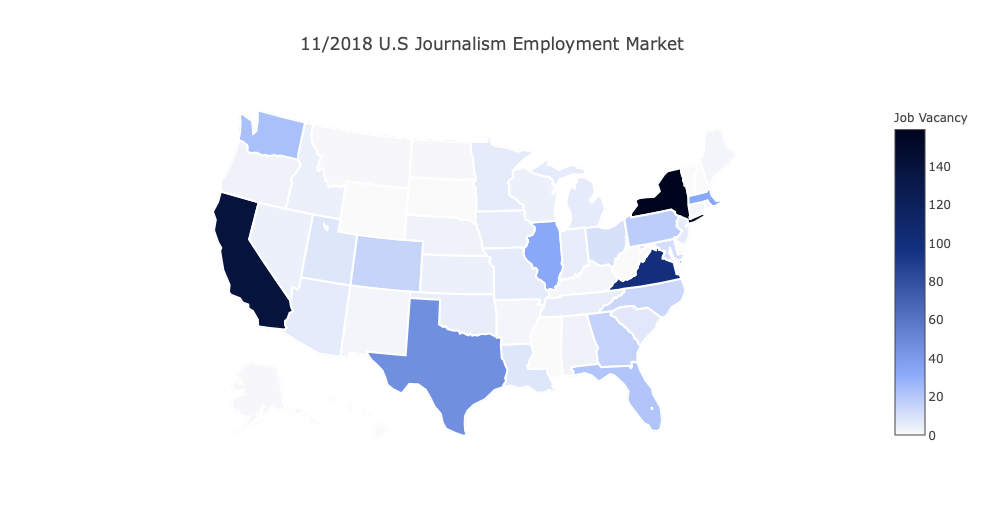
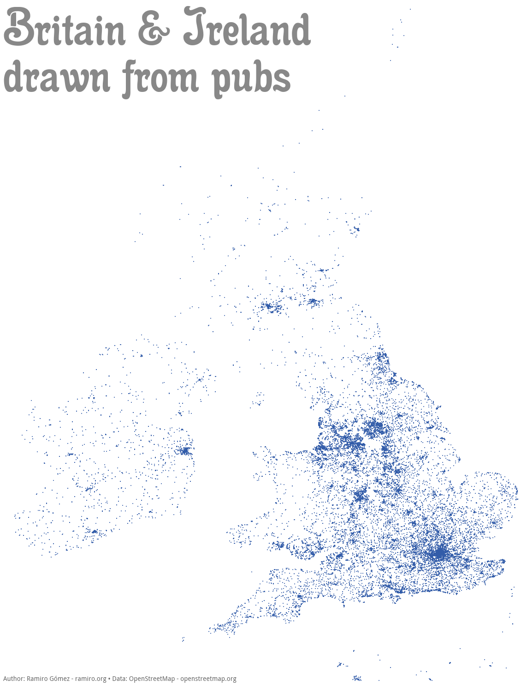
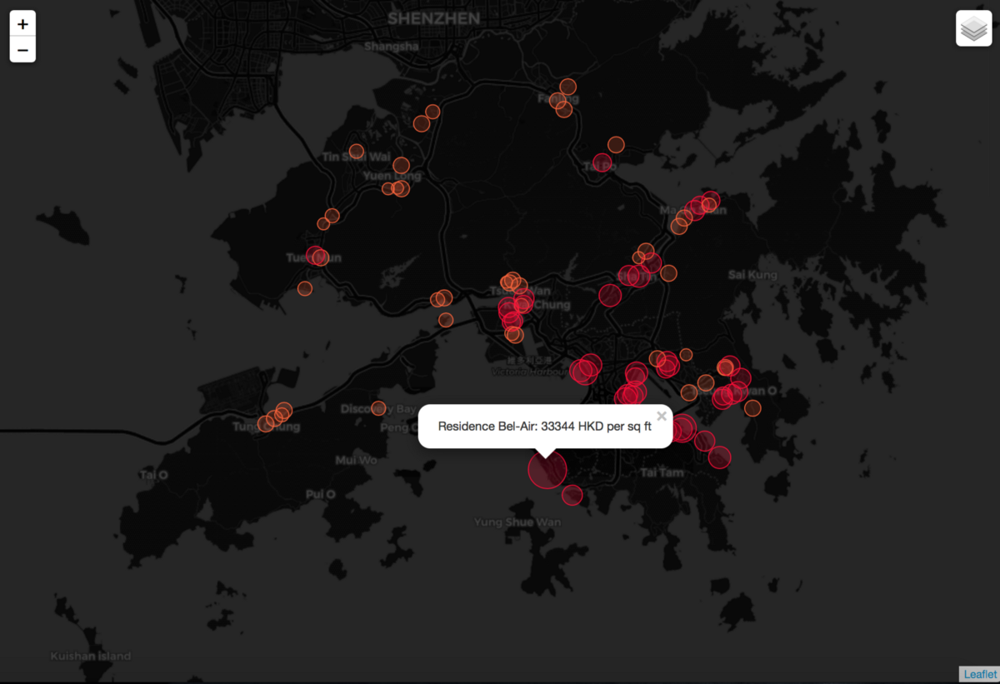
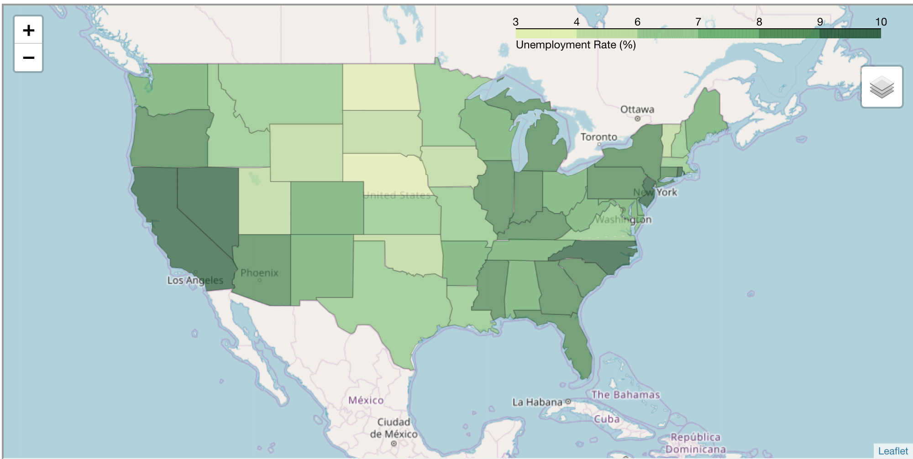

# Week 13: Geographical data

<div id="toc">
<!-- TOC -->

- [Week 13: Geographical data](#week-13-geographical-data)
    - [Objective](#objective)
    - [Geographical System](#geographical-system)
        - [Geocoding: turn string address data into geo coordinates](#geocoding-turn-string-address-data-into-geo-coordinates)
        - [Geographical Reference Systems (GRS)](#geographical-reference-systems-grs)
        - [Projection system](#projection-system)
            - [Mercator projection](#mercator-projection)
    - [File Formats](#file-formats)
        - [GeoJOSN](#geojosn)
        - [TopoJSON](#topojson)
        - [KML](#kml)
    - [Mapping](#mapping)
        - [Map types](#map-types)
        - [Map components](#map-components)
        - [When map is used to show correlation](#when-map-is-used-to-show-correlation)
        - [When map hides key information](#when-map-hides-key-information)
    - [Case studies](#case-studies)
        - [Air crash map using plotly](#air-crash-map-using-plotly)
        - [Openrice Sichuan Food using folium](#openrice-sichuan-food-using-folium)
        - [Global data journalist distribution and contribution map using ploty](#global-data-journalist-distribution-and-contribution-map-using-ploty)
        - [American journalist job market map using ploty](#american-journalist-job-market-map-using-ploty)
        - [England and Ireland pubs using matplotlib](#england-and-ireland-pubs-using-matplotlib)
        - [Hong Kong property price bubble chart using folium](#hong-kong-property-price-bubble-chart-using-folium)
        - [United States unemployment rate 2012 choropleth using folium](#united-states-unemployment-rate-2012-choropleth-using-folium)
    - [Bonus: Other GIS and mapping tools](#bonus-other-gis-and-mapping-tools)
        - [QGIS](#qgis)
        - [ArcGIS](#arcgis)
        - [Carto](#carto)
        - [D3](#d3)
        - [MapShaper](#mapshaper)
        - [Google Fusion Table](#google-fusion-table)

<!-- /TOC -->
</div>

## Objective

Understand geographical data 

Libraries:

- `geopy`
- `folium`
- `plotly`
- `matplotlib`

## Geographical System

Following are the major steps and considerations when dealing with geographical data:

1. Geocode: turn geographical names into longitude and latitude coordinates. For example, you can not plot `Hong Kong` on a map, but you can plot `(114.141, 22.362)` on the map. (you can use [geojson.io](http://geojson.io/#map=11/22.3672/114.0580) to quickly get the data).
2. Projection: even if you get the geo coordinates somehow, it still can not be plotted on the screen directly. We need a translation from the geo coordinates to screen coordinates. For example, if we want to put HK in the center of the a `640px by 480px` 2D map, we need to establish a mapping like `(114.141, 22.362) --> (320px, 240px)`. This process is called projection. The actual project is more complex than that. Here's a demo of [different methods of projection](https://www.jasondavies.com/maps/transition/).
   - Scatter plot/ bubble plot -- simply project the point coordinates
   - Choropleth -- one needs to project a geometry
3. Base layer: maps are usually organised into layers. Besides puting the data points we are interested in onto the map, we also show some geographical information, like consitutuency boundaries, streets and ontours. This is the benefit of map -- put new data points onto a plate that people are already familiar with. This kind of information usually comes with the "base layer", whereas the above plotted elements are in "data layers". Choices for base layer are like Google Maps, Open Street Map, Mapbox, etc.

### Geocoding: turn string address data into geo coordinates

Geocoding is usually done via a web service. The service is costly so you can seldom find free service nowadays. `geopy` has encapsulated many useful geocoding services for your selection. `Nominatim` is a frequently used free service. You just need to specify your user agent (any string would work) and control the request rate.

```python
from geopy.geocoders import Nominatim
geolocator = Nominatim(user_agent='specify_your_app_name_here')
location = geolocator.geocode('The address that you want to geocode')
location.point
```

Google Map once provided a free API. It ceased operation since July 2018. Now you must apply a Google API key before using this service. The first hundreds requests everyday are free. Followup requests are charged at US$5 per 1000 requests. You can checkout details in the [billing plan](https://developers.google.com/maps/documentation/geocoding/usage-and-billing). The core code is as follows:

```python
from geopy.geocoders import GoogleV3
geolocator = GoogleV3(api_key='Your API Key from Google API')
location = geolocator.geocode('The address that you want to geocode')
location.point
```

One can refer to [this notebook](https://github.com/hupili/openrice-data-blog-201811/blob/master/01.%20Geocode%20Sichuan%20Food.ipynb) for a real and complete working example of geocoding. It is part of the [HK Sichuan food growth map](https://github.com/hupili/openrice-data-blog-201811) visualization.

### Geographical Reference Systems (GRS)

A Point-Of-Interest (POI) is denoted by a two dimensional coordiate system (two-element tuple). The location of POI is always in a relative sense. In order to systems to communicate with each other and accurately refer to the same location on earth, Geographical Reference Systems (GRS) needs to be specified. GRS is like the protocol between GIS systems. One GRS specifics the followings:

- The projection method
- Center of the map
- Scaling factor of the map

For example, the geocoding results from above section are a pair of (longitude, latitude) values, which are referencing to the "WGS1984 CRS" (**EPSG:4326**), i.e. longitude in range `[-180, 180]` and latitude in range `[-90, 90]`. If you checkout the [district council boundary file](https://github.com/hupili/geohk/blob/master/census2001/dc.shp) from Hong Kong's Census and Statistics Department, you will find the coordinates are very large numbers. That is because Hong Kong conventionally used "Hong Kong 1980 CRS" (**EPSG:2326**) in government official files. If you put those files into some visualisation tools like [mapshaper](http://mapshaper.org/), there is no problem displaying them individually. However, when you use those files in modern mapping libraries, the plotted geographical elements may not be at the location you expect.

Most modern mapping library and GeoJSON file use WGS1984 CRS. Usually this step is hidden from a normal user. However, if you encountered some ancient files, you may need to handle the CRS conversion. [Here](https://github.com/hupili/geohk/tree/master/census2001) is a practical case of CRS conversion.

### Projection system

We live on a spherical surface but the computer screen is rectangular. The process to convert shapes from the former to the latter is called "projection". Here is a demo of [different methods of projection](https://www.jasondavies.com/maps/transition/).

#### Mercator projection

Mercator projection is the most widely used projection. One can see the most familiar world map using Mercator projection.


Image from [Jason Davies's map projection explorer](https://www.jasondavies.com/maps/transition/)

[Here](https://www.youtube.com/watch?v=lPNrtjboISg) is an excellent video to show you how our conventional world map can be misleading.


Image from ["How the World Map Looks Wildly Different Than You Think"](https://www.youtube.com/watch?v=lPNrtjboISg)

The key take-away is that, the farther away from earth equator, the larger the distortion.

## File Formats

### GeoJOSN

GeoJSON is a lightweight file format to store geographical data. It is based on JSON and can be easily load/ processed by many programming languages. Read more about the file format specification on [http://geojson.org/](http://geojson.org/) and try to draw GeoJSON files on [http://geojson.io/](http://geojson.io/).

### TopoJSON

GeoJSON format can result in very large files. It can be a prohibitive factor for widely deployed web service. TopoJSON can significantly reduce the file size. It is based on the following key ideas:

- Reduce redundant/ shared arcs between geometries to save space
- Use fixed-precision delta-encoding for integer coordinates

### KML

KML was an early format intended for web based mapping services. It is supported by Google and still works as main (or only) format in Google services. Since it is XML like file format, it usually has larger file size than JSON based format (GeoJSON/TopoJSON). Find more on [wiki](https://en.wikipedia.org/wiki/Keyhole_Markup_Language) and try to visualise KML via Google Fusion Map.

## Mapping

"Mapping" refers to the process of visualizing data on maps, a.k.a data visualization on maps. So the key issue of mapping is to determine which visual element is used to present the data. That leads to three major types of maps: visualise by point, by line and by area.

### Map types

This section discusses some common map types.

Plotting points: (Point of Interest; POI)

- Scatter plot -- plot the coordinates on map
  - [England and Ireland seen from pub locations](http://ramiro.org/notebook/mapping-pubs/)
- Bubble plot -- use size/ radius to represent a 3rd dimension data
  - [Sichuan earth quake in 100 years](https://hupili.net/20170800-sichuan-earthquake-in-100years/)
- Heat map -- diffuse a point to surroundings and shows the density
  - [Mapbox heatmap example](https://www.mapbox.com/mapbox-gl-js/example/heatmap-layer/)
- Clustering map -- group nearby points to clusters to make scatter plot less cluttered. Clustering map to heatmap is like [histogram to KDE](notes-week-08.md#kernel-density-estimation-kde)
  - [World airport clustering map](https://www.jerriepelser.com/books/airport-explorer/mapping/clustering/)

Plotting lines:

- Line graph/ path graph
  - [Boeing 787-8 draws a self portrait in the air](https://flightaware.com/live/flight/BOE4/history/20170803/0448Z/KBFI/KBFI)

Plotting areas:

- Choropleth -- represent data value by color; a choropleth is equivalent to a bar chart, where data x-axis of the bar becomes geometry on a map. Think twice before you use choropleth, because in many cases bar chart works better.
  - [US unemployment rate via plotly](https://github.com/hupili/python-for-data-and-media-communication-gitbook/issues/87)
  - [HK Census 2011 visualization](http://hkcensus11.hupili.net/#/choropleth)
- Cartogram -- represent data value by size of geometry (distortion)
  - [Cargogram of the US](http://prag.ma/code/d3-cartogram/#intlmigrate/2011)
  - [US 2016 election forecast by FiveThirtyEight](https://projects.fivethirtyeight.com/2016-election-forecast/)

### Map components

- Feature
- Layer
  - Layer
  - Background Layer
- Auxiliary
  - Tooltip
  - Highlight
  - Toolbox

### When map is used to show correlation



Map can be very effective when the data value is correlated with geolocation. It helps one to identify patterns and discover anomalies.

### When map hides key information



**Map can often hide key information**, because the larger area on a map does not carry an equivalent importance of data. In the above example, Europe, especially Spain, needs to be highlighted because those are the major targets of Qingtian migrants. However, due to the map area issue, Brazil catches one's eye more easily.

One way to solve this problem technically is to plot Cartogram. However, bar chart could come handy most of the time.

## Case studies

This section includes some selected map visualization cases **made in Python**. There are many other tools that can help you make maps, most notably QGIS, D3 and Carto. We leave pointers in the "other tools" section for readers' reference.

### Air crash map using plotly

Following is an example of plotting interactive map with plotly. It's a report about the air crashes in the past 70 years around the world.

For the visualization of the map, the key data we should get is the longitude and latitude of each cities, and organize the start station and the end station of each path. Then, with help of `plotly`, we can get an interactive map.


The tools and process:

- Get the data from the open source website in Socrata,World Bank, and NGIA.
- Use `pandas` to curate and restructure all the data source
- Use `plotly` to visualize the map  

You can refer [here](https://dnnsociety.org/2018/04/30/flying-in-the-sky-a-report-of-air-crash-worldwide/) for the whole story. The dataset and codes can be found [here](https://github.com/ChicoXYC/examples/tree/master/air-crash-map).

### Openrice Sichuan Food using folium

Following is an animated map showing how Sichuan restaurants rolled out in Hong Kong.


The tools and process:

- Use `requests`, `selenium`, and `beautifulsoup` to collect data
- Use `geopy` to perform geocoding, i.e. turn address into geo-location
- Use `folium` (built-on leaflet.js) to visualise circles on map
- Use selenium to take screenshot
- Use ImageMatick and `gifsicle` to combine screenshots into gif

Code repo: https://github.com/hupili/openrice-data-blog-201811

### Global data journalist distribution and contribution map using ploty
Following is an example of scatter plots on maps about how data journalists distribute all over the world.

Like the air crash map above, this map's key data that we should get is also the longitude and latitude of each cities. In addition, we need another dimension to assign the color of each point on this map. In this case, the depth of color represents a journalist's overall github contribution from 2008. 

The tools and process:
- Get the geographical data and other information of a journalist from the csv files
- Use `aggregate()` to accumulate each journalist's Github contribution data from 2008
- Use `plotly` to visualize the map

The dataset and codes can be found [here](https://github.com/FLYSTEPHEN/examples/tree/master/Visualisation/Map/Global%20Data%20Journalist%20Distribution).

### American journalist job market map using ploty
This is an example of choropleth map and a report about the condition of the employment market for journalists in the U.S.
In this map, the key data is the number of opening positions in each state of the U.S. In addition, this map recognise the states with their abbreviations(VA, NY...). 

The tools and process:
- Get the data from `0 jobs.csv`
- Use `pandas` to manipulate the location data from `0 jobs.csv` into `US-States.csv` to code the states of the U.S into their abbreviations
- Use `list.count()` to categorise the jobs into different states
- Use `plotly` to visualize the map

The dataset and codes can be found [here](https://github.com/FLYSTEPHEN/examples/tree/master/Visualisation/Map/2018-America-Journalist-job-market-map).

### England and Ireland pubs using matplotlib

A map of Britain and Ireland pubs.



The tools and process:

- Get data from `OpenStreetMap` and provided by `osm-x-tractor`.
- Draw geo scatter plot via `matplotlib`

Data and codes can be found here: [England and Ireland seen from pub locations](http://ramiro.org/notebook/mapping-pubs/).

### Hong Kong property price bubble chart using folium

Visualizing various property prices in Hong Kong.



The tools and process:

- Dataset extracted from Midland Realty Property Price Chart with help of `pdf to csv converter`
- `overpy` for geocoding.
- Using `pandas` to combine the property names, prices, and coordinates into one huge dataframe for mapping.
- Drawing a map with `Folium`

Data and codes can be found here: [Visualising HK property prices](https://medium.com/coinmonks/visualizing-property-prices-in-hong-kong-with-pandas-overpy-and-folium-595240ffca90).

### United States unemployment rate 2012 choropleth using folium

An example of a choropleth map made using the Folium library. This example comes directly from the [documentation](http://python-visualization.github.io/folium/docs-master/quickstart.html#Choropleth-maps) of this library, you can find more examples here.



The tools and process:

- First get A shape file in the geojson format & A data frame that gives the values of each zone in your case
- Plot choropleth using `folium`.

Data and codes can be found here: [United States unemployment rate 2012 choropleth map](https://python-graph-gallery.com/292-choropleth-map-with-folium/).

## Bonus: Other GIS and mapping tools

### QGIS

https://www.qgis.org/en/site/

QGIS is written in Python. It provides a nice GUI so people without coding background can also use this tool. It integrates very well with Python. One can first try to process the geographical data via QGIS GUI. Once the prototyping is done, one can automate the workflow and take it to a massive scale using some glue code written in Python.

One major advantage of QGIS is being [FOSS](https://en.wikipedia.org/wiki/Free_and_open-source_software).

### ArcGIS

https://www.arcgis.com/index.html

It is a high quality commercial GIS system.

### Carto

https://carto.com/

Very easy to use online tools. However, the free version limits number of POIs to 10,000. You may consider your data scale before using this tool.

### D3

D3 is a widely used data visualization library in Javascript. It provides convenience tools for the users to handle geo project and turn GeoJSON data into SVG `path` elements. The tools is highly flexible and favoured by many web designers.

Here is a case made by [D3](https://hupili.net/20170800-sichuan-earthquake-in-100years/)

### MapShaper

http://mapshaper.org/

MapShper can help one to preview maps files and convert between different formats. It is also available as a command line tool. See it in action in the [geohk](https://github.com/hupili/geohk/tree/master/census2001) project.

### Google Fusion Table

Being in the Google toolchain is a major advantage. However, this online tool requires KML format to plot a map. The current de facto standard GeoJSON is not supported as of this writing.
