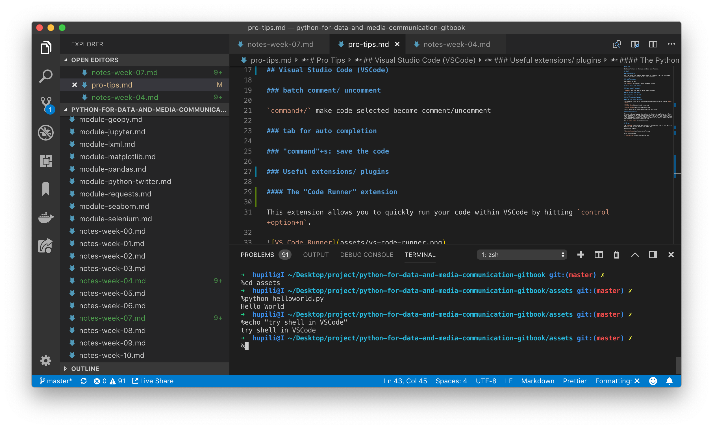
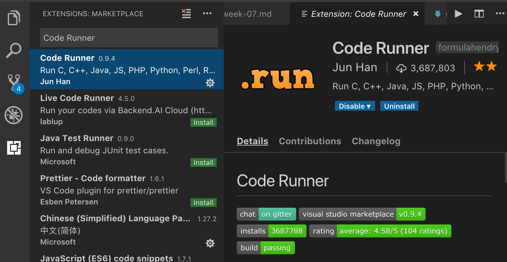
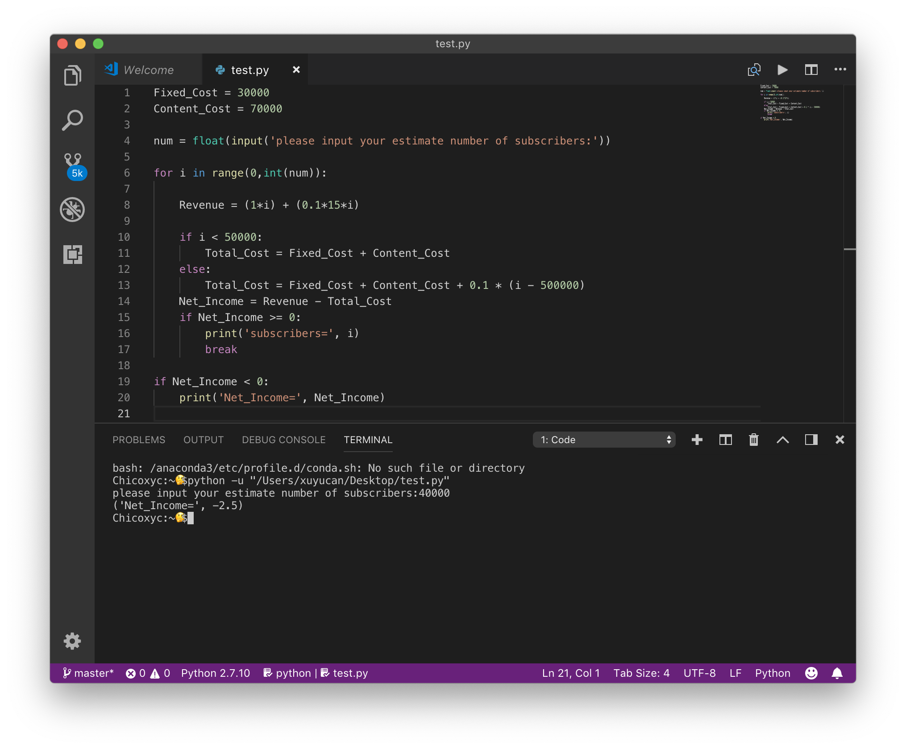
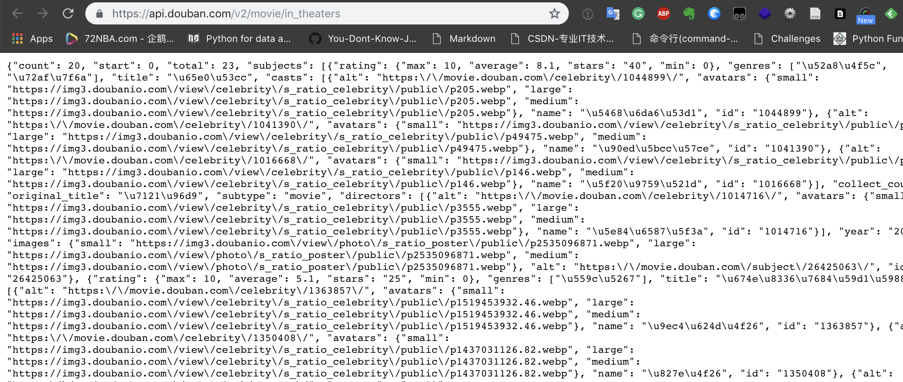
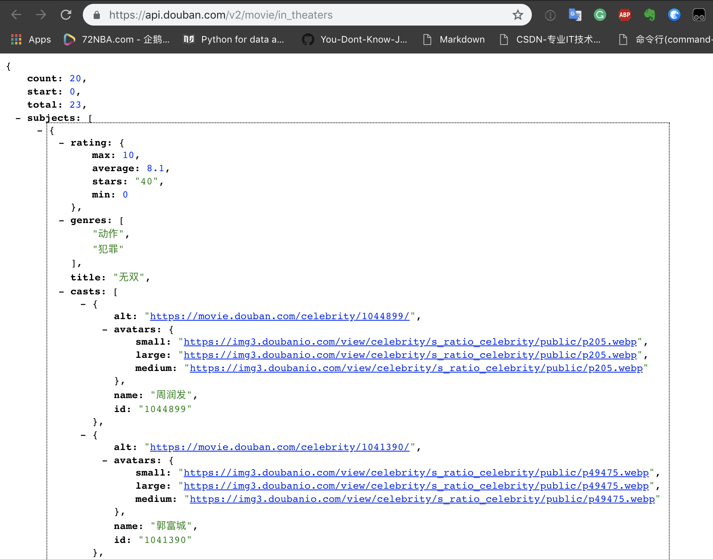

# Pro Tips

Good use of hotkeys and shorthands can boost your efficiency.

## Asking questions like a Pro

Asking questions like a Pro is the first step to boost your journey in programmning world. As long as you adopt the best practice in asking questions, people can easily help you. Developers in the open world like challenges and never mind your silly questions. Here are some tips to help to ask questions like a Pro:

- Clearly state what you want to achieve. Text and images can help.
- Show people what you have tried so far. It is good to let them know what are already known to not work.
- Make a minimum reproducible example of the issue. This helps people focus on the technical problem, instead of your business logics.

In our Python case, it is suggested to make a Jupyter notebook to put the above information in one place. Besides showing the GitHub URL to your notebook, it is even better to show the [NBViewer preview link](notes-week-00.md#nbviewer). That helps people to quickly understand the issue. Note, dynamic chart (via Javascript) is not shown on GitHub due to security reasons.

Here are some hand-picked issues for your reference:

- [#90](https://github.com/hupili/python-for-data-and-media-communication-gitbook/issues/90) is a very good demo of effectively asking questions.
- [This comment](https://github.com/hupili/python-for-data-and-media-communication-gitbook/issues/104#issuecomment-441278543) shows a real minimum reproducible example. It is simpler than the OP. In the open source world, people who come up with minimum reproducible example are highly appreciated. They are the stepping stones for those who eventually solve the issue.

## Shell

### auto completion

Use "Tab" button. For example,  type "python ev", then use "Tab", you can see the "python evening.py" \(assume the file name is evening\)

### find last command

Use upward arrow key.

Try `control+r` to conduct a search in command history.

## Visual Studio Code (VSCode)

### batch comment/ uncomment codes

`command + /` make code selected become comment/ uncomment. This hotkey can give proper comment blocks according to the current languaged identified by VSCode. For example, Python scripts will see `#` prefixed lines as comment blocks. markdown/ HTML files will see `<!-- comment -->` style blocks.

### tab for auto completion

### "command"+s: save the code

### Run shell commands inside VSCode window

You don't have to leave VSCode in order to run Python scripts.

### Useful extensions/ plugins

#### The "Code Runner" extension

This extension allows you to quickly run your code within VSCode by hitting `control+option+n`.

This is equivalent by executing your code from the Terminal.

#### The Python linter

Python is a dynamic language which makes error checking at compile time hard. Most error is exposed at run time. However, some tools can still help us to catch most of the errors and try to write best practice code. "Linting" is a general concept found in all programming languages that refers to the process to identify potential errors and suboptimal practices at the writing time.

The `ms-python.python` plugin may be useful.

## Chrome

The `JSONView` extension can help to structure and highlight JSON. In this way, it is easier to read the JSON response from common APIs.

Before using JSONView:

After using JSONView:

